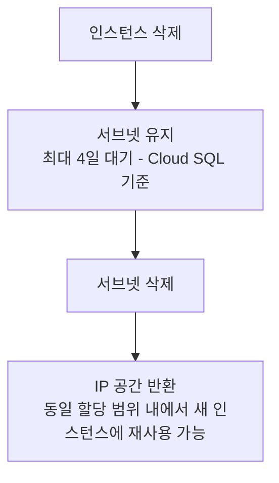

## 1. 개요

PSA에서 "Cache"라는 용어는 GCP 공식 문서에서 별도로 정의된 개념은 아닙니다. 다만, 서비스 프로듀서가 할당된 범위 내에서 서브넷을 생성하고 IP를 할당/회수하는 전체 수명 주기를 이해하는 것이 중요합니다. 이 문서에서는 IP 할당 동작, 재할당 패턴, 삭제 지연(TTL과 유사한 동작)을 다룹니다.

---

## 2. Service Producer의 서브넷 생성 방식

### 2.1 서브넷 할당 메커니즘

서비스 프로듀서는 소비자가 제공한 할당 범위 내에서 자체 네트워크에 서브넷을 생성합니다. 일반적으로 `/29`에서 `/24` 크기의 CIDR 블록을 선택하며, **소비자는 프로듀서의 서브넷 선택을 변경할 수 없습니다**. [[1]](#references)

> "The service producer typically assigns subnets using CIDR blocks ranging from /29 to /24 from your allocated range—you cannot modify the producer's subnet selection."
> — *Private services access* [[1]](#references)

### 2.2 자동 서브넷 확장

기존 서브넷이 가득 차면, 서비스 프로듀서는 할당 범위 내에서 **추가 서브넷을 자동으로 생성합니다.** 이 과정은 소비자에게 투명하게 진행됩니다.

---

## 3. Multi-Range 할당 및 사용 순서

하나의 프라이빗 연결에 **여러 할당 범위를 지정할** 수 있습니다. 이를 통해 IP 고갈을 방지하고 추가 주소 공간을 확보할 수 있습니다. 여러 범위가 할당된 경우, 서비스는 **지정된 순서대로** 각 범위의 IP 주소를 사용합니다. [[2]](#references)

> "The service uses IP addresses from all of the provided ranges in the order that you specified."
> — *Configure private services access* [[2]](#references)

---

## 4. IP 회수 및 재사용 패턴 (TTL과 유사한 동작)

> 본 섹션은 [[2]](#references) 기반

### 4.1 서브넷 삭제 지연 (Deletion Delay)

서비스 인스턴스가 삭제된 후에도 해당 서브넷은 **즉시 삭제되지 않습니다.** Cloud SQL의 경우, 마지막 인스턴스가 삭제된 후 **최대 4일이 지나야** 서브넷이 삭제됩니다. 이 동작이 사실상 "TTL"과 유사한 역할을 합니다.

> "The subnet is deleted 4 days after the last instance in the subnet is deleted."
> — *Configure private services access* [[2]](#references)

### 4.2 제거된 범위의 재할당 불가

프라이빗 연결에서 할당 범위를 **제거(remove)하면,** 해당 범위는 연결과의 연관만 해제될 뿐 삭제되지는 않습니다. 중요한 점은, **제거된 범위는 새로운 서브넷 할당에 사용되지 않습니다**.

> "Private services access doesn't use removed ranges to allocate new subnets."
> — *Configure private services access* [[2]](#references)

### 4.3 재할당 패턴 요약

단, 할당 범위 자체를 프라이빗 연결에서 **제거한** 경우에는 해당 범위의 IP가 새 할당에 사용되지 않습니다.

---

## 5. IP 고갈 감지 및 대응

서비스 프로듀서가 할당 범위 내에서 사용되지 않는 부분을 선택할 때, 할당 범위와 정확히 일치하거나 범위 내에 포함되는 **모든 커스텀 라우트 목적지를 제외합니다.** 이로 인해 실제 사용 가능한 IP 공간이 줄어들 수 있습니다. [[2]](#references)

IP가 고갈되면 `Couldn't find free blocks` 에러가 발생합니다. 이 경우:
1. 기존 할당 범위를 포함하는 더 큰 연속 범위로 **확장**
2. 새로운 할당 범위를 프라이빗 연결에 **추가**

---

## 6. Allocation Ratio 모니터링

> 본 섹션은 [[3]](#references) 기반

### 6.1 2단계 할당 비율

PSA의 IP 사용률은 두 가지 레벨에서 모니터링됩니다:

| 레벨 | 설명 |
|------|------|
| **PSA Range Level** | 할당 범위 중 관리형 서비스에 할당된 비율 |
| **PSA Subnet Level** | 서브넷 범위 중 실제 IP가 할당된 비율 |

### 6.2 임계값 기반 관리

Network Intelligence Center의 Network Analyzer는 PSA 범위의 할당 비율을 모니터링하며:

- **50% 초과 시**: 새로운 할당 IP 범위 추가를 권장
- **75% 초과 시**: 경고 인사이트 생성

> "Review the allocation ratio for your PSA ranges and consider adding new allocated IP address ranges as soon as the allocation ratio is greater than 50%."
> — *IP address utilization insights* [[3]](#references)

### 6.3 모니터링 대상 서비스

Network Analyzer가 PSA 범위를 모니터링하는 서비스:
- AlloyDB, Cloud SQL, Memorystore, Apigee, Vertex AI

---

## 7. DNS Peering 관련 동작

Cloud DNS Private Zone은 VPC 네트워크에 비공개입니다. 서비스 프로듀서가 DNS Peering을 구성하면, 지정된 DNS 접미사에 대한 쿼리를 소비자 VPC 네트워크로 전달하여 이름을 확인할 수 있습니다. [[2]](#references)

DNS Peering 지원 현황:
- 대부분의 Google 서비스에서 지원
- **Cloud SQL은 DNS Peering을 지원하지 않음**
- Cloud DNS API를 명시적으로 활성화해야 사용 가능

---

## 8. Quota 제한

| 항목 | 제한값 |
|------|--------|
| 프라이빗 연결당 할당 IP 범위 수 | 최대 **5,000개** |
| 범위 크기(netmask) 제한 | 없음 (Google은 범위 수에 대한 쿼터만 적용) |

> [[4]](#references)

---

## 9. 핵심 요약

| 메커니즘 | 동작 |
|----------|------|
| 서브넷 크기 | 프로듀서가 `/29` ~ `/24` 범위에서 자동 선택 |
| 다중 범위 사용 순서 | 소비자가 지정한 순서대로 사용 |
| 삭제 후 IP 반환 시간 | Cloud SQL 기준 최대 **4일** 지연 |
| 제거된 범위의 재사용 | **불가** (새 서브넷 할당에 미사용) |
| IP 고갈 임계값 | 50% → 확장 권장, 75% → 경고 |
| DNS Peering | Cloud SQL 제외 대부분 서비스 지원 |

---

## References

| # | 문서 제목 | 링크 |
|---|----------|-----|
| 1 | Private services access | [바로가기](https://docs.cloud.google.com/vpc/docs/private-services-access) |
| 2 | Configure private services access | [바로가기](https://docs.cloud.google.com/vpc/docs/configure-private-services-access) |
| 3 | IP address utilization insights - Network Analyzer | [바로가기](https://docs.cloud.google.com/network-intelligence-center/docs/network-analyzer/insights/vpc-network/ip-utilization) |
| 4 | Quotas and limits - VPC | [바로가기](https://docs.cloud.google.com/vpc/docs/quota) |
