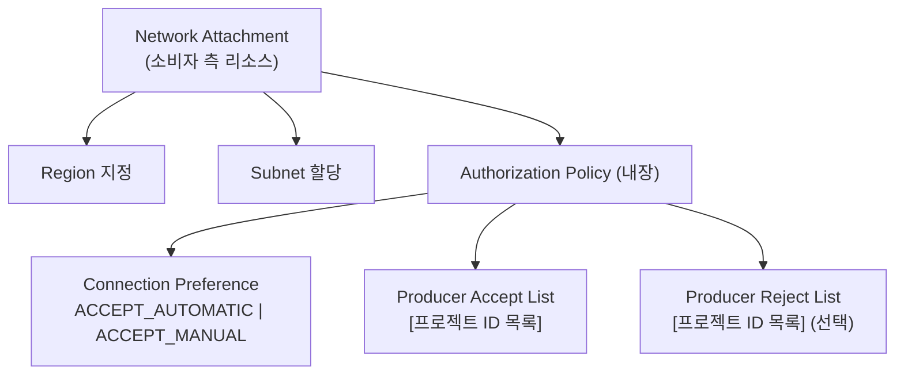
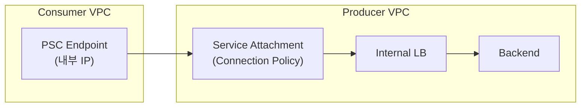
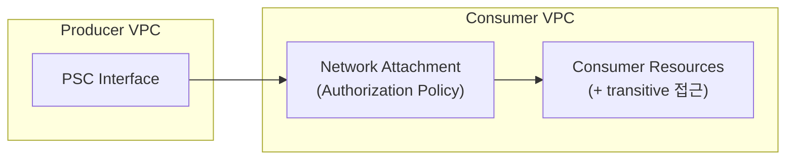

## 1. PSC 구성 요소 개요

PSC에서 주요 구성 요소를 먼저 정리합니다: [[1]](#references)

### 소비자 측 (Consumer)
| 구성 요소 | 설명 |
|----------|------|
| **Endpoint** | 소비자 VPC의 내부 IP 주소 (Forwarding Rule을 통해 Service Attachment 참조) |
| **Backend** | NEG(Network Endpoint Group)을 통해 로드밸런서가 PSC로 트래픽 전송 |
| **Network Attachment** | 프로듀서가 소비자 네트워크로 연결을 시작할 수 있게 하는 리소스 |

### 프로듀서 측 (Producer)
| 구성 요소 | 설명 |
|----------|------|
| **Service Attachment** | 프로듀서의 로드밸런서를 소비자에게 게시하는 리소스 |
| **PSC Interface** | 프로듀서가 소비자 네트워크로 나가는 특수 네트워크 인터페이스 |

---

## 2. Network Attachment 상세

### 2.1 정의 및 핵심 특성


> "A network attachment is a resource that lets a producer Virtual Private Cloud (VPC) network initiate connections to a consumer VPC network."
> — *About network attachments* [[2]](#references)

Network Attachment는 **프로듀서 → 소비자** 방향의 연결을 가능하게 하는 리소스입니다. 이는 일반적인 PSC Endpoint(소비자 → 프로듀서)와 **반대 방향입니다.**

| 방향 | 구성 요소 | 설명 |
|------|----------|------|
| Consumer → Producer | PSC Endpoint | 소비자가 연결을 시작 |
| Producer → Consumer | Network Attachment + PSC Interface | 프로듀서가 연결을 시작 |

### 2.2 전이적 연결 (Transitive Connectivity)

Network Attachment를 통한 연결은 **전이적(transitive)입니다.** 프로듀서 워크로드가 소비자 VPC를 통해 다음에 접근할 수 있습니다: [[2]](#references) [[6]](#references)

- Cloud VPN / Interconnect / VPC Peering으로 연결된 리소스
- Cloud NAT를 통해 접근 가능한 워크로드
- Private Google Access를 통해 접근 가능한 Google APIs
- 다른 PSC Endpoint를 통해 접근 가능한 Published Service
- 소비자 네트워크에 연결된 VPC Spoke의 워크로드

### 2.3 서브넷 할당

각 Network Attachment는 **단일 서브넷과** 연결됩니다. 이 서브넷에서 IP 주소가 할당됩니다. 서브넷 유형:
- IPv4 전용
- Dual-stack (IPv4 + IPv6)
- IPv6 전용

---

## 3. Connection Policy (Authorization Policy)

> 본 섹션은 [[3]](#references) 기반

### 3.1 Connection Preference (연결 기본 설정)

Network Attachment의 Authorization Policy는 **세 가지 구성 요소로** 이루어집니다:

#### 1) Connection Preference 설정

| 모드 | 설명 |
|------|------|
| **`ACCEPT_AUTOMATIC`** | 새 연결을 **자동으로 수락** |
| **`ACCEPT_MANUAL`** | 수동 검토 및 **명시적 승인 필요** |

#### 2) Accept List (수락 목록)

- 연결을 허용할 소비자를 **명시적으로 지정**
- 식별 기준: **Project ID**, **VPC Network**, **PSC Endpoint** (Preview)
- **최대 5,000개** 항목

#### 3) Reject List (거부 목록)

- 특정 소비자의 연결을 **명시적으로 거부**
- **최대 64개** 항목
- **Accept List와 Reject List에 모두 포함된 소비자는 연결이 차단됨**

### 3.2 Network Attachment와 Connection Policy의 관계



**핵심:** Network Attachment는 인프라 리소스이고, Connection Policy(Authorization Policy)는 그 안에 **내장(embedded)되어** 접근을 제어합니다. [[4]](#references)

---

## 4. Service Attachment의 Connection Policy

### 4.1 Service Attachment vs Network Attachment

| 항목 | Service Attachment | Network Attachment |
|------|-------------------|-------------------|
| **위치** | 프로듀서 측 | 소비자 측 |
| **용도** | 프로듀서 서비스를 소비자에게 게시 | 프로듀서가 소비자 네트워크에 접근 |
| **연결 방향** | Consumer → Producer | Producer → Consumer |
| **Connection Policy** | 프로듀서가 소비자 접근 제어 | 소비자가 프로듀서 접근 제어 |

### 4.2 Service Attachment Connection Preference

| 모드 | 설명 |
|------|------|
| **Automatic Acceptance** | 모든 소비자의 인바운드 연결 요청을 **자동 수락** |
| **Explicit Approval** | 소비자가 service attachment의 **consumer accept list에 있을 때만 수락** |

### 4.3 Connection Limit

- **Accept List Limit**: 단일 소비자로부터의 PSC endpoint 및 backend 연결 총 수 제어
- **Propagated Connection Limit**: 단일 소비자에서 service attachment로의 기본 연결 제한 = **250개**

### 4.4 Connection Reconciliation

Accept/Reject List 업데이트가 **기존 연결에 영향을 미치는지** 결정하는 메커니즘:

- **활성화 시:** Accept/Reject List 변경이 **기존 PSC 연결을 종료할** 수 있음
- **비활성화 시:** 기존 연결은 유지되고, 변경사항은 **새 연결에만 적용**

> "Updating accept or reject lists can terminate existing Private Service Connect connections."
> — *About controlling access to published services* [[3]](#references)

### 4.5 Connection Status

연결은 다음 상태를 거칩니다:

| 상태 | 설명 |
|------|------|
| **Accepted** | 연결 수락됨 |
| **Pending** | 승인 대기 중 |
| **Rejected** | 연결 거부됨 |
| **Needs attention** | 조치 필요 |
| **Closed** | 연결 종료됨 |

---

## 5. Service Connection Policy (자동화 대안)

> 본 섹션은 [[5]](#references) 기반

### 5.1 개념

Service Connection Policy는 Network Attachment와는 **별개의 메커니즘으로,** 관리형 서비스 인스턴스로의 연결을 **자동화합니다.**

### 5.2 주요 차이점

| 항목 | Service Connection Policy | Network Attachment |
|------|--------------------------|-------------------|
| **용도** | Service attachment 자동화 | 프로듀서 시작 인터페이스 |
| **동작** | PSC endpoint를 소비자 프로젝트에 자동 생성 | 프로듀서→소비자 연결 제공 |
| **IAM** | 프로듀서가 소비자 프로젝트에 직접 IAM 접근 없음 | 소비자가 직접 관리 |

### 5.3 Authorization 모델

1. 서비스 프로듀서가 자체 프로젝트에 Service Connection Map 생성
2. Service Connectivity Automation이 인가 확인 수행
3. 확인 통과 시 endpoint가 자동 생성
4. 프로듀서는 소비자 프로젝트에 대한 **직접 IAM 접근 없음**

> "Creation of Private Service Connect endpoints without requiring direct IAM privileges in consumer projects."
> — *About service connection policies* [[5]](#references)

---

## 6. 실무 설정 가이드

> 본 섹션은 [[4]](#references) 기반

### 6.1 Network Attachment 생성 (Manual Mode)

**사전 요구 사항:**
- Compute Engine API 활성화
- Compute Network Admin 역할 할당
- 대상 리전에 일반 서브넷 생성
- 프로듀서 프로젝트 ID 확인

**gcloud 명령어:**

```bash
gcloud compute network-attachments create ATTACHMENT_NAME \
    --region=REGION \
    --connection-preference=ACCEPT_MANUAL \
    --producer-accept-list=PROJECT_ID_1,PROJECT_ID_2 \
    --subnets=SUBNET_NAME
```

### 6.2 Network Attachment 생성 (Automatic Mode)

```bash
gcloud compute network-attachments create ATTACHMENT_NAME \
    --region=REGION \
    --connection-preference=ACCEPT_AUTOMATIC \
    --subnets=SUBNET_NAME
```

### 6.3 관리 명령어

```bash
# 목록 조회
gcloud compute network-attachments list --region=REGION

# 상세 조회 (연결 endpoint, IP 할당 확인)
gcloud compute network-attachments describe ATTACHMENT_NAME --region=REGION

# Accept/Reject List 업데이트
gcloud compute network-attachments update ATTACHMENT_NAME \
    --region=REGION \
    --producer-accept-list=PROJECT_ID_1,PROJECT_ID_2

# 삭제 (활성 연결이 없어야 함)
gcloud compute network-attachments delete ATTACHMENT_NAME --region=REGION
```

---

## 7. Best Practices

1. **서브넷 할당 계획**: 여러 Network Attachment에 걸쳐 서브넷을 적절히 분배하여 IP 관리
2. **Accept/Reject List 문서화**: 감사 준수 및 운영 명확성을 위해 목록을 문서화
3. **연결 엔드포인트 모니터링**: IP 할당 및 연결 상태를 주기적으로 확인
4. **활성 연결 확인 후 삭제**: Network Attachment 삭제 전 활성 연결을 먼저 프로듀서 인터페이스에서 업데이트
5. **Connection Reconciliation 고려**: 자동 목록 업데이트가 기존 연결에 미치는 영향 검토
6. **세밀한 접근 제어**: 멀티 테넌트 시나리오에서 Accept List로 프로젝트별 접근 통제
7. **서브넷 요구 사항 확인**: IPv4/IPv6 호환성에 맞는 서브넷 타입 선택

---

## 8. 아키텍처 다이어그램

### 8.1 Consumer → Producer (PSC Endpoint)



### 8.2 Producer → Consumer (Network Attachment)



---

## 9. 핵심 요약

| 항목 | 내용 |
|------|------|
| Network Attachment | 프로듀서 → 소비자 방향 연결을 가능하게 하는 **소비자 측 리소스** |
| Connection Policy 위치 | Network Attachment / Service Attachment에 **내장** |
| 연결 승인 모드 | `ACCEPT_AUTOMATIC` (자동) 또는 `ACCEPT_MANUAL` (수동) |
| Accept List 최대 크기 | **5,000개** 항목 |
| Reject List 최대 크기 | **64개** 항목 |
| Connection Reconciliation | 활성화 시 목록 변경이 **기존 연결에 영향** |
| Service Connection Policy | 자동화 대안 — IAM 없이 endpoint 자동 생성 |

---

## References

| # | 문서 제목 | 링크 |
|---|----------|-----|
| 1 | Private Service Connect | [바로가기](https://docs.cloud.google.com/vpc/docs/private-service-connect) |
| 2 | About network attachments | [바로가기](https://docs.cloud.google.com/vpc/docs/about-network-attachments) |
| 3 | About controlling access to published services | [바로가기](https://docs.cloud.google.com/vpc/docs/about-controlling-access-published-services) |
| 4 | Create and manage network attachments | [바로가기](https://docs.cloud.google.com/vpc/docs/create-manage-network-attachments) |
| 5 | About service connection policies | [바로가기](https://docs.cloud.google.com/vpc/docs/about-service-connection-policies) |
| 6 | About Private Service Connect interfaces | [바로가기](https://docs.cloud.google.com/vpc/docs/about-private-service-connect-interfaces) |
| 7 | Private Service Connect deployment patterns | [바로가기](https://docs.cloud.google.com/vpc/docs/private-service-connect-deployments) |
