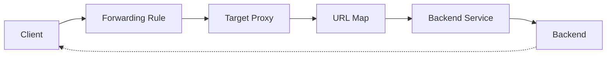
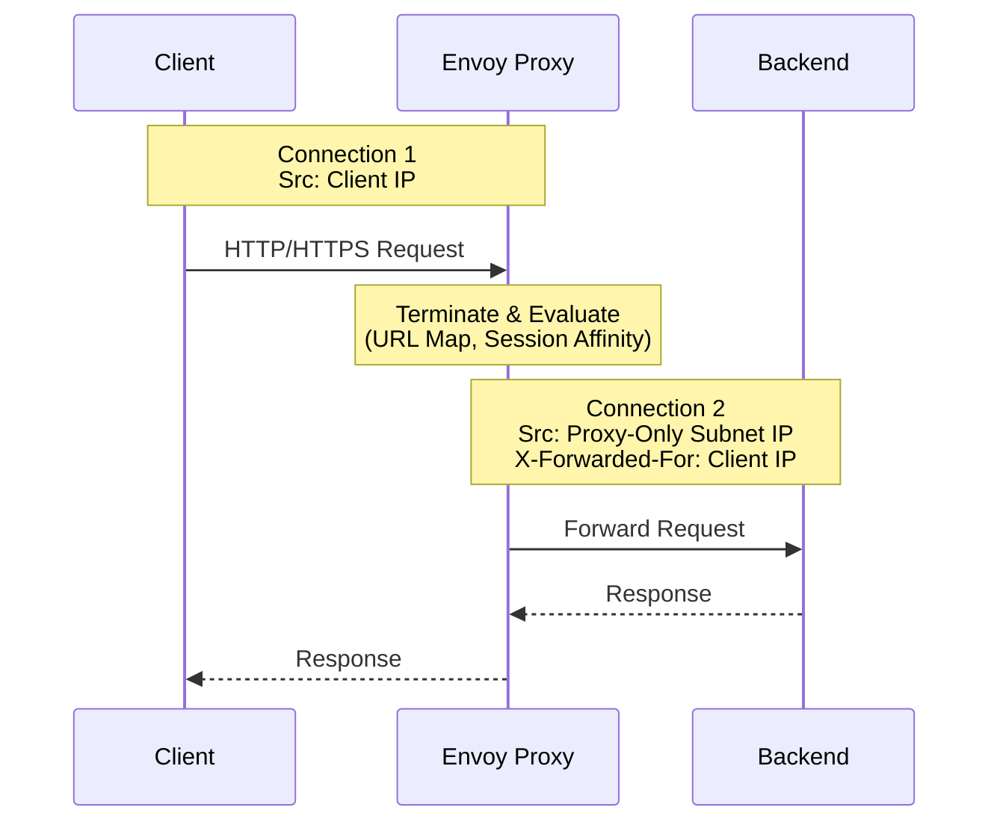

## 1. 개요

GCP의 Envoy 기반 Load Balancer(Internal Application Load Balancer, External Application Load Balancer, Proxy Network Load Balancer 등)는 **Proxy-Only Subnet**이라는 특별한 서브넷을 사용합니다. 이 서브넷은 Envoy Proxy에 IP를 할당하는 용도로만 사용되며, 백엔드 VM이나 포워딩 룰의 VIP와는 완전히 분리됩니다. [[1]](#references)

> "A proxy-only subnet provides a pool of IP addresses that are reserved exclusively for Envoy proxies used by Google Cloud load balancers. It cannot be used for any other purposes."
> — *Proxy-only subnets for Envoy-based load balancers* [[1]](#references)

### 공개 범위 안내

| 영역 | 공개 여부 |
|------|----------|
| Proxy-Only Subnet 구조 및 Purpose | 공개 |
| Proxy 할당 기준 (대역폭, 연결 수 등) | 공개 |
| Envoy Proxy 내부 스케일링 로직 | **Black Box** |
| 프로토콜별(HTTP/2, gRPC) Proxy 할당 차이 | **Black Box** |

---

## 2. Proxy-Only Subnet 아키텍처

### 2.1 아키텍처 개요


위 다이어그램에서 볼 수 있듯이, Envoy 기반 Load Balancer는 최소 **두 개의 서브넷**이 필요합니다: [[1]](#references)

| 서브넷 | 용도 | 예시 |
|--------|------|------|
| **Backend Subnet** | 백엔드 VM/Endpoint 배치 | `10.1.2.0/24` |
| **Proxy-Only Subnet** | Envoy Proxy IP 할당 전용 | `10.129.0.0/23` |

### 2.2 트래픽 흐름

1. 클라이언트가 Load Balancer의 **Forwarding Rule IP:Port**로 연결
2. **Envoy Proxy**가 연결을 수신하고 종료(terminate)
3. Proxy가 URL Map, Session Affinity, Balancing Mode를 평가
4. 적절한 **Backend VM/Endpoint**로 새로운 연결 생성

> **중요**: 백엔드가 수신하는 패킷의 **Source IP는 Proxy-Only Subnet 범위**에서 할당됩니다. 따라서 방화벽 규칙에서 Proxy-Only Subnet 범위를 허용해야 합니다.

---

## 3. Subnet Purpose 유형

### 3.1 Regional vs Cross-Regional

GCP는 두 가지 Proxy-Only Subnet Purpose를 제공합니다: [[1]](#references)

| Purpose | 지원 제품 | 특징 |
|---------|----------|------|
| **REGIONAL_MANAGED_PROXY** | Regional Internal/External Application Load Balancer, Regional Proxy Network Load Balancer, Secure Web Proxy | 리전 내에서 공유 |
| **GLOBAL_MANAGED_PROXY** | Cross-region Internal Application Load Balancer, Cross-region Internal Proxy Network Load Balancer | 글로벌 백엔드 지원 |

### 3.2 Purpose별 제약사항

- 동일 VPC 네트워크와 리전 내에서 **각 Purpose당 하나의 Active Subnet**만 존재 가능
- Regional과 Cross-region Load Balancer는 **동일 Subnet을 공유할 수 없음**
- 기존 `INTERNAL_HTTPS_LOAD_BALANCER` Purpose는 `REGIONAL_MANAGED_PROXY`로 마이그레이션 필요

---

## 4. Internal Application Load Balancer와 Envoy Proxy

### 4.1 Envoy Proxy의 역할

Internal Application Load Balancer는 **오픈소스 Envoy Proxy 기반의 관리형 서비스**입니다: [[2]](#references)

> "A Google Cloud internal Application Load Balancer is a proxy-based Layer 7 load balancer that enables you to run and scale your services behind a single internal IP address."
> — *Internal Application Load Balancer overview* [[2]](#references)

### 4.2 핵심 컴포넌트 이해

Internal Application Load Balancer를 구성하는 핵심 컴포넌트입니다:

| 컴포넌트 | 역할 |
|----------|------|
| **Forwarding Rule** | 클라이언트가 접속하는 VIP(가상 IP) 정의 |
| **Target Proxy** | 클라이언트 HTTP(S) 연결 종료, URL Map 참조 |
| **URL Map** | HTTP 헤더/URI 기반 라우팅 결정 |
| **Backend Service** | 백엔드 그룹 관리 및 트래픽 분산 설정 |
| **Health Check** | 백엔드 상태 모니터링 |
| **Proxy-Only Subnet** | Envoy Proxy 전용 IP 풀 (**VIP와 별도**) |

**트래픽 흐름:**



### 4.3 Regional vs Cross-region 모드

#### 동작 방식 차이

| 항목 | Cross-region | Regional |
|------|-------------|----------|
| **클라이언트 접근** | 항상 전역 접근 가능 | 기본적으로 리전 내만 접근 (Global Access 별도 설정 필요) |
| **백엔드** | 모든 리전의 백엔드로 트래픽 전송 가능 | 동일 리전 백엔드만 지원 |
| **페일오버** | 다른 리전 백엔드로 자동 페일오버 | 동일 리전 내에서만 페일오버 |
| **Proxy-Only Subnet** | `GLOBAL_MANAGED_PROXY` | `REGIONAL_MANAGED_PROXY` |

#### 리소스 스코프 차이

| 리소스 | Cross-region | Regional |
|--------|-------------|----------|
| **Forwarding Rule** | `globalForwardingRules` | `forwardingRules` |
| **Backend Service** | `backendServices` (global) | `regionBackendServices` |
| **URL Map** | `urlMaps` (global) | `regionUrlMaps` |
| **Target Proxy** | `targetHttpProxies` | `regionTargetHttpProxies` |
| **Health Check** | `healthChecks` (global) | `regionHealthChecks` |

#### 모드 선택 기준

| 상황 | 권장 모드 |
|------|----------|
| 백엔드가 단일 리전에 집중 | **Regional** |
| 멀티 리전 페일오버 필요 | **Cross-region** |
| 간단한 구성 선호 | **Regional** |
| 재해 복구(DR) 필수 | **Cross-region** |

> **주의**: 생성 후 모드 변경이 불가능합니다. [[2]](#references)
>
> "After you create a load balancer, you can't edit its mode."

#### 아키텍처 다이어그램

**Regional 아키텍처:**


**Cross-region 아키텍처:**


### 4.4 Proxy-based vs Passthrough 아키텍처

Passthrough Load Balancer(Internal passthrough Network Load Balancer)와 달리, Proxy-based Load Balancer(Envoy 기반)에서는:

1. **연결 종료**: 클라이언트 연결을 Proxy에서 종료
2. **새 연결 생성**: Proxy가 백엔드로 별도의 연결을 생성
3. **Source IP 변경**: 백엔드가 보는 패킷의 Source IP는 **Proxy-Only Subnet IP**

> **참고**: 원본 클라이언트 IP는 `X-Forwarded-For` 헤더를 통해 전달됩니다. [[2]](#references)



---

## 5. Envoy Proxy Scale Out 구조

> **Black Box 영역**: Envoy Proxy의 내부 스케일링 로직(트리거 조건, 스케일링 속도, 인스턴스 배치 알고리즘 등)은 **Google 관리형 서비스로 내부 동작이 공개되지 않습니다**. 아래 내용은 GCP 공식 문서에서 공개된 정보만을 기반으로 합니다.

### 5.1 자동 스케일링 메커니즘

Envoy Proxy는 **트래픽 수요에 따라 자동으로 할당**됩니다: [[2]](#references)

> "After the load balancer is configured, it automatically allocates Envoy proxies to meet your traffic needs."
> — *Internal Application Load Balancer overview* [[2]](#references)

### 5.2 Proxy 할당 기준 (공개된 정보)

Proxy 수는 **10분 단위 측정 기간** 동안 다음 중 더 큰 값을 기준으로 계산됩니다: [[1]](#references)

| 리소스 | Proxy당 용량 |
|--------|-------------|
| **대역폭** | 18 MB/초 |
| **새 연결 (HTTP)** | 600 연결/초 |
| **새 연결 (HTTPS)** | 150 연결/초 |
| **활성 연결** | 3,000 연결 |
| **요청 (Logging 비활성화)** | 1,400 요청/초 |
| **요청 (Logging 100% 활성화)** | 700 요청/초 |

### 5.3 Subnet 크기와 Proxy 용량

| 권장 크기 | IP 수 | 설명 |
|----------|-------|------|
| **최소** | /26 (64개) | 최소 요구사항 |
| **권장** | /23 (512개) | 시작점으로 권장 |
| **대규모** | /22 이상 | Envoy LB + Secure Web Proxy 동시 사용 시 |

> **팁**: Non-RFC 1918 주소 범위도 Proxy-Only Subnet에 사용 가능합니다. RFC 1918 주소가 부족할 때 유용합니다. [[1]](#references)

---

## 6. 통신 패턴별 Proxy 할당

> **Black Box 영역**: HTTP/1.1, HTTP/2, gRPC 등 프로토콜별 Proxy 할당 차이, 개별 연결당 Proxy 매핑 방식 등의 **세부 동작은 GCP에서 공개하지 않습니다**. 아래는 공개된 범위 내에서의 설명입니다.

### 6.1 VPC 레벨 공유

Proxy는 **Load Balancer 레벨이 아닌 VPC 레벨**에서 할당됩니다: [[1]](#references)

> "Proxies are allocated at the VPC level, not the load balancer level. If you deploy multiple load balancers in the same region and same VPC network, they share the same proxy-only subnet for load balancing."

### 6.2 Session Affinity와 Connection 관리

| Affinity 유형 | 동작 |
|--------------|------|
| **None** | 각 요청이 별도 백엔드로 분산 |
| **Client IP** | 동일 클라이언트 IP는 동일 백엔드로 |
| **Generated Cookie** | 쿠키 기반 세션 유지 |
| **Header Field** | 특정 헤더 값 기반 |

---

## 7. 실무 권장사항

### 7.1 Subnet 크기 계획

```bash
# Proxy-Only Subnet 생성 예시
gcloud compute networks subnets create proxy-only-subnet \
    --purpose=REGIONAL_MANAGED_PROXY \
    --role=ACTIVE \
    --region=asia-northeast3 \
    --network=my-vpc \
    --range=10.129.0.0/23
```

### 7.2 방화벽 규칙 설정

백엔드가 Proxy-Only Subnet으로부터의 트래픽을 수신할 수 있도록 방화벽 규칙을 설정해야 합니다:

```bash
# Proxy-Only Subnet에서 백엔드로의 트래픽 허용
gcloud compute firewall-rules create allow-proxy-only \
    --network=my-vpc \
    --action=allow \
    --direction=ingress \
    --source-ranges=10.129.0.0/23 \
    --target-tags=backend \
    --rules=tcp:80,tcp:443
```

### 7.3 모니터링 설정

Proxy-Only Subnet IP 고갈을 방지하기 위한 알림 설정: [[1]](#references)

> "You can configure Monitoring to monitor the IP address usage of your proxy-only subnet. You can define alerting policies to set up an alert for the `loadbalancing.googleapis.com/subnet/proxy_only/addresses` metric."

---

## 8. 체크리스트

- [ ] Proxy-Only Subnet을 `/23` 이상으로 생성했는지 확인
- [ ] 백엔드 방화벽 규칙에 Proxy-Only Subnet 범위를 허용했는지 확인
- [ ] Regional/Cross-regional 모드에 맞는 Purpose를 설정했는지 확인
- [ ] 기존 `INTERNAL_HTTPS_LOAD_BALANCER` Subnet을 마이그레이션했는지 확인
- [ ] Proxy IP 사용량 모니터링 알림을 설정했는지 확인
- [ ] Non-RFC 1918 주소 사용 시 라우팅 호환성을 확인했는지 점검

---

## References

| # | 문서 제목 | 링크 |
|---|----------|-----|
| 1 | Proxy-only subnets for Envoy-based load balancers | [바로가기](https://docs.cloud.google.com/load-balancing/docs/proxy-only-subnets) |
| 2 | Internal Application Load Balancer overview | [바로가기](https://docs.cloud.google.com/load-balancing/docs/l7-internal) |
| 3 | Cloud Load Balancing overview | [바로가기](https://docs.cloud.google.com/load-balancing/docs/load-balancing-overview) |
| 4 | Cloud Load Balancing pricing | [바로가기](https://cloud.google.com/load-balancing/pricing) |
