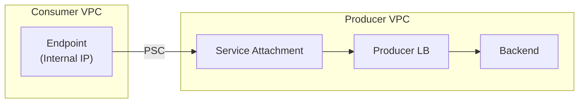
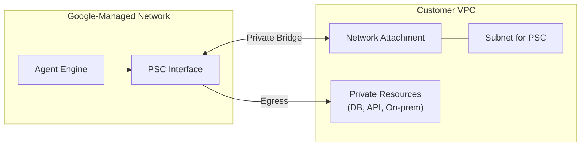

## 1. 개요

Private Service Connect(PSC)는 소비자 VPC에서 관리형 서비스에 **내부 IP로 프라이빗하게 접근**할 수 있게 하는 GCP 네트워킹 기능입니다. Vertex AI Agent Engine을 포함한 Vertex AI 서비스에서도 PSC Interface를 통해 Private 구성이 가능합니다. [[1]](#references)

> "Private Service Connect is a capability of Google Cloud networking that allows consumers to access managed services privately from inside their VPC network."
> — *Private Service Connect* [[1]](#references)

---

## 2. PSC 구성 유형 비교

PSC는 세 가지 주요 유형을 제공합니다: [[1]](#references)

### 2.1 유형별 비교

| 유형 | 방향 | 주요 용도 | 생성 방법 |
|------|------|----------|----------|
| **Endpoints** | Consumer → Producer | 서비스 접근 (L4 연결) | Forwarding Rule |
| **Backends** | Consumer → Producer | LB 기능 필요 시 (URL, Traffic Management) | NEG (Network Endpoint Group) |
| **Interfaces** | Producer → Consumer | 서비스가 소비자 VPC로 연결 필요 시 | Network Attachment |

### 2.2 Endpoints

Endpoints는 **Forwarding Rule 기반**으로 가장 간단한 PSC 연결 방식입니다:



- 소비자 VPC 내부 IP로 서비스 접근
- Google APIs 또는 Published Services 대상
- Layer 4 연결 제공

### 2.3 Backends

Backends는 **Load Balancer 앞단에 PSC NEG**를 배치하여 더 많은 제어 기능을 제공합니다:

- Custom URL/도메인 사용 가능
- 리전 간 페일오버 구성 가능
- 중앙 집중식 보안 설정

### 2.4 Interfaces (Producer → Consumer)

Interfaces는 다른 유형과 **반대 방향**으로, 프로듀서가 소비자 VPC로 연결을 시작합니다: [[1]](#references)

> "A Private Service Connect interface lets a producer VPC network initiate connections to a consumer VPC network (managed service egress). An endpoint works in the reverse direction."

**Vertex AI Agent Engine이 PSC Interface를 사용하는 이유**: Agent가 소비자 VPC 내의 프라이빗 리소스에 접근해야 하기 때문입니다.

---

## 3. Vertex AI Agent Engine Private 구성

### 3.1 PSC Interface 아키텍처

Vertex AI Agent Engine은 PSC Interface와 DNS Peering을 통해 Private Egress 트래픽을 지원합니다: [[2]](#references)



### 3.2 구성 요소

| 구성 요소 | 설명 | 프로젝트 |
|----------|------|---------|
| **VPC Network** | 대상 네트워크 | Customer |
| **Subnet** | PSC Interface용 (최소 /28) | Customer |
| **Network Attachment** | PSC 연결점 | Customer (권장) |
| **DNS Peering** | 서비스 디스커버리 | Customer |

### 3.3 Subnet 요구사항

[[2]](#references)에 따른 서브넷 요구사항:

| 항목 | 값 |
|------|-----|
| 최소 크기 | `/28` (16개 IP) |
| IP 할당 | 최대 인스턴스당 2개 IP |
| 지원 범위 | RFC 1918 및 일부 Non-RFC 1918 |

**제외되는 범위:**
- `100.64.0.0/20`
- `192.0.0.0/24`, `192.0.2.0/24`
- `198.18.0.0/15`, `198.51.100.0/24`
- `203.0.113.0/24`
- `240.0.0.0/4`

### 3.4 Network Attachment 생성

```bash
# 1. Subnet 생성
gcloud compute networks subnets create psc-subnet \
    --network=my-vpc \
    --region=asia-northeast3 \
    --range=10.100.0.0/28

# 2. Network Attachment 생성 (자동 승인)
gcloud compute network-attachments create agent-engine-attachment \
    --region=asia-northeast3 \
    --subnets=psc-subnet \
    --connection-preference=ACCEPT_AUTOMATIC
```

### 3.5 Agent 배포 시 PSC 설정

```python
from vertexai.preview import agent_engine

# Agent 배포 시 Network Attachment 지정
agent = agent_engine.Agent.create(
    display_name="my-agent",
    network_attachment="projects/PROJECT_ID/regions/REGION/networkAttachments/ATTACHMENT_NAME",
    # DNS Peering 설정 (옵션)
    dns_domain="example.internal.",
)
```

---

## 4. PSC Interface 네트워크 아키텍처

### 4.1 Vertex AI Agent Engine 실행 환경

Vertex AI Agent Engine은 Google 관리형 네트워크에서 실행되며, PSC Interface를 통해 Customer VPC와 **Private하고 안전하게 연결**됩니다: [[2]](#references)

> "Your agent is deployed in a secure, **Google-managed network** without access to your Virtual Private Cloud (VPC) network. A PSC interface creates a **private and secure bridge** to your network."

| 구분 | 설명 |
|------|------|
| **Agent Engine 실행 위치** | Google 관리형 네트워크 (관리형 서비스 표준 아키텍처) |
| **Agent ↔ VPC 트래픽** | PSC Interface를 통해 Private 연결, **인터넷 미경유** |

### 4.2 PSC Interface의 역할

PSC Interface는 Agent와 Customer VPC 간의 **Private Bridge**를 제공합니다:

1. **Private 연결**: Agent와 Customer VPC 리소스 간 프라이빗 통신
2. **Google 네트워크 내 전송**: 모든 트래픽이 Google 내부 네트워크에서 전송, 인터넷 미경유
3. **VPC 리소스 접근**: 프라이빗 DB, 내부 API, 온프레미스 연결 등

### 4.3 인터넷 접근 구성

| 시나리오 | 인터넷 접근 방법 |
|----------|----------------|
| **VPC SC 미사용** | VPC 내 Proxy VM 또는 NAT 구성 필요 |
| **VPC SC 사용** | Egress 허용 및 Proxy + NAT 필수 |

> "Without VPC Service Controls: When you configure your agent with only a PSC interface, traffic from your agent is routed into your VPC. By default, your VPC doesn't provide an outbound path to the public internet for this traffic."
> — [[2]](#references)

---

## 5. Shared VPC 환경 구성

### 5.1 권장 구성

Shared VPC 환경에서는 **Service Project에 Network Attachment 생성**을 권장합니다: [[2]](#references)

| 위치 | 장점 | 필요 권한 |
|------|------|----------|
| **Service Project (권장)** | 권한 관리 간소화 | `compute.networkAdmin` |
| **Host Project** | 중앙 집중 관리 | Host Project의 Vertex AI Service Agent에 권한 필요 |

### 5.2 필요 권한

Service Project의 Vertex AI Service Agent에 필요한 권한:

```bash
# Custom Role 생성 (최소 권한)
gcloud iam roles create pscNetworkAttachment \
    --project=SERVICE_PROJECT_ID \
    --title="PSC Network Attachment" \
    --permissions=compute.networkAttachments.get,compute.networkAttachments.update,compute.regionOperations.get

# Service Agent에 역할 부여
gcloud projects add-iam-policy-binding SERVICE_PROJECT_ID \
    --member="serviceAccount:service-PROJECT_NUMBER@gcp-sa-aiplatform.iam.gserviceaccount.com" \
    --role="projects/SERVICE_PROJECT_ID/roles/pscNetworkAttachment"
```

---

## 6. DNS Peering 구성

### 6.1 DNS Peering이 필요한 이유

PSC Interface만으로는 IP 주소 기반 연결만 가능합니다. **DNS Peering**을 추가하면: [[2]](#references)

- 안정적인 DNS 이름으로 서비스 접근
- IP 변경에 영향받지 않음
- Cloud DNS Private Zone 활용

### 6.2 DNS Peering 설정

```bash
# Private DNS Zone 생성 (Customer VPC)
gcloud dns managed-zones create internal-zone \
    --dns-name="internal.example.com." \
    --visibility=private \
    --networks=my-vpc

# Agent 배포 시 DNS Domain 지정
# network_attachment와 함께 dns_domain 파라미터 사용
```

---

## 7. 체크리스트

- [ ] PSC용 Subnet이 최소 `/28` 이상인지 확인
- [ ] Network Attachment가 올바른 프로젝트에 생성되었는지 확인
- [ ] Vertex AI Service Agent에 필요 권한이 부여되었는지 확인
- [ ] PSC Interface 네트워크 아키텍처를 이해하고 있는지 확인
- [ ] 인터넷 접근이 필요한 경우 Proxy/NAT 구성을 계획했는지 확인
- [ ] DNS Peering 필요 시 Private Zone을 구성했는지 확인

---

## 8. 핵심 요약

| 항목 | 설명 |
|------|------|
| **Agent 실행 위치** | Google 관리형 네트워크 (관리형 서비스 표준 아키텍처) |
| **PSC Interface 역할** | Agent ↔ Customer VPC 간 **Private Bridge** 제공 |
| **트래픽 경로** | Google 내부 네트워크 전송, **인터넷 미경유** |
| **인터넷 접근** | VPC 내 Proxy/NAT 구성 필요 |

---

## References

| # | 문서 제목 | 링크 |
|---|----------|-----|
| 1 | Private Service Connect | [바로가기](https://docs.cloud.google.com/vpc/docs/private-service-connect) |
| 2 | Using PSC interface with Vertex AI Agent Engine | [바로가기](https://docs.cloud.google.com/agent-builder/agent-engine/private-service-connect-interface) |
| 3 | Create and manage network attachments | [바로가기](https://docs.cloud.google.com/vpc/docs/create-manage-network-attachments) |
| 4 | Set up a PSC interface for Vertex AI resources | [바로가기](https://docs.cloud.google.com/vertex-ai/docs/general/vpc-psc-i-setup) |
| 5 | About accessing Vertex AI through PSC interfaces | [바로가기](https://docs.cloud.google.com/vertex-ai/docs/general/psc-interfaces) |
