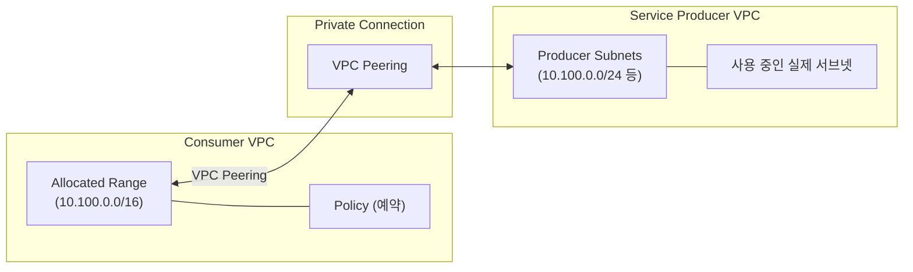

## 1. 개요

Private Service Access(PSA)에서 IP 범위를 할당하면, 해당 범위는 서비스 프로듀서가 서브넷을 생성하는 데 사용됩니다. 이 할당 범위를 **임의로 해제(Release)** 하면 예상치 못한 문제가 발생할 수 있습니다. [[1]](#references)


---

## 2. PSA 할당 범위의 라이프사이클

### 2.1 정상 라이프사이클


### 2.2 구성 요소 관계

| 구성 요소 | 역할 | 삭제 순서 |
|----------|------|----------|
| **할당 범위 (Allocated Range)** | IP 예약 | 마지막 |
| **Private Connection** | VPC Peering 연결 | 중간 |
| **서비스 인스턴스** | Cloud SQL, Memorystore 등 | 먼저 |

---

## 3. Policy Release 시 동작 메커니즘

### 3.1 사용 중인 할당 범위를 삭제하면?

Private Connection을 수정하지 않고 할당 범위를 삭제하면 다음과 같은 상황이 발생합니다: [[1]](#references)

> "If you delete an allocated IP address that is in use, and you don't modify the private connection, the following applies:
> - Existing connections remain active
> - If you delete the only allocated IP address range, the service can't create new subnets
> - If you later create an allocated IP address range that matches or overlaps the deleted range, adding the range to a private connection fails."

### 3.2 상세 동작

| 시나리오 | 기존 연결 | 신규 생성 | 범위 재사용 |
|----------|----------|----------|------------|
| 범위 삭제 (Connection 수정 안 함) | **유지됨** | **불가** | **실패** |
| 범위 삭제 후 Connection 수정 | 유지됨 | 가능 (새 범위 필요) | 가능 |

### 3.3 Warning 상태로 변경되는 케이스

GCP Console이나 CLI에서 다음과 같은 Warning이 표시될 수 있습니다:

1. **IP 범위 충돌 가능성**: 삭제된 범위와 Consumer VPC의 다른 리소스가 동일 IP 사용 가능
2. **신규 서브넷 생성 불가**: 서비스 프로듀서가 새 리소스를 위한 서브넷 생성 불가
3. **범위 재사용 실패**: 동일 범위를 다시 할당하려 해도 Connection에 추가 실패

---

## 4. Peering Route 유지 현상

### 4.1 Route가 남아있는 이유

할당 범위를 업데이트한 후에도 **이전 Peering Subnet Route가 라우팅 테이블에 남아있을 수 있습니다**: [[1]](#references)

> "After you update the allocated IP address range of a private services connection, the old peering subnet route might still appear in the routing table of your VPC network. The route persists because the IP address range is still in use."

### 4.2 Route가 제거되는 조건

1. **서비스 인스턴스 완전 삭제**: 해당 범위를 사용하는 모든 인스턴스 삭제
2. **삭제 대기 기간 완료**: 서비스별 대기 기간 경과 (예: Cloud SQL 4일)
3. **Connection 업데이트**: Private Connection에서 범위 제거

---

## 5. IP 대역 Release 정상 절차

### 5.1 단계별 절차

```bash
# 1. 현재 Private Connection 확인
gcloud services vpc-peerings list \
    --network=my-vpc \
    --service=servicenetworking.googleapis.com

# 2. 해당 범위를 사용하는 서비스 인스턴스 확인 및 삭제
# (예: Cloud SQL)
gcloud sql instances delete my-instance

# 3. 삭제 대기 기간 경과 확인 (Cloud SQL: 최대 4일)

# 4. Private Connection에서 범위 제거
gcloud services vpc-peerings update \
    --network=my-vpc \
    --service=servicenetworking.googleapis.com \
    --ranges=new-range  # 기존 범위 제외

# 5. 할당 범위 삭제
gcloud compute addresses delete old-range --global
```

### 5.2 서비스별 삭제 대기 기간

서비스 프로듀서마다 리소스 삭제 후 대기 기간이 다를 수 있습니다: [[1]](#references)

| 서비스 | 대기 기간 | 비고 |
|--------|----------|------|
| **Cloud SQL** | 최대 4일 | 복원 가능 기간 (문서화됨) |
| **기타 서비스** | 서비스별 상이 | 각 서비스 문서 참조 필요 |

> "For example, if you delete a Cloud SQL instance, you receive a success response, but the service waits for four days before deleting the service producer resources."
> — [[1]](#references)

---

## 6. 비정상 Release 시 대응 방안

### 6.1 Warning 상태 해결

할당 범위를 삭제했지만 Connection을 수정하지 않은 경우:

```bash
# 1. 새로운 할당 범위 생성
gcloud compute addresses create new-psa-range \
    --global \
    --purpose=VPC_PEERING \
    --addresses=10.200.0.0 \
    --prefix-length=16 \
    --network=my-vpc

# 2. Private Connection에 새 범위 추가
gcloud services vpc-peerings update \
    --network=my-vpc \
    --service=servicenetworking.googleapis.com \
    --ranges=new-psa-range \
    --force
```

### 6.2 Route 충돌 해결

이전 범위와 현재 VPC의 다른 서브넷/라우트가 충돌하는 경우:

1. **충돌 리소스 식별**: `gcloud compute routes list` 로 확인
2. **충돌 리소스 제거 또는 수정**
3. **Private Connection 재구성**

### 6.3 Support 케이스가 필요한 상황

| 상황 | 조치 |
|------|------|
| Connection 삭제 후 재생성 실패 | Support 문의 |
| Peering이 정상이나 연결 불가 | Support 문의 |
| 4일 경과 후에도 Route 유지 | Support 문의 |

---

## 7. 모니터링 및 예방

### 7.1 Network Analyzer 활용

Network Intelligence Center의 Network Analyzer를 사용하여 PSA IP 사용량을 모니터링할 수 있습니다: [[1]](#references)

> "To view the allocation ratio for your allocated ranges, use Network Analyzer. For more information, see Private services access IP address utilization summary."

### 7.2 IP 사용량 확인

```bash
# Private Connection의 할당 범위 확인
gcloud services vpc-peerings list \
    --network=my-vpc \
    --service=servicenetworking.googleapis.com

# VPC 라우트 확인 (Peering 서브넷 포함)
gcloud compute routes list \
    --filter="network:my-vpc"
```

### 7.3 예방 체크리스트

- [ ] 삭제 전 해당 범위를 사용하는 모든 서비스 인스턴스 확인
- [ ] 서비스별 삭제 대기 기간 인지
- [ ] Private Connection 수정 먼저 진행
- [ ] 범위 재사용 시 기존 Connection에서 완전 제거 확인

---

## 8. Policy와 할당 IP의 구조적 관계

### 8.1 아키텍처 개요



### 8.2 Policy vs 실제 할당

| 구분 | Policy (Allocated Range) | 실제 사용 (Producer Subnet) |
|------|-------------------------|---------------------------|
| **관리 주체** | Consumer | Producer (자동 생성) |
| **삭제 가능 여부** | 가능 (주의 필요) | 서비스 삭제 시 자동 |
| **범위** | 전체 예약 범위 | 범위 내 일부 |

### 8.3 비정상 해지 시 구조적 이슈

1. **Policy 삭제**: Consumer가 예약 해제
2. **Producer Subnet 유지**: 서비스 인스턴스가 여전히 사용 중
3. **불일치 상태**: Policy는 없지만 실제 사용 중
4. **결과**: 
   - 기존 서비스는 동작하지만 신규 생성 불가
   - IP 충돌 위험 발생
   - 범위 재사용 불가

---

## 9. 핵심 요약

| 질문 | 답변 |
|------|------|
| Policy를 먼저 해지하면? | **기존 연결 유지**, 신규 생성 불가, Warning 발생 |
| Route가 남아있는 이유? | **서비스가 여전히 사용 중**이거나 삭제 대기 기간 미경과 |
| 정상 삭제 순서는? | 인스턴스 삭제 → 대기 기간 → Connection 수정 → 범위 삭제 |
| 비정상 해지 시 대응? | 새 범위 생성 후 Connection 업데이트, 필요시 Support 문의 |

---

## References

| # | 문서 제목 | 링크 |
|---|----------|-----|
| 1 | Configure private services access | [바로가기](https://docs.cloud.google.com/vpc/docs/configure-private-services-access) |
| 2 | Private services access | [바로가기](https://docs.cloud.google.com/vpc/docs/private-services-access) |
| 3 | Network Analyzer - IP utilization | [바로가기](https://docs.cloud.google.com/network-intelligence-center/docs/network-analyzer/insights/vpc-network/ip-utilization) |
| 4 | VPC quotas and limits | [바로가기](https://docs.cloud.google.com/vpc/docs/quota) |
