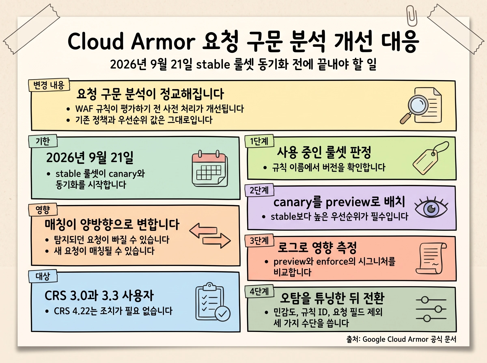
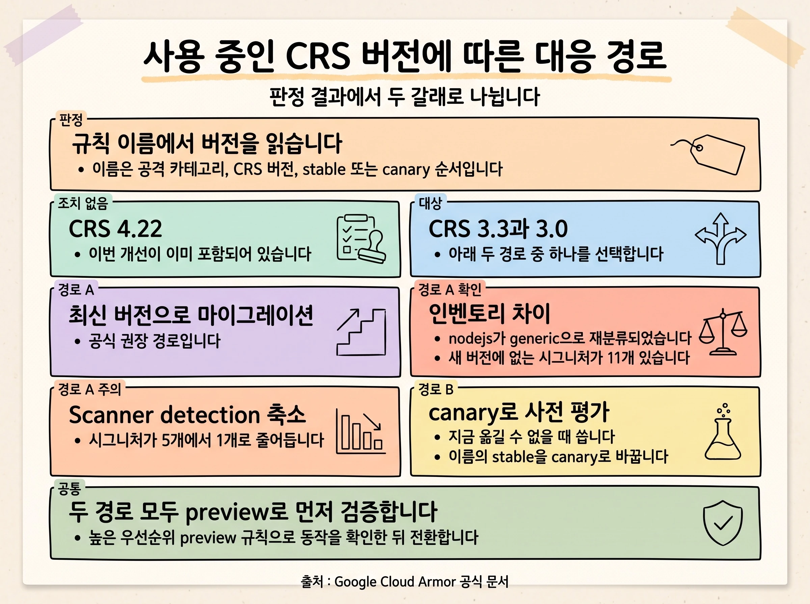
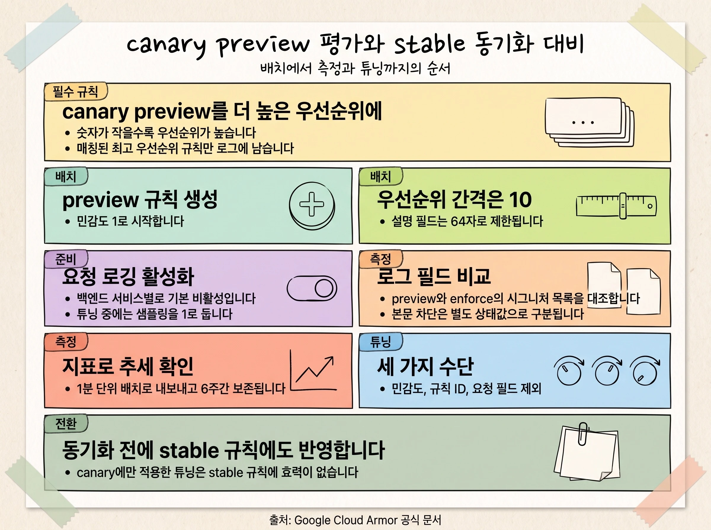

> **본 문서 대상 독자:** Cloud Armor 보안 정책을 운영하는 플랫폼 관리자와 보안 담당자, 그리고 외부 Application Load Balancer 뒤에서 웹 애플리케이션을 서비스하는 개발팀. Cloud Armor 보안 정책과 사전 구성 WAF 규칙의 기본 개념을 안다고 가정합니다.

> **범위 안내:** 이 문서는 Google Cloud 가 공지한 Cloud Armor 요청 구문 분석 개선에 대한 대응 절차를 다룹니다. 명령어와 정량 수치, 로그 필드 이름은 Cloud Armor 공식 문서(2026년 7월 기준)를 근거로 합니다.

## Executive Summary

- Google Cloud 가 Cloud Armor 의 **요청 구문 분석 기능을 개선**합니다. 사전 구성 WAF 규칙이 요청 콘텐츠를 평가하기 전 수행하는 사전 처리가 정교해지는 변경으로, 기존 보안 정책과 규칙 구성, 우선순위 값 자체는 바뀌지 않습니다.
- 개선 사항은 **CRS 3.0 과 CRS 3.3 의 canary 룰셋에 이미 반영**되어 있습니다. **stable 룰셋 동기화는 2026년 9월 21일부터** 시작됩니다. 당초 2026년 7월 20일이었던 일정이 미리 보기 평가 기간을 확보하기 위해 연기된 것입니다.
- 사전 처리가 달라지면 **같은 규칙이 매칭하는 트래픽이 양방향으로 변합니다.** 이전에 탐지되던 요청이 더 이상 매칭되지 않을 수 있고, 탐지되지 않던 요청이 새로 매칭될 수 있습니다. 후자가 정상 트래픽이면 새로운 오탐이 됩니다.
- **CRS 4.22 사용자는 조치가 필요 없습니다.** 이 개선은 4.22 초기 릴리스부터 통합되어 있습니다. CRS 4.22 는 2026년 4월 6일 Preview 로 공개된 뒤 2026년 7월 8일 GA 되었습니다 ([Cloud Armor 릴리스 노트](https://cloud.google.com/armor/docs/release-notes)).
- CRS 3.0 이나 3.3 을 쓰고 있다면 동기화 이전에 **canary 룰셋을 preview 모드로 배치해 영향을 측정하고 필요한 튜닝을 끝내야 합니다.** 이때 canary preview 규칙을 enforce 중인 stable 규칙보다 **높은 우선순위**(더 낮은 숫자)에 두는 것이 필수입니다. Cloud Armor 는 매칭된 최고 우선순위 규칙 한 건에 대해서만 로그를 생성하기 때문입니다 ([보안 정책 개요](https://cloud.google.com/armor/docs/security-policy-overview)).
- 문서 기준일인 2026년 7월 31일에서 동기화 시작일까지 남은 기간은 약 7주입니다.

## 한눈에 보기

이번 대응은 다음 네 단계로 진행합니다.

1. **판정.** 보안 정책이 참조하는 사전 구성 WAF 규칙 이름에서 CRS 버전을 확인합니다. `v422` 면 조치가 끝납니다.
2. **경로 선택.** CRS 4.22 로 마이그레이션할지, 기존 CRS 의 canary 룰셋으로 먼저 평가할지 결정합니다.
3. **측정.** 선택한 룰셋을 높은 우선순위 preview 규칙으로 배치하고, 요청 로그와 지표로 매칭 변화를 관찰합니다.
4. **튜닝과 전환.** 오탐이 확인되면 민감도, 규칙 ID, 요청 필드 제외 세 가지 수단으로 조정한 뒤 enforce 로 전환합니다.

아래 도식은 변경 내용과 기한, 조치 단계를 한 장으로 정리한 것입니다.



읽는 순서는 다음과 같습니다. 변경의 성격을 먼저 이해하고(변경 내용 절), 자신이 대상인지 판정한 뒤(영향 범위 판정 절), 두 경로 중 하나를 골라(대응 경로 절) 측정과 튜닝으로 넘어갑니다. 이미 CRS 4.22 를 쓰고 있다면 판정 절에서 문서를 덮어도 됩니다.

> [!IMPORTANT]
> **기한:** stable 룰셋과 canary 룰셋의 동기화는 2026년 9월 21일부터 시작됩니다. 그 이전에 평가와 튜닝을 마쳐야 합니다. 동기화 이후에는 개선된 구문 분석이 enforce 중인 규칙에 그대로 적용됩니다.

## 변경 내용: 요청 구문 분석 개선

### 무엇이 달라지는가

Cloud Armor 의 요청 구문 분석 기능이 향상되어 콘텐츠 검사의 정확성과 안정성이 높아집니다. 이 개선은 사전 구성 WAF 규칙이 요청을 평가하기 **이전 단계**, 즉 요청 콘텐츠를 어떤 단위로 쪼개어 시그니처에 넘길지 결정하는 사전 처리에 적용됩니다.

정리하면 변경의 요점은 다음 다섯 가지입니다.

| 항목 | 내용 |
|---|---|
| 변경 대상 | 사전 구성 WAF 규칙 평가 이전의 요청 콘텐츠 사전 처리 |
| 변경되지 않는 것 | 기존 보안 정책, 규칙 구성, 우선순위 값 |
| canary 룰셋 | CRS 3.0 과 CRS 3.3 의 canary 에 이미 반영 완료 |
| stable 룰셋 | 2026년 9월 21일부터 canary 와 동기화 시작 |
| CRS 4.22 | 초기 릴리스부터 통합되어 있어 별도 조치 불필요 |

주의할 점은 영향이 한 방향이 아니라는 것입니다. 기존 규칙이 이전에 탐지했던 트래픽과 더 이상 매칭되지 않을 수 있고, 반대로 이전에 탐지되지 않던 새로운 트래픽과 매칭되기 시작할 수 있습니다. 전자는 탐지 공백으로, 후자는 정상 요청 차단으로 이어질 수 있으므로 양쪽 모두를 관찰해야 합니다.

> [!NOTE]
> 오탐은 사전 구성 WAF 규칙이 정상 쿼리를 위협으로 잘못 식별해 매칭이 발생하고 규칙이 그 쿼리를 차단하는 상황을 말합니다 ([WAF 규칙 조정](https://cloud.google.com/armor/docs/rule-tuning)).

### 구문 분석이 WAF 평가에 개입하는 지점

기본 동작에서 Cloud Armor 는 요청 본문 전체를 **하나의 균일한 문자열**로 보고 사전 구성 WAF 규칙의 시그니처와 대조합니다. 본문은 기본적으로 URL 쿼리 파라미터와 같은 방식으로 디코딩됩니다 ([보안 정책 개요](https://cloud.google.com/armor/docs/security-policy-overview)).

문제는 JSON 처럼 별도 인코딩을 쓰는 요청입니다. 이 경우 사용자가 입력하지 않은 **메시지의 구조적 요소**가 시그니처와 매칭될 수 있습니다. 공식 문서는 REST API 를 제공하거나 GraphQL 을 사용하거나 JSON 인코딩 콘텐츠를 받는 워크로드라면, 노이즈와 오탐 위험을 줄이기 위해 지원되는 `Content-Type` 헤더에 대해 대체 파싱을 활성화할 것을 권장합니다 ([요청 본문 콘텐츠 파싱](https://cloud.google.com/armor/docs/content-parsing)).

즉 구문 분석은 "무엇을 검사 대상 문자열로 볼 것인가" 를 결정하는 층이고, 이 층이 바뀌면 시그니처 자체를 건드리지 않아도 매칭 결과가 달라집니다. 이번 개선이 규칙 구성을 바꾸지 않으면서도 매칭 트래픽을 변화시키는 이유가 여기에 있습니다.

또 하나 기억할 점은 본문을 보는 표현식이 하나뿐이라는 사실입니다. `evaluatePreconfiguredWaf` 만 요청 본문에 대해 평가되고, 나머지 모든 표현식은 요청 헤더만 평가합니다. 따라서 이번 변경의 영향은 사전 구성 WAF 규칙에 국한됩니다.

### 본문 검사 범위와 파싱 설정

평가 대상 범위와 파싱 방식은 보안 정책 단위로 설정합니다. 지금 값을 확인해 두면 측정 결과를 해석할 때 기준이 됩니다.

Cloud Armor 는 요청 본문을 기본적으로 처음 64 kB 까지 검사하며, 이 한도를 8 kB, 16 kB, 32 kB, 48 kB, 64 kB 중 하나로 설정할 수 있습니다.

```bash
gcloud compute security-policies update POLICY_NAME \
    --request-body-inspection-size=8kB
```

한도를 넘는 본문은 검사되지 않으므로, 검사되지 않은 콘텐츠가 백엔드에 도달하지 않게 하려면 본문 크기를 직접 막는 규칙을 함께 둡니다. 다음은 8 kB(8192 바이트)를 초과하는 요청을 차단하는 예입니다.

```bash
gcloud compute security-policies rules create 10 \
    --security-policy my-policy \
    --expression "int(request.headers['content-length']) > 8192" \
    --action deny-403 \
    --description "Block requests greater than 8 kB"
```

JSON 파싱은 정책별로 켜고 끕니다. 기본값은 비활성이며, 플래그 값은 `STANDARD`, `STANDARD_WITH_GRAPHQL`, `DISABLED` 세 가지입니다.

```bash
gcloud compute security-policies update POLICY_NAME \
    --json-parsing STANDARD \
    --json-custom-content-types "application/json,application/vnd.api+json,application/vnd.collection+json,application/vnd.hyper+json"
```

GraphQL 요청까지 포함하려면 `--json-parsing STANDARD_WITH_GRAPHQL` 을 씁니다.

> [!WARNING]
> `--json-parsing` 플래그는 `gcloud compute security-policies update` 에서만 사용할 수 있습니다. 새 보안 정책을 만들 때 이 옵션을 함께 지정하려면 정책을 파일로 작성해 가져오기(import) 해야 합니다.

파싱이 항상 성공하는 것은 아니며, 실패 시 동작을 알아 두어야 결과 해석이 가능합니다.

- JSON 콘텐츠를 완전히 파싱할 수 없으면 본문 전체를 단일 URL 인코딩 문자열로 처리하는 방식으로 되돌아갈 수 있습니다.
- JSON 파서가 결과를 반환하지 않으면 URI 파싱이 시도될 수 있습니다. URI 파서가 이름과 값 파라미터를 전혀 또는 일부만 반환하면, 전체 또는 일부 문자열이 검사용 파라미터 이름으로 취급될 수 있습니다.
- JSON 콘텐츠가 설정된 검사 한도보다 크면 그 한도까지만 JSON 파싱이 적용되고, 그 범위가 사전 구성 WAF 규칙의 검사 대상이 됩니다.

디코더가 지원되지 않는 형식도 있습니다. XML, Gzip, UTF-16 은 지원되지 않으며 `multipart/form-data` 를 포함한 그 밖의 콘텐츠 타입과 인코딩 타입에서는 데이터를 디코딩하지 않고 원시 데이터에 사전 구성 규칙을 적용합니다.

## 영향 범위 판정: 사용 중인 룰셋 확인

### 룰셋 이름 읽기

사전 구성 WAF 규칙 이름은 `<공격 카테고리>-<OWASP CRS 버전>-<version field>` 형식입니다. 공격 카테고리는 `xss`, `sqli` 처럼 방어 대상 공격 유형을 나타내고, version field 로는 `stable` 과 `canary` 두 값이 지원됩니다 ([규칙 언어 속성](https://cloud.google.com/armor/docs/rules-language-reference)).

버전 표기는 세 가지로 구분됩니다.

| CRS 버전 | 이름 예시 | 카테고리 수 |
|---|---|---|
| CRS 4.22 | `sqli-v422-stable`, `sqli-v422-canary` | 12 |
| CRS 3.3 | `sqli-v33-stable`, `nodejs-v33-canary` | 12 |
| CRS 3.0 | `sqli-stable`, `sqli-canary` (버전 표기 없음) | 10 |

CRS 3.0 에는 Java 와 NodeJS 카테고리가 없습니다. 이름에 버전 문자열이 아예 없으면 CRS 3.0 입니다.

### 현재 정책이 참조하는 룰셋 확인

보안 정책의 규칙 표현식을 직접 확인합니다.

```bash
gcloud compute security-policies describe POLICY_NAME
```

출력의 규칙 표현식에서 `evaluatePreconfiguredWaf(...)` 의 첫 번째 인수가 룰셋 이름입니다. 사용 가능한 룰셋과 각 시그니처의 민감도를 함께 보려면 다음 명령을 씁니다.

```bash
gcloud compute security-policies list-preconfigured-expression-sets
```

출력은 룰셋 이름 아래에 `RULE_ID` 와 `SENSITIVITY` 쌍이 나열되는 형태입니다.

```text
EXPRESSION_SET
sqli-canary
    RULE_ID                          SENSITIVITY
    owasp-crs-v042200-id942120-sqli  2
xss-canary
    RULE_ID                         SENSITIVITY
    owasp-crs-v042200-id941110-xss  1
    owasp-crs-v042200-id941120-xss  2
```

stable 룰셋과 canary 룰셋이 현재 같은 내용인지는 사전 구성 WAF 규칙 문서의 룰셋 표에서 확인합니다. stable 항목에 `In sync with` 표기와 대응하는 canary 이름이 함께 적혀 있으면 두 룰셋의 내용이 일치하는 상태이고, canary 항목의 `Latest` 표기는 그 룰셋이 최신 변경을 담고 있음을 뜻합니다 ([사전 구성 WAF 규칙 개요](https://cloud.google.com/armor/docs/waf-rules)). 공식 권장 사항도 이 표에서 canary 규칙이 stable 룰셋과 동기화되어 있는지 규칙 이름으로 확인하라고 안내합니다 ([Cloud Armor 권장 구성](https://cloud.google.com/armor/docs/best-practices)).

### 판정 결과

| 사용 중인 룰셋 | 필요한 조치 |
|---|---|
| `*-v422-*` (CRS 4.22) | 없습니다. 이번 개선이 이미 포함되어 있습니다. |
| `*-v33-*` (CRS 3.3) | 대상입니다. 아래 두 경로 중 하나를 선택합니다. |
| 버전 표기 없음 (CRS 3.0) | 대상입니다. 아래 두 경로 중 하나를 선택하며, 4.22 마이그레이션을 우선 검토합니다. |

## 두 가지 대응 경로

아래 다이어그램은 판정 결과에서 두 경로로 갈라지는 흐름과 각 경로의 확인 항목을 정리한 것입니다.



### 경로 A: CRS 4.22 로 마이그레이션

공식 문서는 최신 위협에 대한 보호를 위해 CRS 4.22 사용을 권장합니다. CRS 3.3 과 3.0 에 대한 지원은 계속되지만, 워크로드가 허용하는 한 이전 버전, 특히 CRS 3.0 을 피할 것을 권장합니다 ([사전 구성 WAF 규칙 개요](https://cloud.google.com/armor/docs/waf-rules)).

이 경로를 택하면 이번 구문 분석 개선과 CRS 버전 업그레이드를 한 번에 처리할 수 있습니다. 대신 시그니처 인벤토리가 달라지므로 다음 세 가지를 함께 확인합니다.

**카테고리 재분류.** CRS 3.3 의 `nodejs` 룰셋은 CRS 4.22 에서 `generic` 으로 재분류되었습니다. 두 버전 모두 규칙 ID 의 시작 세 자리로 `934` 를 사용합니다. 따라서 `nodejs-v33-stable` 을 쓰고 있었다면 대응 룰셋은 `generic-v422-stable` 입니다.

**제외된 시그니처.** CRS 3.3 과 4.22 의 시그니처 비교 표 224개 항목 중 양쪽에 모두 있는 항목이 136개, CRS 4.22 에만 있는 항목이 77개, CRS 3.3 에만 있는 항목이 11개입니다. 즉 마이그레이션으로 새로 추가되는 탐지가 훨씬 많지만, 다음 11개는 CRS 4.22 에 포함되지 않습니다.

| 카테고리 | CRS 4.22 에 없는 규칙 ID |
|---|---|
| Remote code execution (RCE) | `932100`, `932105`, `932106`, `932110`, `932115`, `932150` |
| SQL Injection (SQLi) | `942110` |
| Scanner detection | `913101`, `913102`, `913110`, `913120` |

**Scanner detection 축소.** 위 표에서 알 수 있듯 Scanner detection 카테고리는 CRS 3.3 의 5개 시그니처에서 CRS 4.22 의 1개(`913100`)로 줄어듭니다. 비중으로 보면 가장 크게 축소되는 카테고리이므로, 스캐너 탐지에 의존하는 정책이 있다면 마이그레이션 전에 대체 수단을 검토합니다.

> [!TIP]
> 원활한 전환을 위해 CRS 4.22 규칙을 먼저 높은 우선순위 preview 규칙으로 배포해 동작을 검증하고 필요한 조정을 마친 뒤 enforce 로 전환하는 것이 좋습니다. 배치 방법은 아래 평가 절차 절과 동일합니다.

### 경로 B: 기존 CRS 의 canary 룰셋으로 사전 평가

지금 CRS 4.22 로 옮길 수 없는 상황이라면, 사용 중인 CRS 버전의 canary 룰셋으로 이번 구문 분석 개선의 영향을 먼저 평가할 수 있습니다. 개선 사항이 이미 canary 에 반영되어 있으므로, canary 룰셋을 preview 로 돌려 보면 2026년 9월 21일 이후 stable 에서 나타날 매칭 변화를 미리 관찰할 수 있습니다.

룰셋 매핑은 이름의 version field 만 바꾸면 됩니다.

| 현재 enforce 중인 룰셋 | 평가에 쓸 canary 룰셋 |
|---|---|
| `sqli-v33-stable` | `sqli-v33-canary` |
| `xss-v33-stable` | `xss-v33-canary` |
| `sqli-stable` (CRS 3.0) | `sqli-canary` |

새 규칙과 규칙 업데이트는 OWASP Core Rule Set 에서 canary 룰셋을 통해 먼저 제공되고, 안정성 확인 기간을 거친 뒤 stable 룰셋으로 반영됩니다 ([Cloud Armor 권장 구성](https://cloud.google.com/armor/docs/best-practices)). 이번 공지는 그 반영 시점을 2026년 9월 21일로 명시한 것입니다.

## 평가 절차: canary 를 높은 우선순위 preview 로 배치

아래 개요도는 preview 배치에서 로그 확인, 튜닝, stable 동기화까지의 흐름을 정리한 것입니다.



### 우선순위 설계

Cloud Armor 는 규칙 우선순위를 숫자가 작은 것부터 평가합니다. 가장 작은 숫자가 가장 높은 논리적 우선순위를 가지며, 최소값은 0, 지정 가능한 범위는 0 부터 2147483646 까지입니다. 2147483647(`INT-MAX`)은 기본 규칙에 예약되어 있고 두 규칙이 같은 우선순위를 가질 수 없습니다.

권장 배치는 다음과 같습니다.

| 규칙 | 모드 | 우선순위 | 목적 |
|---|---|---|---|
| canary 룰셋 | preview | 더 낮은 숫자 (높은 우선순위) | 매칭 변화 관찰 |
| stable 룰셋 | enforce | 더 높은 숫자 (낮은 우선순위) | 현재 보호 유지 |

> [!WARNING]
> **canary preview 규칙을 stable enforce 규칙보다 높은 우선순위에 두는 것은 선택이 아니라 필수입니다.** Cloud Armor 로그는 요청과 매칭된 **첫 번째(최고 우선순위) 규칙**을 기준으로 생성됩니다. 보안 정책이 preview 모드인지와 무관하며, 매칭되지 않은 규칙이나 더 낮은 우선순위에서 매칭된 규칙에 대해서는 로그가 생성되지 않습니다. canary 규칙을 stable 규칙보다 낮은 우선순위에 두면 stable 규칙이 먼저 매칭되어 canary 의 판정 결과가 로그에 남지 않고, 평가 자체가 성립하지 않습니다.

규칙을 처음 구성할 때는 우선순위 값 사이에 최소 10 의 간격을 둡니다. 예를 들어 처음 두 규칙에 20 과 30 을 부여하면 이후 규칙을 사이에 넣을 수 있습니다. 유사한 규칙은 블록으로 묶고 블록 사이에는 더 큰 간격을 둡니다.

규칙 설명에는 규칙을 만든 이유와 의도한 기능을 남깁니다. `description` 필드는 64자로 제한되므로, 구성 관리 데이터베이스나 다른 저장소의 참조 키를 적는 방식이 효율적입니다.

### preview 규칙 추가

canary 룰셋을 참조하는 규칙을 만들고 preview 모드로 둡니다. 민감도는 권장 시작값인 1 로 둡니다.

```bash
gcloud compute security-policies rules create 20 \
    --security-policy POLICY_NAME \
    --expression "evaluatePreconfiguredWaf('sqli-v33-canary', {'sensitivity': 1})" \
    --action deny-403 \
    --description "canary eval for parsing change" \
    --preview
```

이미 만들어 둔 규칙의 preview 모드는 다음 명령으로 켜고 끕니다.

```bash
gcloud compute security-policies rules update 20 \
    --security-policy POLICY_NAME \
    --preview
```

enforce 로 전환할 때는 `--no-preview` 를 씁니다. 규칙당 표현식은 하나만 쓰는 것을 권장합니다. 논리 OR(`||`) 로 표현식을 결합할 수는 있으나, 최대 표현식 크기를 넘지 않기 위한 권장 사항입니다.

> [!NOTE]
> preview 모드에서도 요청당 정상 요금이 부과됩니다. 또한 요청이 preview 규칙을 트리거하면 Cloud Armor 는 매칭을 찾을 때까지 다른 규칙을 계속 평가하며, 매칭된 규칙과 preview 규칙이 모두 로그에 남습니다.

### 헤더와 본문 2단계 평가에서 주의할 점

일반적으로는 요청과 매칭된 최고 우선순위 규칙이 적용됩니다. 그러나 본문이 있는 요청을 `evaluatePreconfiguredWaf` 를 사용하는 사전 구성 규칙으로 평가할 때는 예외가 있습니다.

Cloud Armor 는 본문보다 헤더를 먼저 받습니다. 따라서 먼저 헤더와 매칭되는 규칙을 평가하고, 이 단계에서는 본문에 대한 사전 구성 규칙 매칭을 수행하지 않습니다. 본문을 받은 다음에야 헤더와 본문 모두에 적용되는 규칙을 평가합니다. 그 결과 **요청 헤더를 허용하는 낮은 우선순위 규칙이, 요청 본문을 차단하는 높은 우선순위 규칙보다 먼저 매칭될 수 있습니다.** 이 경우 요청의 HTTP 헤더 부분은 대상 백엔드 서비스로 전달되고 악성 콘텐츠를 포함할 수 있는 본문은 차단됩니다.

같은 이유로 두 액션은 동작이 달라집니다.

- `redirect` 액션과 커스텀 헤더 삽입 액션은 헤더 처리 단계에서만 동작합니다.
- `redirect` 액션이 본문 처리 단계에서 매칭되면 `deny` 액션으로 변환됩니다.
- 커스텀 요청 헤더 액션이 본문 처리 단계에서 매칭되면 적용되지 않습니다.

이번 변경은 본문 사전 처리에 관한 것이므로, 본문 단계에서 판정이 달라지는 사례가 관찰 대상의 중심입니다. 위 예외를 모르면 "우선순위대로 매칭되지 않는다" 는 오해로 이어질 수 있습니다.

## 로그와 지표로 영향 판단

### 요청 로깅 준비

Cloud Armor 보안 정책으로 평가된 각 HTTP(S) 요청은 Cloud Logging 을 통해 기록됩니다. 다만 **새 백엔드 서비스 리소스의 요청 로깅은 기본적으로 비활성**이므로, 보안 정책으로 보호되는 각 백엔드 서비스에서 HTTP(S) 로깅 설정을 활성화해야 합니다 ([요청 로깅 사용](https://cloud.google.com/armor/docs/request-logging)).

로그 생성은 로드 밸런서에 설정된 로그 샘플링 비율의 영향을 받습니다. 튜닝을 진행하는 동안에는 샘플링 비율을 1 로 유지할 것을 권장합니다. 튜닝이 끝난 뒤에는 전체 요청 로깅을 유지하되 필요하면 더 낮은 비율로 낮출 수 있습니다.

어떤 요청 속성과 페이로드가 특정 WAF 규칙을 트리거했는지 더 자세히 알아야 한다면 자세한 로깅(verbose logging)을 활성화합니다. 자세한 로깅은 규칙을 트리거한 요청의 문제 구간 일부를 포함해 상세 정보를 제공하므로 문제 해결과 튜닝에 유용합니다.

> [!CAUTION]
> 자세한 로깅은 최종 사용자 요청 콘텐츠를 Cloud Logging 에 기록하므로 로그에 최종 사용자 개인정보가 축적될 수 있습니다. 프로덕션 워크로드에서 자세한 로깅을 장기간 켜 둔 상태로 운영하는 것은 권장되지 않습니다 ([Cloud Armor 권장 구성](https://cloud.google.com/armor/docs/best-practices)).

### 로그에서 확인할 필드

preview 평가의 핵심은 두 객체를 비교하는 것입니다.

| 필드 | 의미 |
|---|---|
| `enforcedSecurityPolicy.preconfiguredExprIds` | enforce 된 규칙을 트리거한 모든 사전 구성 WAF 규칙 표현식의 ID |
| `previewSecurityPolicy.preconfiguredExprIds` | preview 규칙 쪽의 동일 정보 |
| `previewSecurityPolicy` (객체 자체) | preview 로 구성된 규칙이 매칭될 때 채워지며, **preview 규칙이 enforce 규칙보다 우선순위가 높았을 때만 존재**합니다 |

`previewSecurityPolicy` 객체의 존재 조건이 우선순위 설계를 필수로 만드는 이유입니다. 이 객체가 비어 있다면 canary 규칙이 stable 규칙보다 낮은 우선순위에 있는지 먼저 확인합니다.

`preconfiguredExprIds` 값은 시그니처 ID 목록으로 기록됩니다. 예를 들어 XSS 시그니처가 트리거된 경우 `owasp-crs-v042200-id941180-xss` 형태로 남습니다 ([Cloud Armor 문제 해결](https://cloud.google.com/armor/docs/troubleshooting)). 두 객체의 ID 집합 차이가 이번 구문 분석 개선으로 새로 매칭되거나 더 이상 매칭되지 않는 시그니처입니다.

차단 지점을 구분할 때는 `statusDetails` 를 함께 봅니다. `denied_by_security_policy` 는 일반적인 차단이고, **`body_denied_by_security_policy`** 는 Cloud Armor 보안 정책으로 인해 요청 본문이 로드 밸런서에서 거부된 경우입니다. 본문 사전 처리 변경의 영향을 추적할 때 특히 유용한 값입니다.

액션 결과는 `outcome` 필드에서 `ACCEPT`, `DENY`, `REDIRECT`, `EXEMPT` 중 하나로 기록됩니다.

### 지표로 추세 확인

건별 로그와 함께 추세를 봅니다. Cloud Armor 모니터링 지표는 1분 단위 배치로 내보내지며 6주간 보존됩니다. 대시보드에서는 Requests 와 Previewed Requests 두 지표를 제공하고, Previewed Requests 는 Requests 의 부분집합입니다 ([Cloud Armor 모니터링](https://cloud.google.com/armor/docs/monitoring)).

preview 배치 직후 Previewed Requests 가 예상보다 급증하면 새로 매칭되는 트래픽이 있다는 신호이므로, 해당 시간대의 로그에서 `previewSecurityPolicy.preconfiguredExprIds` 를 확인해 어떤 시그니처가 원인인지 특정합니다.

## 오탐이 확인되면: 튜닝 수단 세 가지

세 수단은 조정 범위가 넓은 것부터 좁은 것 순서입니다. 넓은 수단으로 먼저 노이즈를 줄이고, 남는 개별 사례를 좁은 수단으로 처리하는 순서가 효율적입니다.

전체 파라미터는 `evaluatePreconfiguredWaf(string, MAP<string, dyn>)` 표현식의 두 번째 인수로 전달합니다.

| 키 | 값 | 제약 |
|---|---|---|
| `sensitivity` | 0 부터 4 까지의 정수 | 생략 시 4 가 사용됩니다 |
| `opt_out_rule_ids` | 문자열 목록 | 최대 128개 |
| `opt_in_rule_ids` | 문자열 목록 | 최대 128개, `sensitivity` 를 `0` 으로 지정해야 합니다 |

`opt_out_rule_ids` 와 `opt_in_rule_ids` 는 상호 배타적입니다.

> [!WARNING]
> 레거시 표현식 `evaluatePreconfiguredExpr()` 는 deprecated 입니다. `evaluatePreconfiguredWaf()` 를 사용합니다.

### 민감도 조정

민감도는 OWASP CRS 의 paranoia level 에 대응합니다. 낮은 민감도는 신뢰도가 높은 시그니처를 뜻하므로 오탐 가능성이 작습니다. 기본 설정은 민감도 4 이며, 이 경우 룰셋의 모든 시그니처가 평가됩니다. 민감도 `x` 를 지정하면 민감도 값이 1 부터 `x` 까지인 시그니처가 평가 대상에 포함됩니다.

민감도 0 은 그 자체로 활성화된 규칙이 없다는 뜻이며, `opt_in_rule_ids` 와 함께 쓸 때만 유효한 값입니다.

```text
evaluatePreconfiguredWaf('sqli-v422-stable', {'sensitivity': 1})
```

공식 문서는 조직의 보안 요구를 충족해야 하는 대부분의 애플리케이션에서 민감도 1 로 시작할 것을 권장합니다. 민감도 1 규칙은 정확도가 높은 시그니처를 사용해 노이즈를 줄입니다. 더 높은 민감도의 시그니처는 더 넓은 범위의 공격 시도를 탐지하고 차단할 수 있지만, 보호 대상 애플리케이션에 따라 노이즈가 발생할 수 있습니다. 더 엄격한 보안 요구를 받는 워크로드라면 최고 민감도를 선택할 수 있으나, 이 경우 프로덕션 반영 전에 튜닝으로 노이즈를 해소해야 합니다.

민감도 1 이 실무의 출발점으로 권장되는 이유는 시그니처 분포에서도 확인됩니다. CRS 4.22 의 고유 시그니처 213개 중 민감도 1 이 110개로 절반을 조금 넘고, 민감도 2 가 75개, 3 이 24개, 4 가 4개입니다. 민감도 1 만으로도 시그니처의 과반이 활성화됩니다.

### 규칙 ID 단위 opt-out 과 opt-in

특정 시그니처가 반복적으로 오탐을 일으킨다면 그 시그니처만 제외합니다.

```text
evaluatePreconfiguredWaf(
  'sqli-v422-stable',
  {
    'sensitivity': 4,
    'opt_out_rule_ids': ['owasp-crs-v042200-id942350-sqli', 'owasp-crs-v042200-id942360-sqli']
  }
)
```

반대로 비활성 민감도 레벨에 있는 시그니처를 개별적으로 켤 수도 있습니다. 사용하려는 시그니처 수가 제외하려는 시그니처 수보다 적을 때는 opt-in 이 유리합니다. opt-in 을 쓰려면 민감도가 `0` 이어야 합니다.

```text
evaluatePreconfiguredWaf(
  'cve-canary',
  {
    'sensitivity': 0,
    'opt_in_rule_ids': ['owasp-crs-v042200-id044228-cve', 'owasp-crs-v042200-id144228-cve']
  }
)
```

opt-in 방식은 이번 대응 맥락에서 한 가지 이점이 더 있습니다. 기존 룰셋에 나중에 추가되는 새 WAF 시그니처를 직접 검토한 뒤 수동으로 포함시키고 싶을 때 `opt_in_rule_ids` 를 선택할 수 있습니다. 룰셋 갱신이 정책 동작을 자동으로 바꾸는 것을 원하지 않는 환경이라면 검토 지점을 확보하는 수단이 됩니다.

> [!IMPORTANT]
> 사전 구성 CRS 룰셋에서 시그니처 ID 를 opt-out 할 때는 구성 오류를 피하기 위해 시그니처 ID 의 버전을 룰셋 버전과 일치시켜야 합니다. 예를 들어 `sqli-v422-stable` 룰셋에는 `owasp-crs-v042200-` 접두를 가진 시그니처 ID 를 씁니다. CRS 3.3 은 `owasp-crs-v030301-`, CRS 3.0 은 `owasp-crs-v030001-` 접두를 사용합니다.

시그니처 ID 와 룰셋의 관계는 이름에서 읽을 수 있습니다. 예를 들어 `xss-v422-stable` 룰셋에는 `owasp-crs-v042200-id941100-xss` 라는 표현식이 포함되며, 이는 버전 4.22 의 규칙 ID `id941100` 에 대응합니다.

### 요청 필드 제외

애플리케이션의 특정 요청 필드가 시그니처와 매칭되지만 그 내용이 정상임을 알고 있다면, 해당 필드를 검사 대상에서 제외합니다. 제외 대상은 전체 사전 구성 WAF 규칙일 수도 있고, 그 규칙 아래의 시그니처 목록일 수도 있습니다.

필드 연산자는 다섯 가지입니다.

| 연산자 | 매칭 조건 |
|---|---|
| `EQUALS` | 필드 값이 지정 값과 같을 때 |
| `STARTS_WITH` | 필드 값이 지정 값으로 시작할 때 |
| `ENDS_WITH` | 필드 값이 지정 값으로 끝날 때 |
| `CONTAINS` | 필드 값이 지정 값을 포함할 때 |
| `EQUALS_ANY` | 필드 값이 무엇이든 |

`EQUALS_ANY` 외의 연산자를 쓸 때는 필드 값을 반드시 지정해야 합니다.

제외 가능한 필드는 네 종류이며, 종류마다 적용 범위가 다릅니다.

| 필드 종류 | 대응 CRS request flag | 적용 방식 |
|---|---|---|
| 요청 헤더 | `REQUEST_HEADERS` | 지정한 헤더의 **값만** 제외되고 이름은 계속 검사됩니다 |
| 요청 쿠키 | `REQUEST_COOKIES` | 지정한 쿠키의 **값만** 제외되고 이름은 계속 검사됩니다 |
| 요청 쿼리 파라미터 | `ARGS`, `ARGS_GET`, `REQUEST_URI`, `REQUEST_URI_RAW`, `REQUEST_LINE` | 값만 제외되며 이름은 계속 검사됩니다. 쿼리 파라미터는 URI 와 요청 라인의 일부이므로 지정 파라미터를 제외한 뒤 해당 필드가 검사용으로 재조립됩니다 |
| 요청 URI | `REQUEST_URI`, `REQUEST_URI_RAW`, `REQUEST_LINE`, `REQUEST_FILENAME`, `REQUEST_BASENAME` | 필드가 검사에서 **완전히** 제외되며 재조립이 수행되지 않습니다 |

> [!WARNING]
> 요청 본문 전체를 검사하는 시그니처(`REQUEST_BODY` request flag 와 연관된 시그니처)에는 쿼리 파라미터 제외가 적용되지 않습니다. 예를 들어 `args` 라는 쿼리 파라미터를 제외해도, 요청 본문에 `args` 파라미터가 있고 그 값이 매칭되면 본문 전체를 검사하는 시그니처에서는 여전히 매칭이 발생할 수 있습니다. 본문 사전 처리 변경으로 생긴 오탐을 필드 제외로 해결하려 할 때 반드시 확인해야 할 제약입니다.

제외 개수에는 한도가 있습니다. 서비스 수준 백엔드 정책(글로벌과 리전 모두)의 기본 튜닝 제외 한도는 **100** 이며, 이 한도는 대상(target)별로 적용됩니다. 대상은 룰셋과 규칙 ID 의 조합입니다. 한도는 요청 헤더, 요청 쿠키, 요청 쿼리 파라미터, 요청 URI 각각에 적용됩니다. 따라서 `sqli-v422-stable` 아래 `owasp-crs-v042200-id942100-sqli` 라는 대상 하나에 대해 헤더 100개, 쿠키 100개, 쿼리 파라미터 100개, URI 100개를 각각 설정할 수 있습니다.

설정 예는 다음과 같습니다. 특정 시그니처 두 개에 대해 `abc` 로 시작하거나 `xyz` 로 끝나는 요청 헤더를 제외합니다.

```bash
gcloud compute security-policies rules add-preconfig-waf-exclusion PRIORITY \
    --security-policy POLICY_NAME \
    --target-rule-set "xss-v422-stable" \
    --target-rule-ids "owasp-crs-v042200-id941140-xss,owasp-crs-v042200-id941270-xss" \
    --request-header-to-exclude "op=STARTS_WITH,val=abc" \
    --request-header-to-exclude "op=ENDS_WITH,val=xyz"
```

제외 설정을 되돌릴 때는 대상을 지정해 제거합니다.

```bash
gcloud compute security-policies rules remove-preconfig-waf-exclusion PRIORITY \
    --security-policy POLICY_NAME \
    --target-rule-set "sqli-v422-stable" \
    --target-rule-ids "owasp-crs-v042200-id942110-sqli,owasp-crs-v042200-id942120-sqli"
```

> [!CAUTION]
> 요청 필드 제외가 연결된 WAF 규칙에는 `allow` 액션을 사용할 수 없습니다. 검사에서 명시적으로 제외된 요청 필드는 자동으로 허용되기 때문입니다.

필드 값에 쓸 수 있는 문자에도 제한이 있습니다. 요청 헤더와 쿠키, 쿼리 파라미터의 경우 `!`, `#`, `$`, `%`, `&`, `*`, `+`, `-`, `.`, `^`, `_`, `` ` ``, `|`, `~` 와 영문자 `A` 부터 `Z`(대소문자), 숫자 `0` 부터 `9` 를 사용할 수 있습니다. 설정한 필드 값은 변환 이후 대소문자를 구분하지 않고 요청의 값과 그대로 비교되며, 허용 문자 집합에 없는 문자를 제외하려고 별도 인코딩을 적용할 필요는 없습니다.

요청 URI 의 필드 값은 URI 형식으로 지정합니다. 스키마는 `http` 와 `https` 만 허용되고, 호스트(IP 주소 포함)와 포트, 경로는 허용되지만 쿼리와 프래그먼트는 허용되지 않습니다.

## 전환 이후와 주의사항

### 2026년 9월 21일 이후 확인 항목

동기화가 시작되면 다음을 순서대로 확인합니다.

- [ ] canary preview 규칙에서 관찰된 매칭 변화가 stable enforce 규칙에서 재현되는지 확인합니다.
- [ ] preview 단계에서 적용한 튜닝(민감도, opt-out 또는 opt-in, 필드 제외)이 stable 룰셋을 참조하는 규칙에도 반영되어 있는지 확인합니다. canary 규칙에만 적용해 두었다면 stable 규칙에는 효력이 없습니다.
- [ ] 사전 구성 WAF 규칙 문서의 룰셋 표에서 stable 항목이 canary 와 동기화된 상태로 표기되는지 확인합니다.
- [ ] 평가용으로 남겨 둔 canary preview 규칙을 정리합니다. preview 규칙에도 요청당 요금이 부과됩니다.

규칙을 변경한 뒤에는 전파 시간을 고려합니다. WAF 규칙 변경은 일반적으로 전파에 몇 분이 걸립니다.

### 알아 둘 제약

측정과 튜닝 과정에서 결과 해석을 어긋나게 만들 수 있는 제약입니다.

| 제약 | 내용 |
|---|---|
| 계층형 정책 상속 | 서비스가 계층형 보안 정책을 상속받는 경우 해당 정책의 규칙은 튜닝할 수 없습니다 |
| WebSocket | Cloud Armor 는 WebSocket 채널 수립 자체는 차단할 수 있으나, 최초 요청 이후의 메시지는 평가하지 않습니다 |
| gRPC | gRPC 호출을 차단하도록 구성해도 로드 밸런서 로그와 지표에는 `200 OK` 가 보고될 수 있습니다. 오동작이 아닙니다 |
| 표현식 크기 | 규칙당 표현식은 하나만 쓰는 것을 권장합니다. 최대 표현식 크기를 초과하지 않기 위한 권장 사항입니다 |
| 기본 규칙 | 기본 규칙은 우선순위 2147483647(`INT-MAX`)로 자동 지정되며 삭제할 수 없습니다. 액션은 변경할 수 있습니다 |

경로 기반 규칙을 함께 쓰고 있다면 정규화도 확인합니다. 경로 비교에는 소문자 변환과 URL 디코딩을 함께 적용하는 것이 안전합니다.

```text
request.path.lower().urlDecode().startsWith('/admin')
```

정규식으로 비교할 때는 백슬래시가 포함될 수 있음을 감안합니다.

```text
request.path.urlDecode().matches(r'^/\\*admin')
```

## 참고 문서

- [사전 구성 WAF 규칙 개요](https://cloud.google.com/armor/docs/waf-rules)
- [Cloud Armor WAF 규칙 조정](https://cloud.google.com/armor/docs/rule-tuning)
- [사전 구성 WAF 규칙 설정](https://cloud.google.com/armor/docs/configure-waf)
- [요청 본문 콘텐츠 파싱](https://cloud.google.com/armor/docs/content-parsing)
- [보안 정책 개요](https://cloud.google.com/armor/docs/security-policy-overview)
- [보안 정책 만들기와 관리](https://cloud.google.com/armor/docs/configure-security-policies)
- [규칙 언어 속성 구성](https://cloud.google.com/armor/docs/rules-language-reference)
- [요청 로깅 사용](https://cloud.google.com/armor/docs/request-logging)
- [자세한 로깅](https://cloud.google.com/armor/docs/verbose-logging)
- [Cloud Armor 모니터링](https://cloud.google.com/armor/docs/monitoring)
- [Cloud Armor 권장 구성](https://cloud.google.com/armor/docs/best-practices)
- [Cloud Armor 문제 해결](https://cloud.google.com/armor/docs/troubleshooting)
- [Cloud Armor 릴리스 노트](https://cloud.google.com/armor/docs/release-notes)
