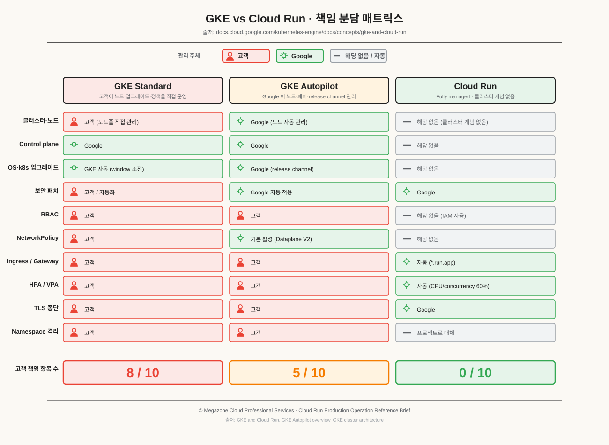
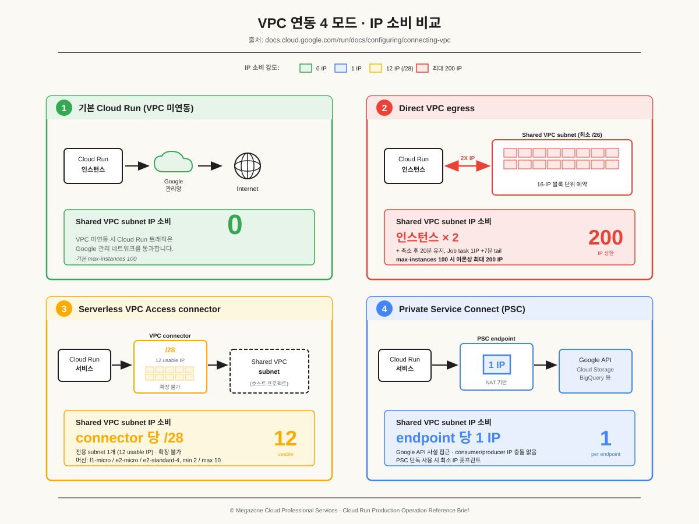
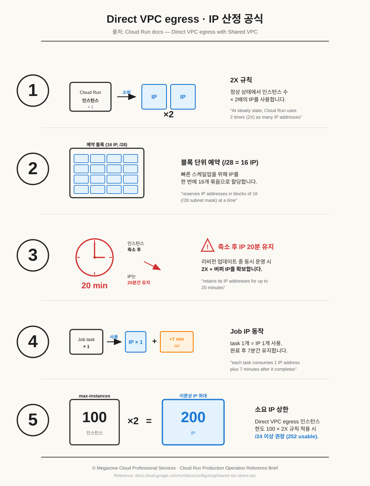

## 1. 개요 (Executive Summary)

세 가지 검토 항목에 대한 핵심 사실을 정리합니다. 각 항목의 상세 근거는 본문 §3~§5에서 다룹니다.

- **검토 항목 ① — Production 운영 관련 사실**
  - Cloud Run은 99.95% SLA를 보장하는 GA 서비스로 프로덕션 워크로드를 대상으로 제공됩니다 ([Cloud Run SLA](https://cloud.google.com/run/sla-20191223)).
  - 인스턴스당 32 GiB 메모리·8 vCPU·동시 요청 1000건·요청 타임아웃 최대 60분과 같은 **하드 한도**가 존재합니다 ([Cloud Run Quotas](https://docs.cloud.google.com/run/quotas)).
  - 비용 모델(Request-based vs Instance-based)과 min-instances 설정은 월 비용에 직접 영향을 줍니다.

- **검토 항목 ② — GKE 운영 특성 비교**
  - Cloud Run은 *클러스터·노드·k8s 업그레이드를 관리하지 않는* fully managed 모델로, GCP 문서가 stateless 웹/API·이벤트 기반·배치 잡 워크로드 매핑을 명시합니다 ([GKE and Cloud Run](https://docs.cloud.google.com/kubernetes-engine/docs/concepts/gke-and-cloud-run)).
  - GKE(특히 Standard)는 namespaces·RBAC·NetworkPolicy·Ingress·HPA/VPA·노드풀을 직접 운영합니다. stateful 워크로드·mesh·custom controller·세밀한 GPU 제어 항목은 GCP 문서가 GKE 매핑을 명시합니다.
  - 비용 모델이 다릅니다. GKE는 *pay-per-cluster-per-hour*, Cloud Run은 *pay-per-use(100ms 단위)* 로 과금됩니다. 예측 가능·꾸준한 트래픽과 변동성·sparse 트래픽에서 비용 특성이 다르게 나타난다고 GCP 문서가 명시합니다.

- **검토 항목 ③ — Shared VPC + IP 제약 환경 가용 옵션**
  - 기본 Cloud Run(VPC 미연동)은 Shared VPC subnet에서 IP를 소비하지 않습니다. VPC 자원 접근이 필요할 때만 IP 소비가 발생합니다.
  - Direct VPC egress는 최소 `/26` subnet, 인스턴스 수의 2배(2X) IP, 축소 후 20분 유지가 정의되어 있습니다 ([Direct VPC egress with Shared VPC](https://docs.cloud.google.com/run/docs/configuring/shared-vpc-direct-vpc)).
  - Serverless VPC Access connector는 connector당 전용 `/28`이 요구됩니다 ([Connect to a VPC network](https://docs.cloud.google.com/vpc/docs/configure-serverless-vpc-access)).
  - Private Service Connect는 endpoint당 IP 1개로 Google API 사설 접근을 제공합니다 ([Private Service Connect](https://docs.cloud.google.com/vpc/docs/private-service-connect)).

### 가용 subnet별 사용 가능 옵션

| 가용 subnet | 사용 가능 옵션 | 각 옵션의 IP 소비 특성 |
|---|---|---|
| VPC 자원 접근 불필요 | Default · PSC endpoint | Default 0, PSC endpoint 당 1 |
| `/24` 이상 | Default · Direct VPC · Connector · PSC | Direct VPC 200 IP (max-instances 100 × 2X) |
| `/26 ~ /25` | Default · Connector · PSC · Direct VPC(max-instances 30~60) | Connector `/28` × 1, Direct VPC 60~120 IP |
| `/28 ~ /27` | Default · 단일 Connector(`/28`) · PSC | Connector subnet 12 usable IP |

---

## 2. Cloud Run 운영 모델 (공통 기반)

세 검토 항목을 다루기 전에 Cloud Run 운영 모델의 핵심을 정리합니다. 이후 모든 항목은 이 모델 위에서 평가됩니다.

### 2.1 컴퓨트 단위 세 가지

- **Service** — HTTP/HTTPS 요청에 응답하는 stateless 인스턴스. 자동 스케일링, 고유 endpoint(`*.run.app`) 제공 ([What is Cloud Run](https://docs.cloud.google.com/run/docs/overview/what-is-cloud-run)).
- **Job** — 수동 또는 스케줄에 의해 실행되어 완료까지 동작하는 병렬 가능 task 묶음.
- **Worker pool** — 공개 HTTP endpoint 없이 항상 켜진 백그라운드 워크로드(Kafka·Pub/Sub pull·RabbitMQ 등)용 컴퓨트. **자동 스케일이 적용되지 않으며 수동 스케일을 사용합니다** ([What is Cloud Run § Worker pools](https://docs.cloud.google.com/run/docs/overview/what-is-cloud-run)).

### 2.2 실행 환경(Execution Environment)

- **Gen1 (gVisor 기반)** — 빠른 콜드스타트, 일부 시스템 콜은 에뮬레이션, 512 MiB 미만 메모리 지원 ([Execution environments](https://docs.cloud.google.com/run/docs/configuring/execution-environments)).
- **Gen2 (microVM 기반)** — 완전한 Linux 시스템 콜·namespaces·cgroups, NFS 지원, CPU·네트워크 성능 차이가 GCP 문서에 명시됨, 콜드스타트는 다소 길어짐 ([Execution environments](https://docs.cloud.google.com/run/docs/configuring/execution-environments)).
- **Jobs와 Worker pool은 Gen2만 사용**합니다 ([Execution environments](https://docs.cloud.google.com/run/docs/configuring/execution-environments)).

### 2.3 Container Contract — 컨테이너가 지켜야 할 규약

- `0.0.0.0:$PORT`에서 요청을 수신해야 하며, `127.0.0.1`은 금지됩니다 ([Container runtime contract](https://docs.cloud.google.com/run/docs/container-contract)).
- 인스턴스 시작 후 4분 이내에 listen을 시작해야 합니다.
- TLS는 Cloud Run이 종단합니다. 컨테이너는 TLS를 직접 구현할 수 없습니다.
- 종료 시 SIGTERM 발송 후 **10초** 후에 SIGKILL이 발송됩니다. Gen1은 SIGTERM을 trap하지 않으면 즉시 종료됩니다 ([Container runtime contract — Termination signal](https://docs.cloud.google.com/run/docs/container-contract#instance-shutdown)).
- 파일 시스템은 메모리 기반(in-memory)이며 인스턴스 종료 시 사라집니다. 영구 데이터는 Cloud Storage·NFS 등을 사용합니다.

### 2.4 Autoscaling 기본 동작 (Service 전용)

다음 자동 스케일링 동작은 **Cloud Run service** 에 적용되는 기본값입니다. Job 은 완료까지 실행되어 종료되며, Worker pool 은 수동 스케일을 사용합니다.

- CPU 사용률 60% / 동시 요청 60% 목표를 유지하도록 자동 스케일 ([Instance autoscaling](https://docs.cloud.google.com/run/docs/about-instance-autoscaling)).
- 기본 min-instances 0, 기본 max-instances 100, 동시 요청 기본 80 × vCPU(하드 한도 1000).
- 0에서 스케일업하는 유일한 트리거는 on-demand scaling이며, 요청은 평균 startup-time의 3.5배 또는 10초 중 더 긴 시간 동안 대기합니다.
- ACT(Adaptive Concurrency Tuning)는 CPU 90% 초과 시 동시성을 1씩 줄여 throttling을 완화합니다.
- idle 인스턴스는 최대 15분 유지(GPU는 10분).

---

## 3. 검토 항목 ① — Cloud Run Production 운영 관련 사실

### 3.1 SLA와 신뢰성

- 월 **99.95% Uptime** SLA가 정의되어 있습니다 ([Cloud Run SLA](https://cloud.google.com/run/sla-20191223)).
- 다운타임 판정 기준: Cloud Run 인프라 원인 5XX 응답 비율 10% 초과.
- 측정 기간 최소 100 유효 요청 미만 구간은 평가 대상에서 제외됩니다.
- 알파·베타 기능, 고객 측 오류, 할당량(quota) 위반은 SLA 적용 대상에서 제외됩니다.
- 크레딧은 해당 월 청구액의 최대 50%로 한도가 설정되어 있으며, 30일 이내 신청·로그 첨부가 필요합니다.

### 3.2 핵심 한도(Quotas) — Production 캐파시티 플래닝 직결 항목

다음은 모두 [Cloud Run Quotas](https://docs.cloud.google.com/run/quotas) 문서 원문 수치입니다.

#### 인스턴스 단위 하드 한도 (증가 불가)

| 항목 | 한도 | 비고 |
|---|---|---|
| 컨테이너 메모리 최대 | 32 GiB | per container instance |
| 컨테이너 vCPU 최대 | 8 vCPU | per container instance |
| 동시 요청 | 1000 | per instance (하드 한도) |
| HTTP/2 동시 stream | 100 | per client connection |
| writable in-memory filesystem | 32 GiB | 인스턴스 메모리에서 차감 |
| 동시 open files | 25,000 | `/proc/sys/fs/file-max` 기준 |
| 환경변수 / 명령 인자 | 1000 | per container |

#### 요청 / 네트워킹 한도

| 항목 | 한도 |
|---|---|
| 요청 타임아웃 최대 | 60분 (기본 5분) |
| HTTP/1 요청·응답 크기 | 32 MiB (chunked·streaming 사용 시 응답 제한 없음, HTTP/2 요청 무제한) |
| Inbound RPS per HTTP/1 container port | 800 (HTTP/2 미적용) |
| Outbound DNS resolution | 1000/sec per instance |

#### 프로젝트·리전 단위 한도

| 항목 | 한도 | 증가 가능 |
|---|---|---|
| Service 수 | 1000 per project/region | 불가 |
| Job 수 | 1000 per project/region | 불가 |
| Worker pool 수 | 1000 per project/region | 불가 |
| Job execution 동시 실행 | 1000 per project/region | 불가 |
| Service 당 revision 수 | 1000 (초과 시 비-서빙 revision 자동 삭제) | 불가 |
| Job Run API | 180회/60초/region | 가능 |

#### Job 한도

- 작업 task timeout 최대: **168시간 (7일)**. GPU 사용 시 1시간.

### 3.3 비용 모델과 최적화 항목

#### 청구 모드 종류

- **Request-based billing**(기본) — 요청 처리 시간 동안만 vCPU·메모리 과금, 요청 단위 요금 추가, 미사용 시 0원 ([Pay-per-use pricing](https://docs.cloud.google.com/run/docs/overview/what-is-cloud-run#pay-per-use_pricing_for_services)).
- **Instance-based billing** — 인스턴스 전체 수명 동안 과금, 요청 단위 요금 없음, vCPU·메모리 시간당 단가가 낮음 ([Cost optimization](https://docs.cloud.google.com/run/docs/tips/services-cost-optimization)).
- **GPU 서비스는 Instance-based 강제**입니다.
- 트래픽 특성별 비용 차이는 GCP 문서에 명시되어 있습니다 (꾸준한 트래픽과 산발적 트래픽에서 청구 모드 비용 특성이 다름).

#### 비용에 영향을 주는 주요 노브

- **min-instances** — 0이면 idle 시 비용 0이지만 콜드스타트가 발생합니다. min-instances를 1 이상으로 설정하면 idle 인스턴스도 과금됩니다.
- **Tier 1 vs Tier 2 region** — Tier 1 region이 vCPU·메모리 단가가 낮다고 GCP 문서가 명시합니다 ([Cost optimization](https://docs.cloud.google.com/run/docs/tips/services-cost-optimization)).
- **과금 단위** — vCPU·메모리는 100ms 단위로 과금됩니다 ([What is Cloud Run](https://docs.cloud.google.com/run/docs/overview/what-is-cloud-run)).
- **북미 외부 트래픽** — 1 GiB/월 무료, 모든 inbound는 무료.
- **Direct VPC egress 사용** — Serverless VPC Access connector의 baseline compute·idle 비용이 발생하지 않습니다 ([Networking best practices](https://docs.cloud.google.com/run/docs/configuring/networking-best-practices)).

#### Committed Use Discount (CUD) 적용 항목

Cloud Run에는 두 종류의 CUD가 적용됩니다 ([Committed use discounts overview](https://docs.cloud.google.com/compute/docs/instances/committed-use-discounts-overview)).

- **Compute flexible CUD** — Compute Engine, GKE, Cloud Run을 함께 커버. GPU·네트워킹은 미적용.
- **Cloud Run 전용 CUD** — Request-based service·Cloud Run functions: 17% (1년·3년 동일). Instance-based service, jobs, worker pools: 1년 28% / 3년 46%.

#### 비용 안전망 체크리스트

- 서비스에 **인증을 의무화**하여 의도치 않은 요청이 비용을 발생시키지 않도록 합니다.
- 초기 배포 시 **max-instances를 3** 정도로 시작해 폭주를 방지합니다 ([About maximum instances](https://docs.cloud.google.com/run/docs/configuring/max-instances-limits)).
- **동시성(concurrency)을 상향**하면 동일 요청량을 더 적은 인스턴스로 처리할 수 있습니다.
- 리전 내 동일 region에 DB·스토리지를 배치하면 데이터 전송 비용이 0입니다.
- Cloud CDN·Firebase Hosting을 앞단에 두면 캐시 가능 자산의 egress 비용을 절감할 수 있습니다.
- **Recommender**가 과거 1개월 트래픽 기반으로 청구 모드 전환을 제안합니다.

### 3.4 운영 리스크 항목과 완화책

#### 요청 타임아웃

- 기본 5분(300초), 최대 60분(3600초) ([Request timeout](https://docs.cloud.google.com/run/docs/configuring/request-timeout)).
- 타임아웃 초과 시 클라이언트에 504 반환, 컨테이너는 종료되지 않습니다.
- 15분 이상이 필요한 워크로드는 재시도 가능·클라이언트 재접속 허용 패턴으로 설계가 필요합니다.

#### 헬스 체크

- Startup probe — period 1~240초, 기본 10초, default failure threshold 3, 전체 성공 한도는 `failureThreshold × periodSeconds ≤ 240초` ([Configure health checks](https://docs.cloud.google.com/run/docs/configuring/healthchecks)).
- Liveness probe — period 1~3600초, 기본 10초. HTTP probe는 HTTP/1 endpoint 필수.
- Readiness probe(Preview) — period 1~300초, 기본 10초.
- 반복적 liveness 실패 시 Cloud Run이 인스턴스 재시작을 제한하여 crash loop를 방지합니다.

#### 스케일링·콜드스타트 항목

- max-instances에 도달하면 요청은 **30초 큐**에 대기 후 429 (`No available container instances`) 반환 ([About maximum instances](https://docs.cloud.google.com/run/docs/configuring/max-instances-limits)).
- 배포 시 기존 revision이 inflight 요청을 처리하므로 max-instances를 5로 설정해도 일시적으로 최대 10개 인스턴스가 동작할 수 있습니다.
- max-instances 한도는 spike·deployment 중 약 15분간 일시적으로 초과될 수 있습니다 ([Instance autoscaling](https://docs.cloud.google.com/run/docs/about-instance-autoscaling)).

#### vCPU hotspot 항목

- 단일 스레드 애플리케이션을 multi-vCPU 인스턴스에 띄우면 한 vCPU만 100%, 나머지는 idle이 됩니다 ([Maximum concurrent requests](https://docs.cloud.google.com/run/docs/about-concurrency)).
- 이 경우 CPU autoscaler가 평균 낮음으로 판단해 스케일아웃하지 않으므로, max-concurrency 조정으로 요청 throughput 기반 스케일이 필요합니다.

### 3.5 보안·컴플라이언스 통제 항목

- **CMEK** — Customer-Managed Encryption Keys로 저장 데이터 암호화 ([Using CMEK](https://docs.cloud.google.com/run/docs/securing/using-cmek)).
- **VPC Service Controls** — Cloud Run 서비스를 perimeter로 둘러 외부 호출을 통제 ([VPC SC](https://docs.cloud.google.com/run/docs/securing/using-vpc-service-controls)).
- **Binary Authorization** — 승인된 컨테이너 이미지만 배포 ([Binary Authorization](https://docs.cloud.google.com/run/docs/securing/binary-authorization)).
- **Identity-Aware Proxy (IAP)** — Cloud Run 서비스 접근 시 사용자 인증 요구 ([IAP for Cloud Run](https://docs.cloud.google.com/run/docs/securing/identity-aware-proxy-cloud-run)).
- **Cloud Armor** — DDoS·WAF 규칙 적용 ([Use Cloud Armor](https://docs.cloud.google.com/run/docs/securing/cloud-armor)).
- **Cloud Run Threat Detection** — 의심 활동 자동 탐지 ([Threat Detection](https://docs.cloud.google.com/run/docs/securing/cloud-run-threat-detection)).
- **Ingress 제어** — 내부 전용 / 내부+로드밸런서 / 전체 공개 중 선택 ([Restrict ingress](https://docs.cloud.google.com/run/docs/securing/ingress)).
- **Custom org constraints** — liveness probe 강제·메모리 한도 강제 등 조직 정책 ([Custom constraints](https://docs.cloud.google.com/run/docs/securing/custom-constraints)).

### 3.6 관측성 기본 제공 항목

- 요청 로그(latency·status·request size) 자동 수집 ([Monitoring and logging overview](https://docs.cloud.google.com/run/docs/monitoring-overview)).
- 컨테이너 stdout/stderr 자동 Cloud Logging 송신.
- CPU·메모리 사용률, active/idle 인스턴스 수, request count·latency 메트릭은 Cloud Monitoring에서 즉시 조회 가능.
- Error Reporting이 컨테이너 stdout/stderr 로그에서 예외를 자동 집계합니다 ([Monitoring overview](https://docs.cloud.google.com/run/docs/monitoring-overview)).

---

## 4. 검토 항목 ② — GKE 운영 대비 Cloud Run 운영 특성

### 4.1 GCP 공식 워크로드 매핑

[GKE and Cloud Run](https://docs.cloud.google.com/kubernetes-engine/docs/concepts/gke-and-cloud-run) 문서에서 정의한 워크로드 매핑입니다.

- **Cloud Run 매핑 워크로드 유형**
  - Stateless 웹 서비스 / API
  - 이벤트 기반 애플리케이션 (Pub/Sub, Cloud Storage, Eventarc, Firebase 이벤트)
  - 배치 잡 / 주기적 작업
  - pay-per-use 비용 모델이 부합하는 sparse·variable 트래픽
  - 즉시 가용성이 요구되는 빠른 배포

- **GKE 매핑 워크로드 유형**
  - 복잡한 마이크로서비스 아키텍처 (mesh, custom routing)
  - Stateful 애플리케이션 (persistent volume 필요)
  - Custom Kubernetes controller / Operator 사용
  - 고급 networking / mesh 솔루션
  - GPU·전용 하드웨어 정밀 제어

- **하이브리드 사용 시 주의**
  - GKE와 Cloud Run을 동시 사용 가능하지만, tightly-coupled 마이크로서비스 조합 시 플랫폼 간 latency·운영 복잡도 증가가 GCP 문서에 명시되어 있습니다.

### 4.2 책임 분담 비교

| 관리 항목 | GKE Standard | GKE Autopilot | Cloud Run |
|---|---|---|---|
| 노드/노드풀(클러스터 관리 포함) | 고객 | Google | 불필요 |
| Control plane | Google | Google | 불필요 |
| OS·k8s 업그레이드(Maintenance window 조정) | GKE 자동(고객 window 조정) | Google (release channel 자동) | 불필요 |
| 보안 패치 | 고객 / 자동화 | Google 자동 적용 | Google |
| RBAC | 고객 | 고객 | 불필요 (IAM 사용) |
| NetworkPolicy / Dataplane V2 | 고객 | 기본 활성 | 불필요 |
| Ingress / Gateway API | 고객 | 고객 | 자동 (`*.run.app`) |
| HPA / VPA | 고객 | 고객 | 자동 |
| TLS 종단 | 고객 | 고객 | Google |
| Namespace 격리 | 고객 | 고객 | 프로젝트로 대체 |

(출처: [GKE and Cloud Run](https://docs.cloud.google.com/kubernetes-engine/docs/concepts/gke-and-cloud-run), [GKE Autopilot overview](https://docs.cloud.google.com/kubernetes-engine/docs/concepts/autopilot-overview), [GKE cluster architecture](https://docs.cloud.google.com/kubernetes-engine/docs/concepts/cluster-architecture))

### 4.3 GKE Autopilot 운영 특성

- Google이 노드를 관리하므로 신규 노드 생성·업그레이드·복구를 고객이 직접 다루지 않습니다 ([GKE Autopilot overview](https://docs.cloud.google.com/kubernetes-engine/docs/concepts/autopilot-overview)).
- 모든 Autopilot 클러스터는 release channel에 자동 등록되어 검증된 버전으로 control plane·node가 운영됩니다.
- Network Policy(Dataplane V2)가 기본 활성화되어 Pod 네트워크 트래픽 통제가 기본 적용됩니다.
- Pod 기반 billing(컨테이너 최적화 컴퓨트 플랫폼 사용 시) — 노드 단위가 아닌 Pod 단위 과금.
- GPU·전용 머신 시리즈 등 특수 하드웨어 사용 시에는 node-based billing으로 전환됩니다.
- 컨테이너 최적화 컴퓨트 플랫폼은 워크로드 수요에 따라 노드를 동적으로 리사이즈하며, 사전 프로비저닝된 컴퓨트 풀에서 자동 할당됩니다 ([Autopilot overview](https://docs.cloud.google.com/kubernetes-engine/docs/concepts/autopilot-overview)).
- Autopilot 클러스터는 SLA가 control plane과 Pod 컴퓨트 캐파시티 모두를 커버합니다.

### 4.4 비용 모델 비교

| 항목 | GKE | Cloud Run |
|---|---|---|
| 과금 모델 | Pay-per-cluster per hour (mode·size·topology 무관) | Pay-per-use, 100ms 단위 |
| 자원 과금 단위 | 노드 (Standard) / Pod 또는 노드 (Autopilot) | vCPU·메모리·요청 |
| 미사용 시 | 클러스터·노드 비용 발생 | min-instances 미설정 시 0원 |
| CUD | Resource-based 1~3년, Compute flexible 적용 | Cloud Run 전용 CUD + Compute flexible |
| CUD 할인율 | 메모리 최적화 최대 70%, 그 외 최대 55% | Cloud Run service request-based / functions 17%; instance-based·jobs·worker pools 1년 28% / 3년 46% |

(출처: [GKE and Cloud Run § Pricing model](https://docs.cloud.google.com/kubernetes-engine/docs/concepts/gke-and-cloud-run), [What is Cloud Run](https://docs.cloud.google.com/run/docs/overview/what-is-cloud-run), [CUD overview](https://docs.cloud.google.com/compute/docs/instances/committed-use-discounts-overview))

- 트래픽이 *예측 가능하고 꾸준한* 경우와 *변동이 크거나 sparse* 한 경우 두 모델의 비용 특성이 다르게 나타난다고 GCP 문서가 명시합니다.

### 4.5 마이그레이션 경로

#### Kubernetes → Cloud Run ([Migrate from Kubernetes](https://docs.cloud.google.com/run/docs/migrate/from-kubernetes))

- Deployment → Cloud Run service.
- Pod → Cloud Run instance.
- HorizontalPodAutoscaler(min/max replicas) → Cloud Run min/max instances.
- ConfigMap → Secret Manager (Cloud Run은 ConfigMap을 지원하지 않습니다).
- Kubernetes Secret → Secret Manager.
- Service / Ingress → 불필요 (Cloud Run이 endpoint 자동 발급).
- Namespace → 사용 불가. 대신 GCP 프로젝트를 격리 경계로 사용합니다.
- Cloud Run은 zonal redundancy가 기본이므로 별도 replica 구성으로 zonal 장애를 방어할 필요가 없습니다.

#### Cloud Run → GKE ([Migrate to GKE](https://docs.cloud.google.com/run/docs/migrate/to-gke))

- Cloud Run service → Kubernetes Deployment (replicas·label selector 명시 필요).
- Endpoint를 위해 별도 Kubernetes Service 생성이 필요합니다.
- HPA를 직접 구성해야 합니다.
- Cloud Run의 zonal redundancy를 유지하려면 **regional cluster**로 마이그레이션해야 합니다.
- Worker pool → Kubernetes Deployment.

### 4.6 Cloud Run 에서 제약·미지원 항목

다음 요구사항은 GCP 문서가 Cloud Run에서 제약·미지원으로 명시한 항목입니다.

- 고정된 replica 수 정확 유지 — Cloud Run은 min=max로 회피 가능하지만 GKE의 fixed-replica 모델과 표현력이 다릅니다.
- 컨테이너에서 직접 TLS 종단 — Cloud Run은 TLS를 항상 자체적으로 종단합니다 ([Container contract](https://docs.cloud.google.com/run/docs/container-contract)).
- HTTP/2 cleartext(h2c)로만 동작하는 컨테이너 — Cloud Run에서 동작 가능하지만 컨테이너가 h2c를 처리해야 합니다.
- Persistent volume·StatefulSet 기반 워크로드 — Cloud Run 마이그 가이드는 stateful 워크로드를 GKE 매핑으로 명시합니다 ([Migrate from Kubernetes](https://docs.cloud.google.com/run/docs/migrate/from-kubernetes)).
- Custom Kubernetes 컨트롤러·Operator·CRD 기반 운영 — GCP 문서가 GKE 매핑으로 분류한 영역입니다 ([GKE and Cloud Run](https://docs.cloud.google.com/kubernetes-engine/docs/concepts/gke-and-cloud-run)).
- 고급 networking·mesh 솔루션 — GCP 문서가 GKE 매핑으로 분류한 영역입니다.

---

## 5. 검토 항목 ③ — Shared VPC + IP 제약(`/19` 이상 어려움) 환경 가용 옵션

### 5.1 IP 소비 모델 — 4가지 VPC 연동 모드

Cloud Run이 VPC 네트워크와 통신하는 방식은 4가지이며, IP 소비량이 모드별로 다릅니다.

| 모드 | Shared VPC subnet IP 소비 | 인스턴스 한도 | 출처 |
|---|---|---|---|
| 기본 Cloud Run (VPC 미연동) | 0 (Google 관리 네트워크) | 서비스 기본 한도 적용 | [Cloud Run quotas](https://docs.cloud.google.com/run/quotas) |
| Direct VPC egress | 인스턴스 수 × **2X** (16 블록 단위 예약, 축소 후 20분 유지) | **100** (Direct VPC 사용 시) | [Direct VPC with Shared VPC](https://docs.cloud.google.com/run/docs/configuring/shared-vpc-direct-vpc) |
| Serverless VPC Access connector | connector당 전용 **`/28`** (12 usable IP), 확장 불가 | — | [Connect to a VPC network](https://docs.cloud.google.com/vpc/docs/configure-serverless-vpc-access) |
| Private Service Connect endpoint | endpoint당 **1 IP** | — | [Private Service Connect](https://docs.cloud.google.com/vpc/docs/private-service-connect) |

### 5.2 Direct VPC egress 정량 분석

문서 원문 인용 기반의 정확한 수치입니다 ([Direct VPC egress with Shared VPC](https://docs.cloud.google.com/run/docs/configuring/shared-vpc-direct-vpc)).

#### Subnet 크기 요구

- 최소 subnet 크기는 **`/26` 이상**입니다.
- subnet은 IPv4 기준이며, RFC 1918, RFC 6598(`100.64.0.0/10`), Class E(`240.0.0.0/4`)를 지원합니다.

#### IP 할당 동작

- Cloud Run은 **블록 단위로 IP를 예약**합니다. 한 번에 **16개(`/28`)** 블록을 할당해 빠른 스케일업을 지원합니다.
- 정상 상태에서 **인스턴스 수의 2배(2X)** 만큼의 IP를 사용합니다.
- 리비전이 축소되어도 IP는 **20분간 유지**됩니다. 리비전 업데이트 중 동시 운영 시에는 *2X + 버퍼*를 확보해야 합니다.
- 인스턴스당 throughput 한도는 **1 Gbps**입니다.

#### 인스턴스 한도

- Direct VPC egress 사용 시 **service당 max-instances 100**이 기본 한도이며 이는 IP 소비의 상한선과 직결됩니다.
- 이론상 한 service의 IP 최대 소비는 **200 IP** 수준입니다(2X 규칙 + 인스턴스 100).

#### Job의 IP 동작

- Job task 하나는 실행 동안 1 IP를 소비하며, **완료 후 7분간 IP를 유지**합니다.
- 예시 — 1일 1회 단일 task job: 최대 1 IP.
- 예시 — 10 task job × 10분 주기 × 15분 task: 약 30 IP (각 task가 종료 후 7분 보유 → 22분 점유, 10분 주기 → 동시 실행 3회 × 10 task = 30).
- 예시 — 1 task job × 1분 task × 분당 100회 실행: 약 800 IP.

#### IP 운영 항목

- IP는 ephemeral하므로 방화벽 정책은 **개별 IP가 아닌 subnet 전체 CIDR**로 작성해야 합니다.

### 5.3 IP 사용량 감소 옵션 ([Networking best practices](https://docs.cloud.google.com/run/docs/configuring/networking-best-practices))

#### 비-RFC1918 사용

- RFC 1918 외에 **RFC 6598(`100.64.0.0/10`)**과 **Class E/RFC 5735(`240.0.0.0/4`)**를 Cloud Run subnet에 사용할 수 있습니다.
- Class E는 2.6억 개 이상의 IP 공간을 제공합니다.
- Class E는 Windows 일부 버전, 일부 온프레미스 하드웨어에서 미지원이므로 호환성 확인이 필요합니다.
- 비-RFC1918 워크로드가 온프레미스 RFC 1918 자원에 접근해야 하면 Hybrid NAT 등의 조합이 GCP 문서에 명시되어 있습니다.

#### Serverless VPC Access connector

- Connector는 전용 `/28` subnet 1개를 요구합니다 ([VPC connectors](https://docs.cloud.google.com/run/docs/configuring/vpc-connectors), [Configure Serverless VPC Access](https://docs.cloud.google.com/vpc/docs/configure-serverless-vpc-access)).
- Subnet은 만든 뒤 **확장 불가**, `/28` 그대로 유지됩니다.
- 머신 타입: f1-micro / e2-micro / e2-standard-4. 프로덕션 환경의 고동시성·소량 빈번 요청에는 e2-standard-4 사용 사례가 GCP 문서에 명시되어 있습니다 ([VPC connectors](https://docs.cloud.google.com/run/docs/configuring/vpc-connectors)).
- 최소 인스턴스 2, 최대 10, scale-in은 자동으로 일어나지 않습니다.
- Connector는 2주마다 유지보수 윈도가 적용되며, 이 시기에 max-instances를 일시적으로 초과할 수 있습니다.

#### Private Service Connect — Google API 사설 접근

- PSC endpoint는 endpoint당 1 IP를 소비합니다 ([Private Service Connect](https://docs.cloud.google.com/vpc/docs/private-service-connect)).
- Cloud Storage, BigQuery 등 Google API를 사설 IP로 접근 가능합니다 ([Access Google APIs through endpoints](https://docs.cloud.google.com/vpc/docs/configure-private-service-connect-apis)).
- NAT 기반이라 consumer / producer 간 IP 충돌이 없습니다.

#### Cloud NAT 옵션

- Cloud NAT는 외부 IP가 없는 Cloud Run 인스턴스에 공유 외부 IP를 제공합니다 ([Cloud NAT overview](https://docs.cloud.google.com/nat/docs/overview)).
- Public NAT(인터넷 outbound), Private NAT(VPC ↔ on-prem / 타 클라우드)를 지원합니다.

#### VPC Service Controls

- VPC-SC는 IP 광폭 확보 없이 Cloud Run을 perimeter로 보호하는 옵션입니다 ([Using VPC-SC](https://docs.cloud.google.com/run/docs/securing/using-vpc-service-controls)).
- 보호가 필요한 워크로드는 ingress=internal 설정과 결합할 수 있습니다 ([Restrict ingress](https://docs.cloud.google.com/run/docs/securing/ingress), [Private networking](https://docs.cloud.google.com/run/docs/securing/private-networking)).

### 5.4 Direct VPC vs Connector 특성 비교

[Compare Direct VPC egress and VPC connectors](https://docs.cloud.google.com/run/docs/configuring/connecting-vpc)에 정리된 항목입니다.

| 항목 | Direct VPC egress | Serverless VPC Access connector |
|---|---|---|
| Latency | 낮음 | 더 높음 |
| IP 소비 | 일반적으로 더 많음 (2X 규칙) | 더 적음 (`/28` 1개) |
| 비용 | 네트워크 egress만 (0까지 축소) | Compute (VM) + 네트워크 egress |
| Scale 속도 | 인스턴스 자동 스케일 (NIC 생성 포함, 0에서 느림) | Scale-up 시 네트워크 latency |
| 네트워크 태그 granularity | service/job 단위 | connector를 공유하는 모든 서비스가 동일 태그 |
| Google 문서 표현 | "We recommend that you enable your Cloud Run service or job to send traffic to a VPC network by using Direct VPC egress" ([Serverless VPC Access](https://docs.cloud.google.com/vpc/docs/serverless-vpc-access)) | 보조 옵션으로 위치 |

### 5.5 Shared VPC 거버넌스 ([Shared VPC](https://docs.cloud.google.com/vpc/docs/shared-vpc))

- Host project가 VPC·subnet을 소유하고 service project에 공유합니다.
- Service project는 자체 리소스를 소유하지만 네트워크 자원은 생성할 수 없습니다.
- Service Project Admin에게 **subnet 단위로 `compute.networkUser`** 권한 부여가 가능합니다.
- 한 project는 host와 service 역할을 동시에 가질 수 없습니다.
- 청구는 자원이 위치한 service project로 귀속됩니다(호스트의 VPC를 사용해도).
- 조직 정책 `constraints/compute.restrictSharedVpcSubnetworks`로 service project가 사용할 수 있는 subnet을 제한할 수 있습니다.
- `run.allowedVPCEgress` 조직 정책으로 개발자가 선택 가능한 egress 모드를 통제할 수 있습니다 ([Direct VPC with Shared VPC](https://docs.cloud.google.com/run/docs/configuring/shared-vpc-direct-vpc)).
- Connector를 Shared VPC에서 사용할 때는 **host project에 네트워크 관리자가 `/28` subnet을 미리 생성**해야 합니다 ([Configure Serverless VPC Access](https://docs.cloud.google.com/vpc/docs/configure-serverless-vpc-access)).
- Subnet은 생성 후 **확장만 가능**하며 축소·교체는 불가합니다 ([Subnets](https://docs.cloud.google.com/vpc/docs/subnets)).

### 5.6 Subnet 사이즈 가용 IP 표

[Subnets](https://docs.cloud.google.com/vpc/docs/subnets) 문서의 예약 규칙(첫 2개, 마지막 2개 IP 예약)을 적용한 가용 IP 수입니다.

| Subnet | 전체 IP | 가용 IP |
|---|---|---|
| `/28` | 16 | 12 |
| `/27` | 32 | 28 |
| `/26` | 64 | 60 |
| `/25` | 128 | 124 |
| `/24` | 256 | 252 |

#### Direct VPC egress 산정 예시

- **max-instances 50**: 2X × 50 = 100 IP 필요 → `/26`(60 usable)으로는 부족, `/25` 이상이 필요한 크기입니다.
- **max-instances 100**(Direct VPC 한도): 200 IP 필요 → `/24` 이상이 필요한 크기입니다.
- **max-instances 20**: 40 IP 필요 → `/26`(60 usable)로 충분합니다.

#### Connector 산정 예시

- 단일 connector: `/28` 1개.
- 3 connector(동일 region): `/28` × 3 = 가용 36 IP.

### 5.7 시나리오별 가능한 패턴 (IP 제약 환경 대응)

| 시나리오 | 확보 가능한 subnet | 사용 가능 옵션 |
|---|---|---|
| A | `/24` 이상 | Default · Direct VPC egress · Connector · PSC. Direct VPC 사용 시 non-RFC1918 보조 대역도 옵션. |
| B | `/26 ~ /25` | Default · 단일 connector(`/28`) · PSC · Direct VPC(max-instances 30~60 한도 내). |
| C | `/28 ~ /27` 만 가능 | Default · 단일 Serverless VPC connector(`/28`) · PSC endpoint. VPC egress 필요량이 큰 워크로드는 GKE / Compute Engine 분리 옵션 검토 항목. |
| D | VPC 자원 접근 불필요 | Default · PSC endpoint만 사용 (Shared VPC subnet IP 0 소비). |

### 5.8 IP 사용량 모니터링

- Cloud Monitoring 메트릭 `run.googleapis.com/container/instance_count`에 **2를 곱해** 현재 IP 사용량을 추정합니다 ([Networking best practices](https://docs.cloud.google.com/run/docs/configuring/networking-best-practices)).
- 알람 임계값을 subnet 가용 IP 의 일정 비율 수준에 설정하여 IP 고갈을 조기 감지하는 운영 패턴이 가능합니다.

---

## 6. 세 검토 항목 요약

| 검토 항목 | 관찰 사실 | 적용 조건 | 주의 항목 |
|---|---|---|---|
| ① Production 운영 | 99.95% SLA, 인스턴스당 32 GiB·8 vCPU·동시 요청 1000건·요청 타임아웃 60분 한도 | 한도 내 워크로드 | 한도 초과 시 GKE / Compute Engine 분리 검토 항목 |
| ② GKE 대비 운영 | stateless·이벤트·sparse 트래픽은 Cloud Run, stateful·mesh·custom controller·고정 replica는 GKE 매핑이 GCP 문서에 명시 | 클러스터·k8s 관리 부담, pay-per-use vs pay-per-cluster | TLS 직접 종단·persistent volume 미지원, Custom Kubernetes controller/Operator 는 GCP 문서가 GKE 매핑으로 분류 |
| ③ Shared VPC + IP 제약 | 4가지 VPC 연동 모드 (Default 0 IP, Direct VPC 2X, Connector `/28`, PSC 1 IP/endpoint) | 워크로드의 VPC 연동 필요성에 따라 모드 선택 | Subnet 생성 후 축소 불가, Direct VPC 사용 시 service당 max 100 인스턴스 |

---

## 7. 참고 문서

- **Cloud Run 개요·운영 모델**
  - [What is Cloud Run](https://docs.cloud.google.com/run/docs/overview/what-is-cloud-run)
  - [Deployment options and resource model](https://docs.cloud.google.com/run/docs/resource-model)
  - [Container runtime contract](https://docs.cloud.google.com/run/docs/container-contract)
  - [Execution environments](https://docs.cloud.google.com/run/docs/configuring/execution-environments)
- **한도·SLA**
  - [Cloud Run Quotas and Limits](https://docs.cloud.google.com/run/quotas)
  - [Cloud Run SLA](https://cloud.google.com/run/sla-20191223)
- **운영 노브**
  - [Instance autoscaling](https://docs.cloud.google.com/run/docs/about-instance-autoscaling)
  - [Maximum concurrent requests](https://docs.cloud.google.com/run/docs/about-concurrency)
  - [About maximum instances](https://docs.cloud.google.com/run/docs/configuring/max-instances-limits)
  - [Configure health checks for services](https://docs.cloud.google.com/run/docs/configuring/healthchecks)
  - [Configure request timeout](https://docs.cloud.google.com/run/docs/configuring/request-timeout)
- **비용**
  - [Best practices for cost-optimized Cloud Run services](https://docs.cloud.google.com/run/docs/tips/services-cost-optimization)
  - [Committed use discounts overview](https://docs.cloud.google.com/compute/docs/instances/committed-use-discounts-overview)
- **GKE 비교**
  - [GKE and Cloud Run](https://docs.cloud.google.com/kubernetes-engine/docs/concepts/gke-and-cloud-run)
  - [GKE Autopilot overview](https://docs.cloud.google.com/kubernetes-engine/docs/concepts/autopilot-overview)
  - [GKE cluster architecture](https://docs.cloud.google.com/kubernetes-engine/docs/concepts/cluster-architecture)
  - [Migrate from Kubernetes to Cloud Run](https://docs.cloud.google.com/run/docs/migrate/from-kubernetes)
  - [Migrate from Cloud Run to GKE](https://docs.cloud.google.com/run/docs/migrate/to-gke)
- **Shared VPC · IP 제약**
  - [Best practices for Cloud Run networking](https://docs.cloud.google.com/run/docs/configuring/networking-best-practices)
  - [Direct VPC egress with Shared VPC](https://docs.cloud.google.com/run/docs/configuring/shared-vpc-direct-vpc)
  - [Compare Direct VPC egress and VPC connectors](https://docs.cloud.google.com/run/docs/configuring/connecting-vpc)
  - [Configure connectors in Shared VPC host project](https://docs.cloud.google.com/run/docs/configuring/shared-vpc-host-project)
  - [Configure VPC connectors](https://docs.cloud.google.com/run/docs/configuring/vpc-connectors)
  - [Connect to a VPC network](https://docs.cloud.google.com/vpc/docs/configure-serverless-vpc-access)
  - [Send serverless traffic to a VPC network](https://docs.cloud.google.com/vpc/docs/serverless-vpc-access)
  - [Shared VPC](https://docs.cloud.google.com/vpc/docs/shared-vpc)
  - [VPC subnets](https://docs.cloud.google.com/vpc/docs/subnets)
  - [Private Service Connect](https://docs.cloud.google.com/vpc/docs/private-service-connect)
  - [Access Google APIs through endpoints](https://docs.cloud.google.com/vpc/docs/configure-private-service-connect-apis)
  - [Cloud NAT overview](https://docs.cloud.google.com/nat/docs/overview)
- **보안**
  - [Using VPC Service Controls](https://docs.cloud.google.com/run/docs/securing/using-vpc-service-controls)
  - [Restrict ingress](https://docs.cloud.google.com/run/docs/securing/ingress)
  - [Identity-Aware Proxy for Cloud Run](https://docs.cloud.google.com/run/docs/securing/identity-aware-proxy-cloud-run)
  - [Use Cloud Armor](https://docs.cloud.google.com/run/docs/securing/cloud-armor)
  - [Binary Authorization](https://docs.cloud.google.com/run/docs/securing/binary-authorization)
  - [Cloud Run Threat Detection](https://docs.cloud.google.com/run/docs/securing/cloud-run-threat-detection)
  - [Using CMEK](https://docs.cloud.google.com/run/docs/securing/using-cmek)
  - [Custom constraints](https://docs.cloud.google.com/run/docs/securing/custom-constraints)
