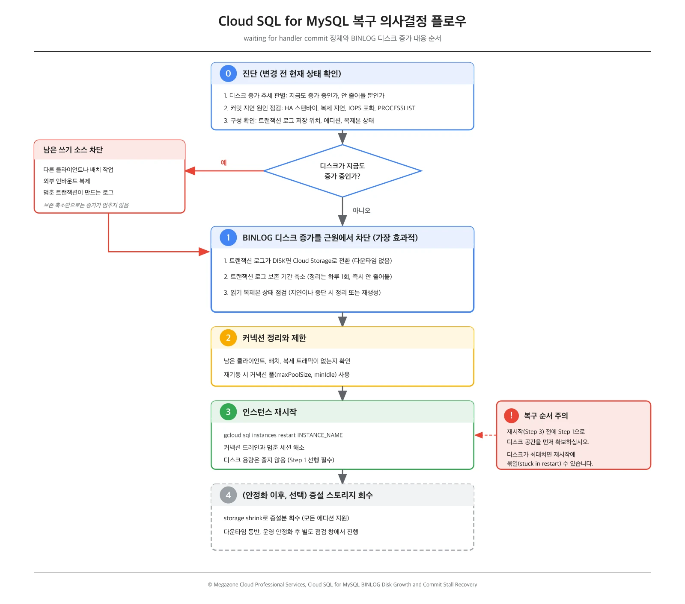

## 개요

Cloud SQL for MySQL 운영 중 다음 증상이 함께 나타나는 경우가 있습니다. 본 가이드는 특정 사례에 한정하지 않고, 동일한 증상을 겪는 운영자가 그대로 따라할 수 있는 공통 복구 런북으로 작성했습니다.

대표 시나리오(증상)는 다음과 같습니다.

- 커밋이 `waiting for handler commit` 상태에서 풀리지 않습니다.
- 바이너리 로그(BINLOG)가 저장된 디스크가 계속 증가합니다.
- 스토리지를 큰 폭으로 증설(예: 1.5TB)했으나 증상이 지속됩니다.
- 애플리케이션(예: Cloud Run) 커넥션을 전부 중지했는데도 안정화되지 않습니다.

핵심 진단은 한 줄로 요약됩니다. 이 증상의 무게중심은 애플리케이션 커넥션 수가 아니라 인스턴스 내부에 있습니다. 즉 바이너리 로그의 디스크 적재와 동기 커밋 경로입니다. 애플리케이션을 모두 중지해도 안정화되지 않는다는 점이 이를 강하게 시사합니다.

복구 우선순위가 "원인 분석보다 운영 복구 먼저"라면, 무엇보다 순서를 지키는 것이 중요합니다. 디스크 공간을 먼저 확보한 다음 재시작해야 합니다. 디스크가 최대치에 도달한 상태에서 재시작부터 하면 인스턴스가 재시작에 묶일(stuck in restart) 수 있습니다.

아래 표는 본 가이드에서 사용하는 조치를 한눈에 정리한 것입니다. 실행 순서와 상세 절차는 즉시 운영 복구 절차 장에서 다룹니다.

| 조치 | 무엇을 하는가 | 다운타임 | 효과가 보이는 시점 |
|---|---|---|---|
| 트랜잭션 로그를 Cloud Storage로 전환 | 바이너리 로그를 인스턴스 디스크에서 분리 | 없음 | 새 로그는 즉시 전환, 전체 전환은 보존 기간만큼 소요 |
| 트랜잭션 로그 보존 기간 축소 | 정리(purge) 대상 로그를 확대 | 없음 | 정리가 하루 1회라 즉시 줄지 않음 |
| 커넥션 정리와 커넥션 풀 | 멈춘 커밋과 과다 커넥션 해소 | 없음 | 즉시 |
| 인스턴스 재시작 | 커넥션 드레인, 멈춘 세션 해소 | 짧은 중단 | 재시작 직후(디스크 용량은 줄지 않음) |
| 스토리지 축소(storage shrink) | 증설한 용량 회수 | 있음(상당할 수 있음) | 작업 완료 후 |

> [!IMPORTANT]
> 순서가 중요합니다. 디스크 공간을 먼저 확보(Step 1)하지 않고 재시작(Step 3)부터 하면, 디스크가 가득 찬 상태에서는 인스턴스가 재시작에 묶일 수 있습니다.

다음 그림은 진단부터 회수까지의 의사결정 흐름을 한 장으로 정리한 것입니다.



## 현상 정리와 핵심 진단

### 보고된 현상과 문서 기반 해석

| 보고된 현상 | 문서 기반 해석 |
|---|---|
| 커밋이 `waiting for handler commit`에서 풀리지 않음 | MySQL 스레드 상태 표현입니다. 커밋이 디스크 동기화(fsync)나 동기 복제 완료를 기다리는 단계에서 멈춘 것입니다. |
| BINLOG 디스크가 계속 증가 | 바이너리 로그(PITR 트랜잭션 로그)가 인스턴스 디스크에 적재되며, 보존 기간과 쓰기량에 비례해 쌓입니다. |
| 큰 폭으로 증설했으나 지속 | 증설은 적재 속도나 보존 정책을 바꾸지 않습니다. 게다가 로그는 하루 1회만 정리되어 즉시 줄지 않습니다. |
| 애플리케이션을 전부 중지했는데도 안정화 안 됨 | 핵심 단서입니다. 원인이 앱 커넥션 수가 아니라 인스턴스 내부(디스크 적재와 동기 커밋)임을 시사합니다. |

> [!NOTE]
> `waiting for handler commit`은 MySQL 스레드 상태를 가리키는 표현이며 Google Cloud 문서의 공식 용어는 아닙니다. 본 가이드는 이 상태를 "커밋이 엔진 커밋과 로그 동기화 단계에서 정체된 상황"으로 해석하고, 그 배경을 공식 문서에 근거해 설명합니다.

### `waiting for handler commit`이 발생하는 이유

바이너리 로깅(PITR)이 켜진 Cloud SQL은 커밋 경로가 디스크 I/O에 직접 묶입니다.

- 바이너리 로깅이 활성화된 경우, Cloud SQL은 `sync_binlog=1`과 `innodb_support_xa=true`로 row-based replication을 사용합니다. 따라서 쓰기 작업마다 추가 디스크 fsync가 발생합니다([Cloud SQL replication](https://cloud.google.com/sql/docs/mysql/replication)).
- HA(리전) 인스턴스인 경우, 동기 복제를 통해 프라이머리의 모든 쓰기가 두 영역의 디스크에 복제된 뒤에야 트랜잭션이 커밋 완료로 보고됩니다([High availability](https://cloud.google.com/sql/docs/mysql/high-availability)).

즉 디스크가 가득 차거나 I/O가 포화되면 커밋이 handler commit(엔진 커밋과 로그 동기화) 단계에서 정체될 수 있습니다. 문서는 최대 스토리지에 도달하면 데이터베이스 쓰기가 실패하고 인스턴스가 재시작에 묶일 수 있다고 명시합니다([Diagnose issues](https://cloud.google.com/sql/docs/mysql/diagnose-issues)). 현재 증상과 일치하는 대목입니다.

> [!WARNING]
> "거의 찬 디스크 때문에 fsync가 지연되어 커밋이 정체된다"는 설명은 합리적 추론이지만 문서가 단정하는 표현은 아닙니다. 커밋 지연을 디스크 포화 하나로 단정하지 말고, Cloud Monitoring 메트릭으로 디스크 사용량과 I/O 포화, 복제 지연을 함께 확인하십시오.

### BINLOG 디스크가 계속 차는 이유

- 바이너리 로그 저장 용량은 일반 데이터와 동일 요율로 과금되며, 가장 오래된 자동 백업(기본 7일) 기준으로 자동 절단됩니다. 크기는 워크로드에 비례하며, 쓰기 부하가 높을수록 더 많이 소비합니다([Cloud SQL replication](https://cloud.google.com/sql/docs/mysql/replication)).
- 바이너리 로그 만료 기간은 트랜잭션 로그 보존 기간과 `binlog_expire_logs_seconds`(또는 `expire_logs_days`) 중 더 작은 값으로 결정됩니다([Database flags](https://cloud.google.com/sql/docs/mysql/flags)).
- 로그는 하루에 한 번만 정리되며 연속적으로 정리되지 않습니다([Known issues](https://cloud.google.com/sql/docs/mysql/known-issues)). 증설이나 보존 조정의 효과가 즉시 보이지 않는 이유입니다.
- 트랜잭션 로그는 디스크(`DISK`)나 Cloud Storage(`CLOUD_STORAGE`)에 저장될 수 있습니다. `DISK`이면 바이너리 로그가 인스턴스 디스크를 직접 점유합니다([Configure PITR](https://cloud.google.com/sql/docs/mysql/backup-recovery/configure-pitr)).

### 두 증상을 분리해서 보기

이 상황은 별개로 문서화된 두 메커니즘이 같은 디스크 위에서 겹친 것으로 보는 편이 정확합니다. 하나의 단일 인과로 단정하지 말고 아래처럼 분리해 확인하십시오.

- BINLOG 디스크 증가: 바이너리 로그가 인스턴스 디스크에 적재되어 보존 기간과 쓰기량에 비례해 누적됩니다. 정리는 하루 1회라 즉시 줄지 않습니다.
  - 중요한 갈림길이 있습니다. 애플리케이션을 전부 중지했는데도 디스크가 "계속 늘어난다"면, 바이너리 로그는 쓰기가 있을 때만 증가하므로 남은 쓰기 소스가 있다는 신호입니다. 이는 이미 쌓인 로그가 "안 줄어드는" 것과는 다른 문제입니다. 남은 쓰기 소스로는 다른 클라이언트나 배치 작업, 인바운드 복제(외부 소스에서 이 인스턴스로 들어오는 복제), 또는 멈춘 트랜잭션이 계속 로그를 생성하는 경우가 있습니다.
- 커밋 지연: 커밋이 디스크 동기화나 동기 복제 완료를 기다리는 단계에서 정체됩니다. 디스크 포화는 한 원인일 뿐이며, HA 스탠바이 상태, 읽기 복제본의 복제 지연, 디스크 I/O 포화도 원인이 될 수 있으므로 점검 대상으로 둡니다.

## 즉시 운영 복구 절차

> [!IMPORTANT]
> 아래 절차는 순서가 중요합니다. 디스크 공간을 먼저 확보(Step 1)한 뒤 재시작(Step 3)하십시오. 디스크가 가득 찬 상태에서 재시작부터 하면 재시작에 묶일 수 있습니다.

### Step 0 진단 (변경 전 현재 상태 확인)

먼저 디스크가 "지금도 증가 중"인지 "안 줄어드는" 것인지 판별합니다. 이 판단이 이후 조치의 방향을 결정합니다.

- Cloud Monitoring 디스크 사용량 그래프에서 애플리케이션 중지 시점 이후의 최근 추세를 봅니다.
  - 여전히 증가 중이면 남은 쓰기 소스가 있다는 뜻입니다. 보존 기간 축소만으로는 증가 자체가 멈추지 않으므로, 쓰기 주체를 먼저 찾아 차단해야 합니다. `waiting for handler commit`로 걸린 세션이 곧 그 쓰기 주체일 수 있습니다.
  - 증가는 멈췄고 줄지 않을 뿐이면, 이미 쌓인 로그가 보존 기간이나 일일 정리 전이라 그런 것입니다. 이때는 Step 1이 정확한 해법입니다.

다음으로 커밋 지연의 원인 후보를 점검합니다. 단일 원인으로 단정하지 않습니다.

- HA(리전) 인스턴스 여부와 스탠바이 상태, 읽기 복제본의 복제 지연이나 중단 여부, 디스크 I/O 포화(IOPS, throughput) 메트릭을 함께 확인합니다.
- 콘솔이나 `SHOW PROCESSLIST`로 활성 쿼리와 오래 실행 중인 트랜잭션을 점검해, 멈춘 커밋을 잡고 있는 세션을 식별합니다([Diagnose issues](https://cloud.google.com/sql/docs/mysql/diagnose-issues)).

마지막으로 구성을 확인합니다.

```bash
# 트랜잭션 로그 저장 위치 등 인스턴스 구성 확인 (단일 인스턴스)
gcloud sql instances describe INSTANCE_NAME

# 여러 인스턴스의 트랜잭션 로그 저장 위치 상태를 한 번에 확인
gcloud sql instances list --show-transactional-log-storage-state
#  → TRANSACTIONAL_LOG_STORAGE_STATE 컬럼 확인
#    DISK / SWITCHING_TO_CLOUD_STORAGE / SWITCHED_TO_CLOUD_STORAGE / CLOUD_STORAGE
```

에디션(Enterprise 또는 Enterprise Plus), 현재 보존 일수, 읽기 복제본 유무와 상태, HA 여부를 함께 확인합니다. 아래 조치의 가용 범위와 한도가 에디션에 따라 다릅니다.

### Step 1 BINLOG 디스크 증가를 근원에서 차단

가장 효과적인 단계입니다. 디스크 증가를 멈추는 세 가지 조치를 차례로 검토합니다.

먼저, 트랜잭션 로그가 `DISK`라면 Cloud Storage로 전환합니다.

```bash
gcloud sql instances patch INSTANCE_NAME \
  --switch-transaction-logs-to-cloud-storage
```

- 디스크에 PITR 트랜잭션 로그를 저장 중이라면 다운타임 없이 Cloud Storage로 전환할 수 있습니다. 전환을 시작하면 즉시 새 트랜잭션 로그가 Cloud Storage에 쌓이기 시작하고, 전체 전환은 대략 트랜잭션 로그 보존 기간만큼 소요됩니다([Configure PITR](https://cloud.google.com/sql/docs/mysql/backup-recovery/configure-pitr)).
- 이 명령은 프라이머리 인스턴스에만 적용되며 복제본에는 적용할 수 없습니다. 또한 같은 요청에서 다른 설정을 동시에 변경할 수 없습니다.
- 가용 여부는 에디션에 따라 다를 수 있습니다. 문서는 Enterprise에서 Enterprise Plus로 업그레이드할 때 저장 위치가 자동으로 Cloud Storage로 전환된다고 명시합니다. 이 기능이 에디션에 종속될 가능성이 있으므로, Step 0에서 확인한 에디션에 맞춰 적용하십시오.

> [!TIP]
> 전환 후에도 복제본을 위해 일부 바이너리 로그는 디스크에 유지됩니다. 전환 완료 후 `binlog_expire_logs_seconds`를 1일로 설정하면 할당 디스크 크기와 스토리지 비용을 줄일 수 있습니다.

다음으로, 트랜잭션 로그 보존 기간을 축소해 정리 대상을 넓힙니다.

```bash
gcloud sql instances patch INSTANCE_NAME \
  --retained-transaction-log-days=DAYS   # Enterprise 1~7, Enterprise Plus 1~35
```

- 보존 일수를 낮추면 더 많은 오래된 로그가 정리 대상이 됩니다.
- 보조 플래그로 `binlog_expire_logs_seconds`(권장)나 `expire_logs_days`(MySQL 8.4부터 제거됨)가 있습니다. 실제 보존은 이 값과 트랜잭션 로그 보존 기간 중 더 작은 값으로 결정됩니다.

> [!WARNING]
> 보존을 줄여도 즉시 줄지 않습니다. 정리는 하루 1회이고, PITR로 복구 가능한 시간 범위가 줄어드는 트레이드오프가 있습니다. 디스크에 바이너리 로그가 많을 때는 성능 영향을 막기 위해 보존 값을 하루에 하루씩 며칠에 걸쳐 점진적으로 낮추는 것이 권장됩니다. 또한 백업 개수를 로그 보존 일수보다 최소 1 크게 설정하면 지정한 일수의 로그 보존을 보장할 수 있습니다.

마지막으로, 읽기 복제본이 있으면 상태를 점검합니다.

- 복제가 깨졌거나 지연된 복제본이 있으면 먼저 상태를 확인하고, 불필요하면 정리하거나 재생성합니다([Manage replicas](https://cloud.google.com/sql/docs/mysql/replication/manage-replicas)).
- 복제가 보존 기간(기본 7개 백업)보다 오래 중단되면 복제본을 삭제하고 새로 만들어야 합니다([Cloud SQL replication](https://cloud.google.com/sql/docs/mysql/replication)).
- 참고로 프라이머리를 증설하면 읽기 복제본의 스토리지도 자동으로 프라이머리 이상으로 확대됩니다([Instance settings](https://cloud.google.com/sql/docs/mysql/instance-settings)).

### Step 2 커넥션 정리와 제한

- 애플리케이션 커넥션을 이미 중지했다면, 그 외 클라이언트나 배치, 복제 트래픽이 남아 있지 않은지 확인합니다.
- Cloud SQL의 전체 커넥션 한도는 초과할 수 없으며, 커넥션 수를 줄이면 오버헤드가 감소합니다. 앱을 재기동할 때는 커넥션 풀(maxPoolSize, minIdle 설정)을 사용하도록 권장합니다([Manage connections](https://cloud.google.com/sql/docs/mysql/manage-connections)).

### Step 3 인스턴스 재시작

```bash
gcloud sql instances restart INSTANCE_NAME
```

- 재시작은 인스턴스의 커넥션을 드레인하고 중지한 다음 재기동하여 새 연결을 받습니다. 실행 중인 인스턴스 재시작은 일부 문제를 해소할 수 있습니다. 다만 서비스 중단이 발생하고 인스턴스 캐시가 비워져 일시적으로 성능이 저하됩니다([Start, stop, restart](https://cloud.google.com/sql/docs/mysql/start-stop-restart-instance)).
- 재시작은 공개 또는 비공개 IP 주소를 바꾸지 않습니다.

> [!WARNING]
> 재시작만으로는 디스크가 줄지 않습니다. Step 1(저장 위치 전환과 보존 축소)을 먼저 적용해야 근본적으로 해소됩니다. 디스크가 거의 찬 상태라면 재시작이 정체될 수 있으므로 Step 1로 공간을 먼저 확보하십시오. 최근에 재시작했다면 인스턴스 로그에서 완전히 복구되었는지 확인한 뒤 다시 재시작하십시오.

### Step 4 (안정화 이후, 선택) 증설한 스토리지 회수

- 스토리지 축소(storage shrink)는 프라이머리와 읽기 복제본 모두에서, 모든 에디션에서 사용할 수 있습니다. 따라서 증설한 용량은 영구히 고정되는 것이 아닙니다([About storage shrink](https://cloud.google.com/sql/docs/mysql/about-storage-shrink)).

> [!CAUTION]
> 스토리지 축소는 다운타임을 동반합니다. 작업 완료 시 인스턴스가 재시작되며, 디스크 크기에 따라 다운타임이 상당할 수 있습니다. 복제본은 프라이머리보다 작게 줄일 수 없으므로 프라이머리를 먼저 축소합니다. 다운타임 제약이 크면 Database Migration Service로 더 작은 새 인스턴스에 데이터를 옮기는 방안이 대안으로 권장됩니다.

따라서 운영 안정화와 BINLOG 증가 차단을 마친 뒤, 별도 점검 창에서 진행하는 것을 권장합니다.

## 근본 원인(RCA)과 재발 방지

근본 원인은 다음과 같이 정리됩니다. 바이너리 로그(PITR 트랜잭션 로그)가 인스턴스 디스크에 누적되고 쓰기 부하가 더해지면서, 디스크 포화로 동기 커밋(`sync_binlog`에 의한 fsync, HA 동기 복제)이 정체됩니다. 디스크가 최대치에 도달하면 쓰기가 실패하고 재시작에 묶일 수 있습니다.

재발을 막기 위한 점검 항목은 다음과 같습니다.

1. 트랜잭션 로그를 Cloud Storage에 저장해 인스턴스 디스크에서 분리합니다.
2. 트랜잭션 로그 보존 기간과 `binlog_expire_logs_seconds`를 워크로드에 맞게 합리적으로 설정합니다.
3. 자동 스토리지 증가를 켜되 증가 한도를 함께 설정해 무한 증가와 SLA 손실을 방지합니다([Instance settings](https://cloud.google.com/sql/docs/mysql/instance-settings)).
4. Cloud Monitoring으로 디스크 사용량과 복제 지연에 대한 알림을 구성합니다.
5. 애플리케이션은 커넥션 풀을 사용해 커넥션 수를 통제합니다.

> [!CAUTION]
> `sync_binlog`와 `innodb_flush_log_at_trx_commit`의 기본값(둘 다 1)을 변경하면 데이터 내구성이 떨어지고 SLA 커버리지를 잃을 수 있습니다. 디스크 부담을 줄이려는 목적으로 이 값을 바꾸지 마십시오. 디스크 문제는 Step 1의 로그 저장 위치 전환과 보존 조정으로 다루는 것이 안전합니다.

## Commit 정체의 원인 감별: Lock 경합 대 IO/fsync 경로 정체

커밋이 장시간 정체된 사례에서 원인을 두고 해석이 갈릴 수 있습니다. 한쪽은 사용자 측 row-level lock 경합(장시간 실행 트랜잭션이 특정 행을 잠금)으로 보고, 다른 한쪽은 storage 또는 disk I/O 계층에서 커밋의 fsync 경로가 진행되지 못한 정체로 봅니다. 두 가설은 관측 지표로 구분할 수 있습니다. 본 장은 공식 문서를 근거로 감별 기준을 제시하고, 정식 RCA에서 요청할 항목을 정리합니다.

본 장은 메커니즘과 지표 정합성으로 가설을 평가합니다. 특정 시점에 어떤 플랫폼 내부 이벤트가 실제로 있었는지는 제품 문서로 증명할 수 없으며, 그 확정은 Google 내부 텔레메트리를 통한 정식 RCA의 몫입니다.

### 두 가설

- 가설 A (row-level lock 경합): 장시간 실행 중인 트랜잭션이 특정 행을 잠가, 같은 행을 갱신하려는 다른 세션들이 lock 대기에 묶입니다.
- 가설 B (커밋 fsync I/O 경로 정체): I/O 계층에서 커밋 시 요구되는 fsync가 진행되지 못해, 잠긴 행과 무관하게 모든 쓰기 세션이 커밋 단계에서 동시에 정체됩니다.

### 왜 커밋 경로가 I/O와 fsync에 묶이는가

바이너리 로깅(PITR)이 켜진 인스턴스에서 커밋은 디스크 동기화에 직접 묶입니다.

- `sync_binlog=1`과 `innodb_support_xa=true`로 row-based replication을 사용하므로 쓰기마다 추가 fsync가 발생합니다([Cloud SQL replication](https://cloud.google.com/sql/docs/mysql/replication)).
- full ACID를 위해 `innodb_flush_log_at_trx_commit`과 `sync_binlog`는 기본값 1이어야 합니다([Database flags](https://cloud.google.com/sql/docs/mysql/flags)).
- HA(리전) 인스턴스라면 두 영역의 디스크에 기록된 뒤에야 트랜잭션이 커밋 완료로 보고됩니다([High availability](https://cloud.google.com/sql/docs/mysql/high-availability)).

따라서 I/O 계층이 멈추면 특정 행이 아니라 모든 쓰기 세션이 커밋 단계에서 동시에 정체됩니다. 가설 B가 "다수 세션이 커밋 단계 I/O 대기에 동시 적체"되는 양상을 설명하는 이유입니다.

### 지표로 두 가설 감별하기

| 관측 지표 | 가설 A(row-lock)에서 예상 | 가설 B(I/O fsync 정체)에서 예상 | 확인 방법 |
|---|---|---|---|
| Lock 대기 세션 | 다수가 lock wait에 적체 | 0(lock과 무관) | `SHOW ENGINE INNODB STATUS`, InnoDB Lock Monitor |
| 세션의 Wait, Query | 일부 세션이 특정 행 대기 | 다수가 커밋과 I/O 대기로 동시 적체 | `SHOW PROCESSLIST` |
| Disk write I/O | 무관한 세션은 계속 write 발생 | 0으로 끊김 | Cloud Monitoring, 아래 메커니즘 참고 |
| DML operation count | 계속 발생 | 0(디스크에 반영되지 않음) | Cloud Monitoring |
| 복구 시 read I/O | 특이사항 없음 | 밀린 I/O를 캐치업하며 IOPS 상한에 도달 | Compute persistent disk throttling 메트릭 |

위 감별 기준은 모두 [Diagnose issues](https://cloud.google.com/sql/docs/mysql/diagnose-issues) 문서의 진단 안내(lock 모니터링, 성능과 IOPS, clean shutdowns, disk space)에 근거합니다.

고객이 제시한 지표 패턴, 즉 Lock 대기 0, 다수 세션의 커밋 단계 I/O 대기 동시 적체, disk write I/O 0, DML 0, 복구 시 read I/O 상한 도달은 가설 B와 더 일관됩니다. 메커니즘상으로도 커밋 경로가 fsync와 디스크에 묶여 있으므로, I/O 계층이 정체되면 전 세션 동시 정체가 자연스럽게 설명됩니다.

### "Write I/O가 0이 되는" 메커니즘과 지속 시간 필터

핵심 변별자는 지속 시간입니다. 이번 정체는 약 4시간(14,000초대)으로 균일하게 지속되었습니다. 문서화된 메커니즘을 지속 시간으로 거르면 다음과 같이 나뉩니다.

- 단기 일시적 메커니즘 (4시간 정체를 단독으로 설명하지 못함)
  - 유지보수 종료: Cloud SQL이 인스턴스를 종료하면 mysqld 종료가 최대 1분으로 제한되고, 그 안에 끝나지 않으면 강제 종료되어 디스크 쓰기가 중간에 중단될 수 있습니다. 다만 상한이 1분이므로 4시간 정체의 단독 원인이 될 수 없습니다([Diagnose issues](https://cloud.google.com/sql/docs/mysql/diagnose-issues), clean shutdowns).
  - 단일 failover: 약 60초 동안 인스턴스가 사용 불가 상태가 됩니다. 역시 4시간을 설명하지 못합니다([High availability](https://cloud.google.com/sql/docs/mysql/high-availability)).
- 지속 가능 조건 (4시간 균일 정체와 부합)
  - 최대 스토리지 도달: 디스크가 최대치에 도달하면 데이터베이스 쓰기가 실패하고, 인스턴스가 재시작에 묶일 수 있습니다. 조치 전까지 상태가 지속됩니다([Diagnose issues](https://cloud.google.com/sql/docs/mysql/diagnose-issues), disk space).
  - crash loop나 suspended state: 운영 이슈로 인스턴스가 정지되거나 일시 중단될 수 있으며, 해소 전까지 지속됩니다([Diagnose issues](https://cloud.google.com/sql/docs/mysql/diagnose-issues), suspended state).

> [!IMPORTANT]
> 지속 시간이 핵심 변별자입니다. 1분이나 60초로 상한이 명시된 메커니즘은 약 4시간에 걸친 균일한 정체의 단독 원인이 될 수 없습니다. 원인은 조치 전까지 지속되는 조건에서 찾아야 합니다.

이 가운데 "최대 스토리지 도달"은 지속 시간 필터를 통과하면서, 본 가이드가 처음 다룬 BINLOG 디스크 무한 증가 보고와 한 줄로 연결됩니다.

디스크가 가득 참 → 커밋이 요구하는 fsync가 완료되지 못함 → 잠긴 행과 무관하게 모든 세션이 커밋 단계에서 정체 → write I/O와 DML이 0 → 데이터가 더 이상 증가하지 않음 → 세션이 적체되다 일괄 종료(killed) → 복구 시 밀린 I/O가 read I/O 캐치업 버스트로 처리.

이 서술은 고객이 관측한 지표를 일관되게 설명하며 "데이터가 증가하지 않았다"는 현상까지 포괄합니다. 다만 이는 지속 시간과 부합하는 후보이지 확정이 아닙니다. 장애 시점의 디스크 사용량이 실제로 최대치에 도달했는지를 메트릭으로 대조해 확인해야 합니다.

### 복구 시 read I/O가 상한(15k/s)에 붙은 것의 해석

- 문서는 Cloud SQL이 최대 60,000 IOPS를 지원하며, IOPS와 throughput이 disk size, instance vCPU 수, I/O block size 등에 의존한다고 명시합니다. Compute는 throttling 메트릭을 제공합니다([Diagnose issues](https://cloud.google.com/sql/docs/mysql/diagnose-issues), Performance).
- 따라서 복구 시 read I/O가 일정 상한(15k/s)에 평평하게 붙은 것은, 밀려 있던 I/O를 캐치업하며 인스턴스의 provisioned IOPS 상한에 도달한 것과 부합합니다. 이는 상한이 존재한다는 정상 동작의 표현이며, 그 자체로 장애의 원인을 증명하지는 않습니다.
- 8 vCPU 인스턴스의 정확한 IOPS 상한값은 본 코퍼스에 없습니다. 인스턴스의 실제 디스크 종류와 크기, 머신 구성, 그리고 장애 시점의 Compute persistent disk throttling 메트릭으로 확인해야 합니다.
- 참고로 Hyperdisk Balanced의 기본 provisioned IOPS는 4,000, 기본 throughput은 170이며, 이는 Enterprise Plus의 C4A 또는 N4 머신 시리즈에 한정됩니다([Instance settings](https://cloud.google.com/sql/docs/mysql/instance-settings)).

### row-lock 가설의 검증 가능성 (입증 책임은 대칭적으로)

- row-lock 가설은 잘 정의된 산출물로 검증할 수 있습니다. 장애 시점의 InnoDB Lock Monitor 출력(`SHOW ENGINE INNODB STATUS`), blocking transaction ID, InnoDB lock wait 지표가 그것입니다([Diagnose issues](https://cloud.google.com/sql/docs/mysql/diagnose-issues), Enable lock monitoring).
- 고객 관측상 Lock 대기 세션이 0이었고 위 산출물이 제시되지 않았다면, 현재까지 근거로는 row-lock 가설이 뒷받침되지 않습니다.
- 가설 B의 확정에는 Google 내부 텔레메트리가 필요합니다. 제품 문서는 메커니즘과 확인 방법을 설명할 수 있을 뿐, 특정 시점에 어떤 플랫폼 이벤트가 있었는지는 증명하지 못합니다. 입증 책임은 양쪽 모두에 동일하게 적용됩니다.

### SHOW PROCESSLIST가 정상으로 보이는 것은 해결을 의미하지 않습니다

적체된 세션들이 강제 종료(killed)되었다면, `SHOW PROCESSLIST`가 정상으로 보이는 것은 근본 원인이 해소되었기 때문이 아니라 적체가 강제로 비워졌기 때문입니다.

> [!IMPORTANT]
> 세션이 일괄 종료된 뒤라면 `SHOW PROCESSLIST`가 깨끗한 것은 어떤 원인에서든 당연한 결과이며, 문제 해결의 증거가 아닙니다. 따라서 본 건은 PROCESSLIST가 정상으로 보이더라도 원인 규명이 끝나지 않은 상태로 보는 것이 타당합니다.

### 정식 RCA 요청 항목

정식 RCA에서 다음을 요청합니다. 각 항목은 위 감별 기준에 직접 대응합니다.

| 요청 항목 | 왜 필요한가 |
|---|---|
| 장애 시간대 disk write_ops와 write_latency가 0으로 변한 원인, storage subsystem 이벤트 로그 | write I/O 0은 가설 B의 핵심 지표입니다. 약 4시간 지속을 설명할 사건의 식별이 필요합니다. |
| 복구 시 read I/O 15k/s가 IOPS throttling인지 여부, 해당 인스턴스의 provisioned IOPS 상한 포함 | IOPS는 disk size, vCPU 수, I/O block size에 의존하며 상한이 존재합니다. 정상 캐치업인지 병목인지 구분이 필요합니다. |
| 해당 시간대 failover, maintenance, persistent disk 관련 내부 이벤트 유무 | 단기 메커니즘(1분, 60초)이 단독 원인이 아님을 확인하고, 지속 사건의 존재 여부를 가립니다. |
| row-lock 주장의 근거가 된다면 blocking transaction ID와 InnoDB lock wait 지표 | row-lock 가설은 이 산출물로만 입증됩니다. Lock 대기 0 관측과 대조가 필요합니다. |
| 장애 시점 디스크 사용량(최대 스토리지 도달 여부) | 최대치 도달은 쓰기 실패와 재시작 정체의 문서화된 원인이며, 지속 시간 필터를 통과하는 후보입니다. |

종합하면, 현재까지 공개된 지표는 커밋의 fsync I/O 경로 정체(가설 B)와 더 일관되며, row-lock 가설은 Lock 대기 0 관측과 검증 산출물의 부재와 배치됩니다. 단기 플랫폼 메커니즘은 약 4시간의 정체를 설명하지 못하므로, 조치 전까지 지속되는 조건(최대 스토리지 도달을 포함)을 시점 대조로 먼저 확인해야 합니다. 가설의 확정에는 위 RCA 항목에 대한 Google 내부 데이터가 필요합니다.

## 핵심 파라미터와 한도 레퍼런스

에디션별 트랜잭션 로그 보존 범위는 다음과 같습니다.

| 항목 | Cloud SQL Enterprise | Cloud SQL Enterprise Plus |
|---|---|---|
| 트랜잭션 로그 보존 범위 | 1~7일 | 1~35일 |
| 기본값 | 7일 | 14일 |
| 설정 플래그 | `--retained-transaction-log-days` | `--retained-transaction-log-days` |

디스크 적재와 커밋 경로에 직접 관여하는 플래그는 다음과 같습니다.

| 플래그 | 기본값 | 역할 | 주의 |
|---|---|---|---|
| `sync_binlog` | 1 | 1이면 트랜잭션 커밋 전에 바이너리 로그를 디스크에 동기화 | 기본값 변경 시 내구성 저하와 SLA 상실 |
| `binlog_expire_logs_seconds` | 86400(1일) | 바이너리 로그 만료 기간(초) | MySQL 8.4에서 `expire_logs_days`를 대체 |
| `expire_logs_days` | 0 | 바이너리 로그 만료 기간(일) | MySQL 8.4에서 제거됨, `binlog_expire_logs_seconds` 사용 |

트랜잭션 로그 저장 위치 상태(`TRANSACTIONAL_LOG_STORAGE_STATE`)는 네 가지입니다.

| 상태 | 의미 |
|---|---|
| `DISK` | 트랜잭션 로그를 인스턴스 디스크에 저장 |
| `SWITCHING_TO_CLOUD_STORAGE` | Cloud Storage로 전환 진행 중 |
| `SWITCHED_TO_CLOUD_STORAGE` | 전환 완료 |
| `CLOUD_STORAGE` | 트랜잭션 로그를 Cloud Storage에 저장 |

본 가이드에서 사용한 주요 gcloud 명령은 다음과 같습니다.

| 목적 | 명령 |
|---|---|
| 저장 위치 등 인스턴스 구성 확인 | `gcloud sql instances describe INSTANCE_NAME` |
| 저장 위치 상태 일괄 확인 | `gcloud sql instances list --show-transactional-log-storage-state` |
| 트랜잭션 로그를 Cloud Storage로 전환 | `gcloud sql instances patch INSTANCE_NAME --switch-transaction-logs-to-cloud-storage` |
| 트랜잭션 로그 보존 기간 설정 | `gcloud sql instances patch INSTANCE_NAME --retained-transaction-log-days=DAYS` |
| 인스턴스 재시작 | `gcloud sql instances restart INSTANCE_NAME` |

## 참고 문서

- **바이너리 로깅과 복제**
  - [Cloud SQL for MySQL replication (바이너리 로깅 영향, 스토리지 오버헤드)](https://cloud.google.com/sql/docs/mysql/replication)
  - [Manage read replicas](https://cloud.google.com/sql/docs/mysql/replication/manage-replicas)
  - [Create read replicas](https://cloud.google.com/sql/docs/mysql/replication/create-replica)
- **PITR와 트랜잭션 로그**
  - [About point-in-time recovery (PITR)](https://cloud.google.com/sql/docs/mysql/backup-recovery/pitr)
  - [Configure point-in-time recovery (Cloud Storage 전환, 보존 설정)](https://cloud.google.com/sql/docs/mysql/backup-recovery/configure-pitr)
  - [Backups and transaction log retention](https://cloud.google.com/sql/docs/mysql/backup-recovery/backups)
- **플래그와 고가용성**
  - [Configure database flags (sync_binlog, expire_logs_days, binlog_expire_logs_seconds)](https://cloud.google.com/sql/docs/mysql/flags)
  - [High availability (동기 복제와 커밋)](https://cloud.google.com/sql/docs/mysql/high-availability)
- **디스크, 스토리지, 인스턴스 운영**
  - [Instance settings (스토리지 용량, 자동 증가, 복제본 리사이즈)](https://cloud.google.com/sql/docs/mysql/instance-settings)
  - [About storage shrink](https://cloud.google.com/sql/docs/mysql/about-storage-shrink)
  - [Start, stop, and restart instances](https://cloud.google.com/sql/docs/mysql/start-stop-restart-instance)
  - [Manage connections (한도와 커넥션 풀)](https://cloud.google.com/sql/docs/mysql/manage-connections)
- **진단과 알려진 이슈**
  - [Diagnose issues (디스크 공간, 쓰기 실패, stuck in restart)](https://cloud.google.com/sql/docs/mysql/diagnose-issues)
  - [Known issues (트랜잭션 로그와 디스크 증가, 일일 정리)](https://cloud.google.com/sql/docs/mysql/known-issues)
  - [Operational guidelines](https://cloud.google.com/sql/docs/mysql/operational-guidelines)
