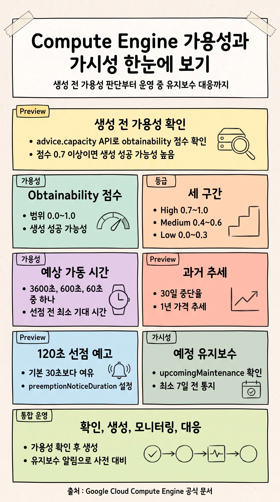
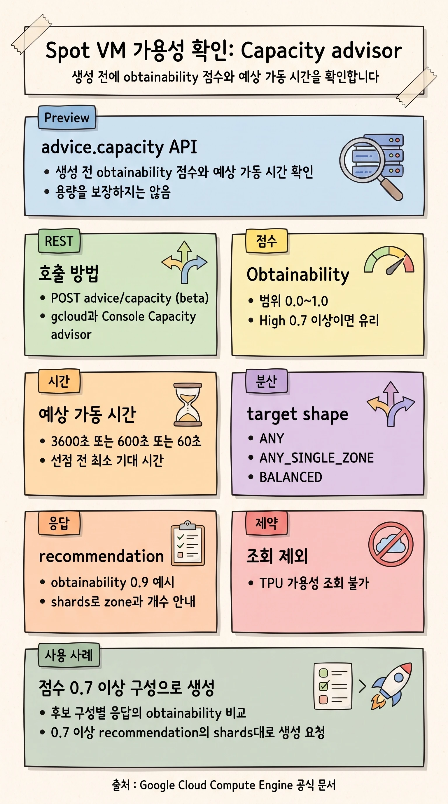
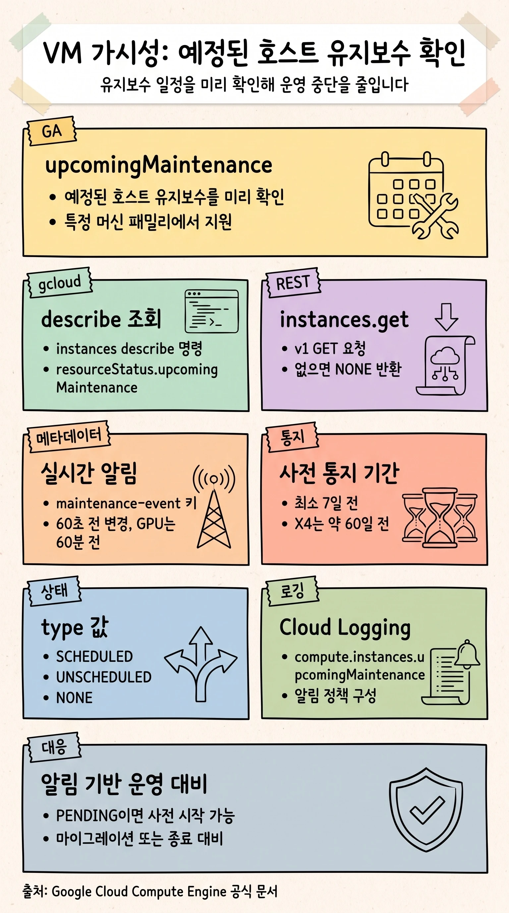

## 개요

Compute Engine에서 워크로드의 안정성을 확보하는 일은 크게 두 축으로 나뉩니다. 하나는 자원을 만들기 전에 실제로 확보할 수 있는지 미리 판단하는 일이고, 다른 하나는 운영 중에 예정된 변경을 미리 파악해 대비하는 일입니다. 이 문서는 이 두 축을 가용성과 가시성 순서로 다룹니다.

- **가용성**: Spot VM을 만들기 전에 성공 가능성과 예상 가동 시간을 확인하는 Capacity advisor 기능(`advice.capacity`, `advice.capacityHistory`)과, 선점 시 대응 시간을 확보하는 120초 선점 예고입니다. 이 기능들은 모두 Preview 단계입니다.
- **가시성**: 이미 운영 중인 인스턴스에 예정된 호스트 유지보수를 미리 확인하는 기능입니다. 이 기능은 일반적으로 GA 상태이며, 특정 머신 패밀리에서만 지원됩니다.



이 문서의 핵심 사용 사례는 가용성 부분에 있습니다. Spot VM의 가용성을 REST API로 먼저 확인해서, 성공 가능성 점수가 0.7(70%) 이상인 구성으로 생성을 요청하는 흐름입니다. 이 흐름은 뒤의 사용 사례 절에서 단계별로 설명합니다.

### 기능별 출시 단계

문서에서 다루는 기능의 출시 단계는 다음과 같습니다. Preview와 GA를 정확히 구분해서 도입 여부를 판단하시기 바랍니다.

| 기능 | 관련 API 또는 키 | 출시 단계 |
|---|---|---|
| Spot VM 가용성 조회 (obtainability, 예상 가동 시간) | `advice.capacity` (beta) | Preview |
| Spot VM 과거 중단율과 가격 조회 | `advice.capacityHistory` (beta) | Preview |
| 120초 선점 예고 시간 | `preemptionNoticeDuration` | Preview |
| 예정된 호스트 유지보수 조회 | `instances.get` (v1), `upcoming-maintenance` | GA (머신 패밀리 한정) |
| 실시간 유지보수 알림 | `maintenance-event` 메타데이터 키 | GA |
| 정지 또는 일시 중단 시 Local SSD 데이터 보존 | 호스트 유지보수 정책 | Preview |

> [!NOTE]
> Preview 기능은 Google Cloud의 "Pre-GA Offerings Terms"가 적용됩니다. Pre-GA 기능은 있는 그대로 제공되며 지원이 제한될 수 있습니다. 프로덕션 도입 전에 각 기능의 [출시 단계 설명](https://cloud.google.com/products/#product-launch-stages)을 확인하시기 바랍니다.

## Spot VM 가용성 확인: Capacity advisor

Spot VM은 Compute Engine의 여유 용량을 활용하는 프로비저닝 모델입니다. 온디맨드 대비 큰 할인을 받는 대신, 용량이 필요해지면 Compute Engine이 언제든 인스턴스를 선점(preemption)할 수 있습니다. 따라서 Spot VM을 만들 때는 두 가지 질문이 중요합니다. 지금 이 구성으로 원하는 수량을 실제로 만들 수 있는가, 그리고 만든 뒤 얼마나 오래 가동할 수 있는가입니다.

`advice.capacity` API는 Spot VM을 만들기 전에 이 두 질문에 답할 실시간 추천 지표를 제공합니다. 여러 머신 타입과 위치에 대한 가용성과 예상 가동 시간을 비교해서, 자원 부족 오류를 줄이고 선점에 강한 구성을 고를 수 있습니다.



### Obtainability 점수

Obtainability 점수(`obtainability`)는 지정한 수량과 머신 구성으로 Spot VM 생성 요청이 성공할 가능성을 나타냅니다. Compute Engine은 요청한 자원의 실시간 가용성과 최근 생성 요청의 성공률을 바탕으로 이 점수를 계산합니다.

점수는 `0.0`에서 `1.0` 사이의 값이며, 다음 세 구간 중 하나에 해당합니다.

| 구간 | 점수 범위 | 의미 |
|---|---|---|
| High | `0.7`~`1.0` | 요청한 Spot VM을 만들 가능성이 매우 높습니다. |
| Medium | `0.4`~`0.6` | 만들 가능성이 중간입니다. 대량 생성이나 목표 크기를 지정한 MIG에서는 일부만 확보될 수 있습니다. |
| Low | `0.0`~`0.3` | 만들 가능성이 낮습니다. 다른 위치나 머신 타입, 또는 다른 프로비저닝 모델을 검토하시기 바랍니다. |

이 문서의 핵심 사용 사례에서 기준으로 삼는 0.7은 바로 High 구간의 하단 경계입니다. 즉 점수가 0.7 이상이면 생성 성공 가능성이 높은 구간에 든다는 의미입니다.

> [!CAUTION]
> Obtainability 점수는 용량을 보장하지 않습니다. 추천을 받은 시점과 실제로 VM을 만드는 시점 사이에 자원이 사용 불가능해질 수 있습니다. 점수는 생성 시점의 성공 가능성을 높이는 참고 지표로 사용하시기 바랍니다.

### 예상 가동 시간

예상 가동 시간(`estimatedUptime`)은 대부분의 Spot VM이 선점되기 전까지 실행될 것으로 기대되는 최소 시간입니다. Compute Engine은 지정한 머신 타입과 위치의 과거 및 현재 사용 패턴을 바탕으로 이 값을 계산하며, 다음 세 값 중 하나로 설정합니다.

| 예상 가동 시간 | 값 | 적합한 워크로드 |
|---|---|---|
| 60분 | `3600s` | 중단을 견딜 수 있는 장시간 워크로드(예: 배치 작업) |
| 10분 | `600s` | 짧은 작업, 또는 짧은 간격으로 진행 상황을 저장하는 내결함성 워크로드 |
| 1분 | `60s` | 매우 짧은 작업, 테스트, 비핵심 워크로드. 또는 다른 위치나 머신 타입 검토 |

예상 가동 시간 역시 실제 가동 시간을 보장하지는 않습니다. 만들어진 Spot VM은 추정보다 길게 또는 짧게 실행될 수 있습니다.

### 조회 방법과 권한

가용성은 세 가지 방법으로 조회할 수 있습니다. 워크로드 요건에 따라 적절한 방법을 선택하시기 바랍니다.

- **Console**: 여러 머신 시리즈와 타입, 여러 리전을 한 번에 비교할 때는 [Capacity advisor 페이지](https://console.cloud.google.com/compute/capacityAdvisor)를 사용합니다.
- **gcloud CLI**: 리전 MIG의 target distribution shape 기준으로 조회할 때 사용합니다.
- **REST API**: N1 GPU VM이나 기본 연결되지 않는 Local SSD 디스크의 가용성을 조회할 때 사용합니다.

조회에 필요한 권한은 프로젝트 수준의 `compute.advice.capacity`이며, [Compute 뷰어 역할](https://docs.cloud.google.com/iam/docs/roles-permissions/compute#compute.viewer)(`roles/compute.viewer`)에 포함되어 있습니다.

### Target distribution shape

`advice.capacity`는 요청한 자원의 분산 형태를 지정할 수 있습니다. 워크로드 성격에 맞는 값을 선택하시기 바랍니다.

| 값 | 동작 | 권장 용도 |
|---|---|---|
| `ANY` | 가용성에 따라 하나 이상의 존에 생성 | 배치 워크로드 |
| `ANY_SINGLE_ZONE` | 가용성에 따라 단일 존에만 생성 | VM 간 통신이 많은 AI, HPC 워크로드 |
| `BALANCED` | 여러 존에 최대한 고르게 분산 | 존 장애 영향을 줄이려는 고가용성 워크로드 |

> [!TIP]
> 가용성을 최대한 확보하려면 다음 모범 사례를 권장합니다. 첫째, 서로 다른 머신 타입의 출력을 비교합니다. 예를 들어 `n1-standard-2` 100대와 `n1-standard-4` 50대를 비교할 수 있습니다. 둘째, 여러 위치의 출력을 비교합니다. 예상 가동 시간이 같다면 obtainability 점수가 더 높은 위치를 고릅니다. 셋째, `ANY`나 `BALANCED`를 지정하면 API가 여러 존에 나누어 만들도록 추천할 수 있습니다.

### 제약 사항

`advice.capacity` API로는 TPU의 가용성을 조회할 수 없습니다.

## 사용 사례: Obtainability 점수 0.7 이상 구성으로 Spot VM 생성

운영 현장에서 가장 흔한 요구는 다음과 같습니다. 아무 존에나 무작정 생성을 시도했다가 자원 부족 오류를 겪기 전에, 먼저 API로 성공 가능성을 확인하고 충분히 높은 구성으로만 생성을 요청하는 것입니다. 이 절은 obtainability 점수 0.7 이상을 기준으로 삼는 흐름을 단계별로 설명합니다.

여기서 한 가지를 정확히 이해해야 합니다. **obtainability 점수는 존 단위가 아니라 추천(recommendation) 단위로 매겨집니다.** 하나의 응답에 들어 있는 `recommendations` 항목은 각각 단일 `obtainability` 값을 가지며, 그 값은 그 추천에 포함된 모든 `shards`(존과 머신 타입 조합)를 함께 포괄합니다. 따라서 "점수 0.7 이상인 곳으로 생성"은 API가 존마다 점수를 매겨 존을 골라 주는 방식이 아니라, 다음 두 단계로 이루어집니다.

1. 후보가 되는 리전이나 머신 구성별로 `advice.capacity`를 호출하고, 응답의 obtainability 점수를 서로 비교합니다.
2. 점수가 0.7 이상인 추천을 선택하고, 그 추천의 `shards` 구성(존, 머신 타입, 수량)대로 별도의 생성 API로 Spot VM을 만듭니다.

`advice.capacity`는 조언만 제공하며 생성은 하지 않습니다. 실제 생성은 `instances.insert`나 `bulkInsert` 같은 별도의 호출입니다.

### 1단계: 가용성 조회 요청

리전 `us-central1`에서 두 머신 타입(`n2-standard-2`, `n2-standard-4`)으로 100대를 만들 수 있는지 조회하는 예입니다. gcloud로는 다음과 같이 요청합니다.

```bash
gcloud beta compute advice capacity \
    --provisioning-model=SPOT \
    --instance-selection-machine-types=n2-standard-2,n2-standard-4 \
    --target-distribution-shape=ANY \
    --size=100 \
    --region=us-central1
```

REST로는 beta `advice.capacity` 메서드에 `POST` 요청을 보냅니다. 요청 하나에 최대 다섯 개의 머신 타입까지 조회할 수 있습니다.

```bash
POST https://compute.googleapis.com/compute/beta/projects/PROJECT_ID/regions/us-central1/advice/capacity
```

```json
{
  "instanceProperties": {
    "scheduling": {
      "provisioningModel": "SPOT"
    }
  },
  "instanceFlexibilityPolicy": {
    "instanceSelections": {
      "selection-1": { "machineTypes": ["n2-standard-2"] },
      "selection-2": { "machineTypes": ["n2-standard-4"] }
    }
  },
  "distributionPolicy": {
    "targetShape": "ANY"
  },
  "size": 100
}
```

### 2단계: 응답의 점수 비교와 선택

응답 예시는 다음과 같습니다. 이 예에서 obtainability는 `0.9`로 High 구간(0.7 이상)에 들고, 예상 가동 시간은 `600s`입니다. `shards`는 추천된 존과 머신 타입, 수량을 담고 있습니다.

```json
{
  "recommendations": [
    {
      "scores": {
        "estimatedUptime": "600s",
        "obtainability": 0.9
      },
      "shards": [
        {
          "instanceCount": 90,
          "machineType": "n2-standard-2",
          "provisioningModel": "SPOT",
          "zone": ".../zones/us-central1-a"
        },
        {
          "instanceCount": 10,
          "machineType": "n2-standard-4",
          "provisioningModel": "SPOT",
          "zone": ".../zones/us-central1-c"
        }
      ]
    }
  ]
}
```

이 응답의 obtainability는 0.9이므로 0.7 기준을 통과합니다. 만약 점수가 0.7 미만이라면, 다른 리전이나 다른 머신 타입으로 1단계를 다시 호출해서 0.7 이상인 구성을 찾습니다. 예상 가동 시간이 같은 후보가 여러 개라면 obtainability가 더 높은 쪽을 선택합니다.

### 3단계: 추천된 구성대로 생성

점수 기준을 통과했다면, 추천의 `shards`에 나온 존과 머신 타입, 수량 그대로 Spot VM을 만듭니다. 위 예에서는 `us-central1-a`에 `n2-standard-2` 90대, `us-central1-c`에 `n2-standard-4` 10대를 만듭니다. 여러 존에 걸친 대량 생성은 `bulkInsert`나, 같은 target distribution shape를 지정한 리전 MIG로 처리하는 것이 편리합니다. 단일 구성은 다음과 같이 만들 수 있습니다.

```bash
gcloud compute instances create spot-worker-01 \
    --provisioning-model=SPOT \
    --machine-type=n2-standard-2 \
    --zone=us-central1-a \
    --instance-termination-action=STOP
```

> [!WARNING]
> 점수 확인과 실제 생성 사이에는 시간 차이가 있고, 그 사이 자원이 사용 불가능해질 수 있습니다. 점수가 0.7 이상이어도 생성이 실패할 수 있으므로, 대량 생성 시에는 부분 실패를 견디도록 설계하고 실패한 구성에 대해서는 조회부터 다시 수행하시기 바랍니다.

## 과거 추세로 비용과 안정성 예측: advice.capacityHistory

`advice.capacity`가 현재 시점의 성공 가능성을 본다면, `advice.capacityHistory`는 과거 데이터를 봅니다. 특정 머신 타입과 위치의 과거 중단율과 가격 추세를 확인해서, 머신 타입과 위치 사이의 안정성과 비용을 비교할 수 있습니다.

### 과거 중단율

과거 중단율(`preemptionHistory`)은 지정한 머신 타입과 존의 최근 30일간 일별 중단율을 보여줍니다. 데이터 경계는 태평양 시간(PT) 자정 기준이며, 당일 값은 하루 동안 변할 수 있습니다. 중단율은 다음 공식으로 계산합니다.

`preemptionHistory = 하루 동안 선점된 Spot VM 수 / 하루 동안 실행을 멈춘 Spot VM 수`

중단율은 `0.00`에서 `1.00` 사이의 값입니다. 예를 들어 `0.50`은 그날 실행을 멈춘 해당 구성의 Spot VM 중 50%가 선점되었다는 뜻입니다.

### 과거 가격

과거 가격(`priceHistory`)은 지정한 머신 타입과 리전의 최근 1년간 USD 시간당 가격 변동을 보여줍니다. 가격 변동은 PT 자정에 반영되며, 데이터가 없는 구간은 비어 있습니다. 가격은 `listPrice.nanos` 필드에 나노 단위로 표현됩니다.

### 조회 예

gcloud로 리전의 중단율과 가격을 함께 조회하려면 다음과 같이 요청합니다.

```bash
gcloud beta compute advice capacity-history \
    --provisioning-model=SPOT \
    --machine-type=n2-standard-32 \
    --types=PREEMPTION,PRICE \
    --region=us-central1
```

REST 응답 예시는 다음과 같습니다.

```json
{
  "machineType": "n2-standard-32",
  "location": ".../regions/us-central1",
  "preemptionHistory": [
    { "interval": { "startTime": "2026-04-20T07:00:00Z",
        "endTime": "2026-04-21T07:00:00Z" }, "preemptionRate": 0.52 },
    { "interval": { "startTime": "2026-04-21T07:00:00Z",
        "endTime": "2026-04-22T07:00:00Z" }, "preemptionRate": 0.64 }
  ],
  "priceHistory": [
    { "interval": { "startTime": "2026-04-27T07:00:00Z",
        "endTime": "2026-05-11T07:00:00Z" },
      "listPrice": { "currencyCode": "USD", "nanos": "478720000" } }
  ]
}
```

> [!IMPORTANT]
> 두 지표를 혼동하지 마시기 바랍니다. `obtainability`(0.0~1.0)는 생성 성공 가능성이라 높을수록 좋고, `preemptionRate`(0.00~1.00)는 중단율이라 낮을수록 좋습니다. 둘 다 0에서 1 사이 값이지만 의미는 반대입니다. 조회 권한도 다릅니다. 과거 추세 조회에는 `compute.advice.capacityHistory` 권한이 필요합니다.

`advice.capacityHistory`로는 GPU가 연결된 N1 머신 타입, 커스텀 머신 타입, TPU의 중단율과 가격을 조회할 수 없습니다.

## 예방적 종료 대비: 120초 선점 예고

가용성을 확인하고 생성한 Spot VM도 결국 선점될 수 있습니다. 선점이 시작되면 Compute Engine은 인스턴스 메타데이터에 신호를 보내고, 그 뒤 종료 절차를 진행합니다. 기본 구성에서는 신호 이후 셧다운 스크립트가 실행되는 셧다운 기간이 최대 30초이며, 이 시간은 보장되지 않습니다. 30초보다 긴 시간이 필요한 워크로드라면 선점 예고 시간(`preemptionNoticeDuration`)을 120초로 설정할 수 있습니다.

| 선점 예고 시간 | 설정 | 특징 |
|---|---|---|
| 최대 30초 (기본) | 별도 설정 없음 | 셧다운 스크립트로 처리, 보장되지 않음 |
| 120초 (Preview) | `preemptionNoticeDuration=120s` | 전용 처리 시간이 필요한 워크로드에 권장 |

gcloud로 120초 선점 예고를 지정해 만들려면 다음과 같이 요청합니다.

```bash
gcloud beta compute instances create VM_NAME \
    --provisioning-model=SPOT \
    --preemption-notice-duration=120s \
    --instance-termination-action=STOP
```

REST로는 beta `instances.insert` 메서드의 `scheduling`에 `preemptionNoticeDuration` 필드를 넣습니다.

```json
{
  "scheduling": {
    "provisioningModel": "SPOT",
    "preemptionNoticeDuration": { "seconds": 120 },
    "instanceTerminationAction": "STOP"
  }
}
```

선점 시 종료 동작(`instanceTerminationAction`)은 `STOP`(기본값) 또는 `DELETE` 중에서 선택합니다.

## VM 가시성: 예정된 호스트 유지보수 확인

여기서부터는 이미 운영 중인 인스턴스를 다룹니다. Google은 호스트 유지보수가 예정되면 여러 방법으로 알림을 보내며, 지원되는 인스턴스는 유지보수 일정을 미리 조회할 수 있습니다. 유지보수 창이 열리기 전에 일정을 파악하면, 워크로드를 미리 대비시켜 중단을 최소화할 수 있습니다.



이 기능을 지원하는 인스턴스에는 다음과 같은 특징이 있습니다. 유지보수 이벤트가 더 적고, 통지가 더 일찍 오며, Cloud Logging으로 일정을 추적할 수 있고, 통지 기간 중에 유지보수를 원하는 시점에 직접 시작할 수 있습니다.

> [!IMPORTANT]
> 예정된 유지보수 조회는 특정 머신 패밀리에서만 지원됩니다. 가속기 최적화(A4, A4X, A3, A2, G4, G2, 그리고 T4, P4, P100, V100 GPU가 연결된 N1), TPU(TPU7x, TPU v6e, TPU v5p), 범용(C4D, C4A, C4, C3D, C3), 네트워크 최적화(M4N), 메모리 최적화(X4, M4, M4N, M3, M2, M1), 스토리지 최적화(Z3), 컴퓨트 최적화(H4D, H3)가 해당합니다. 이 조회 기능 자체는 GA이며, 이 영역에서 Preview인 것은 정지 또는 일시 중단 시 Local SSD 데이터를 보존하는 기능뿐입니다.

### upcomingMaintenance 객체

조회 결과는 `upcomingMaintenance` 객체로 제공됩니다. 주요 필드는 다음과 같습니다.

| 필드 | 의미 |
|---|---|
| `canReschedule` | 통지 기간에 유지보수를 직접 시작할 수 있는지 여부(`TRUE` 또는 `FALSE`) |
| `maintenanceStatus` | 유지보수 상태. `PENDING`(예정), `ONGOING`(진행 중) |
| `type` | 유지보수 종류. `NONE`, `SCHEDULED`, `UNSCHEDULED` |
| `windowStartTime`, `windowEndTime` | 유지보수가 일어나는 시간 창의 시작과 끝 |
| `latestWindowStartTime` | 유지보수 창을 미룰 수 있는 가장 늦은 시각 |
| `machineType` | 인스턴스의 머신 타입 |

`type` 값에 따라 통지 기간이 다릅니다. `SCHEDULED`는 중단을 유발하는 유지보수의 경우 대부분의 인스턴스에 최소 7일 전 통지를 제공하며, X4 인스턴스는 약 60일 전 통지를 받습니다. `UNSCHEDULED`는 긴급 업데이트로, 최대한 미리 알리려 하지만 대개 예정 유지보수보다 통지 기간이 훨씬 짧습니다.

`canReschedule`와 `maintenanceStatus`를 함께 보면 가능한 조치를 알 수 있습니다. `canReschedule=TRUE`이고 `maintenanceStatus=PENDING`이면 예정 시각 전에 유지보수를 직접 시작할 수 있습니다. `maintenanceStatus=ONGOING`이면 이미 진행 중이라 미룰 수 없습니다.

### 조회 방법

세 가지 방법으로 조회할 수 있으며, 모두 같은 응답 형식을 사용합니다. 조회 권한은 `compute.instances.get`이며, [Compute 인스턴스 관리자 역할](https://docs.cloud.google.com/iam/docs/roles-permissions/compute#compute.instanceAdmin.v1)(`roles/compute.instanceAdmin.v1`)에 포함됩니다. 감사 로그 조회에는 `roles/logging.viewer`가 추가로 필요합니다.

gcloud로는 `instances describe`에서 관련 필드만 추출합니다.

```bash
gcloud compute instances describe INSTANCE_NAME \
    --zone=ZONE_NAME \
    --format="yaml(resourceStatus.upcomingMaintenance)"
```

예정된 유지보수가 있으면 다음과 같은 응답을 받습니다. 없으면 gcloud는 `null`을 반환합니다.

```yaml
resourceStatus:
  upcomingMaintenance:
    canReschedule: true
    latestWindowStartTime: '2025-01-15T12:00:01Z'
    machineType: x4-960-16t-metal
    maintenanceStatus: PENDING
    type: SCHEDULED
    windowEndTime: '2025-01-15T16:00:00Z'
    windowStartTime: '2025-01-15T12:00:00Z'
```

REST로는 v1 `instances.get` 메서드에 `GET` 요청을 보냅니다. 예정된 유지보수가 없으면 HTTP `200`과 함께 `NONE`을 반환합니다.

```bash
GET https://compute.googleapis.com/compute/v1/projects/PROJECT_NAME/zones/ZONE/instances/INSTANCE_NAME
```

게스트 OS 안에서는 메타데이터 서버의 `upcoming-maintenance` 키를 조회합니다.

```bash
curl "http://metadata.google.internal/computeMetadata/v1/instance/upcoming-maintenance?alt=json" \
    -H "Metadata-Flavor: Google"
```

### Cloud Logging으로 추적

Compute Engine은 유지보수 이벤트를 Cloud 감사 로그의 시스템 이벤트로 기록합니다. Logs Explorer에서 다음 `methodName` 값으로 필터링해 유지보수 전후 흐름을 추적할 수 있습니다.

- `compute.instances.upcomingMaintenance`: 예정, 시작, 종료 알림
- `compute.instances.migrateOnHostMaintenance`: 라이브 마이그레이션으로 처리된 이벤트
- `compute.instances.terminateOnHostMaintenance`: 종료로 처리된 이벤트

로그 기반 알림 정책을 만들어 유지보수 통지를 알림 채널로 받을 수 있으며, 인시던트 자동 종료 기간은 최대 7일까지 설정할 수 있습니다.

## 실시간 유지보수 알림: 메타데이터 서버

예정 유지보수 조회가 며칠에서 몇 주 앞을 내다본다면, 메타데이터 서버의 `maintenance-event` 키는 유지보수 직전의 실시간 신호를 알려 줍니다. 이 신호를 감지하면 데이터 백업이나 로그 정리 같은 사전 작업을 트리거할 수 있습니다.

`maintenance-event` 키의 기본값은 `NONE`이며, VM의 스케줄링 옵션이 `migrate`이거나 GPU가 연결된 경우에만 유지보수 이벤트에 대해 채워집니다. 인스턴스 유형에 따라 신호 시점이 다릅니다.

- **라이브 마이그레이션 VM**(GPU 없음, `migrate`): 마이그레이션 60초 전에 값이 `NONE`에서 `MIGRATE_ON_HOST_MAINTENANCE`로 바뀌고, 이벤트가 끝나면 다시 `NONE`으로 돌아옵니다.
- **GPU 연결 VM**: 라이브 마이그레이션 대상이 아니므로 정지 60분 전에 값이 `NONE`에서 `TERMINATE_ON_HOST_MAINTENANCE`로 바뀝니다.
- **단독 테넌트 VM**: 유지보수 중에도 값이 `NONE`으로 유지됩니다.

60초 경고를 받으려면 마지막 이벤트 이후 `maintenance-event` 키를 최소 한 번은 직접 조회해 두어야 합니다. 한 번도 조회하지 않았거나 마지막 마이그레이션 이후 조회하지 않았다면, Compute Engine은 사전 경고가 필요 없다고 간주하고 60초 경고를 건너뜁니다. `wait_for_change=true` 옵션을 쓰면 값이 바뀔 때만 응답이 반환되어, 폴링 없이 변화를 감지할 수 있습니다.

```bash
curl "http://metadata.google.internal/computeMetadata/v1/instance/maintenance-event?wait_for_change=true" \
    -H "Metadata-Flavor: Google"
```

> [!NOTE]
> 유지보수 이벤트 중에는 메타데이터 서버가 잠시 `503 Service Unavailable`을 반환할 수 있습니다. 클라이언트 코드는 `503`을 받으면 재시도하도록 작성하시기 바랍니다.

## 운영 통합 권장

지금까지 다룬 기능들은 Spot VM의 수명 주기에 맞춰 하나의 흐름으로 이어집니다.

1. **확인**: `advice.capacity`로 생성 전 obtainability 점수와 예상 가동 시간을 확인하고, `advice.capacityHistory`로 과거 중단율과 가격을 비교합니다.
2. **생성**: 점수가 0.7 이상인 구성으로, 필요하면 120초 선점 예고를 설정해 생성합니다.
3. **모니터링**: 운영 중에는 예정된 호스트 유지보수를 조회하고 Cloud Logging 알림을 구성합니다.
4. **대응**: `maintenance-event` 실시간 신호와 셧다운 스크립트로 마이그레이션이나 종료에 대비합니다.

도입 시 다음 항목을 점검하시기 바랍니다.

- [ ] 생성 자동화에 `advice.capacity` 조회를 넣고 obtainability 0.7 기준을 적용했는가
- [ ] 응답이 존이 아니라 추천 단위로 점수를 준다는 점을 반영해, 추천의 `shards`대로 생성하는가
- [ ] 30초보다 긴 정리 시간이 필요한 워크로드에 120초 선점 예고를 설정했는가
- [ ] 운영 중인 인스턴스의 머신 패밀리가 예정 유지보수 조회를 지원하는지 확인했는가
- [ ] `maintenance-event` 키를 주기적으로 조회하고 `503` 재시도를 구현했는가
- [ ] Preview 기능은 Pre-GA 약관을 검토하고 프로덕션 적용 범위를 정했는가

> [!TIP]
> 가용성 조회와 유지보수 조회는 모두 자동화에 넣을 때 가치가 큽니다. 생성 파이프라인에는 obtainability 점수 게이트를, 운영 파이프라인에는 유지보수 알림 정책을 넣어 두면, 자원 부족 오류와 예기치 않은 중단을 모두 줄일 수 있습니다.

## 참고 자료

- [Spot VM 가용성 조회](https://docs.cloud.google.com/compute/docs/instances/view-vm-availability)[^avail]
- [Spot VM 중단율과 가격 조회](https://docs.cloud.google.com/compute/docs/instances/view-spot-preemption-price)[^price]
- [Spot VM 생성과 사용](https://docs.cloud.google.com/compute/docs/instances/create-use-spot)[^create]
- [호스트 유지보수 이벤트 모니터링과 계획](https://docs.cloud.google.com/compute/docs/instances/monitor-plan-host-maintenance-event)[^maint]
- [메타데이터 서버 유지보수 이벤트 조회](https://docs.cloud.google.com/compute/docs/metadata/getting-live-migration-notice)[^meta]

[^avail]: `advice.capacity` API, obtainability 점수 구간, 예상 가동 시간 값, target distribution shape의 출처입니다.
[^price]: `advice.capacityHistory` API, 과거 중단율 공식과 범위, 과거 가격 필드의 출처입니다.
[^create]: 120초 선점 예고(`preemptionNoticeDuration`)와 기본 30초 셧다운 기간의 출처입니다.
[^maint]: `upcomingMaintenance` 필드, 통지 기간(최소 7일, X4 약 60일), 지원 머신 패밀리, Cloud Logging `methodName`의 출처입니다.
[^meta]: `maintenance-event` 키의 값 변화 시점(60초, GPU 60분), `upcoming-maintenance` 키, `503` 재시도 안내의 출처입니다.
