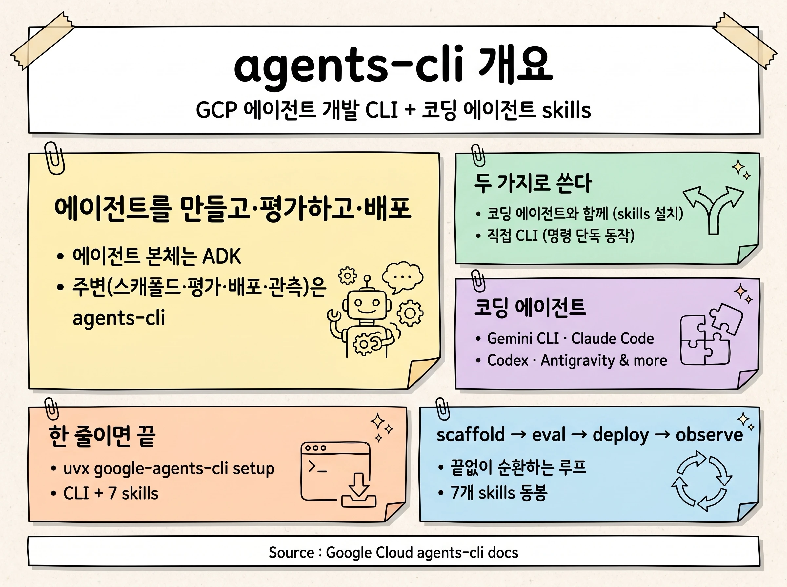
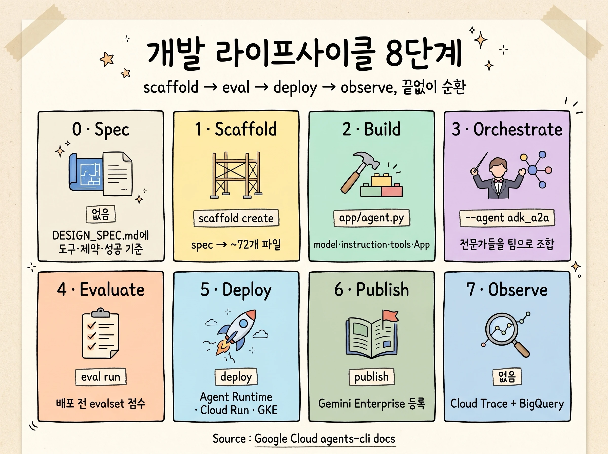
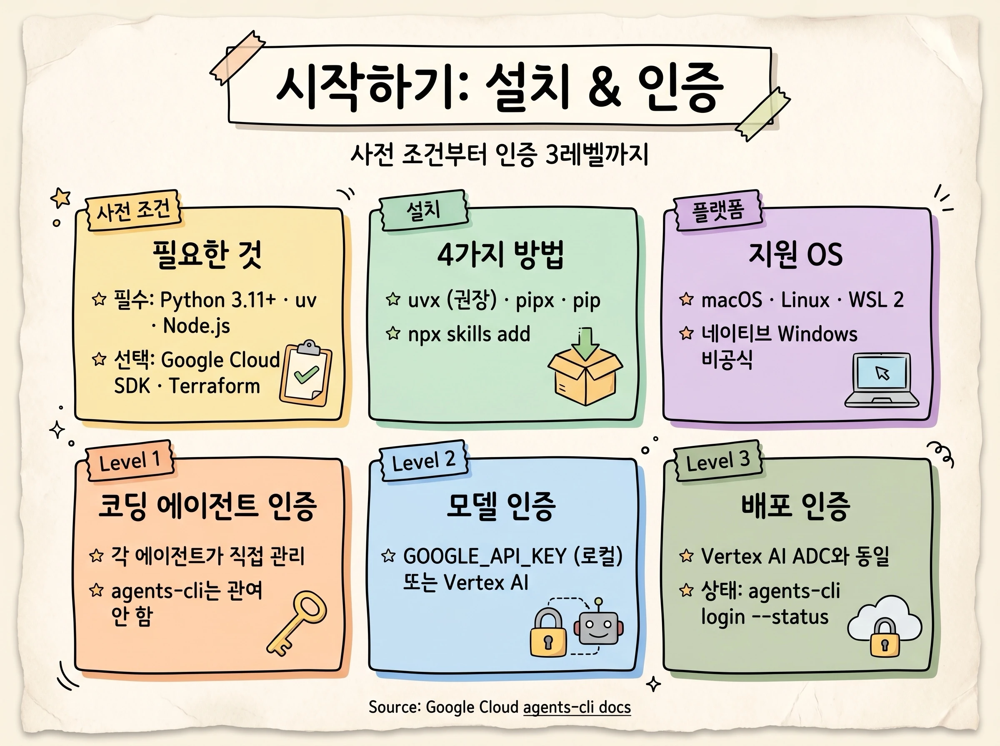
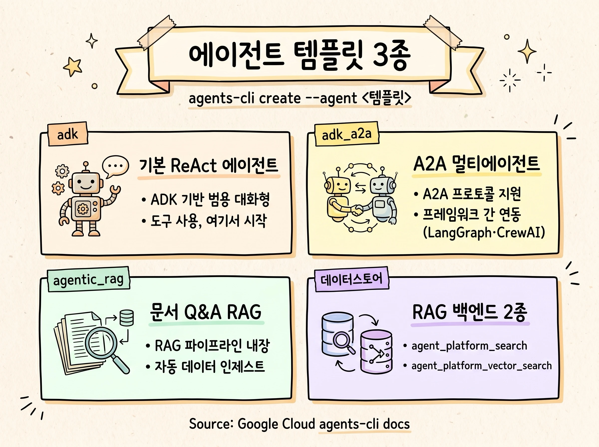
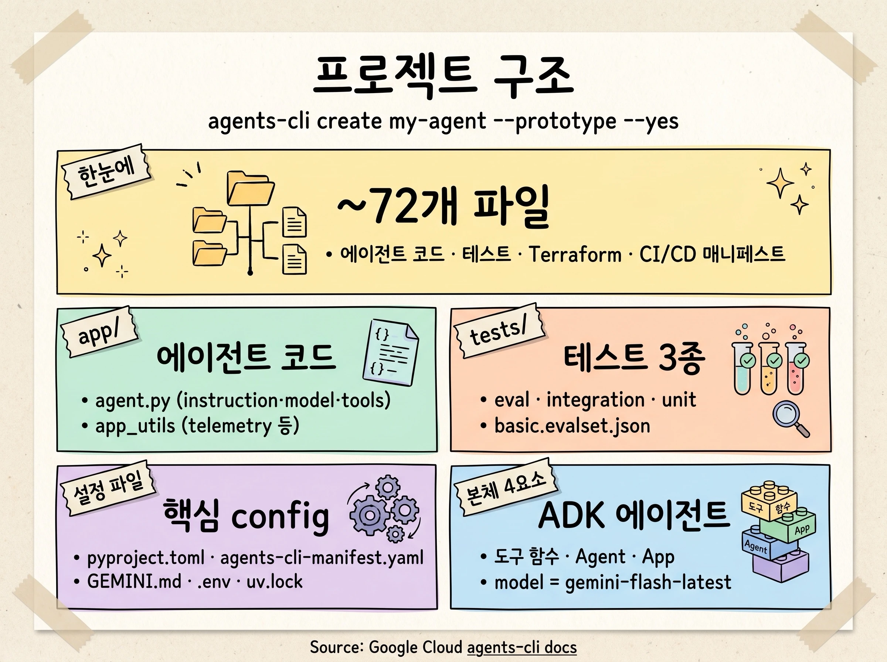
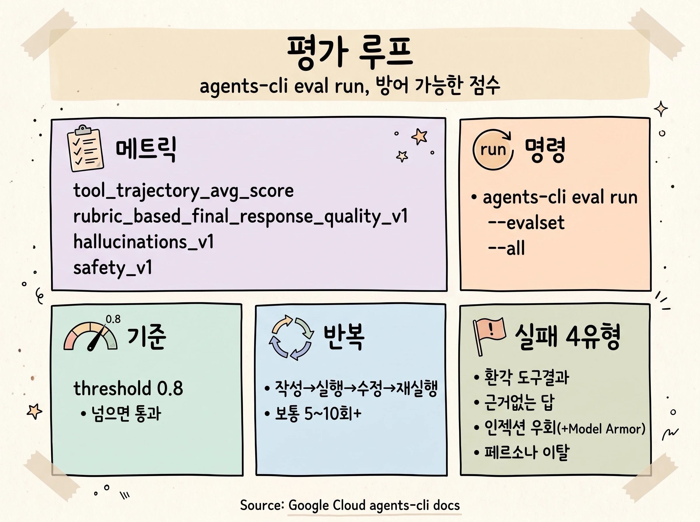
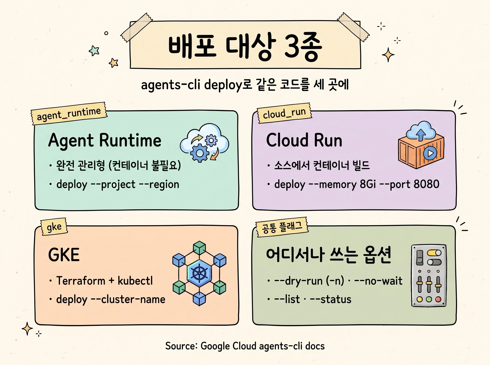
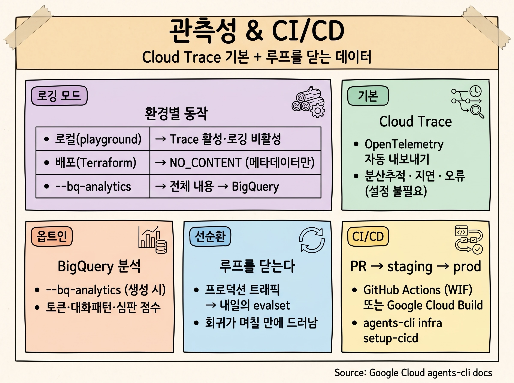

`agents-cli`는 Google Cloud에서 AI 에이전트를 만들고·평가하고·배포하는 CLI이자, 코딩 에이전트용 skills 패키지입니다. 에이전트 본체는 [Agent Development Kit(ADK)](https://google.github.io/adk-docs/)로 만들고, 그 주변의 스캐폴딩·평가·배포·관측을 `agents-cli`가 담당합니다.

## 개요: agents-cli란



`agents-cli`는 두 가지 방식으로 쓸 수 있습니다. **코딩 에이전트와 함께** 쓸 때는 Gemini CLI, Claude Code, Codex, Antigravity 등에 skills를 설치하면 코딩 에이전트가 각 단계에서 올바른 명령을 대신 골라 실행합니다. **직접 CLI로** 쓸 때는 터미널에서 명령을 하나씩 입력하며, 모든 명령은 단독으로 동작합니다.

설치는 한 줄입니다.

```bash
uvx google-agents-cli setup
```

이 명령은 CLI와 함께 코딩 에이전트용 **7개 skills**(`google-agents-cli-workflow`, `-adk-code`, `-scaffold`, `-eval`, `-deploy`, `-publish`, `-observability`)를 설치합니다. 에이전트는 ADK로 만들되, 모델은 Gemini 외에도 [Model Garden](https://cloud.google.com/model-garden)이 지원하는 Anthropic Claude·OpenAI GPT 등으로 교체할 수 있습니다.

## 개발 라이프사이클: 8단계



`agents-cli`가 가장 공들이는 것은 **'노트북에서 잘 돌아가던' 데모를 '프로덕션에서도 살아 움직이게' 만드는 루프**입니다. 핵심은 `scaffold → eval → deploy → observe`가 끝없이 도는 것이고, 천천히 풀면 8단계가 됩니다.

각 단계의 CLI verb는 **1 Scaffold** `scaffold create`, **4 Evaluate** `eval run`, **5 Deploy** `deploy`, **6 Publish** `publish` 입니다. **0 Spec**, **2 Build**, **3 Orchestrate**, **7 Observe**는 별도 verb 없이 spec 작성·코드 편집(`app/agent.py`)·구성으로 진행합니다.

## 시작하기: 설치와 인증



**사전 조건**은 Python 3.11+, [uv](https://docs.astral.sh/uv/), Node.js(skills 설치용)이며, 배포용으로 Google Cloud SDK와 Terraform이 선택적으로 필요합니다. 플랫폼은 macOS, Linux, Windows(WSL 2)를 지원하고 네이티브 Windows는 공식 지원되지 않습니다.

설치 방법은 환경에 맞게 고릅니다.

```bash
uvx google-agents-cli setup                          # 권장
pipx install google-agents-cli && agents-cli setup   # pipx
pip install google-agents-cli && agents-cli setup    # venv + pip
npx skills add google/agents-cli                     # skills만
```

인증은 세 레벨로 나뉩니다. **Level 1**은 코딩 에이전트 자신의 인증(각 에이전트가 직접 관리, `agents-cli`가 관여하지 않음)입니다. **Level 2**는 만들고 있는 에이전트가 호출하는 모델의 인증으로, 두 가지 중 하나를 씁니다.

```bash
# Option A. Gemini API Key (AI Studio), 로컬 dev·run·eval 용
export GOOGLE_GENAI_USE_VERTEXAI=FALSE
export GOOGLE_API_KEY="your-key-here"

# Option B. Google Cloud (Vertex AI), 배포까지 가능
agents-cli login -i          # = gcloud auth application-default login
export GOOGLE_CLOUD_LOCATION="us-east1"
export GOOGLE_GENAI_USE_VERTEXAI=TRUE
```

**Level 3**(배포 인증)은 Level 2 Option B의 ADC와 동일하며, `deploy`와 `infra` 명령을 풉니다. 현재 인증 상태는 `agents-cli login --status`로 확인합니다.

> [!NOTE]
> Gemini API Key(Option A)는 로컬 개발 명령(`dev`, `run`, `eval`)만 지원합니다. Google Cloud로의 배포는 Level 3(=Vertex AI ADC)이 필요합니다.

## 에이전트 템플릿 3종



프로젝트는 템플릿에서 생성됩니다. 각 템플릿은 용도에 맞는 의존성·도구·구조를 갖춘 동작하는 에이전트를 제공합니다.

| 템플릿 | 설명 | 용도 |
|---|---|---|
| `adk` | ADK 기반 ReAct 에이전트 (기본값) | 도구를 쓰는 범용 대화형 에이전트 |
| `adk_a2a` | A2A 프로토콜을 지원하는 ADK 에이전트 | 프레임워크를 넘나드는 분산 멀티에이전트(LangGraph·CrewAI 등) |
| `agentic_rag` | RAG 파이프라인이 포함된 ADK 에이전트 | 문서 Q&A, 자동 데이터 인제스트 |

```bash
agents-cli create my-agent --agent adk
agents-cli create my-agent --agent adk_a2a
agents-cli create my-agent --agent agentic_rag --datastore agent_platform_search
```

`agentic_rag`는 데이터스토어를 고릅니다. `agent_platform_search`(스케줄링·랭킹이 포함된 GCS Data Connector) 또는 `agent_platform_vector_search`(자동 임베딩 Kubeflow 파이프라인) 중 하나이며, 생성 후 `agents-cli infra datastore`로 프로비저닝하고 `agents-cli data-ingestion`으로 데이터를 적재합니다.

## 생성되는 프로젝트 구조



`agents-cli create my-agent --prototype --yes`를 실행하면 바로 실행 가능한 프로토타입 프로젝트가 나옵니다. 전체 배포 인프라까지 포함하면 약 **72개 파일**(에이전트 코드, eval, Terraform, CI/CD 워크플로, 배포 매니페스트)이 생성됩니다.

```text
my-agent/
├── app/
│   ├── agent.py              # 에이전트 정의: model · tools
│   └── app_utils/            # telemetry.py · typing.py · gcs.py
├── tests/                    # eval · integration · unit
├── pyproject.toml            # google-adk>=1.15.0,<2.0.0
├── agents-cli-manifest.yaml  # agents-cli 프로젝트 설정
├── GEMINI.md                 # 코딩 에이전트용 가이드
├── Makefile
├── .env
└── uv.lock
```

ADK 에이전트 본체는 **도구 함수 + `Agent` + `App`** 네 부분으로 압축됩니다. 모델 기본값은 `gemini-flash-latest`이며 `App`의 `name`은 에이전트 디렉터리 이름(`app`)과 일치해야 합니다.

```python
root_agent = Agent(
    name="root_agent",
    model=Gemini(model="gemini-flash-latest",
                 retry_options=types.HttpRetryOptions(attempts=3)),
    instruction="You are a helpful AI assistant.",
    tools=[get_weather, get_current_time],
)
app = App(root_agent=root_agent, name="app")  # name은 디렉터리명과 일치
```

배포 인프라를 추가하면 `deployment/terraform/{dev,staging,prod}/`, `.github/workflows/`(또는 `.cloudbuild/`) 디렉터리가 더해집니다. 프로토타입으로 시작해 `agents-cli scaffold enhance`로 나중에 붙일 수 있습니다.

## 평가 루프



대부분의 에이전트 데모가 건너뛰는 단계입니다. `agents-cli eval run`은 evalset을 실행하고 LLM 심판이 각 응답을 rubric으로 채점해 **방어 가능한 점수**를 줍니다. 기본 임계값은 **0.8**이며, 이를 넘으면 통과입니다.

```bash
agents-cli eval run                                          # 기본 evalset
agents-cli eval run --evalset tests/eval/evalsets/custom.evalset.json
agents-cli eval run --all                                    # 전체 evalset
```

에이전트 유형별로 메트릭을 고릅니다.

| 에이전트 유형 | 권장 메트릭 |
|---|---|
| 커스텀 함수 도구 | `tool_trajectory_avg_score` + `rubric_based_final_response_quality_v1` |
| `google_search` 등 모델 내장 도구 | `rubric_based_final_response_quality_v1` (내장 도구는 trajectory에 안 나타남) |
| RAG 에이전트 | `rubric_based_final_response_quality_v1` + `hallucinations_v1` |

평가는 반복적입니다. **작성(1~2개 핵심 케이스) → 실행 → 결과 읽기 → 수정 → 재실행 → 확장**의 사이클을 거치며, 일관되게 통과하기까지 보통 **5~10회 이상** 반복합니다. rubric이 자주 잡는 실패 유형은 환각 도구 결과(`tool_trajectory_avg_score`), 근거 없는 답변(`hallucinations_v1`), 프롬프트 인젝션 우회(`safety_v1`, Model Armor와 병행), 페르소나 이탈(`rubric_based_final_response_quality_v1`)입니다.

## 배포 대상 3종



같은 에이전트 코드를 세 곳에 배포할 수 있습니다. `agents-cli deploy`는 `pyproject.toml`의 `deployment_target`을 읽어 알맞은 흐름으로 분기합니다.

| 대상 | 분기 동작 |
|---|---|
| `agent_runtime` | Agent Runtime 배포 (완전 관리형, 컨테이너·인프라 관리 불필요) |
| `cloud_run` | `gcloud beta run deploy` (소스에서 컨테이너 빌드) |
| `gke` | Terraform + Docker 빌드 + `kubectl apply` |

```bash
# Agent Runtime: 가장 빠른 경로 (세션·eval·trace 내장)
agents-cli deploy --project my-gcp-project --region us-east1

# Cloud Run: 리소스 한도·이미지 지정
agents-cli deploy --memory 8Gi --port 8080
agents-cli deploy --image gcr.io/my-project/my-agent:v1

# GKE: 클러스터 지정
agents-cli deploy --cluster-name my-cluster --project my-gcp-project

# 공통: 미리보기·비동기·목록·상태
agents-cli deploy --dry-run        # -n, 실행 없이 명령 미리보기
agents-cli deploy --no-wait        # 즉시 반환 후 --status로 확인
agents-cli deploy --list           # 배포 목록
```

각 대상은 프로덕션 기본기를 물려받습니다. `--agent-identity`로 에이전트를 전용 서비스 계정으로 실행할 수 있고, `--iap`로 Cloud Run을 Workspace SSO 뒤에 둘 수 있으며, GitHub Actions는 Workload Identity Federation으로 GCP에 인증합니다.

> [!TIP]
> 고급 Cloud Run 옵션이 `agents-cli` 플래그로 노출되지 않으면 `--dry-run`(`-n`)으로 전체 `gcloud` 명령을 출력한 뒤 복사해 인자를 덧붙이면 됩니다.

## 관측성과 CI/CD



모든 프로젝트는 OpenTelemetry 계측을 기본 탑재하며 추적을 **Cloud Trace**로 자동 내보냅니다. 별도 설정 없이 분산 추적, 지연 분석, 오류 가시성을 제공합니다. 프롬프트·응답 로깅은 환경에 따라 다릅니다. 로컬(`agents-cli playground`)에서는 비활성이고, 배포 환경에서는 `NO_CONTENT`(메타데이터만)이며, `--bq-analytics`를 켜면 전체 내용이 `BigQuery`에 적재됩니다. Cloud Trace는 모든 환경에서 활성입니다.

`--bq-analytics`(프로젝트 생성 시)를 켜면 모든 프롬프트·응답이 BigQuery에 적재돼 대화 패턴·토큰 사용량·LLM 심판 점수를 분석할 수 있습니다. **이 데이터가 루프를 닫습니다.** 프로덕션 트래픽이 내일의 evalset이 되어, 회귀가 몇 달이 아니라 며칠 만에 드러납니다.

CI/CD는 PR 검사 → 머지 시 스테이징 → 승인 후 프로덕션의 흐름입니다. 스캐폴드 시 GitHub Actions(`pr_checks.yaml`, WIF 인증) 또는 Google Cloud Build를 선택하며, 인프라는 `agents-cli infra setup-cicd`로 프로비저닝합니다.

## 출처

본 문서의 모든 명령·수치·메트릭 이름은 Google 공식 문서 [`agents-cli` (Agent Platform)](https://google.github.io/agents-cli/)에서 인용했습니다(2026년 5월 29일 기준).

- [Getting Started](https://google.github.io/agents-cli/guide/getting-started/): 설치·사전 조건·skills
- [The Lifecycle](https://google.github.io/agents-cli/guide/lifecycle/): 8단계 라이프사이클
- [Authentication](https://google.github.io/agents-cli/guide/authentication/): 인증 3레벨
- [Agent Templates](https://google.github.io/agents-cli/guide/templates/): adk / adk_a2a / agentic_rag
- [Project Structure](https://google.github.io/agents-cli/guide/project-structure/): 생성 파일 구조
- [Evaluation Guide](https://google.github.io/agents-cli/guide/evaluation/): 메트릭·eval-fix 루프
- [Deployment](https://google.github.io/agents-cli/guide/deployment/): Agent Runtime·Cloud Run·GKE
- [Observability](https://google.github.io/agents-cli/guide/observability/): Cloud Trace·BigQuery 분석
- [CLI Reference](https://google.github.io/agents-cli/cli/): 전체 명령·플래그
