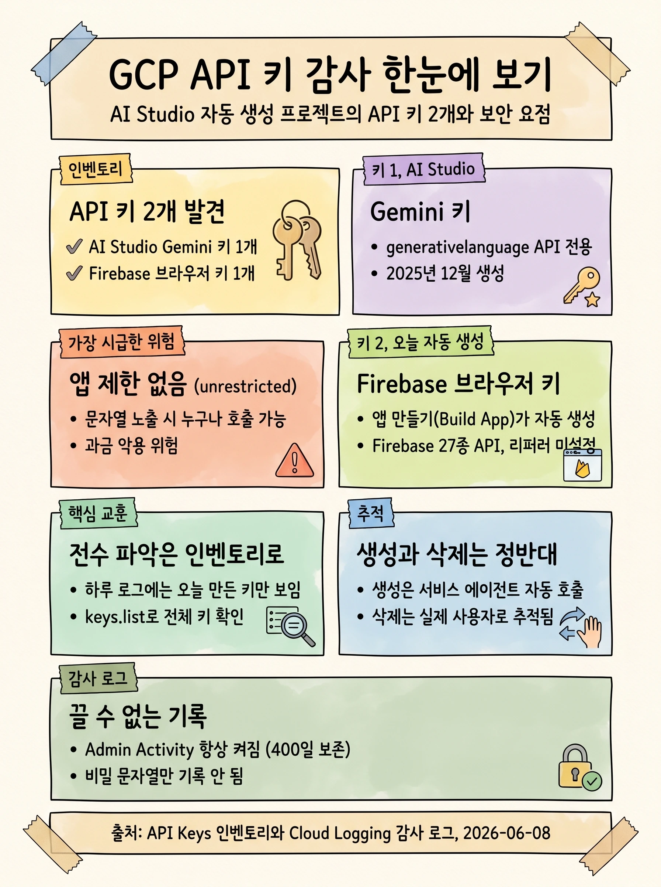
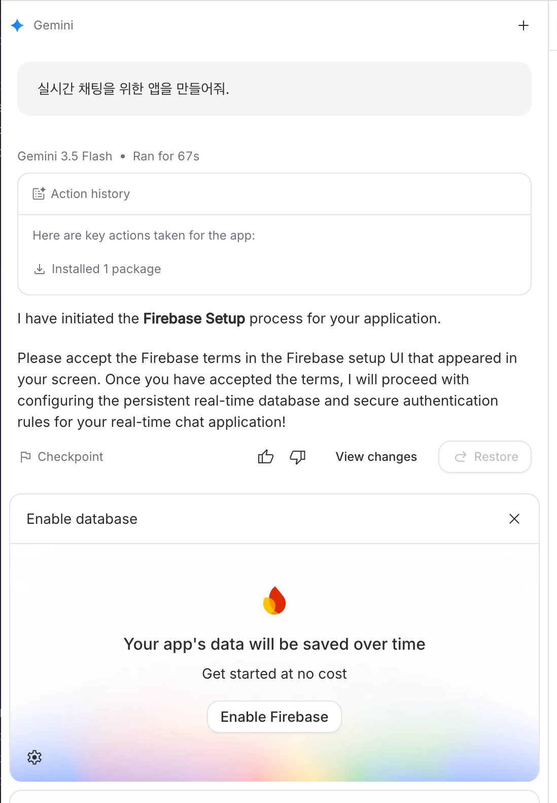
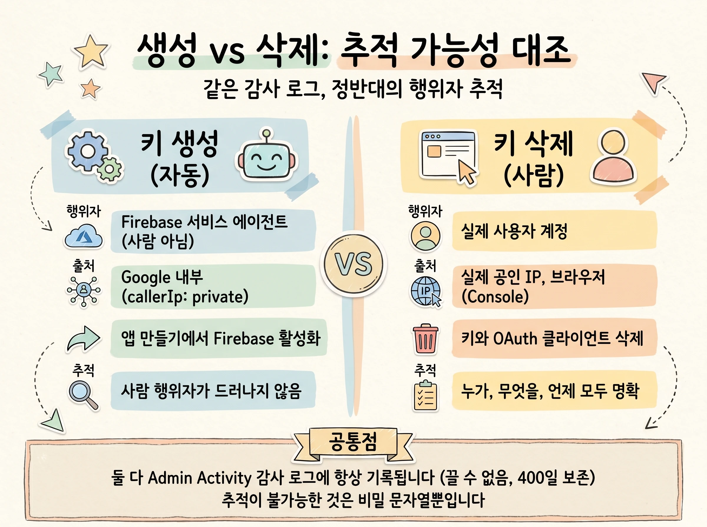

## 개요 (Executive Summary)

대상 프로젝트 `gen-lang-client-XXXXXXXXXX`의 API 키를 read-only로 전수 조사했습니다. 키가 몇 개이고 누가 언제 만들고 지웠는지, 무엇이 위험으로 남아 있는지를 정리합니다. 조사는 대상 프로젝트에 어떤 변경도 가하지 않았습니다.

{width=72%}

조사 범위와 방식은 다음과 같습니다.

| 항목 | 값 |
|------|-----|
| 대상 프로젝트 | `gen-lang-client-XXXXXXXXXX` (프로젝트 번호 `XXXXXXXXXXXX`) |
| 조사 범위 | 최근 약 24시간 로그와 메트릭 전수조사, API Keys 인벤토리 |
| 조사 시각 | 2026-06-08 (UTC) |
| 방식 | read-only (ADC). Cloud Logging `entries.list`, Cloud Monitoring `timeSeries.list`, API Keys API `keys.list` |
| 비밀 취급 | 키 문자열(keyString)은 조회하거나 출력하지 않음 (`keys.list`는 비밀을 반환하지 않으며 `getKeyString`은 호출하지 않음) |
| 쿼터 프로젝트 | `kktae-demo` (여기에 `clouderrorreporting`과 `apikeys` API 활성화. 대상 프로젝트는 무변경) |

핵심 발견은 세 가지입니다.

- 이 프로젝트는 AI Studio 또는 Firebase Studio가 자동 생성하는 `gen-lang-client-*` 유형이며, API 키가 2개 있습니다. 하나는 2025년 12월에 만든 AI Studio Gemini 키(`api-key`)이고, 다른 하나는 오늘 Firebase가 자동 생성한 브라우저 키(`ai-studio-applet-webapp`)입니다.
- Gemini 키에는 애플리케이션 제한이 전혀 없습니다(unrestricted). 가장 시급한 보안 항목입니다.
- 최근 하루 로그만 보면 오늘 만든 Firebase 키만 보입니다. 오래된 Gemini 키는 로그 창 밖이므로, 키 전수 파악은 로그가 아니라 API Keys 인벤토리(`keys.list`)로 해야 합니다.

> [!CAUTION]
> Gemini 키(`api-key`)에 애플리케이션 제한이 전혀 없어, 문자열이 노출되면 누구나 이 프로젝트로 Gemini를 호출하여 과금을 발생시킬 수 있습니다. 애플리케이션 제한 추가 또는 키 회전을 권고합니다(상세는 보안 권고 절 참고).

## 발견된 두 개의 API 키

`keys.list`(API Keys API)는 키의 메타데이터만 돌려주고 비밀 문자열은 포함하지 않습니다. 아래는 두 키의 메타데이터입니다.

### 키 1: `api-key` (AI Studio Gemini 키)

2025년 12월에 만들어진 AI Studio Gemini 키로, `generativelanguage.googleapis.com` 한 곳으로만 API가 제한되어 있습니다. 문제는 앱 제한이 전혀 없다는 점입니다.

| 필드 | 값 |
|------|-----|
| `name` | `projects/XXXXXXXXXXXX/locations/global/keys/4b79a685-a0f0-4af6-8042-c58c6080c505` |
| `uid` | `4b79a685-a0f0-4af6-8042-c58c6080c505` |
| `createTime` | **2025-12-05T03:30:41Z** (약 6개월 전) |
| API 제한 | `generativelanguage.googleapis.com` (단일) |
| 앱 제한 | **없음 (unrestricted)** |

> [!WARNING]
> 이 키는 앱 제한이 없어 어떤 출처에서든 호출할 수 있습니다. 보안 권고 절의 제한 추가 또는 회전 항목을 적용하세요.

### 키 2: `ai-studio-applet-webapp` (Firebase 브라우저 키)

오늘 Firebase 프로비저닝이 자동 생성한 브라우저 키입니다(전체 이름 `ai-studio-applet-webapp (auto created by Firebase)`). Firebase 계열 27종 API로 제한되어 있고, 허용 리퍼러는 아직 설정되어 있지 않습니다.

| 필드 | 값 |
|------|-----|
| `name` | `projects/XXXXXXXXXXXX/locations/global/keys/b252b9a9-6eef-4114-8a96-98be95f528c6` |
| `uid` | `b252b9a9-6eef-4114-8a96-98be95f528c6` |
| `createTime` | **2026-06-08T05:35:13Z** (오늘, 아래 감사 로그와 일치) |
| API 제한 | Firebase 계열 27종 (`firebase*`, `firestore`, `identitytoolkit`, `securetoken`, `firebasevertexai`, `mlkit` 등) |
| 앱 제한 | `browserKeyRestrictions` (허용 리퍼러 미설정) |

> [!NOTE]
> `keys.list` 응답에는 `keyString` 필드가 존재하지 않습니다(실측 확인). 비밀 값은 노출되지 않았습니다.

## 키는 어떻게 만들어졌나

두 키의 출처는 서로 다릅니다. Gemini 키(키 1)는 2025년 12월에 AI Studio에서 만들어졌고, Firebase 브라우저 키(키 2)는 오늘 AI Studio의 앱 만들기 과정에서 자동으로 생성됐습니다.

AI Studio의 앱 만들기(Build App)로 앱을 생성하면, Gemini 에이전트가 앱에 필요한 백엔드를 구성하면서 Firebase 설정(Firebase Setup)을 시작합니다. 아래는 실시간 채팅 앱을 요청했을 때 에이전트가 Firebase 설정을 시작하고, 사용자에게 약관 동의와 데이터베이스 활성화(Enable Firebase)를 요청하는 화면입니다.

{width=48%}

사용자가 이 화면에서 약관에 동의하고 "Enable Firebase"를 누르면 Firebase 프로비저닝이 진행되고, 그 과정에서 Firebase 서비스 에이전트가 브라우저 키(키 2)를 자동으로 생성합니다. 즉, 키 생성 API 호출 자체는 사람이 직접 한 것이 아니라 서비스 에이전트가 수행하지만, 그 출발점은 사람이 Build App에서 Firebase를 활성화한 행위입니다. 이때 행위자는 Firebase 서비스 에이전트 계정으로, 호출 출처는 Google 내부(`callerIp: private`)로 기록됩니다.

생성 시점 기준으로 두 키 모두 아직 Gemini 추론에 사용된 적은 없습니다. `generativelanguage.googleapis.com` 사용 로그는 최근 24시간과 30일 모두 0건입니다.

## 감사 로그로 무엇을 알 수 있나

키의 생성, 삭제, 수정은 모두 Admin Activity 감사 로그(`logName`이 `...%2Factivity`로 끝나는 스트림)에 남습니다. 이 로그가 키 추적의 1차 근거입니다. 아래는 Firebase 브라우저 키가 생성될 때 실제로 남은 엔트리이며, 비밀은 포함되지 않습니다.

```json
{
  "logName": "projects/gen-lang-client-XXXXXXXXXX/logs/cloudaudit.googleapis.com%2Factivity",
  "resource": {
    "type": "audited_resource",
    "labels": {
      "service": "apikeys.googleapis.com",
      "project_id": "gen-lang-client-XXXXXXXXXX",
      "method": "google.api.apikeys.v1.ApiKeys.CreateApiKey"
    }
  },
  "severity": "NOTICE",
  "timestamp": "2026-06-08T05:35:13.290101Z",
  "protoPayload": {
    "@type": "type.googleapis.com/google.cloud.audit.AuditLog",
    "authenticationInfo": {
      "principalEmail": "service-XXXXXXXXXXXX@gcp-sa-firebase.iam.gserviceaccount.com"
    },
    "requestMetadata": {
      "callerIp": "private",
      "callerSuppliedUserAgent": "stubby_client"
    },
    "serviceName": "apikeys.googleapis.com",
    "methodName": "google.api.apikeys.v1.ApiKeys.CreateApiKey",
    "authorizationInfo": [
      {
        "resource": "projectnumbers/XXXXXXXXXXXX",
        "permission": "serviceusage.apiKeys.create",
        "granted": true
      }
    ],
    "resourceName": "projects/XXXXXXXXXXXX",
    "response": {
      "@type": "type.googleapis.com/google.api.apikeys.v1.ApiKey",
      "keyId": "b252b9a9-6eef-4114-8a96-98be95f528c6"
    }
  }
}
```

추적에 쓰는 주요 필드는 다음과 같습니다.

| 경로 | 의미 | 키 찾기에서의 역할 |
|------|------|---------------------|
| `logName` | 감사 로그 스트림 (`%2Factivity`=Admin Activity, `%2Fdata_access`=Data Access) | 키 생성과 삭제는 Admin Activity에 항상 남음 |
| `protoPayload.authenticationInfo.principalEmail` | 행위자 | 누가 만들었나 (사람 또는 서비스 에이전트) |
| `protoPayload.requestMetadata.callerIp` / `callerSuppliedUserAgent` | 출처 | `private`와 `stubby_client`이면 Google 내부 자동 호출 |
| `protoPayload.authorizationInfo[]` | 권한 검사 결과 | `serviceusage.apiKeys.create` 권한 보유자 식별 |
| `protoPayload.methodName` | `CreateApiKey`/`DeleteApiKey`/`UpdateApiKey`/`GetKeyString` | 무슨 키 작업인가 |
| `protoPayload.response.keyId` | 생성된 키의 uid | 이 값으로 `keys.list`나 Console에서 키를 특정 (비밀 아님) |

> [!IMPORTANT]
> 감사 로그의 `response.keyId`(= `b252b9a9-...`)는 키 식별자(uid)라서 키를 특정하는 데 충분합니다. 하지만 키 문자열(secret)은 감사 로그에 절대 남지 않습니다. 비밀은 생성 API 응답으로 호출자에게만 1회 반환됩니다.

한편 키가 실제로 얼마나 호출됐는지(사용량)는 이 로그에 없습니다. Gemini 호출 사용 내역은 Data Access 감사 로그에 남지만 기본 비활성이라 본 프로젝트엔 0건입니다. 사용량 추적은 보통 Cloud Monitoring 메트릭이 더 실용적이며, `serviceruntime.googleapis.com/api/request_count`(리소스 `consumed_api`)의 `credential_id` 라벨로 어떤 키가 얼마나 호출됐는지 구분합니다.

## 키를 찾고 추적하는 방법

현재 존재하는 키를 빠짐없이 보려면 인벤토리(`keys.list`)를, 누가 언제 만들고 지웠는지 보려면 감사 로그를 사용합니다. 쉬운 순서로 정리하면 다음과 같습니다.

| # | 방법 | 보는 것 | 비밀 값 |
|---|------|---------|---------|
| 1 | AI Studio ([API 키 페이지](https://aistudio.google.com/app/apikey)) | 본인 AI Studio 키 목록 | 표시와 복사 가능 |
| 2 | Cloud Console 사용자 인증 정보 ([credentials 콘솔](https://console.cloud.google.com/apis/credentials?project=gen-lang-client-XXXXXXXXXX)) | 전체 키(이름, 생성일, 제한) | "키 표시"로 확인 |
| 3 | gcloud (`gcloud services api-keys list`) | 키 메타데이터(uid, displayName, 제한) | `gcloud services api-keys get-key-string <KEY>` (권한 `apikeys.keys.getKeyString`) |
| 4 | API Keys REST (`GET .../v2/projects/XXXXXXXXXXXX/locations/global/keys`) | 키 메타데이터 | `:getKeyString` 별도 호출 |
| 5 | 감사 로그 추적 (Cloud Logging) | 언제와 누가 생성하거나 삭제했는지, 그리고 `keyId` | 없음 (비밀 안 남음) |

> [!IMPORTANT]
> 로그(5번)는 생성과 사용 시점을 추적하고, `keys.list`(3번과 4번)는 현재 존재하는 전체 키를 보여줍니다. 오래전 만든 키는 로그 보존기간(기본 400일, 조회는 보통 최근 구간) 밖일 수 있으므로, 전수 파악은 반드시 `keys.list`나 Console로 해야 합니다.

## 누가 삭제했고 무엇이 지워졌나

조사 이후 사용자가 Cloud Console에서 자동 생성된 Firebase 브라우저 키(키 2)와 연결된 OAuth 클라이언트를 직접 삭제했습니다. 이 삭제는 누가, 무엇을, 어떻게 했는지가 모두 추적됩니다. 흥미롭게도 생성과 삭제는 추적 가능성이 정반대 양상을 보입니다.

{width=92%}

### 삭제한 사용자 추적

생성 이벤트는 Firebase 서비스 에이전트가 Google 내부(`callerIp: private`, `stubby_client`)에서 자동 호출한 것이라 사람 행위자가 드러나지 않습니다. 반면 삭제는 실제 사람의 브라우저 작업으로 또렷이 남습니다.

| 필드 | 값 |
|------|-----|
| `protoPayload.authenticationInfo.principalEmail` | `user@mz.co.kr` (실제 사용자) |
| `protoPayload.requestMetadata.callerIp` | `221.167.xxx.xxx` (실제 공인 IP) |
| `protoPayload.requestMetadata.callerSuppliedUserAgent` | `Mozilla/5.0 (Macintosh; Intel Mac OS X 10_15_7) ... Chrome` (브라우저, 즉 Console) |

즉, 누가(이메일), 어디서(IP), 무엇으로(브라우저) 삭제했는지가 명확합니다. OAuth 클라이언트 삭제는 User-Agent가 비어 있을 수 있으나 `principalEmail`과 `callerIp`는 동일하게 기록됩니다.

### 삭제한 키와 클라이언트 추적

- **API 키**: `resourceName`과 `request.name`이 모두 `projects/gen-lang-client-XXXXXXXXXX/locations/global/keys/b252b9a9-6eef-4114-8a96-98be95f528c6`이라 삭제된 키 uid를 특정할 수 있습니다 (앞에서 본 Firebase 브라우저 키, 키 2와 동일).
- **OAuth 클라이언트**: `resourceName`이 `clients/XXXXXXXXXXXX-8r4ae5rba1m9quju4nfbt1q9um35tled.apps.googleusercontent.com`이라 삭제된 클라이언트 ID를 특정할 수 있습니다. 클라이언트 secret은 로그에 없습니다. 원래 비밀은 기록되지 않기 때문입니다.

아래는 두 삭제 이벤트의 실제 로그이며, 비밀은 포함되지 않습니다.

```json
{
  "severity": "NOTICE",
  "timestamp": "2026-06-08T07:16:30.080175Z",
  "protoPayload": {
    "@type": "type.googleapis.com/google.cloud.audit.AuditLog",
    "authenticationInfo": { "principalEmail": "user@mz.co.kr" },
    "requestMetadata": {
      "callerIp": "221.167.xxx.xxx",
      "callerSuppliedUserAgent": "Mozilla/5.0 (Macintosh; Intel Mac OS X 10_15_7) ... Chrome"
    },
    "serviceName": "apikeys.googleapis.com",
    "methodName": "google.api.apikeys.v2.ApiKeys.DeleteKey",
    "authorizationInfo": [
      { "permission": "serviceusage.apiKeys.delete", "granted": true }
    ],
    "resourceName": "projects/gen-lang-client-XXXXXXXXXX/locations/global/keys/b252b9a9-6eef-4114-8a96-98be95f528c6",
    "request": {
      "@type": "type.googleapis.com/google.api.apikeys.v2.DeleteKeyRequest",
      "name": "projects/gen-lang-client-XXXXXXXXXX/locations/global/keys/b252b9a9-6eef-4114-8a96-98be95f528c6"
    }
  }
}
```

```json
{
  "severity": "NOTICE",
  "timestamp": "2026-06-08T07:17:23.802595Z",
  "protoPayload": {
    "authenticationInfo": { "principalEmail": "user@mz.co.kr" },
    "requestMetadata": { "callerIp": "221.167.xxx.xxx" },
    "serviceName": "clientauthconfig.googleapis.com",
    "methodName": "DeleteClient",
    "authorizationInfo": [
      { "permission": "clientauthconfig.clients.delete", "granted": true }
    ],
    "resourceName": "clients/XXXXXXXXXXXX-8r4ae5rba1m9quju4nfbt1q9um35tled.apps.googleusercontent.com",
    "request": { "@type": "type.googleapis.com/google.identity.clientauthconfig.v1.DeleteClientRequest" }
  }
}
```

> [!NOTE]
> 생성과 삭제의 유일한 차이는 `methodName`(Create에서 Delete로)과 행위자 컨텍스트입니다. 로그 구조는 앞의 생성 로그와 동일하며, 삭제 대상 식별자는 API 키의 경우 `request.name`과 `resourceName`에, OAuth 클라이언트의 경우 `resourceName`에 들어 있습니다.

> [!IMPORTANT]
> Admin Activity 감사 로그(생성, 삭제, 수정)는 항상 켜져 있고 끌 수 없습니다. 따라서 키와 클라이언트 삭제는 언제나 추적할 수 있습니다(기본 보존 400일). 추적이 불가능한 것은 단 하나, 삭제된 키의 비밀 문자열과 클라이언트 secret뿐이며, 이 값들은 원래 어떤 로그에도 남지 않습니다.

### 삭제 후 남은 위험

삭제 직후 `keys.list`를 다시 확인한 결과, 남은 키는 1개였습니다.

| 남은 키 | uid | API 제한 | 앱 제한 |
|---------|-----|----------|---------|
| `api-key` (AI Studio Gemini 키 1) | `4b79a685-a0f0-4af6-8042-c58c6080c505` | `generativelanguage.googleapis.com` | 없음 (unrestricted) |

> [!CAUTION]
> 사용자는 Firebase 자동 생성 키(키 2)와 OAuth 클라이언트를 지웠지만, 보안 권고 절에서 지적한 위험한 무제한 Gemini 키(키 1)는 그대로 남아 있습니다. 이 키에 애플리케이션 제한을 추가하거나 회전하는 것이 다음 우선 조치입니다.

## 재현 방법

조사에 사용한 쿼리와 명령입니다. Cloud Logging Logs Explorer나 동등한 도구에 그대로 넣어 확인할 수 있습니다(시간 범위는 도구의 시간 창 옵션으로 지정).

### 감사 로그 필터 (CLQL)

```text
# 키 생성, 삭제, 수정 이력 전체
protoPayload.serviceName="apikeys.googleapis.com"

# 생성만 / 삭제만
protoPayload.methodName="google.api.apikeys.v1.ApiKeys.CreateApiKey"
protoPayload.serviceName="apikeys.googleapis.com" AND protoPayload.methodName=~"Delete"

# OAuth 클라이언트 삭제
protoPayload.serviceName="clientauthconfig.googleapis.com"

# 특정 사용자가 한 변경만
protoPayload.authenticationInfo.principalEmail="user@mz.co.kr"

# Gemini 사용 (Data Access 로그 활성화 시)
protoPayload.serviceName="generativelanguage.googleapis.com"
```

### 키 인벤토리 (gcloud)

```bash
gcloud services api-keys list --project=gen-lang-client-XXXXXXXXXX \
  --format="table(uid, displayName, createTime, restrictions.apiTargets[].service)"

# 값 확인 (필요 시):
gcloud services api-keys get-key-string \
  projects/XXXXXXXXXXXX/locations/global/keys/<UID> --project=gen-lang-client-XXXXXXXXXX
```

### 사용량 메트릭

```text
metric.type="serviceruntime.googleapis.com/api/request_count"
resource.type="consumed_api"        # 라벨 credential_id 로 키별 사용량 구분
```

## 보안 권고

1. **키 `api-key`(Gemini, unrestricted)에 애플리케이션 제한 추가**: 서버용이면 IP 제한, 클라이언트용이면 HTTP 리퍼러 또는 앱 제한을 적용합니다. 현재 무제한이라 문자열이 노출되면 즉시 악용(과금)이 가능합니다.
2. **노출 의심 시 회전(rotate)**: 새 키 생성 후 코드와 시크릿 매니저를 교체하고 기존 키를 삭제하는 순서로 진행합니다. 키 문자열을 코드, 리포지토리, 로그, 공유 터미널에 하드코딩하지 않습니다.
3. **키 `ai-studio-applet-webapp`(Firebase 브라우저 키)**: 삭제하지 않고 유지한다면 허용 리퍼러를 실제 앱 도메인으로 한정합니다.
4. **사용 추적 강화**: 필요 시 Data Access 감사 로그를 활성화하거나 `request_count`(`credential_id`) 기반 알림을 구성합니다.
5. **생성 권한 점검**: `serviceusage.apiKeys.create` 보유 주체(현재 Firebase 서비스 에이전트 포함)를 주기적으로 검토합니다.

## 조사 한계와 주의사항

- 본 조사는 read-only이며 대상 프로젝트(`gen-lang-client-XXXXXXXXXX`)에 어떤 변경도 가하지 않았습니다. 키와 OAuth 클라이언트 삭제는 조사와 별개로 사용자가 Console에서 직접 수행한 것입니다. `apikeys`와 `clouderrorreporting` API는 쿼터 프로젝트 `kktae-demo`(관리 프로젝트)에만 활성화했습니다(되돌리기 가능).
- 키 문자열(비밀)은 일절 조회하거나 출력하지 않았습니다. 실제 값이 필요하면 본인이 AI Studio나 Console에서 확인하세요.
- 로그 조회는 ADC 쿼터 프로젝트 기준이며, 대상 프로젝트의 read 권한(`logging.viewer` 등)에 의존합니다.
