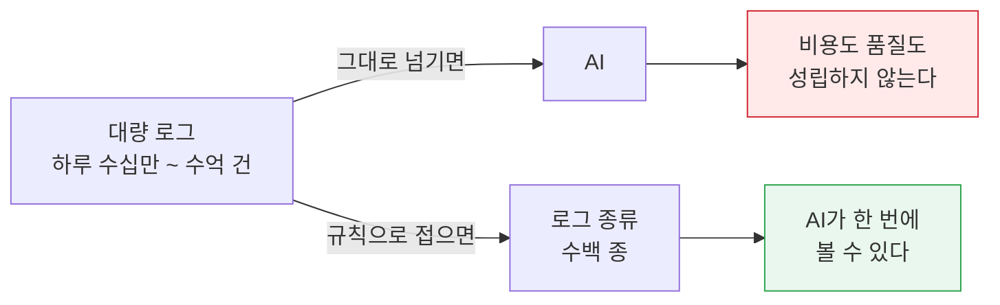
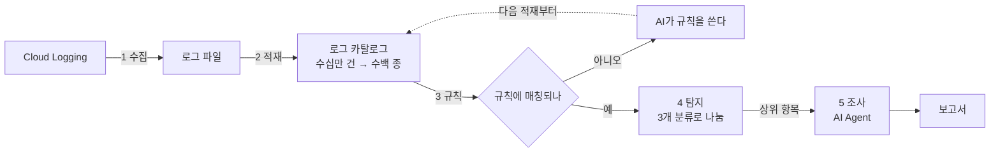
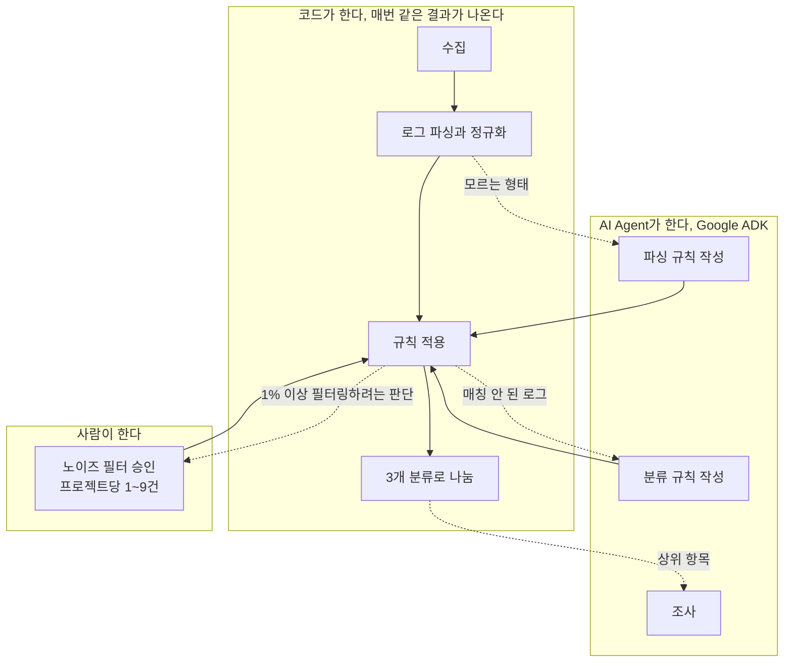
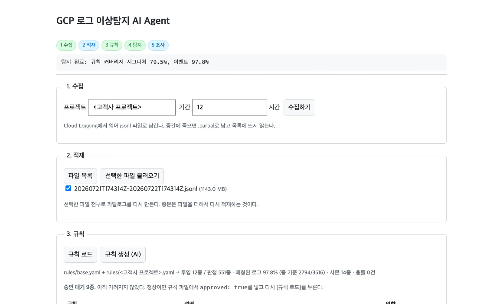
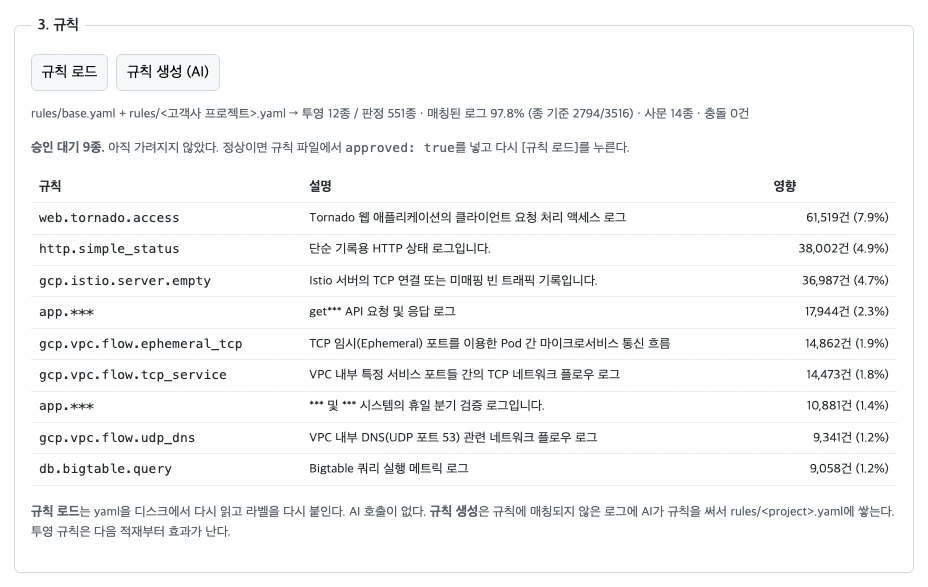
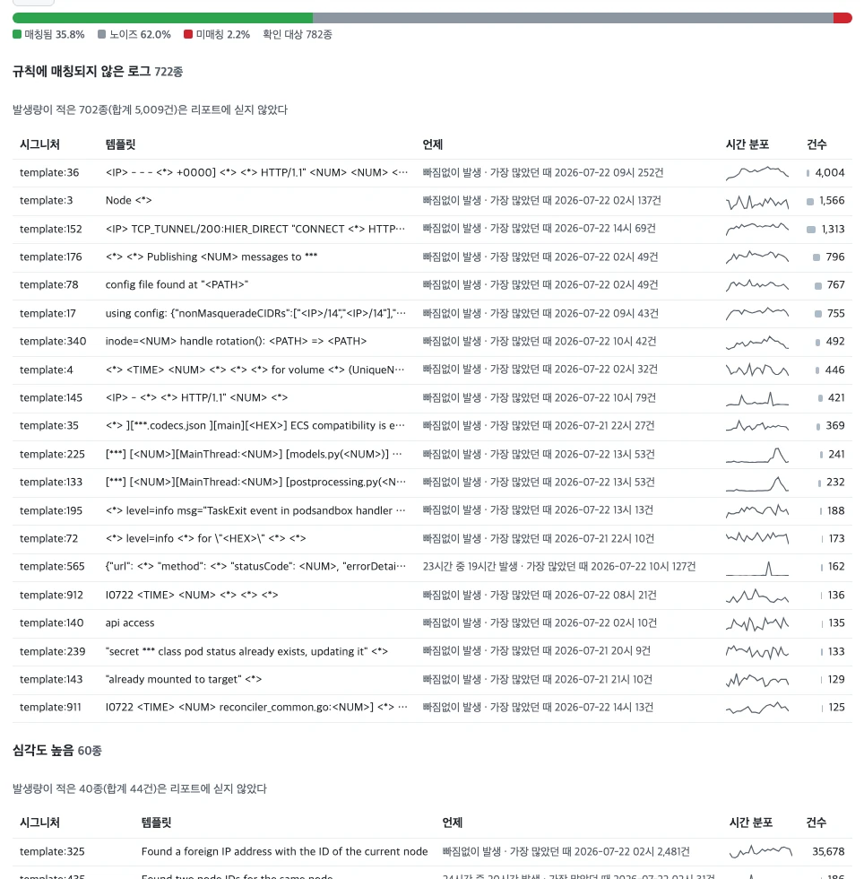
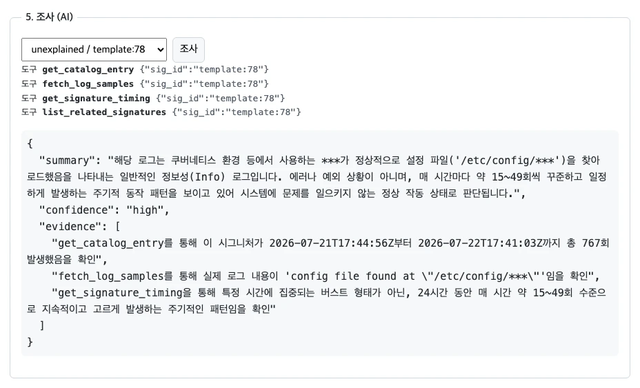
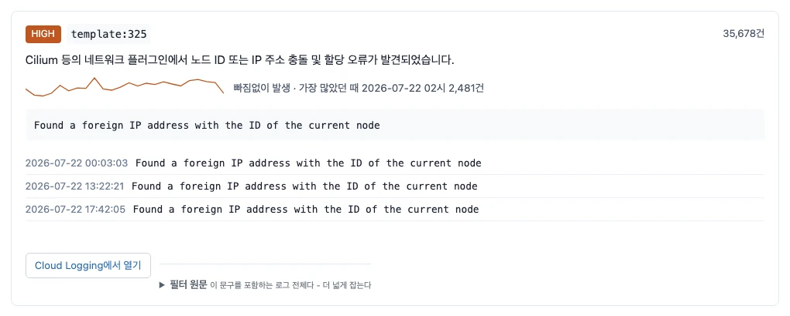

검증 범위는 GCP 프로젝트 3곳이고, 하루 로그가 6천 건에서 7억 7천만 건까지 걸쳐 있다.

**한 줄 요약.** Cloud Logging의 대량 로그에서 이상을 찾되 사람 개입을 최소화하는 것이
목표였고, ADK로 AI Agent를 구성해 진행했다. 그 과정에서 세 프로젝트의 로그를 전수조사했더니
프로젝트마다 로그 형태가 전혀 달랐고, AI에게 로그를 그대로 넘길 수 없다는 것이 드러났다.
그래서 **로그를 종류로 접는 규칙 기반 계층**을 앞에 두고, AI는 그 위에서 규칙을 쓰고
조사하게 했다. **결과적으로 하루 7억 7천만 건이 쌓이는 고객사 실운영 환경에서 로그의
97.8%에 규칙이 매칭됐고, 아무도 보고 있지 않던 인프라 장애를 찾아냈다. AI가 스스로 쓴
규칙은 762종이고, 그중 공용 규칙은 설계에 쓰지 않은 다른 프로젝트의 로그 91%에
그대로 매칭됐다.** 평소와 다른 변화를 잡는 데까지는 다음 단계가 남아 있다.

## 한 장 요약

**목표.** Cloud Logging에 쌓이는 대량 로그에서 이상을 찾되, **사람이 손대는 일을 최소로**
만든다. 수단은 Google ADK로 구성한 AI Agent다.

**한 일.** 로그를 AI가 읽을 수 있는 크기로 접는 계층을 먼저 만들고, 그 위에서 AI Agent가
규칙을 직접 쓰고 문제를 조사하게 했다.

**된 것.** AI가 규칙 **762종**을 스스로 작성했다. 사람이 손으로 쓴 것은 22종이다.
**하루 7억 7천만 건이 쌓이는 고객사 실운영 프로젝트에서 로그의 97.8%에 규칙이
매칭**됐고, 한 프로젝트에서 만든 규칙이 **규칙을 만들 때 참고하지 않은 다른 프로젝트의
로그 91%에 그대로 매칭**된다. 프로젝트가 늘어도 처음부터 다시 만들 필요가 없다는 뜻이다.

**실제로 찾은 것.** 고객사 실운영 환경에서 **쿠버네티스 노드 네트워크의 ID와 IP 충돌이
24시간 내내 한 시간도 빠짐없이** 일어나고 있었다. 표본에서 35,678건이고, 전체 규모로
환산하면 **하루 약 3,570만 건**이다. 아무도 보고 있지 않았다. 초회차 검증 프로젝트에서는
전체 로그의 71%가 30일째 방치된 디스크 쓰기 실패였다. 둘 다 기존 모니터링으로는
구조적으로 잡히지 않는 유형이다.

**사람이 손대는 지점.** 프로젝트당 **1~9건**. 전체 로그의 1% 이상을 노이즈로
숨기려는 판단만 사람 승인을 요구한다. 그 외 판단은 전부 자동이다.

**남은 과제.** 초대형 프로젝트를 **빠짐없이** 읽으려면 로그 내보내기 구성이 선행되어야
한다. 로그가 생기는 속도가 읽을 수 있는 속도의 9배이기 때문이다. 이번 검증은 균일
표본으로 그 제약을 우회했고(표본 절), 비율 기반 결론은 표본에서 그대로 성립한다.
전량이 필요한 것은 인프라 결정이다.

**필요한 결정.** 결정이 필요한 것 절에 선택지 세 가지를 정리했다. Google Cloud 기본 기능과
어디서 겹치고 어디가 비는지는 Google Cloud 기본 기능과 이 도구의 자리 절에 있다.

| | **고객사 실운영** | kktae-demo | 사내 운영 |
|---|---|---|---|
| 검증한 로그 | **787,906건** (24시간 0.1% 표본) | 182,290건 (30일) | 73,631건 (24시간) |
| 로그 종류 | **3,516종** | 673종 | 167종 |
| **규칙에 매칭된 로그** | **97.8%** | **99.7%** | **95.5%** |
| 확인 대상 로그 종류 | 782종 | 129종 | 69종 |
| **사람 승인이 필요한 항목** | **9건** | **6건** | **1건** |

### 이 보고서에 계속 나오는 다섯 단어

| 용어 | 뜻 |
|---|---|
| **로그 종류** (시그니처) | 값만 다르고 형태가 같은 로그를 하나로 묶은 단위. 78만 건이 3,516종이 된다 |
| **파싱 규칙 / 분류 규칙** | 앞은 로그에서 어떤 필드를 남길지 정하고, 뒤는 그 결과가 무슨 뜻이고 얼마나 심각한지 정한다 |
| **카탈로그** | 로그를 종류별로 묶어 정리해둔 목록 |
| **커버리지** | 규칙에 매칭된 로그의 비율. 위 표의 97.8%가 그것이다 |
| **노이즈** | 정상 동작이라 보고서에서 가려도 되는 로그 |

## 왜 했나

### 로그는 이미 사람이 못 읽는 양이다

| 검증 프로젝트 | 하루 로그 | 역할 |
|---|---|---|
| **고객사 대규모 프로젝트** | **7억 7천만 건** | **본 검증.** 실제 운영 중인 환경이고, 이 보고서 수치의 주역이다 |
| **사내 운영 프로젝트** | 92만 건 | **설계에 쓰지 않은 검증 대상.** 규칙을 만들 때 이 프로젝트 로그를 참고하지 않았다 |
| **kktae-demo** | 6천 건 | **초회차 검증.** 개발 대상이자, 고친 코드가 기존 결과를 깨지 않았는지 확인하는 기준선 |

> 뒤에서는 프로젝트를 역할로 부른다. 각각 **고객사**, **사내 운영**,
> **초회차 검증**이다. 고객사와 사내 운영은 실제 이름 대신 역할만 쓴다.

**본 검증을 고객사 프로젝트에서 한 이유.** kktae-demo는 하루 6천 건짜리 테스트
프로젝트다. 30일 전량을 모아도 18만 건이라, 실제 운영 환경에서 이 도구가 통하는지에
대한 답이 되지 못한다. 그래서 하루 7억 7천만 건이 쌓이는 고객사 실운영 프로젝트에서
24시간 표본 **78만 건**을 다시 수집해 검증했다. kktae 전체 데이터의 4배다.

> 고객사 프로젝트는 실제 이름을 쓰지 않는다. 화면 캡처에서도 프로젝트 이름과 내부
> 리소스 이름을 가렸다(부록의 화면 캡처에 대해).

하루 7억 7천만 건은 사람이 훑는다는 개념 자체가 성립하지 않는 양이다. 1초에 한 줄씩
쉬지 않고 읽어도 24년이 걸린다.

### 기존 방식이 통하지 않는다

지금까지는 "심각도가 높은 로그만 본다"가 표준이었다. 실제로 재보니 **세 프로젝트 모두
로그의 대부분이 심각도 표시가 없거나 '정보'로** 되어 있다.

| 프로젝트 | 정보, 알림, 표시 없음의 비율 |
|---|---|
| kktae-demo | 97.6% |
| 사내 운영 | 96.1% |
| 고객사 | 91.2% |

걸러낼 기준으로 쓸 수 없다는 뜻이다. 91%를 남기는 필터는 필터가 아니다.

더 결정적인 사례가 있다. 초회차 검증 프로젝트(kktae-demo)에서 심각도가 높은 것만 남기면
81건이 되는데, **그 81건은 전체 볼륨의 71%를 차지하는 진짜 장애와 아무 관계가 없다.** 그 장애는 심각도 표시가
'정보'로 붙어 있었기 때문이다. 심각도를 믿고 걸렀다면 이 프로젝트에서 가장 큰 문제를
놓쳤을 것이다.

그리고 더 근본적인 문제가 있다. 미리 정한 조건으로 거르려면 **무엇을 걸러야 하는지 이미
알고 있어야 한다.** 알고 있는 문제는 이미 알림이 걸려 있다. 모르는 문제를 찾는 데는
이 방식을 쓸 수 없다.

**그래서 무엇이 중요한지는 심각도가 아니라 로그의 의미를 보고 판단해야 한다.
이것이 AI가 필요한 첫 번째 이유다.**

### 방치된 고장: 실제로 무엇이 있었나

**검증 프로젝트 두 곳에서 각각 하나씩 나왔다.** 둘 다 오래전부터 계속 나고 있었고,
아무도 보고 있지 않았다.

**고객사 실운영 프로젝트: 노드 네트워크 ID와 IP 충돌**

> 쿠버네티스의 네트워크 플러그인(CNI)이 **"현재 노드의 ID를 가진 외부 IP 주소를
> 발견했다"고** 기록하고 있었다. 노드마다 고유해야 할 식별자가 다른 곳과 겹쳤다는
> 뜻이고, 파드 사이 트래픽이 엉뚱한 노드로 갈 수 있다는 신호다.
>
> **24시간 내내, 한 시간도 빠짐없이** 났다. 24시간 표본에서 35,678건이고 전체
> 규모로 환산하면 **하루 약 3,570만 건**이다. 같은 계통의 로그 두 종이 함께 나왔다
> (탐지 결과 절).

**초회차 검증 프로젝트(kktae-demo): 로그 자체가 유실되고 있었다**

> syslog 데몬(`rsyslogd`)이 디스크 쓰기에 실패해, 로그를 내보내는 동작을
> **중단(suspend)했다가 재개(resume)하기를 30일 내내 반복**하고 있었다. 각각
> 66,605건씩, 평균 39초에 한 번꼴이다. 둘을 합쳐 **그 프로젝트 전체 로그의 71%다.**
>
> 이건 서비스 장애 하나로 끝나지 않는다. **로그가 유실되거나 늦게 기록되고 있었다는
> 뜻**이라, 그 서버의 로그를 근거로 내리는 모든 판단이 함께 흔들린다.

**두 사례 모두 기존 이상 탐지가 구조적으로 못 잡는다.** 이상 탐지는 "평소와 다른 것"을
찾는 기술인데, 24시간 또는 30일 내내 같은 빈도로 나오는 값에는 비교할 편차가 없다.
**계속 나고 있는 고장은 그 시스템의 평소 그 자체**여서, 이상 탐지 입장에서는 오히려
가장 정상적인 로그로 보인다.

## 접근: AI Agent를 쓰되 로그를 그대로 주지 않는다

### 전수조사가 이끈 결론

시스템을 만들기 전에 세 프로젝트의 로그를 형태별로 전수조사했다. 로그를 다루는 방법은
크게 둘이다. **사람이 읽는 문장을 뽑아 비슷한 것끼리 묶거나**, **감사 기록처럼 정해진
필드를 조합하거나.** 세 프로젝트가 각각 어느 쪽에 해당하는지 재봤다.

| | 사람이 읽는 문장을 뽑을 수 있음 | 감사 기록 | **둘 다 아님** |
|---|---|---|---|
| kktae-demo | **92.5%** | 2.2% | 5.3% |
| 사내 운영 | 3.7% | **94.7%** | 1.6% |
| 고객사 | 32.9% | 1.0% | **66.1%** |

**세 프로젝트가 서로 정반대다.** 한 곳은 문장이 92.5%인데 다른 곳은 3.7%다. 한 가지
방법만 골라 구현하면 **반드시 한 프로젝트가 통째로 무너진다.**

그리고 **고객사 프로젝트 로그의 66.1%가 두 방식 어느 쪽으로도 처리되지 않는다.** 문장도 아니고
표준 감사 기록도 아닌, 서비스마다 제각각인 구조화 데이터다. 이것이 설계를 바꾼 발견이다.
가장 큰 프로젝트의 3분의 2를 못 다루는 설계는 쓸 수 없다.

**로그를 AI에게 그대로 줄 수도 없다.** 사내 운영 프로젝트의 하루 92만 건을 그대로
넘기는 것은 비용으로도 품질로도 성립하지 않는다. 그래서 접어야 하는데, 순진하게 "필드 조합이 같으면 같은 종류"로
묶으면 종류가 폭발한다. 실측하면 **27,311건이 14,100종**이 된다. 거의 1건당 1종이라 접은
의미가 없다. 요청 ID나 포트 번호처럼 매번 달라지는 값이 섞여 있기 때문이다.

**즉 무엇을 남기고 무엇을 버릴지 정하는 일 자체가 판단이고, 그 판단이 곧 규칙이다.**

### 그래서 규칙 계층이 AI 앞에 선다



**로그를 종류로 접는 일은 코드가 한다. AI는 그 위에서 판단한다.** 이 순서가 이 프로젝트의
핵심 설계 결정이고, 전수조사가 그 결론으로 이끌었다.

## 전체 아키텍처

### 파이프라인

다섯 단계다. 각 단계는 따로 실행할 수 있다.



| 단계 | 하는 일 | AI |
|---|---|---|
| **1 수집** | Cloud Logging에서 지정한 기간을 읽어 파일로 남긴다 | 없음 |
| **2 적재** | 로그를 파싱해 종류별로 묶는다 (로그 카탈로그) | 없음 |
| **3 규칙** | 규칙을 적용한다. 매칭 안 된 것에만 AI가 규칙을 쓴다 | **있음** |
| **4 탐지** | 규칙으로 정상을 빼고 남은 것을 3개 분류로 나눈다 | 없음 |
| **5 조사** | 상위 항목을 AI Agent가 파고들어 원인을 설명한다 | **있음** |

**반복할수록 AI 호출이 줄어든다.** 3단계에서 AI가 규칙을 한 번 쓰면 그 규칙은 파일에
남고, 다음부터는 코드가 그 규칙을 적용한다. **같은 로그를 두 번 묻지 않는다.** 이것이
운영 비용이 시간이 갈수록 내려가는 이유다.

### AI Agent 3종이 맡는 일



#### 파싱 규칙을 만드는 AI

처음 보는 형태의 로그가 들어오면 **어떤 필드를 남기고 어떤 필드를 버릴지** 정한다.
전수조사에서 본 것처럼 이 판단이 잘못되면 로그 종류가 폭발하거나(요청 ID를 남겼을 때) 서로
다른 문제가 한 덩어리로 뭉개진다(중요한 필드를 버렸을 때).

**이 AI는 시간이 지날수록 안 불린다.** 한 번 정한 형태는 파일에 남으므로 같은 형태를
다시 묻지 않기 때문이다. 실측으로 첫 회차 7건에서 두 번째 회차 1건으로 떨어졌고, 다른
프로젝트에서는 두 번째 회차에 0건이었다.

#### 분류 규칙을 만드는 AI

파싱된 로그 종류를 보고 **"이건 무슨 뜻이고 얼마나 심각한가, 무시해도 되는가"를** 정해
규칙으로 쓴다. 사람이 읽을 수 있는 문장과 함께 저장되므로 나중에 검토하고 고칠 수 있다.

**이쪽은 0으로 수렴하지 않는다.** 새로운 종류의 로그는 서비스가 바뀌는 한 계속 나오고,
그때마다 판단이 필요하기 때문이다.

#### 조사 에이전트

탐지 결과 상위 항목에 대해 **스스로 도구를 골라 여러 번 부르며** 원인을 파고든다.
목록에서 통계를 보고, 실제 로그 줄을 뽑아 보고, 언제 얼마나 났는지 분포를 보고, 필요하면
주변 로그까지 본 다음에 답한다. **무엇을 어떤 순서로 볼지는 사람이 정하지 않는다.**

실제 동작은 AI Agent가 실제로 조사하는 장면 절에 그대로 실었다.

#### 왜 앞의 둘을 파일에 남기는가

**AI에게 같은 질문을 반복하지 않는 것이 이 구조의 핵심이다.** 규칙 파일은 코드와 함께
저장소에 커밋되고, 사람이 읽고 검토하고 다른 프로젝트로 복사할 수 있다. 만약 AI가 매번
판단을 다시 내린다면 비용이 줄지 않을 뿐 아니라 **같은 로그가 실행할 때마다 다른 판정을
받게 된다.** 그러면 보고서를 신뢰할 수 없다.

### AI 출력에 거는 가드레일: 코드와 AI의 경계

표현할 수 있는 것을 미리 좁혀두고, 그래도 들어온 것은 검증기가 되돌려 보낸다.

**AI가 실행 가능한 코드를 만들어내지 않는다.** 이 구분이 안전의 핵심이다.

파싱 규칙에서 AI가 고르는 것은 두 가지뿐이다. **어떤 필드를 남길지**, 그리고 그 값을
어떻게 다룰지를 **미리 정해둔 처리 방식 목록에서 하나** 고르는 것이다. 예를 들어
"포트 번호는 잘 알려진 것과 임시 포트로만 구분한다"거나 "도메인은 뒤 세 마디만 남긴다"
같은 것들이고, 목록에 없는 처리는 애초에 표현할 수 없다. **AI가 임의의 변환 로직을 짜서
넣을 방법이 없다.**

분류 규칙의 검색식도 무한 반복이 원리적으로 불가능한 형태로만 받아들인다. 악의적이든
실수든 시스템을 멈추게 하는 패턴이 들어올 수 없다.

**그리고 AI가 쓴 규칙은 받자마자 자동 검사를 통과해야 채택된다.** 지금까지 **153건**이
되돌려 보내졌다. 실제로 걸러진 세 유형이 왜 위험한지가 이 검사의 존재 이유다.

- **규칙 하나가 로그 전체를 삼킨다.** 너무 넓은 검색식을 쓰면 서로 다른 문제 수백 종이
  한 판정을 받는다. 커버리지 숫자는 올라가는데 실제로는 아무것도 구분하지 못하게 된다
- **존재하지 않는 필드를 지어낸다.** 그 규칙은 영원히 아무것도 매치하지 못한다. 조용히
  실패하므로 누군가 확인하기 전까지 "규칙이 있으니 덮였다"고 착각하게 된다
- **사람이 내린 판정을 덮어쓴다.** 이미 다른 규칙이 판정한 로그에 다른 답을 붙이면,
  규칙 파일을 읽어도 실제로 어느 쪽이 적용되는지 알 수 없게 된다

셋 다 **틀렸는데 틀린 티가 안 나는** 실패다. 사람이 눈으로 훑어서는 안 걸리므로
검증기가 잡아야 한다.

### 사람에게 무엇을 보여주는가

다섯 단계가 순서대로 놓이고, 각 단계의 결과가 그 자리에서 보인다.



이미 받아둔 로그 파일로도 전체 흐름을 돌릴 수 있다. Cloud Logging을 실제로 호출하며
기다리지 않아도 되므로, 시연이나 재검증이 수집 시간에 묶이지 않는다.

## 승인 게이트: 사람이 개입하는 유일한 지점

전체 로그의 **1% 이상**을 노이즈로 분류해 보고서에서 숨기려는 판단은, 사람이
승인하기 전까지 **실제로 적용되지 않는다.**



### 절차

1. AI가 "이 로그는 정상 운영 노이즈니 숨겨도 된다"는 규칙을 쓴다
2. 시스템이 그 규칙이 **몇 건, 전체의 몇 %를 숨기게 되는지** 계산한다
3. 1%를 넘으면 **숨기지 않고 그대로 보여주면서**, 승인 대기 목록에 올린다
4. 사람은 규칙 이름, 설명, 영향 범위를 보고 판단해 규칙 파일에 승인 표시를 넣는다
5. 그때부터 그 로그가 보고서에서 빠진다

위 화면이 3단계의 모습이다. 9종이 합쳐서 전체 로그의 27.2%를 숨기려 하고 있고,
아직 아무것도 숨겨지지 않았다.

### 왜 여기만인가

AI가 내리는 다른 판단은 **틀려도 화면에 남아서 사람이 알아챈다.** 심각도를 낮게 매겼다면
목록에서 아래쪽에 있을 뿐 사라지지는 않는다.

**"이건 무시해도 된다"는 판단만 틀리면 아무것도 보이지 않는다.** 숨겨진 것은 숨겨졌다는
사실조차 보이지 않으므로, 잘못된 판단을 발견할 계기가 영영 오지 않는다. 되돌릴 수 없는
결정이라 승인을 요구한다.

### 왜 심각도가 아니라 영향 범위인가

심각도는 **AI가 매긴 값**이다. 승인 기준으로 쓰면 AI가 심각도를 낮게 매기는 것만으로
자기 판단에 대한 검증을 우회할 수 있다.

영향 범위(몇 %를 숨기는가)는 **데이터에서 나오는 값**이라 AI가 조작할 수 없다. 그래서
기준을 이쪽에 둔다.

승인이 없으면 **숨기지 않고 보여준다.** 안전한 쪽으로 실패하도록 만들어져 있다.

## 결과

### 해결한 것 일곱 가지

일곱 가지다. 각각 근거가 되는 절을 함께 적는다.

| 해결한 것 | 근거 |
|---|---|
| **실운영 규모에서 동작한다.** 하루 7억 7천만 건짜리 프로젝트의 24시간 표본 78만 건에서 로그의 97.8%에 규칙이 매칭됐다 | 커버리지 절, 표본 절 |
| 프로젝트마다 **정반대인 로그 형태를 하나의 파이프라인으로** 덮었다. 문장형 92.5% ↔ 감사 기록 94.7% ↔ 둘 다 아님 66.1% | 전수조사 절, 커버리지 절 |
| **AI 호출이 반복할수록 줄어든다.** 파싱 규칙은 실운영 프로젝트에서도 2회차에 0건으로 수렴했다 | AI Agent 3종 절, 운영 비용 절 |
| 규칙이 **다른 프로젝트로 그대로 옮겨진다.** 규칙을 만들 때 참고하지 않은 프로젝트에 91.1% | 이식성 절 |
| 사람 개입을 **프로젝트당 1~9건**으로, 그것도 되돌릴 수 없는 결정에만 남겼다 | 승인 게이트 절, 자동화 수준 절 |
| **아무도 보고 있지 않던 장애를 실제로 찾았다.** 실운영 환경의 노드 네트워크 충돌(하루 환산 3,570만 건)과 초회차 검증의 디스크 쓰기 실패(전체의 71%) | 방치된 고장 절, 탐지 결과 절 |
| AI가 쓴 규칙을 **검증기가 걸러 되돌려 보냈다.** 손으로 쓴 규칙의 심각도를 AI가 낮추려던 것도 여기서 걸렸다 | 가드레일 절, 자동화 수준 절 |

가장 값어치 있는 것은 여섯 번째다. **실제로 돌아가고 있는 고객사 환경에서, 24시간
내내 한 시간도 빠짐없이 나던 인프라 장애를 찾아냈다.** 심각도로 걸렀다면 못 찾았고, 이상 탐지로도 못 찾는다(둘 다 왜 했나 절 참조). 사람이 하루 7억 건을 매일 훑었어야 나오는
발견이다.

### 자동화 수준

| | 결과 |
|---|---|
| **AI가 스스로 작성한 규칙** | **762종** |
| 사람이 손으로 쓴 규칙 | 22종 |
| 사람 승인이 필요했던 항목 | 프로젝트당 **1~9건** |
| 시스템이 AI의 잘못된 규칙을 되돌려 보낸 횟수 | 153건 |

사람이 쓴 22종은 어느 GCP 프로젝트에나 똑같이 나오는 표준 로그를 다룬다. 형식이 구글에
의해 고정되어 있어 AI에게 물을 이유가 없는 것들이다. 나머지, 즉 프로젝트마다 다른 로그를
AI가 맡았다.

**검증기가 실제로 무엇을 잡는지 보여주는 사례가 이번에 나왔다.** AI가 쓴 규칙 하나가
로드밸런서의 5xx 응답을 "심각도 중간"으로 판정했는데, 사람이 손으로 쓴 규칙은 같은
로그를 "심각도 높음"으로 보고 있었다. **AI가 사람의 판단을 조용히 덮어쓰려 한 것**이고,
충돌 검사가 이것을 막았다. 판정을 조정해 5xx는 사람이 쓴 규칙이, 그 외는 AI 규칙이
맡도록 나눴다. 규칙이 파일에 남아 있어서 이런 검토가 가능하다(가드레일 절).

### 이식성: 다른 프로젝트로 그대로 옮겨 쓴다

**규칙을 만들 때 참고하지 않은 프로젝트의 로그 91%가, 공용 규칙만으로 매칭됐다.**

| | 공용 규칙만으로 매칭된 로그 |
|---|---|
| 사내 운영 | **91.1%** |
| kktae-demo | 76.9% |
| 고객사 실운영 | 60.2% |

**이것이 확장 비용에 대한 답이다.** 프로젝트를 하나 더 붙일 때 처음부터 다시 만들 필요가
없다. 대부분은 이미 만들어둔 규칙이 덮고, 그 프로젝트 고유의 로그만 AI가 추가로 정리한다.
프로젝트가 열 개로 늘어도 작업량이 열 배가 되지 않는다.

**고객사 프로젝트에서 60.2%가 나온 것은 이식성의 하한이자 규모의 성질이다.** 사람이 쓴
22종만으로 실운영 로그의 60%를 이미 덮는다는 뜻이고, 동시에 서비스가 많을수록 그
프로젝트 고유의 로그 비중이 커진다는 뜻이다. 실제로 단계를 나눠 재보면 이렇다.

| 어떤 규칙까지 썼나 | 매칭된 로그 (건수) | 로그 종류 기준 |
|---|---|---|
| 사람이 쓴 공용 규칙만 (22종) | 63.5% | 36.3% |
| \+ 예비 표본에서 AI가 만든 규칙 (66종) | 78.2% | 42.5% |
| \+ AI 저자 1회차 (251종) | 80.0% | 55.6% |
| **\+ AI 저자 2회차 (221종)** | **97.8%** | **79.5%** |

> 위 표의 60.2%와 이 표의 63.5%는 재는 방법이 다르다. 앞의 것은 **완성된 카탈로그에서**
> 공용 규칙이 차지한 몫이고, 뒤의 것은 **공용 규칙만 올려놓고 처음부터 다시 적재**했을
> 때의 값이다. AI가 만든 파싱 규칙이 로그를 다르게 접으면서 차이가 생긴다.

**예비 표본**은 본 검증에 앞서 같은 프로젝트에서 받아둔 0.01% 표본(77,664건)이다.
본 검증 표본의 10분의 1 크기다.

두 번째 줄이 이식성의 다른 증거다. **10분의 1 크기의 예비 표본에서 만든 규칙이, 10배로
늘린 로그에서도 그대로 동작해 커버리지를 14.7%p 올렸다.** 규칙이 특정 표본에 맞춰진
것이 아니라 그 프로젝트의 로그 자체에 매칭되고 있다는 뜻이다.

### 커버리지

| | 규칙에 매칭된 로그 (건수) | 로그 종류 기준 |
|---|---|---|
| **고객사 실운영** | **97.8%** | 79.5% |
| kktae-demo | **99.7%** | 82.8% |
| 사내 운영 | **95.5%** | 58.7% |

건수 기준과 종류 기준이 크게 다른 것에 주의해야 한다. **많이 나는 로그는 잘 덮이고,
드물게 나는 로그는 덜 덮인다.** 볼륨의 97.8%에 매칭돼도 종류로 세면 79.5%다.

> **이 숫자를 정확히 읽는 법.** 커버리지 안에서 "가려진 것"과 "그대로 보이는 것"은
> 다른 이야기다. 고객사 프로젝트의 97.8%는 이렇게 갈린다.
>
> - **62.0%**: 노이즈로 분류해 **실제로 가린** 몫
> - **27.2%**: AI가 노이즈로 분류했지만 영향이 커서 **사람 승인 전까지 가리지 않고
>   그대로 보여주는** 몫 (9종, 승인 게이트). 승인이 없으면 안 가리는 쪽으로 실패한다
> - 나머지 **8.6%**: 규칙이 이름을 붙였고 노이즈도 아닌, 실제 확인 대상
>
> 초회차 검증 프로젝트의 99.7% 중 71%는 rsyslogd 디스크 쓰기 실패 하나가 차지하고, 사내 운영
> 프로젝트의 95.5% 중 91.1%는 이 프로젝트만의 판단 없이 공용 규칙만으로 매칭된 것이다.
> **커버리지는 "얼마나 많이 알아봤나"이지 "얼마나 쓸모 있나"가 아니다.**

### 탐지 결과: 무엇을 찾았나

규칙으로 정상을 빼고 남은 것을 **3개 분류로 나눠** 보여준다.



| 분류 | 답하는 질문 | **고객사 실운영** | kktae | 사내 운영 |
|---|---|---|---|---|
| **규칙에 매칭되지 않은 로그** | "처음 보는 것인가" | **722종** | 116종 | 69종 |
| **심각도 높음** | "심각한가" | **60종** | 13종 | 0종 |
| **대량 발생** | "많이 나는가" | 0종 | 0종 | 0종 |

**셋을 섞지 않는 것이 중요하다.** 각각 다른 질문에 답하고 있고, 대응도 다르기 때문이다.

첫 번째는 **이 도구가 하는 유일한 신규성 탐지(novelty detection)다.** 규칙에 매칭되지
않았다는 것은 곧 지금까지 본 적 없는 로그라는 뜻이다. 나머지 둘은 이미 규칙이 이름을
붙여둔 것들 중에서 눈여겨볼 것을 고른 것이라, 성격이 다르다.

셋을 한 덩어리로 내놓으면 **"AI가 이상을 찾아냈다"로 읽히게 된다.** 이 보고서가 변화 탐지 절에서
"아직 이상 탐지가 아니다"라고 적는 것과 정면으로 충돌한다. 그래서 화면에서도 분류를
나누고 각각 무엇인지 적는다.

#### 실운영 환경에서 무엇이 나왔나

**심각도 높음 1위가 인프라 장애였다.**

> **`Found a foreign IP address with the ID of the current node`, 35,678건**
>
> 쿠버네티스의 네트워크 플러그인이 **현재 노드의 ID를 가진 외부 IP 주소를 발견했다**고
> 24시간 내내 기록하고 있었다. **한 시간도 빠짐없이**, 시간당 최소 396건에서 최대
> 2,481건이다. 0.1% 표본에서 이 숫자이므로 전체로 환산하면 **하루 약 3,570만 건**이다.
>
> 같은 계통의 로그가 함께 나왔다. `Found two node IDs for the same node` 186건,
> `Attempted to deallocate a node ID that wasn't allocated` 112건. 노드 ID 할당이
> 어긋나 있다는 신호가 세 갈래로 나온 것이다. 파드 간 통신 경로 오류와 패킷 유실로
> 이어질 수 있는 유형이다.

**계속 나고 있어서 오히려 안 보이는, 앞에서 말한 그 유형이다.** 24시간 내내 같은 빈도로 나므로 "평소와 다른
것"을 찾는 이상 탐지에는 걸리지 않고, 심각도 표시로도 걸러지지 않는다. 계속 나고 있는
고장은 그 시스템의 평소 그 자체다.

#### 시간 분포가 숫자를 뒤집는다

각 항목에 **언제 얼마나 났는지**가 작은 그래프로 붙는다. 이것이 목록의 숫자만으로는 알
수 없는 것을 드러낸다.

| 프로젝트 | 목록의 숫자 | 시간 분포가 말하는 것 |
|---|---|---|
| 고객사 실운영 | 노드 ID 충돌 `35,678건` | 24구간 전부에서 발생. 진짜 방치된 고장 |
| 초회차 검증 | 디스크 쓰기 실패 `66,605건` | 30일 내내 빠짐없이. 진짜 방치된 고장 |
| 초회차 검증 | 처음 보는 로그 1위와 2위 `74건`, `48건` | 끝에 스파이크 하나뿐이다. **74개 사건이 아니라 한 사건의 멀티라인 파편이다** |
| 초회차 검증 | `Summary: succeeded N jobs 28건` | 촘촘하고 규칙적이다. 정기 배치다. 노이즈 필터 후보 |

**발생량 순 정렬만으로는 가짜 우선순위가 생긴다.** 세 번째 줄에서 목록 맨 위 두 개가
사실 한 사건이다. 숫자만 봤다면 74건짜리 문제 두 개로 읽었을 것이다. 사람이 다음에
무엇을 할지가 달라지는 정보다. (이 조각 문제는 멀티라인 로그 절에서 한계로 다룬다.)

### AI Agent가 실제로 조사하는 장면

조사 에이전트는 **스스로 도구를 골라 여러 번 부른다.** 아래는 실제 실행을 그대로 담은
것이다. 도구 네 개를 순서대로 부르고, 각각에서 얻은 것을 근거로 결론을 냈다.



결과를 그대로 옮긴다. **"처음 보는 로그"로 분류된 것 하나를 조사한 것이다.**

> **`config file found at "<PATH>"`, 767건**
>
> 쿠버네티스 환경의 에이전트가 설정 파일을 정상적으로 찾아 로드했음을 알리는 정보성
> 로그다. 에러나 예외 상황이 아니며, 매 시간마다 약 15~49회씩 꾸준하고 일정하게
> 발생하는 **주기적 동작 패턴**을 보이고 있어 **시스템에 문제를 일으키지 않는 정상
> 작동 상태**로 판단된다.
>
> 근거로 든 것: 카탈로그에서 24시간 동안 767회 발생 확인 / 실제 로그 내용에서 파일
> 경로 확인 / 시간 분포에서 특정 시간에 집중되는 버스트 형태가 아니라 24시간 내내
> 고르게 발생하는 주기적 패턴임을 확인

**이것이 "사람 개입 최소화"의 실체다.** 사람이 한 일은 대상 하나를 고른 것뿐이다.
무엇을 볼지, 어떤 순서로 볼지, 어디까지 파고들지, 무엇을 근거로 제시할지는 전부
에이전트가 정했다.

**그리고 이 결론의 값어치는 "정상이다"라고 판정한 데 있다.** 규칙에 매칭되지 않아
확인 대상으로 올라온 767건짜리 항목을, 사람이 손대기 전에 에이전트가 근거 셋을 갖춰
정상으로 분류했다. 확인 대상 782종을 사람이 하나씩 열어보는 대신 이 판단을 먼저
받는 것이 이 도구가 줄이려는 일이다.

### 산출물

보고서에는 항목마다 **언제 얼마나 났는지, 실제 로그가 어떤 줄인지, 원본을 어디서 다시
보는지**가 붙는다. 마지막 항목이 중요하다. 시스템이 요약한 것을 사람이 의심할 때
원본으로 돌아갈 길이 없으면 판단을 검증할 수 없기 때문이다.



### 재현성: 같은 입력에 같은 결과

AI를 쓰는 시스템에서 흔치 않은 성질이라 따로 적는다. **이 프로젝트는 그것을 의도해서
설계했다.**

- 자동 검증 **196개 통과** (브라우저 화면 검증 11개 포함)
- 규칙이 파일에 남아 있어서 같은 로그에 AI를 다시 부르지 않는다. 따라서 **같은 로그가
  실행할 때마다 다른 판정을 받지 않는다**

이것이 **보고서를 믿을 수 있게 만드는 전제**다. AI가 매번 판단을 새로 내리는 구조였다면
같은 로그가 어제는 심각, 오늘은 정상이 된다. 그런 보고서로는 아무것도 결정할 수 없다.

### 운영 비용

**반복 실행할수록 AI 호출이 줄어든다.**

| AI가 새로 만든 **파싱** 규칙 | 1회차 | 2회차 |
|---|---|---|
| **고객사 실운영** | 1건 | **0건** |
| kktae-demo | 7건 | 1건 |
| 사내 운영 | 9건 | **0건** |

**로그를 종류로 접는 일은 한 번 배우면 끝난다.** 실운영 프로젝트에서도 2회차에 0건으로
수렴했다. 하루 7억 7천만 건이 쌓이는 환경에서도 로그의 *형태*는 유한하다는 뜻이다.

**다만 완전히 0이 되지는 않는다.** 앞서 본 대로 파싱 규칙은 0으로 수렴하지만
"이 로그가 무슨 뜻인가"를 판정하는 규칙은 새로운 로그가 나오는 만큼 계속 만들어진다.
고객사 프로젝트에서 판정 규칙은 1회차 251종, 2회차 221종이었고, 그 대가로 커버리지가
80.0%에서 97.8%로 올랐다.

| | 고객사 실운영 (78만 건) | kktae (18만 건) |
|---|---|---|
| 수집 | 68분 | 수 분 |
| 적재 + 탐지 | 15초 | 수 초 |
| AI 규칙 저자 1회 | 약 18분 | 약 8분 |

**측정하지 않은 것: AI 호출의 실제 과금액.** 실행 시간은 쟀지만 비용은 계산하지 않았다.
운영 투입을 결정한다면 이 수치가 먼저 필요하다.

### 표본: 고객사 수치는 전량이 아니다

**고객사 프로젝트는 24시간 × 0.1% 균일 표본이다.** 전량이 아니다. 이 사실이 위 결론과
어떤 관계인지 분명히 해둔다.

**균일 표본은 구성비를 보존한다.** Cloud Logging이 서버 쪽에서 무작위로 뽑아주므로
어떤 종류의 로그가 얼마나 차지하는지가 그대로 유지된다(실측 오차 0.9%p 이하).
커버리지, 이식성, 노이즈 필터 승인 게이트는 전부 비율로 정의되므로 **표본에서 잰 값이 전량에서도
성립한다.**

**이 도구가 잘하는 영역은 표본에 온전히 남는다.** 방치된 고장은 곧 대량 발생이고,
대량 발생은 표본에 반드시 잡힌다. 노드 ID 충돌이 35,678건으로 1위에 오른 것이 그
증거다.

**표본이 약하게 만드는 것은 희소 신호다.** 로그 종류 수(3,516종)는 실제보다 작은
하한이고, "처음 보는 로그" 분류는 표본에서 과소평가된다. 24시간 창이므로 kktae에서
말한 "30일 방치" 같은 장기 서술도 이번 데이터로는 할 수 없다.

**그리고 이것은 우회이지 해결이 아니다.** 전량을 빠짐없이 읽으려면 로그 내보내기 구성 절의
구성이 필요하다. 다만 **비율로 답할 수 있는 질문에는 표본으로 충분하고, 이번 검증의
질문이 전부 그런 종류였다.**

## 적용 범위와 남은 과제

지금 범위 밖인 것과 다음 단계로 남은 것 다섯 가지다. **각각 무엇을 하면 되는지 함께
적는다.** 경영 판단에 직접 붙는 항목이므로 수치를 그대로 싣는다.

### 로그 내보내기 구성: 전량을 읽으려면 선행되어야 한다

**이번 검증은 균일 표본으로 이 제약을 우회했고**, 비율로 답하는 질문에는 그것으로
충분했다. 여기서 말하는 것은 **전량이 필요해질 때**의 이야기다.

로그가 생기는 속도가 **읽을 수 있는 속도의 9배**다. 하루치를 전부 읽는 데 9일이
걸리므로, 당겨오는 방식으로는 따라잡히지 않는다.

| | 분당 생성 | 읽기 한도 대비 | 하루치 수집에 |
|---|---|---|---|
| kktae-demo | 4건 | 문제 없음 | 수 분 |
| 사내 운영 | 640건 | 문제 없음 | 약 15분 |
| **고객사** | **539,333건** | **9배 초과** | **9일** |

**나눠서 자주 읽는 방식으로는 풀리지 않는다.** 읽는 속도가 생성 속도에 못 미치면
구간을 아무리 잘게 쪼개도 다음 구간이 계속 밀린다. 코드 쪽에서 시도할 수 있는 방법은
전부 확인했고, 이 규모에서는 수집 경로 자체를 바꾸는 것이 답이다.

**해결하려면 GCP가 로그를 밀어주도록 내보내기를 구성해야 한다.** 우리가 당겨오는 대신
구글이 보내주는 방식이라 읽기 한도를 아예 쓰지 않는다. 질의와 장기 보관이 필요하면
BigQuery, 받아서 바로 처리하면 되면 Pub/Sub이 훨씬 가볍다.

**둘 다 프로젝트에 리소스를 새로 만드는 작업이라 이번 검증 범위에서 제외했고, 남은
과제로 기록한다.** 대신 표본으로 78만 건을 68분에 읽어 실운영 검증을 마쳤다. 읽기
한도는 반환 건수가 아니라 훑는 구간의 길이에 걸리므로, 표본율을 10배 올려도 소요
시간은 거의 같다(실측: 같은 창에서 0.01% 7.8초 ↔ 0.1% 7.2초).
유도 과정은 별도 분석 노트 `수집 대역폭 한계`에 정리했다.

### 변화 탐지: 다음 단계로 남았다

지금 잡는 것은 **계속 나고 있는데 아무도 못 보던 고장**이다. 고객사 실운영 환경의 노드
ID 충돌(24시간 내내)과 rsyslogd 디스크 쓰기 실패(전체 볼륨의 71%)가
그 사례다. **기존 이상 탐지가 원리적으로 못 잡는 유형을 이 도구가 잡았다는 뜻이고, 실제
운영 환경에서 그것이 재현됐다.**

하지만 "평소와 다른 일이 생겼다"를 잡으려면 **평소가 무엇인지 알아야 한다.** 평균과
편차를 낼 만큼 관측이 쌓여 있어야 한다는 뜻이다. 실제로 재봤다.

| 초회차 검증 프로젝트를 30일 관측한 결과 | 종류 | 비율 |
|---|---|---|
| 하루 40건 이상. 빈도 비교 가능 | 13 | **1.6%** |
| 하루 1~40건 | 62 | 7.5% |
| 하루 1건 미만 | 748 | 90.9% |
| 그중 30일 통틀어 **단 한 번만** | 433 | 53% |

**로그 종류의 90.9%는 하루에 한 건도 안 나온다. 그중 절반 이상은 30일에 딱 한 번
나왔다.** 한 번 나온 값에는 평균도 편차도 없다. 즉 **빈도를 비교하는 이상 탐지를 적용할
수 있는 대상이 전체의 1.6%뿐**이라는 뜻이다.

> 이 표는 **초회차 검증 프로젝트를 30일 관측한 값**이다. 관측 창이 길어야 나오는 성질이라 24시간
> 표본인 고객사 데이터로는 같은 표를 만들 수 없다. 다만 방향은 같다. 고객사
> 프로젝트에서도 확인 대상 782종 중 742종이 발생량이 적어 리포트 본문에서 생략됐다.

**무엇을 하면 되나.** 집계 단위를 개별 로그 종류에서 규칙과 서비스로 올리면 관측이
쌓이는 대상이 늘어난다. 다만 어느 축으로 묶을지는 데이터를 보고 정해야 하므로 별도
과제 규모다. 지금 강한 영역(방치된 고장, 처음 보는 로그)과는 다른 문제다.

### 규칙 검토 절차: 운영 투입 전 과제

AI가 만든 규칙 762종 중 사람이 내용을 확인한 것은 **0종**이다. 승인 절차는 "노이즈로
분류해 숨기는" 판단에만 걸려 있고(승인 게이트 절), "이건 심각하다"거나 "이건 이런 뜻이다"라는 판단에는
아직 걸려 있지 않다.

가드레일이 걸러내는 것은 **형식적으로 잘못된 규칙**이지 **내용이 틀린 규칙**이
아니다. AI가 로그의 의미를 잘못 이해하고 그럴듯한 설명을 붙였다면 검사를 통과한다.

**다만 검사가 아무것도 못 잡는 것은 아니다.** 이번 검증에서 AI가 쓴 규칙 하나가 사람이
정한 심각도를 낮추려 했고 충돌 검사에 걸렸다(자동화 수준 절). **사람의 판단과 부딪히는 지점은
검증기가 짚어준다.** 남은 것은 아무와도 부딪히지 않는 규칙의 내용이 맞는지다.

**무엇을 하면 되나.** 규칙이 사람이 읽을 수 있는 문장과 함께 파일에 저장되어 있어서
검토 자체는 어렵지 않다. 저장소에 커밋되므로 코드 리뷰와 같은 절차에 태울 수 있다.
운영 투입 전에 한 번 훑는 것으로 족하다.

### 조사 자리 배분: 조정 여지가 있다

조사 대상은 분류 우선순위(처음 보는 것 → 심각한 것 → 많이 나는 것) 순으로 뽑고 그 안에서
발생량 순으로 자른다. 한 번에 다섯 개를 본다.

**실운영 프로젝트에서 이 문제가 그대로 재현됐다.** "처음 보는 로그"가 722종이라
다섯 자리가 전부 그 분류로 채워지고, **이번 검증의 대표 발견인 노드 ID 충돌
(35,678건, 심각도 높음)이 자동 선정에서 밀린다.** kktae에서도 같았다. "처음 보는
로그"가 116종이라 디스크 쓰기 실패(66,605건, 30일 내내)가 들어오지 않았다.
사람이 목록에서 직접 고르면 조사되지만, 자동 선정에서는 밀린다.

**무엇을 하면 되나.** 분류마다 자리를 나눠 배분하면 된다(예: 처음 보는 것 2 / 심각한 것 2 /
많이 나는 것 1). 코드로는 간단하지만 **어느 분류에 몇 자리를 줄지가 운영 정책 판단**이라
이번에는 관찰만 기록하고 비율은 정하지 않았다.

### 멀티라인 로그: 수집 설정으로 개선된다

스택 트레이스처럼 **한 사건이 여러 줄에 걸치는 로그**가 두 방향으로 문제를 만든다.

#### 파편화: 한 사건이 여러 종류로 쪼개진다

멀티라인 로그의 각 줄이 Cloud Logging에 별개 항목으로 들어오면, 시스템은 그것들을 서로
다른 종류의 로그로 센다. 실측 결과가 이렇다.

| 초회차 검증 프로젝트, "처음 보는 로그" 분류 | |
|---|---|
| 전체 | 116종 / 466건 |
| **멀티라인 파편으로 보이는 것** | **95종 / 215건 (46%)** |

목록 **1위와 2위가 둘 다 파편**이다. `↳ ...` 74건과 `## ...` 48건인데, 시간 분포를 보면
같은 시각에 몰려 있어 **한 사건의 파편**임이 드러난다(탐지 결과에서 본 그래프다).

**이 분류가 이 도구의 유일한 신규성 탐지인데, 그 절반이 멀티라인 파편이다.**

#### 통째 유실: 반대로 아예 사라지기도 한다

여러 줄이 **한 항목에 묶여** 들어오면서 첫 줄이 스택 트레이스 머리글이면, 그 항목 전체가
버려진다. 실측 39건이다. 예외 내용이 통째로 사라지므로 **화면에는 아무것도 뜨지 않는다.**

지금도 Python과 Java 스택 트레이스 줄은 걸러내고 있다(문장형 로그의 3.0%). 다만 그 방식이
"**버린다**"라서, 예외가 갑자기 늘어나도 눈에 보이는 변화가 없다.

#### 원인은 분석 계층이 아니라 수집 설정이다

**이 문제는 Google Cloud가 이미 푸는 방법을 제공한다.** Ops Agent의
[`parse_multiline` 프로세서](https://docs.cloud.google.com/logging/docs/agent/ops-agent/configuration)가
Java, Python, Go 예외를 **하나의 LogEntry로 합쳐서** 보낸다. 이 검증 환경에는 그 설정이
걸려 있지 않았고, 그래서 파편이 그대로 올라왔다.

예외를 묶어 보는 것도 [Error Reporting](https://docs.cloud.google.com/error-reporting/docs/formatting-error-messages)이
맡는 영역이다. 멀티라인 `textPayload`를 받아 스택 트레이스를 파싱하고 같은 예외끼리
묶어준다.

**즉 우리 쪽 재설계가 아니라 수집 파이프라인 설정으로 푸는 문제다.**

#### 그래도 남는 한계

- `parse_multiline`은 **Java, Python, Go 세 언어**를 다룬다. 그 밖의 형식은 여전히 파편으로
  들어온다. 실측에서 1위와 2위였던 `↳`, `##`는 애플리케이션이 직접 만든 멀티라인이라 여기
  해당하지 않는다
- Error Reporting은 **severity가 ERROR**여야 하고 지원하는 리소스 타입이 정해져 있다.
  미지원 스택 트레이스 형식은 잡히지 않는다

#### 판단에 주는 영향

결정이 필요한 것 절에서 A안(지금 상태로 투입)을 고른다면, **"처음 보는 로그" 분류의 신뢰도를 실측된
만큼(절반 가까이) 낮춰 잡아야 한다.** 이 분류를 알림으로 연결하면 파편 하나하나가 알림
하나가 된다. 수집 쪽에 `parse_multiline`을 먼저 거는 것이 가장 값싼 개선이다.

## Google Cloud 기본 기능과 이 도구의 자리

"이건 Google Cloud가 이미 제공하는 것 아닌가"는 당연히 나올 질문이다. 공식 문서로
확인했다. 결론부터 말하면 **겹치는 부분이 있고, 비어 있는 부분도 있다.**

### 먼저, 보안과 운영은 다른 제품군이다

Security Command Center(SCC)와 그 위협 탐지 엔진 Event Threat Detection은 **보안 위협**을
찾는 제품이다. 이 프로젝트가 찾는 것은 **운영 이상**(디스크 쓰기 실패, 배치 지연)이다.
목적이 달라서 같은 저울에 올리면 안 된다.

그리고 SCC가 보는 로그는 **Google Cloud가 만드는 표준 로그**로 한정된다.

| Event Threat Detection이 분석하는 로그 |
|---|
| Cloud Audit Logs, Cloud DNS, Cloud IDS, VPC Flow Logs, 방화벽 규칙 로그, Cloud NAT, Cloud Load Balancing, GKE 감사 로그, Compute Engine 감사 로그, Workspace 감사 로그 |

**공식 문서에 커스텀 애플리케이션 로그를 분석한다는 언급이 없다.** 즉 우리가 직접 짠
코드가 남기는 로그는 SCC의 기본 탐지 대상이 아니다.

커스텀 앱 로그를 보안 관점으로 보려면 **Google SecOps**를 써야 한다. 여러 시스템의
로그를 한곳에 모아 보안 이벤트를 찾는 SIEM(Security Information and Event Management)
제품이고, **SCC Enterprise 등급**에 포함된다(Premium에는 없다). SecOps는 Ingestion API로
자체 개발 애플리케이션 로그를 받는다. **다만 탐지 규칙을 쓰는 언어(YARA-L)가 정규화된
데이터 모델(UDM, Unified Data Model) 위에서 돌기 때문에, 커스텀 포맷은 그 모델로 옮기는
파서를 먼저 만들어야 한다.**

### 운영 쪽에 무엇이 있나

| 기능 | 하는 일 | 한계 |
|---|---|---|
| **로그 기반 지표 + 알림** | 필터에 맞는 로그를 세어 지표로 만들고 임계값으로 알림 | **무엇을 거를지 미리 알아야 한다** |
| **Cloud Monitoring 이상 탐지** | 예측 조건(1시간~2.5일 앞), 장기 조회로 전주 대비와 Z-score 비교 | **지표에만 적용된다.** 로그를 지표로 만들려면 다시 필터가 필요하다 |
| **Error Reporting** | 스택 트레이스를 파싱해 같은 예외끼리 묶는다 | severity가 ERROR여야 하고, 지원 언어와 리소스 타입이 정해져 있다 |
| **Log Analytics** | 로그에 SQL 질의. 사후 탐색 | 로그 버킷 업그레이드 필요, 중복 제거 안 함. **사람이 질문을 먼저 던져야 한다** |
| **Ops Agent `parse_multiline`** | Java, Python, Go 예외를 하나의 항목으로 합친다 | 그 세 언어. 수집 시점 설정이다 |

**이 중 셋은 공통 전제가 하나 있다.** 로그 기반 지표, Cloud Monitoring 이상 탐지,
Log Analytics는 **"무엇을 볼지"(필터, 질의)를 사람이 먼저 정해야 한다.** 앞서 기존
방식의 한계에서 지적한 그 문제가 Google Cloud 제품에도 그대로 있다.

**나머지 둘은 전제가 다르다.** Error Reporting은 필터 없이 스스로 스택 트레이스를
파싱하지만 severity와 리소스 타입이 정해져 있고, Ops Agent `parse_multiline`은 분석이
아니라 수집 시점 설정이다. 둘 다 이 도구가 채우는 자리 절에서 **함께 쓰면 되는 것**으로 다시 나온다.

### 이 도구가 채우는 자리

#### 이 도구만 하는 것

**필터를 미리 쓰지 않고 커스텀 애플리케이션 로그 전체를 훑는다.** 앞 절에서 본 대로
로그 기반 지표, Cloud Monitoring, Log Analytics는 "무엇을 볼지"를 사람이 먼저 정해야
하고, SecOps는 커스텀 포맷을 옮길 파서를 먼저 만들어야 한다. **이 도구는 그 전제 없이
시작한다.** 앞서 본 rsyslogd 디스크 쓰기 실패가 그 차이를 보여준다. 그 로그는 심각도가 '정보'였고
아무도 필터를 걸어두지 않았으므로, 필터를 전제하는 어떤 기능으로도 나오지 않았을
발견이다.

#### 설계가 업계와 같은 방향이다

Google도 결국 **먼저 정규화하고 그 위에서 규칙**이라는 순서를 쓴다(UDM + 파서 → YARA-L).
이 프로젝트가 "로그를 규칙으로 접고 그 위에 AI를 둔다"고 결정한 것과 같은 구조다.
**전수조사에서 나온 결론이 업계 표준과 같은 방향이었다는 뜻이고, 설계 근거가 우리 데이터
안에서만 성립하는 것이 아니라는 근거다.**

#### 함께 쓰면 되는 것

전부 이 도구로 덮을 이유가 없다. 아래는 전용 수단이 더 낫다.

| 영역 | 더 나은 수단 |
|---|---|
| 예외와 스택 트레이스 묶기 | Error Reporting (전용 제품이고 묶기가 정확하다) |
| 이미 아는 패턴에 대한 알림 | 로그 기반 지표 (훨씬 싸다. AI를 부를 이유가 없다) |
| 지표로 환원되는 이상 | Cloud Monitoring의 예측과 Z-score |

**이 도구는 그 앞단에서 "무엇을 알림으로 걸어야 하는지"를 찾아주는 자리에 선다.**
찾아낸 것을 위 수단에 넘기면 이후로는 값싸게 감시된다.

#### 남은 범위

적용 범위와 남은 과제에 적은 그대로다. 변화 탐지는 다음 단계이고, 초대형 프로젝트는
수집 경로를 먼저 바꿔야 하며, AI 규칙 검토는 운영 투입 전 과제다.

> [!NOTE]
> **참고한 문서**
>
> - [Event Threat Detection 개요](https://docs.cloud.google.com/security-command-center/docs/concepts-event-threat-detection-overview)
> - [SCC 서비스 등급](https://docs.cloud.google.com/security-command-center/docs/service-tiers)
> - [SecOps 데이터 수집](https://docs.cloud.google.com/chronicle/docs/ingestion/data-types)
> - [로그 기반 지표](https://cloud.google.com/logging/docs/logs-based-metrics)
> - [예측 기반 알림 정책](https://docs.cloud.google.com/monitoring/alerts/metric-forecast)
> - [Error Reporting 로그 형식](https://docs.cloud.google.com/error-reporting/docs/formatting-error-messages)
> - [Log Analytics](https://docs.cloud.google.com/logging/docs/analyze/query-and-view)
> - [Ops Agent 설정](https://docs.cloud.google.com/logging/docs/agent/ops-agent/configuration)

## 결정이 필요한 것

| | 선택지 | 얻는 것 | 드는 것 |
|---|---|---|---|
| **A** | 중소 규모 프로젝트에 지금 상태로 투입 | 검증된 범위에서 바로 쓴다. 추가 개발 거의 없음 | AI 규칙 검토 절차 수립(규칙 검토 절차 절), 실제 과금액 측정, 수집 쪽 멀티라인 설정(멀티라인 로그 절). **예외 추적과 알려진 패턴 알림은 Error Reporting과 로그 기반 지표에 맡기는 편이 낫다(이 도구가 채우는 자리 절)** |
| **B** | 대규모 프로젝트까지 확대 | 가장 문제가 많을 프로젝트를 커버한다 | **로그 내보내기 구성**(BigQuery 또는 Pub/Sub). 프로젝트에 리소스 생성 필요(로그 내보내기 구성 절) |
| **C** | 이상 탐지까지 확장 | "평소와 다른 일"을 잡는다 | 기준선 설계 재작업. 별도 과제 규모(변화 탐지 절) |

**A는 B, C와 독립적이다.** 지금 상태로도 작동하고, 실제로 방치된 고장을 찾아냈다.

**B의 문턱이 생각보다 낮다는 것이 이번 검증의 소득이다.** 하루 7억 7천만 건짜리
프로젝트에서도 균일 표본이면 인프라 변경 없이 앞의 커버리지를 그대로 얻는다.
이번 검증이 그 방식이었다. 비율로 답하는 질문, 즉 무엇이 얼마나 나는가, 무엇이 방치되고 있는가는
지금 상태로도 답할 수 있다. **로그 내보내기 구성이 필요한 것은 "빠짐없이" 봐야 할
때다.** 감사 추적처럼 한 건도 놓치면 안 되는 용도가 여기 해당한다.

**C는 기대치를 조정해야 한다.** "AI가 이상을 자동으로 찾아준다"는 아직 아니다. 지금
값어치는 "**방치된 고장에 이름을 붙여 눈에 보이게 만드는 것**"과 "**처음 보는 로그를
가려내는 것**"에 있다.

## 부록: 이 보고의 근거

### 측정 시점

모든 수치는 실제 GCP 프로젝트에서 측정한 것이다. **측정 시점이 다른 값을 구분한다.**

**현재 코드로 재측정한 값** (2026-07-23): 규칙 수, 로그 종류 수, 커버리지, 분류별 종 수,
승인 대기 수, 이식성의 단계별 표, 탐지 결과의 발견과 시간 분포, 조사 결과, 운영 비용의 수렴과
소요 시간, 멀티라인 로그의 파편 수치.

**초기 실행에서 나온 값** (다시 재려면 실시간 수집이 필요하다): kktae의 1회차 15분 →
2회차 8분, 고객사 프로젝트 분당 539,333건.

**측정하지 않은 것**: AI 호출 과금액, 사람이 같은 일을 했을 때의 소요 시간. 따라서
비용 대비 효과는 아직 정량화되지 않았다.

### 조사 범위

- 로그 전수조사: 3개 프로젝트. 소규모는 30일 전량, 나머지 둘은 24시간 균일 표본
- 시스템 실행: 3개 프로젝트. 규칙 파일을 지우고 백지에서 시작한 회차 포함
- **본 검증**: 고객사 실운영 프로젝트, 2026-07-21 17:43 ~ 07-22 17:43 (UTC) 24시간,
  `sample(insertId, 0.001)` 균일 표본 789,566건 수집(1.2GB, 68분), 중복 제거 후 787,906건
- 자동 검증: 196개 테스트 통과 (브라우저 화면 검증 11개 포함)

### 화면 캡처에 대해

이 문서의 캡처는 **실제 데이터로 찍되 식별자를 가렸다.** 건수, 커버리지, 로그 종류 수는
진짜라 본문 수치와 일치하고, 프로젝트 이름, 사람 계정, IP, 내부 리소스명만 치환했다.
원시 로그와 생성된 보고서를 저장소에 커밋하지 않는 것과 같은 이유다.

**가릴 이름은 수집한 로그에서 자동으로 만든다.** 고객사 프로젝트는 파드 이름만
2,804종이라 손으로 적는 방식이 성립하지 않는다. 이번 캡처에서는 209,233개 토큰을
훑어 가렸다. 로그 본문과 AI가 쓴 문장에만 나오는 이름은 자동으로 잡히지 않으므로
캡처를 한 장씩 눈으로 읽고 확인했다.

재생성: `uv run python scripts/capture_assets.py --project <PROJECT_ID> --investigate`

### 재현

```bash
# 이미 가진 로그로 (Cloud Logging 호출 없음)
uv run sre-agent import --project <PROJECT_ID> <파일.jsonl>
uv run sre-agent load   --project <PROJECT_ID>
uv run sre-agent detect --project <PROJECT_ID> --investigate

# 수용 기준 검증
uv run python survey/verify.py
```
