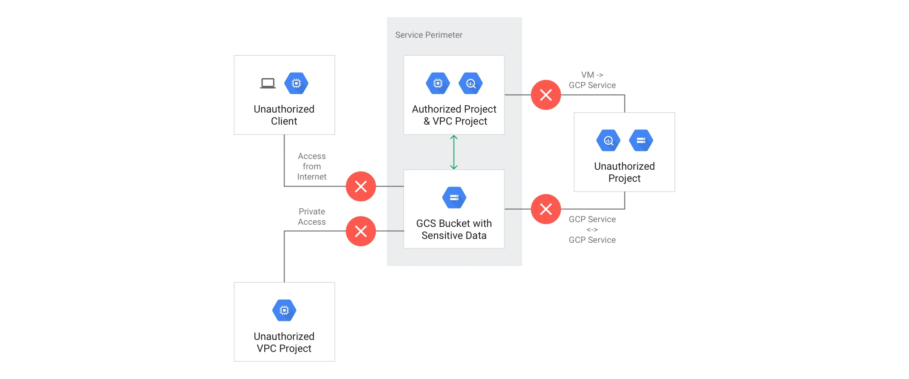
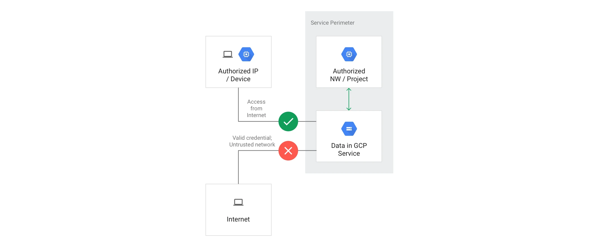
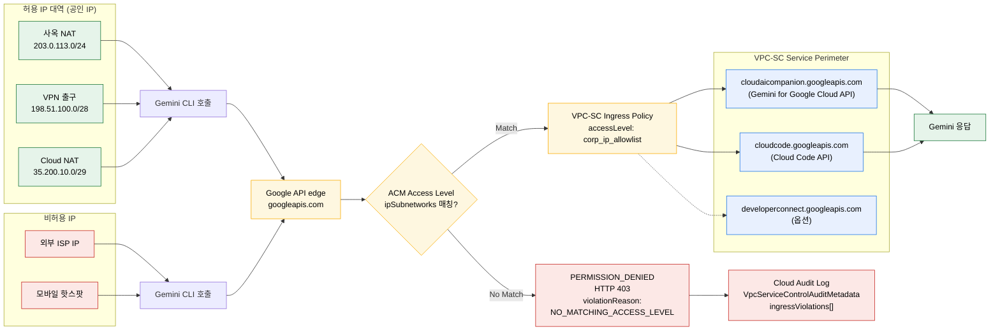

## 개요

Gemini CLI를 **허용된 공인 IP 대역에서만 사용하도록 제한**하는 GCP 구현 가이드입니다. Gemini CLI 자체에는 IP allowlist 옵션이 없지만, GCP 표준 데이터 보안 통제인 **VPC Service Controls(VPC-SC) + Access Context Manager(ACM) IP 기반 Access Level + Ingress Policy**를 조합하면 허용 IP 대역 외에서의 Gemini 백엔드 호출을 차단할 수 있습니다.

본 문서는 배경 개념, 통제 지점, 권장 아키텍처, gcloud/REST 기반 단계별 구성, 콘솔과 CLI 기반 dry-run 검증 방법까지 다룹니다.

---

## 0. 배경: VPC Service Controls와 Access Context Manager

### 0.1 개념 요약

- **VPC Service Controls (VPC-SC)**: Google Cloud 관리형 서비스(BigQuery, Cloud Storage, Gemini API 등) 주위에 **데이터 경계선**(service perimeter)을 둘러, 경계 밖에서 오는 호출을 막아 **데이터 유출을 차단하는 방화벽 성격의 통제**입니다. IAM(권한)과는 별개의 독립 레이어로 동작합니다.
- **Access Context Manager (ACM)**: "이 요청이 경계를 통과해도 되는가?"를 판정할 때 쓰는 **조건**(Access Level)을 정의해 두는 정책 저장소입니다. **IP, 디바이스, 사용자 신원** 같은 컨텍스트가 조건으로 들어갑니다. ACM 자체는 시행(enforcement)을 하지 않고, **VPC-SC 같은 시행 지점이 ACM에 정의된 Access Level을 불러다 평가**합니다.
- **역할 분리**: ACM은 규칙을 정의하고, VPC-SC는 그 규칙을 평가해 실제 요청을 허용/거부합니다. ACM에 Access Level만 만들어두는 것으로는 아무 효과가 없으며, VPC-SC perimeter의 ingress/egress policy가 그 Access Level을 참조해야 비로소 시행됩니다.

### 0.2 VPC Service Controls가 해결하는 문제

Google Cloud 공식 문서가 정리하는 4가지 위협 시나리오:

- **자격증명 탈취(credential theft)**: OAuth 토큰이나 서비스 계정 키가 유출돼도, 허용된 네트워크 밖에서는 API 호출이 거부됩니다.
- **내부자 위협(insider threat)**: 경계 내부 리소스에서 외부로 데이터를 빼돌리는 서비스 호출 자체를 차단합니다.
- **IAM 오설정(misconfigured IAM)**: IAM 권한이 실수로 과하게 부여돼도 네트워크 컨텍스트가 틀리면 거부됩니다. 두 번째 방어선 역할입니다.
- **데이터 반출(data exfiltration)**: ingress/egress 규칙으로 경계를 넘나드는 데이터 흐름을 명시적으로 제어합니다.



*그림: 프로젝트들을 하나의 service perimeter로 감싸, 내부 서비스 간 통신은 자유롭게 허용하고 외부로부터의 호출은 통제하는 VPC-SC 기본 구조입니다. (출처: Google Cloud 공식 문서, VPC Service Controls overview)*

### 0.3 Access Context Manager와 Access Level

- **Access Policy**: 조직(organization) 단위 정책 컨테이너입니다. 이 안에 여러 개의 **Access Level**을 담습니다.
- **Access Level 종류**
  - *Basic*: 여러 조건을 `AND`/`OR`로 조합하는 일반 형태입니다.
  - *Custom*: CEL(Common Expression Language) 표현식으로 복잡한 조건을 기술하는 고급 형태입니다.
- **조건 예시**: `ipSubnetworks`(공인 IP CIDR), `members`(사용자와 서비스 계정), `devicePolicy`(회사 관리 디바이스, OS, 스크린락 등), `requiredAccessLevels`(다른 Access Level과의 계층 조합).
- **적용 경로**: 4절에서 만드는 `corp_ip_allowlist`가 IP 조건을 담은 Access Level이며, Step 3의 Ingress Policy가 이 Access Level을 VPC-SC perimeter에서 참조해 시행합니다.

### 0.4 이 문서 시나리오에서의 동작



*그림: 외부 네트워크(인터넷)에서 Google API edge로 들어오는 호출은 source IP가 Access Level의 `ipSubnetworks`와 일치해야만 perimeter 내부 서비스(Gemini API 등)에 도달합니다. 미일치 시 `NO_MATCHING_ACCESS_LEVEL`로 거부됩니다. (출처: Google Cloud 공식 문서, VPC Service Controls overview)*

본 가이드 구성요소와 공식 개념도의 매핑:

| 공식 개념도 요소 | 본 가이드에서의 실제 값 |
|---|---|
| Service Perimeter | 대상 프로젝트를 감싸는 VPC-SC perimeter |
| Restricted services | `cloudaicompanion.googleapis.com`, `cloudcode.googleapis.com` |
| Access Level | `corp_ip_allowlist` (ACM에 정의) |
| `ipSubnetworks` 허용 대역 | 사옥 NAT, VPN 출구, Cloud NAT의 **공인 IP CIDR** |
| 미일치 시 반환 | HTTP 403, `PERMISSION_DENIED`, `violationReason=NO_MATCHING_ACCESS_LEVEL` |

### 0.5 용어 정리

- **Service Perimeter**: 하나 이상의 프로젝트를 감싸는 데이터 경계입니다. 내부끼리는 자유롭게 통신하고, 경계를 넘는 통신은 규칙으로 통제합니다.
- **Restricted services**: perimeter가 보호할 Google API 목록입니다 (예: `cloudaicompanion.googleapis.com`). 여기 등록된 API만 VPC-SC 평가 대상이 됩니다.
- **Access Level**: "통과 조건"을 기술하는 ACM 객체입니다. 본 문서에서는 IP 기반 단일 조건입니다.
- **Ingress policy**: 경계 **외부 → 내부**로 들어오는 호출을 허용하는 규칙입니다. 어떤 identity가 어떤 Access Level을 만족할 때 어떤 service를 호출할 수 있는지 명시합니다.
- **Egress policy**: 경계 **내부 → 외부**로 나가는 호출 규칙입니다 (이 문서 범위 밖).
- **Dry-run**: 실제로 차단하지 않고 **로그만 남겨 영향을 관찰**하는 시뮬레이션 모드입니다. 운영 적용 전 필수 단계입니다.
- **Policy Denied Audit Log**: VPC-SC 위반 내역이 기록되는 `cloudaudit.googleapis.com/policy` 로그입니다. 별도 활성화 없이 자동으로 기록되며, **프로젝트 스코프**에 저장됩니다.

---

## 1. Gemini CLI가 호출하는 API와 통제 지점

| 콘솔에 표시되는 서비스명 | API 서비스 식별자 | VPC-SC 지원 | 비고 |
|---|---|---|---|
| Gemini for Google Cloud API | `cloudaicompanion.googleapis.com` | **지원** | Gemini 백엔드 공통, IDE/CLI가 주로 호출 |
| Cloud Code API (Gemini Code Assist IDE 백엔드) | `cloudcode.googleapis.com` | **지원** | VS Code/JetBrains Gemini Code Assist 플러그인이 사용 |
| Gemini Code Assist PA 백엔드 | `cloudcode-pa.googleapis.com` | **미지원** (VPC-SC에 추가 시 400 `INVALID_ARGUMENT`) | 비공개 "PA" 경로. 사내 프록시/방화벽 차단 또는 `X-GeminiCodeAssist-Allowed-Domains` 헤더 주입으로만 통제 가능 |
| Developer Connect API | `developerconnect.googleapis.com` | 지원 | 코드 커스터마이즈 사용 시에만 |

VPC-SC perimeter의 **Restricted services**에 지원되는 항목만 추가할 수 있습니다. `cloudcode-pa`는 `Service 'cloudcode-pa.googleapis.com' is not supported by VPC Service Controls` 오류로 거부됩니다.

> [!IMPORTANT]
> **VPC-SC는 Google API edge에서 source IP를 평가합니다.**
> 즉, Access Level의 `ipSubnetworks`에는 **공인 IP CIDR**(사옥 NAT, VPN 출구, Cloud NAT)을 등록해야 합니다. 사설 IP를 넣으면 매칭되지 않습니다.

---

## 2. 권장 아키텍처

허용/비허용 IP에서 출발한 호출이 Google API edge → ACM Access Level 평가 → VPC-SC Ingress Policy → perimeter 내부 서비스로 이어지는 경로를 다음 다이어그램에 정리합니다.



> [!NOTE]
> 이 다이어그램은 [Mermaid Live 편집기](https://l.mermaid.ai/lT8xjj)에서도 확인할 수 있습니다.

---

## 3. 사전 준비

1. **Organization Admin / Access Context Manager Admin** 권한을 확보합니다.
2. Access Policy ID 확인 방법은 아래 둘 중 하나입니다:
   ```bash
   # (a) 로그인된 gcloud CLI가 있는 환경
   gcloud access-context-manager policies list \
     --organization=ORG_ID \
     --format="value(name)"
   # 출력 예: 123456789012  (이 값이 POLICY_ID)
   ```
   ```bash
   # (b) ADC만 있는 환경, REST
   TOKEN=$(gcloud auth application-default print-access-token)
   curl -sS -H "Authorization: Bearer $TOKEN" \
        -H "x-goog-user-project: YOUR_PROJECT" \
     "https://accesscontextmanager.googleapis.com/v1/accessPolicies?parent=organizations/ORG_ID" \
   | jq -r ".accessPolicies[].name"
   # 출력 예: accessPolicies/<POLICY_NUMBER>
   ```
3. 대상 프로젝트(들)에서 `cloudaicompanion.googleapis.com`, `cloudcode.googleapis.com` 활성화를 확인합니다:
   ```bash
   # REST (ADC)
   curl -sS -H "Authorization: Bearer $TOKEN" \
        -H "x-goog-user-project: YOUR_PROJECT" \
     "https://serviceusage.googleapis.com/v1/projects/YOUR_PROJECT/services/cloudaicompanion.googleapis.com" \
   | jq ".state"     # "ENABLED" 기대
   ```
   > [!NOTE]
   > `cloudcode.googleapis.com`은 비공개 서비스라 `serviceusage` get이 403 `Permission denied to get service`로 돌아올 수 있습니다. perimeter PATCH가 통과하면 실사용이 가능합니다.
4. 허용할 공인 IP 대역(CIDR)을 확정합니다.

---

## 4. 구성 단계

### Step 1. IP 기반 Access Level 생성

`corp-ip.yaml`:
```yaml
- ipSubnetworks:
    - 203.0.113.0/24      # 본사 인터넷 게이트웨이 공인 IP
    - 198.51.100.0/28     # VPN 출구 공인 IP
    - 35.200.10.0/29      # Cloud NAT 공인 IP
```

```bash
# (a) 로그인된 gcloud CLI가 있는 환경
gcloud access-context-manager levels create corp_ip_allowlist \
  --title="Corp IP Allowlist for Gemini" \
  --basic-level-spec=corp-ip.yaml \
  --combine-function=OR \
  --policy=POLICY_ID
```
```bash
# (b) ADC만 있는 환경, REST
curl -sS -X POST \
  -H "Authorization: Bearer $TOKEN" \
  -H "x-goog-user-project: YOUR_PROJECT" \
  -H "Content-Type: application/json" \
  --data '{
    "name": "accessPolicies/POLICY_ID/accessLevels/corp_ip_allowlist",
    "title": "Corp IP Allowlist for Gemini",
    "basic": {
      "conditions": [
        { "ipSubnetworks": ["203.0.113.0/24","198.51.100.0/28","35.200.10.0/29"] }
      ],
      "combiningFunction": "OR"
    }
  }' \
  "https://accesscontextmanager.googleapis.com/v1/accessPolicies/POLICY_ID/accessLevels"
# 응답: operations/... (LRO). done:true로 수 초 내 완료.
```

(공식 문서: *Create a basic access level*)

### Step 2. Service Perimeter 생성 또는 수정 (Dry-run 우선)

기존 perimeter가 있으면 dry-run 구성에 Gemini API를 추가합니다:

```bash
gcloud access-context-manager perimeters dry-run update PERIMETER_NAME \
  --add-restricted-services=cloudaicompanion.googleapis.com,cloudcode.googleapis.com \
  --add-resources=projects/PROJECT_NUMBER \
  --policy=POLICY_ID
```

> [!WARNING]
> `cloudcode-pa.googleapis.com`은 VPC-SC 미지원 서비스이므로 `--add-restricted-services`에 넣으면 `Service 'cloudcode-pa.googleapis.com' is not supported by VPC Service Controls` (400 `INVALID_ARGUMENT`)로 거부됩니다. Gemini Code Assist IDE 백엔드 보호는 `cloudcode.googleapis.com`만으로 충족되며, `cloudcode-pa`는 사내 프록시에서 도메인 차단으로 별도 통제합니다.

신규 perimeter라면 dry-run으로 먼저 생성 후 enforce 단계로 승격합니다.

**ADC만 있는 환경의 REST 대안:**
```bash
TOKEN=$(gcloud auth application-default print-access-token)
POLICY_ID=YOUR_POLICY_ID
PERI=YOUR_PERIMETER_NAME
PROJECT=YOUR_PROJECT

curl -sS -X PATCH \
  -H "Authorization: Bearer $TOKEN" \
  -H "x-goog-user-project: $PROJECT" \
  -H "Content-Type: application/json" \
  --data '{"useExplicitDryRunSpec":true,"spec":{"restrictedServices":["cloudaicompanion.googleapis.com","cloudcode.googleapis.com"]}}' \
  "https://accesscontextmanager.googleapis.com/v1/accessPolicies/$POLICY_ID/servicePerimeters/$PERI?updateMask=spec.restrictedServices,useExplicitDryRunSpec"
```
응답은 LRO(`operations/.../update/<ID>`)입니다. `done: true` 확인 후 약 30초 내 전파가 완료됩니다.

> [!NOTE]
> `updateMask`에 `useExplicitDryRunSpec`을 반드시 포함해야 합니다. 생략 시 `Service Perimeter '' has a 'spec' but does not have dry-run enabled` 400 오류가 발생합니다.
>
> `restrictedServices`는 **전체 치환**이므로 기존에 등록된 다른 서비스를 유지하려면 해당 목록도 모두 포함해 전달해야 합니다.

### Step 3. Ingress Policy로 IP Access Level 바인딩

`ingress.yaml`:
```yaml
- ingressFrom:
    identityType: ANY_IDENTITY   # 운영 환경에서는 identities 필드로 특정 user/SA를 지정해 좁히는 것을 권장
    sources:
      - accessLevel: accessPolicies/POLICY_ID/accessLevels/corp_ip_allowlist
  ingressTo:
    operations:
      - serviceName: cloudaicompanion.googleapis.com
        methodSelectors:
          - method: "*"
      - serviceName: cloudcode.googleapis.com
        methodSelectors:
          - method: "*"
    resources:
      - "*"
```

```bash
gcloud access-context-manager perimeters dry-run update PERIMETER_NAME \
  --set-ingress-policies=ingress.yaml \
  --policy=POLICY_ID
```

(공식 문서: *Configuring ingress and egress policies*)

`ingressFrom`의 주체 지정은 **`identityType` 필드와 `identities` 필드가 서로 배타적**입니다:
- `identityType`: 값 `ANY_IDENTITY`(미인증 포함) / `ANY_USER_ACCOUNT`(인증된 사용자) / `ANY_SERVICE_ACCOUNT`(서비스 계정) 중 하나입니다. 넓은 범주를 열 때 사용합니다.
- `identities`: 구체 principal 리스트입니다. 예: `user:alice@example.com`, `serviceAccount:sa@proj.iam.gserviceaccount.com`, `group:team@example.com`. `ANY_IDENTITY` 같은 토큰은 여기 넣으면 `INVALID_ARGUMENT: Unsupported IAM principal` 오류가 발생합니다.

### Step 4. Dry-run 단계에서 영향 평가 (최소 1~2주 권장)

비허용 IP에서 들어오는 호출이 dry-run violation으로 **Policy Denied Audit Logs**에 기록됩니다(차단되지 않음).

**중요: 로그 스코프**
- VPC-SC 위반 로그는 `cloudaudit.googleapis.com/policy` 전용 log에 기록되며 **기본적으로 대상 리소스 프로젝트에 저장**됩니다. 조직 수준으로 자동 집계되지 **않습니다**.
- 조직 전역 조회가 필요하면 org-level **Aggregated Log Sink**를 구성해 별도 BigQuery/Cloud Logging bucket으로 라우팅해야 합니다.
- Policy Denied Audit Logs는 **조직/프로젝트에서 별도 활성화 없이 항상 자동으로 기록**됩니다(Admin Activity와 유사).

Logs Explorer 쿼리 (반드시 대상 프로젝트 스코프로 열고, `logName` 포함):
```
logName="projects/PROJECT_ID/logs/cloudaudit.googleapis.com%2Fpolicy"
protoPayload.metadata."@type"="type.googleapis.com/google.cloud.audit.VpcServiceControlAuditMetadata"
protoPayload.metadata.dryRun="true"
protoPayload.serviceName=("cloudaicompanion.googleapis.com" OR "cloudcode.googleapis.com")
```

`violationReason`이 `NO_MATCHING_ACCESS_LEVEL`이면 IP 정책으로 막힐 호출입니다. 필요 시 `ipSubnetworks`를 보강합니다.

**특정 위반 1건을 정확히 핀포인트하려면 troubleshoot token을 사용합니다:**
차단된 호출의 응답 본문/에러 메시지에 포함된 `vpcServiceControlsUniqueIdentifier`(예: `SK3RSYCc83HGtX0P8hVzz...`)를 아래 필터로 조회합니다:
```
protoPayload.metadata.vpcServiceControlsUniqueId="<UNIQUE_ID>"
```
이 방법은 log scope, 시간 범위, log name을 몰라도 해당 로그 1건을 즉시 찾아줍니다.

### Step 5. Enforce 전환

```bash
gcloud access-context-manager perimeters dry-run enforce PERIMETER_NAME \
  --policy=POLICY_ID
```

이 시점부터 비허용 IP에서의 Gemini 호출은 실제로 차단됩니다.

---

## 5. 검증 (실제 테스트 절차)

### 5.1 허용 IP 검증
- 사옥 네트워크의 PC에서 `gemini` CLI 정상 호출 → 응답 정상입니다.
- GCE 인스턴스(Cloud NAT 경유)에서 `gemini` CLI 정상 호출 → 응답 정상입니다.

### 5.2 비허용 IP 검증
- 외부 망(모바일 핫스팟, 집 인터넷 등)에서 동일 사용자 계정으로 `gemini`를 실행합니다.
- 기대 결과: HTTP 403, 메시지 `"Request is prohibited by organization's policy"` (status code 7 = PERMISSION_DENIED).

### 5.3 Audit Log로 차단 사실 확인 (Logs Explorer)

**Logs Explorer 필수 설정:**
- **스코프**: 조직 스코프가 아닌 **대상 프로젝트 스코프**로 열어야 합니다 (Policy Denied 로그는 프로젝트 단위로 기록됨).
- **시간 범위**: dry-run violation 발생 시각을 포함하는 범위로 조정합니다(기본 "Last 1 hour" 부족 시 확장).

쿼리:
```
logName="projects/PROJECT_ID/logs/cloudaudit.googleapis.com%2Fpolicy"
protoPayload.metadata."@type"="type.googleapis.com/google.cloud.audit.VpcServiceControlAuditMetadata"
protoPayload.metadata.violationReason="NO_MATCHING_ACCESS_LEVEL"
protoPayload.serviceName="cloudaicompanion.googleapis.com"
severity="ERROR"
```

> [!NOTE]
> dry-run / enforce 구분 없이 severity는 모두 `ERROR`입니다. dry-run 여부는 `protoPayload.metadata.dryRun` 필드로 판별합니다.

`protoPayload.metadata.ingressViolations[]`에서 `targetResource`, `targetResourcePermissions`, `servicePerimeter`를 확인할 수 있습니다. 예시:
```json
"ingressViolations": [{
  "servicePerimeter": "accessPolicies/<POLICY_NUMBER>/servicePerimeters/<PERIMETER_NAME>",
  "targetResource": "projects/<PROJECT_NUMBER>",
  "targetResourcePermissions": ["cloudaicompanion.locations.list"]
}]
```

### 5.4 회귀 테스트 체크리스트

- [ ] 허용 IP 환경(사옥 네트워크, 회사 VPN, Cloud NAT 경유 GCE 등)에서 Gemini CLI 사용 가능
- [ ] 비허용 IP 환경(VPN 미연결 외부망, 모바일 핫스팟 등)에서 Gemini CLI 차단 + Audit log 기록
- [ ] CI/CD 파이프라인(Cloud Build, GitHub Actions self-hosted runner)에서 Gemini 호출 시 사용 IP가 allowlist에 포함됨
- [ ] 동일 perimeter에 묶인 다른 프로젝트 자원 호출 영향 평가 완료

---

## 6. 주의사항 / 한계

1. **Dry-run 필수**: 운영 환경에 enforce를 바로 적용하면 누락된 NAT IP, 외부 SaaS의 호출 등이 한꺼번에 차단되어 장애를 일으킵니다. 항상 dry-run → 로그 분석 → enforce 순서입니다.
2. **NAT 공인 IP는 고정으로 운영**: Cloud NAT는 *Manual NAT IP allocation*으로 정적 IP를 묶어두고, 사옥/VPN은 ISP 동적 IP를 피해야 합니다.
3. **Endpoint 추가 가능성**: Gemini CLI/Code Assist는 기능 확장에 따라 endpoint가 추가될 수 있으므로 GCP 릴리즈 노트와 *Configure VPC Service Controls for Gemini* 문서를 정기적으로 모니터링합니다.
4. **`cloudcode-pa.googleapis.com`는 VPC-SC로 차단 불가**: `--add-restricted-services=cloudcode-pa.googleapis.com` 시 `Service 'cloudcode-pa.googleapis.com' is not supported by VPC Service Controls` (400 `INVALID_ARGUMENT`) 오류가 반환됩니다. Gemini Code Assist IDE 확장의 일부 PA 트래픽과 개인 Google 계정 기반 무료 모드 트래픽이 이 경로를 사용할 수 있으므로, **사내 프록시/방화벽에서 `cloudcode-pa.googleapis.com` 도메인 자체를 차단**하거나 **`X-GeminiCodeAssist-Allowed-Domains` 헤더 주입**(*Control Network Access to Gemini Code Assist*)을 VPC-SC와 병행해야 완전한 통제가 됩니다. VPC-SC 지원 `cloudcode.googleapis.com`은 Step 2에 포함시켜 IDE 표준 트래픽은 차단할 수 있습니다.
5. **Policy Denied Audit Logs는 프로젝트 스코프**: VPC-SC violation 로그는 대상 리소스 프로젝트의 `cloudaudit.googleapis.com/policy` 로그에 기록되며, **조직 스코프 Logs Explorer에서는 기본 보이지 않습니다.** 조직 전역 모니터링이 필요하면 org-level **Aggregated Log Sink**를 구성해 BigQuery/Logging bucket으로 라우팅하세요. 운영 가이드에 반드시 "프로젝트 스코프로 Logs Explorer 열기 + `logName` 필터 사용"을 명시하세요. Policy Denied 로그는 별도 활성화 없이 자동 기록됩니다.
6. **인증 강화 권장**: IP만으로는 단일 통제이므로 ingress policy의 `ingressFrom`에 `identityType: ANY_USER_ACCOUNT`(인증된 사용자로 한정) + 회사 도메인 조건을 결합하거나, `identities`에 특정 사용자, 그룹, 서비스 계정(예: `group:secops@example.com`)만 나열해 주체를 좁히는 구성을 권장합니다. `identityType`과 `identities`는 배타적이므로 둘 중 하나만 사용합니다.
7. **VPC-SC 비용/한계**: VPC-SC는 무료지만 perimeter당/조직당 한도가 있으므로 *VPC Service Controls quotas* 확인이 필요합니다.

---

## 7. 참고 (공식 문서)

- [Configure VPC Service Controls for Gemini](https://cloud.google.com/gemini/docs/configure-vpc-service-controls)
- [Configure VPC Service Controls for Gemini Code Assist](https://developers.google.com/gemini-code-assist/docs/configure-vpc-service-controls)
- [Create a basic access level (Access Context Manager)](https://cloud.google.com/access-context-manager/docs/create-basic-access-level)
- [Context-aware access with ingress rules (VPC-SC)](https://cloud.google.com/vpc-service-controls/docs/context-aware-access)
- [Configuring ingress and egress policies](https://cloud.google.com/vpc-service-controls/docs/configuring-ingress-egress-policies)
- [Dry run mode for service perimeters](https://cloud.google.com/vpc-service-controls/docs/dry-run-mode)
- [VPC Service Controls troubleshooting (Audit log violationReason)](https://cloud.google.com/vpc-service-controls/docs/troubleshooting)
- [Control Network Access to Gemini Code Assist (도메인 헤더)](https://developers.google.com/gemini-code-assist/docs/network-access)
