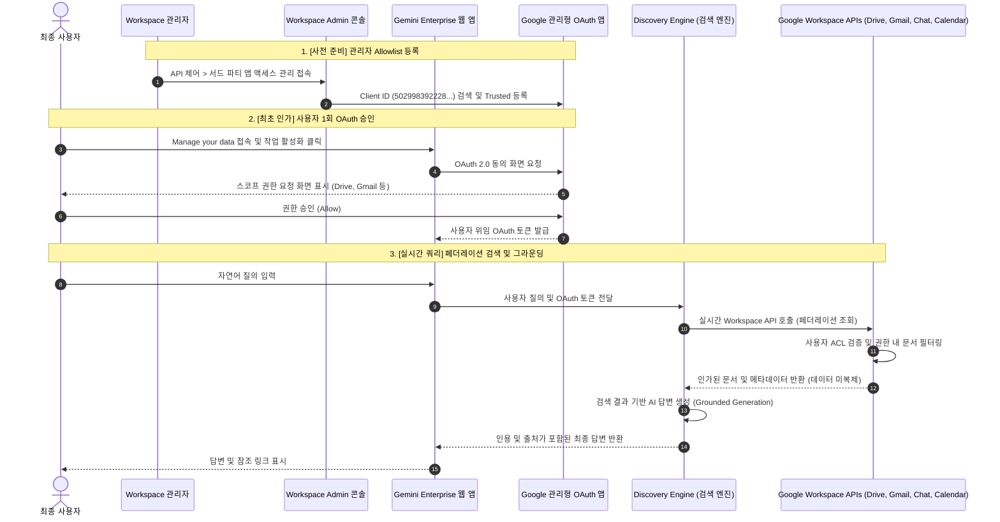
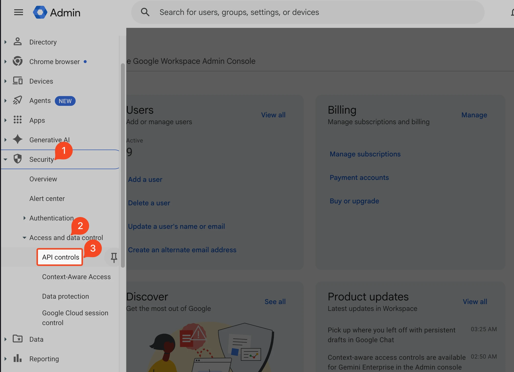
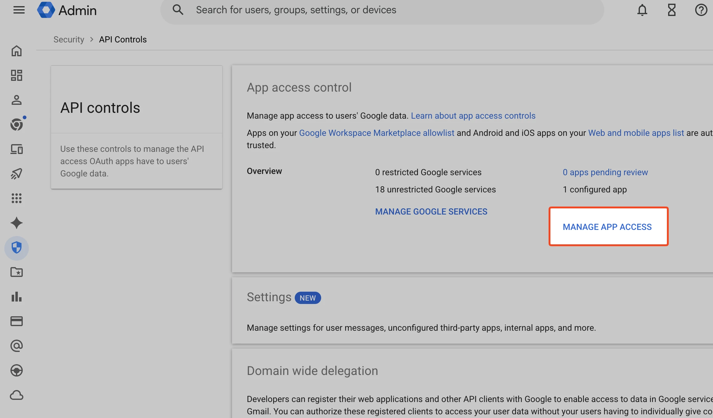
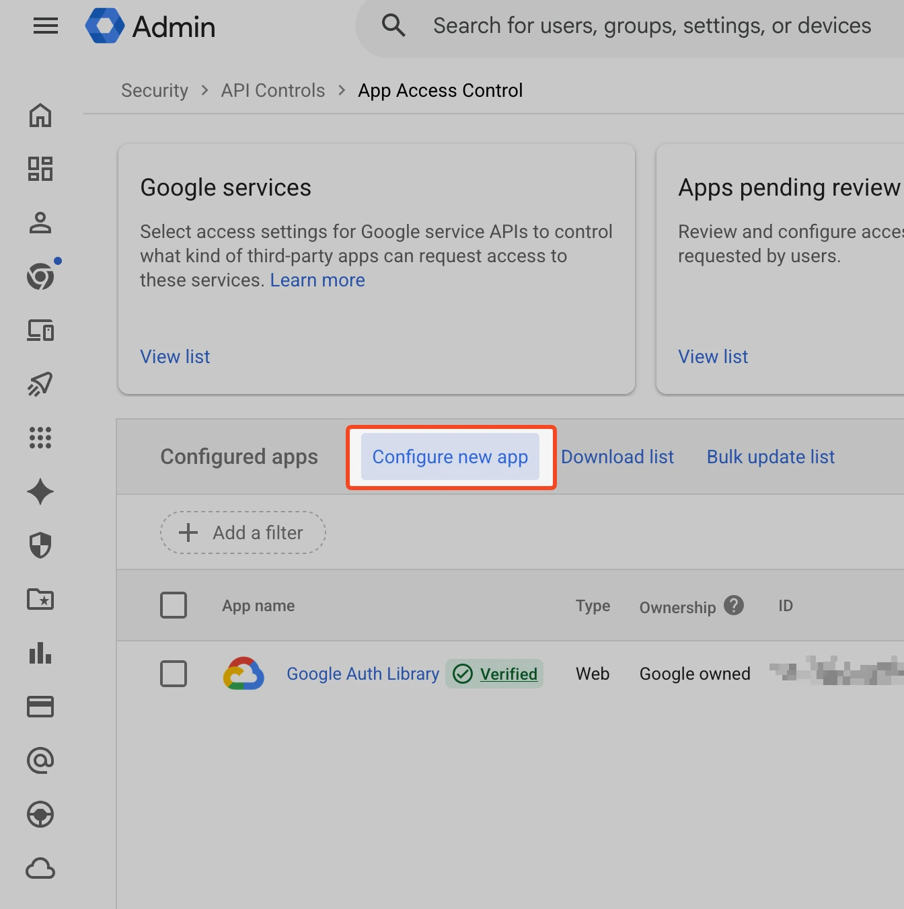
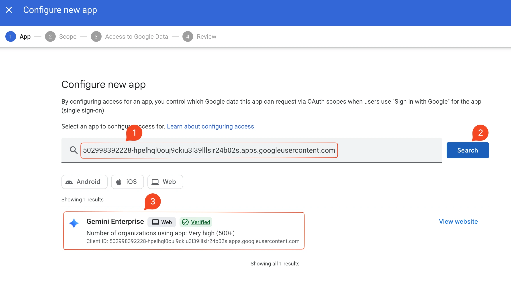
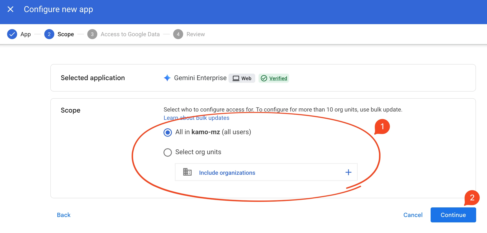
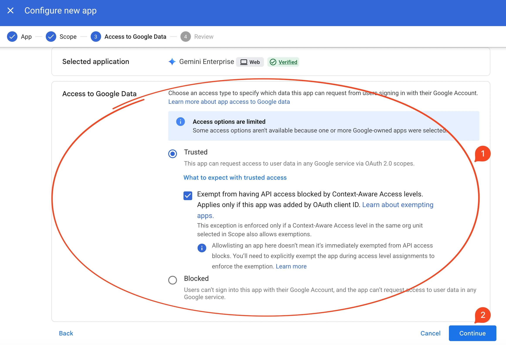
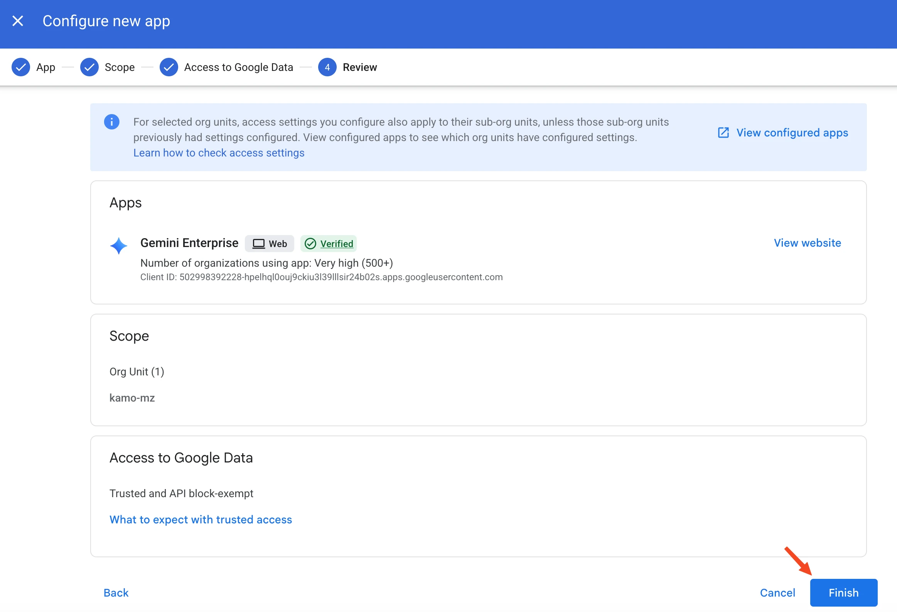
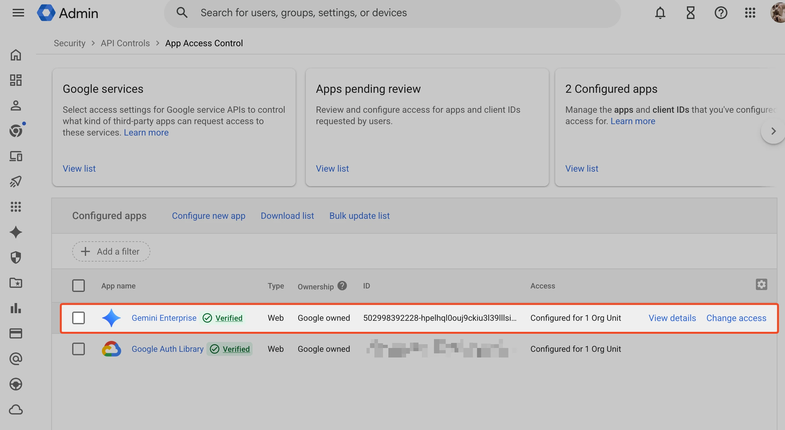

> [!NOTE]
> **대상 독자 및 목적:** Google Cloud 상에서 Gemini Enterprise(Discovery Engine 기반 엔터프라이즈 검색 및 AI 어시스턴트)를 구축 및 운영하는 클라우드 아키텍트, Google Workspace 관리자, 엔터프라이즈 보안 담당자를 대상으로 합니다. Google Workspace 주요 데이터 소스(Drive, Gmail, Chat, Calendar)를 안전하게 연동하기 위한 **Google 관리형 OAuth 앱**(Google-managed OAuth App)의 관리자 사전 승인(Allowlist), 데이터 스토어 구성, 사용자 인가, 보안 거버넌스 및 장애 해결 방안을 실무 중심으로 다룹니다.

## Executive Summary

Gemini Enterprise와 Google Workspace의 데이터 연동 아키텍처는 자격증명 관리 부담과 보안 위험을 해소하기 위해 **Google 관리형 OAuth 앱(Google-managed OAuth App)** 모델로 전면 전환되었습니다.

과거 고객 관리형 방식에서는 관리자가 개별 Workspace API를 수동 활성화하고, Client ID와 Secret을 생성하여 데이터 스토어에 직접 입력해야 했습니다. 이는 자격증명 유출 위험과 설정 오류로 인한 운영 비용을 수반했습니다.

최신 관리형 아키텍처의 핵심 변화는 다음과 같습니다:

- **단일 관리형 클라이언트 도입:** Google이 직접 소유하고 검증한 단일 공식 OAuth Client ID를 통해 Drive, Gmail, Chat, Calendar 커넥터 인증이 표준화되었습니다.
- **실시간 데이터 페더레이션 및 ACL 준수:** Workspace 데이터는 Gemini Enterprise 인덱스로 복제되지 않고 실시간 조회되며, 최종 사용자가 보유한 기존 접근 제어 목록(ACL) 범위 내에서만 문서가 검색됩니다.
- **관리자 사전 승인(Allowlist) 의무화:** 보안 정책이 적용된 도메인의 경우, Workspace 최고 관리자가 Admin 콘솔에서 해당 공식 Client ID를 **신뢰할 수 있음(Trusted)** 으로 등록해야 합니다.

## 핵심 아키텍처 및 인증 모델

### 인증 모델 비교: 고객 관리형 vs Google 관리형

Google Cloud는 운영 오버헤드를 최소화하고 보안 거버넌스를 강화하기 위해 신규 데이터 스토어 생성 시 Google 관리형 OAuth 앱을 기본 적용합니다.

| 비교 항목 | 기존 고객 관리형 (Customer-managed) | 최신 Google 관리형 (Google-managed) |
| :--- | :--- | :--- |
| **적용 대상** | 유지 중인 기존 레거시 데이터 스토어 | 새로 생성되는 모든 Workspace 데이터 스토어 |
| **OAuth 앱 소유권** | 고객 Google Cloud 프로젝트 소유 | Google 직접 소유 및 검증 (`Google owned`, `Verified`) |
| **API 직접 활성화** | 고객 프로젝트 내 Drive, Gmail 등 개별 활성화 필수 | 고객 프로젝트 내 개별 API 활성화 불필요 |
| **자격증명 관리** | Client ID 및 Secret 수동 생성 및 입력 | 자격증명 입력 불필요 (보안 노출 위험 원천 차단) |
| **동의 화면 구성** | 고객이 브랜딩, 지원 이메일, 스코프 직접 구성 | Google 관리형 표준 화면 자동 적용 |
| **Admin 승인 절차** | 고객 앱에 대한 도메인 전체 위임 또는 개별 승인 | 공식 Client ID를 Admin 콘솔 허용 목록에 등록 |

> [!NOTE]
> 기존에 고객 관리형 OAuth 앱으로 생성된 데이터 스토어는 계속 동작합니다. 다만 신규 데이터 스토어를 생성할 때는 사용자 지정 자격증명 입력 필드가 제공되지 않으며 Google 관리형 앱이 강제 적용됩니다.

### 공식 OAuth 클라이언트 정보

Google Workspace Admin 콘솔에서 허용 목록 등록 시 식별자로 사용하는 공식 정보입니다:

- **애플리케이션 명칭:** `Gemini Enterprise` (플랫폼: `Web`, 상태: `Verified`)
- **공식 Client ID:** `502998392228-hpelhql0ouj9ckiu3l39lllsir24b02s.apps.googleusercontent.com`
- **권장 접근 수준:** `Trusted` (신뢰할 수 있음)
- **리디렉션 URI (참고):** `https://vertexaisearch.cloud.google.com/oauth-redirect`

### 엔드투엔드 인증 및 데이터 흐름

전체 연동 라이프사이클은 관리자 사전 승인, 사용자 1회 위임 인가, 그리고 실시간 페더레이션 쿼리의 3단계로 동작합니다.



## 필수 사전 요구사항

커넥터 생성 전 충족해야 하는 테넌트, 인증, 정책 및 권한 요구사항입니다.

| 구분 | 필수 요건 | 세부 내용 |
| :--- | :--- | :--- |
| **계정 및 테넌트** | 동일 도메인 계정 | Cloud 콘솔 작업자와 Workspace 인스턴스의 사용자 테넌트(Customer ID)가 일치해야 합니다 (`@gmail.com` 개인 계정 불가). |
| **인증 제공업체** | Google Identity 필수 | Gemini Enterprise의 인증 제공업체는 Google Identity로 구성되어야 합니다 (제3자 IdP 사용 시에도 계정 동기화 필요). |
| **Workspace 정책** | 스마트 기능 활성화 | 도메인 관리 설정에서 'Google Workspace 스마트 기능' 및 '기타 Google 제품의 스마트 기능'이 모두 활성화되어 있어야 합니다. |
| **IAM 권한** | 최소 권한 할당 | 관리자(데이터 스토어 생성): `roles/discoveryengine.editor` / 최종 사용자(웹 앱 질의): `roles/discoveryengine.agentspaceUser` |

> [!CAUTION]
> 운영 중인 Gemini Enterprise 환경에서 Identity Provider 설정을 변경하면 기존 사용자의 대화 기록(Chat History)이 유실됩니다. 대화 이력은 IdP 고유 식별자에 바인딩되므로 운영 중 IdP 교체는 지양해야 합니다.

## Google Workspace Admin 콘솔: 관리형 OAuth 앱 등록 절차

Workspace 최고 관리자가 공식 Client ID를 허용 목록에 등록하는 3단계 실무 절차입니다.

### 1. 앱 액세스 제어 메뉴 진입

1. [Google 관리 콘솔(Admin console)](https://admin.google.com)에 로그인합니다.
2. 좌측 메뉴에서 **보안(Security)** > **액세스 및 데이터 제어(Access and data control)** > **API 제어(API controls)** 메뉴로 이동합니다.
3. 상단 **앱 액세스 제어(App access control)** 섹션에서 **서드 파티 앱 액세스 관리(MANAGE APP ACCESS)** 버튼을 클릭합니다.
4. **새 앱 구성(Configure new app)** 드롭다운에서 **OAuth 앱 이름 또는 클라이언트 ID(OAuth App Name Or Client ID)** 항목을 선택합니다.







### 2. 클라이언트 ID 검색 및 대상 조직 범위 지정

1. 검색창에 Gemini Enterprise 전용 공식 Client ID를 입력하고 **Search(검색)** 버튼을 클릭합니다:
   ```text
   502998392228-hpelhql0ouj9ckiu3l39lllsir24b02s.apps.googleusercontent.com
   ```
2. 검색 결과에 표시되는 `Gemini Enterprise` (`Web`, `Verified`) 항목에서 **선택(Select)** 버튼을 클릭합니다.
3. 적용할 조직 단위(OU)를 지정합니다 (전체 조직 또는 특정 부서 단위). 지정 후 **계속(Continue)** 버튼을 클릭합니다.





### 3. 신뢰 권한 부여 및 구성 완료

1. 데이터 액세스 수준에서 반드시 **신뢰할 수 있음(Trusted)** 옵션을 선택합니다.
2. 조직에 컨텍스트 인식 액세스(CAA) 정책이 적용된 경우, API 호출 차단을 방지하기 위해 **"Exempt from having API access blocked by Context-Aware Access levels"** 체크박스를 활성화합니다.
3. 설정을 최종 검토한 후 **완료(Finish)** 버튼을 클릭합니다.
4. **구성된 앱(Configured apps)** 목록에서 `Gemini Enterprise`가 `Google owned`, `Verified` 상태로 정상 등록되었는지 확인합니다.







> [!TIP]
> Admin 콘솔에서 변경한 정책은 전 세계 Google 데이터 센터에 반영되기까지 수 분에서 최대 24시간이 소요될 수 있습니다.

## 서비스별 연동 기능 및 운영 한도

Gemini Enterprise 커넥터가 지원하는 각 Workspace 서비스의 주요 동작, 권한 범위 및 시스템 제약사항입니다.

| 서비스 | 지원 상태 | 주요 지원 동작 (Actions) | 핵심 OAuth 권한 범위 (Scopes) | 주요 제약 및 용량 한도 |
| :--- | :--- | :--- | :--- | :--- |
| **Google Drive** | GA | 파일 검색 및 본문 조회, 메타데이터/권한 확인, 파일 생성/수정/복사, 공유 및 휴지통 이동 | `drive.readonly`, `drive.file`, `drive`, `drive.metadata.readonly` | 단일 파일 최대 75 MB / 텍스트 추출 최대 1 MB (PDF OCR 최대 80페이지, 50 MB) |
| **Gmail** | GA | 메일/스레드 검색, 메일 발송/답장/전달, 임시보관함 초안 생성, 라벨 및 필터 제어 | `gmail.readonly`, `gmail.send`, `gmail.compose`, `gmail.modify`, `gmail.labels`, `gmail.settings.basic` | 첨부파일 업로드 및 다운로드 단일 파일 최대 50 MB |
| **Google Chat** | Preview | 대화방/메시지 검색, 메시지 발송(Markdown 지원), 스페이스 생성, 멤버십 관리, 리액션 | `chat.spaces.readonly`, `chat.messages.readonly`, `chat.messages.create`, `chat.memberships` | 멀티턴 문맥 해석을 위해 **Gemini 3.1** 이상 모델 연동 권장 |
| **Google Calendar** | GA | 개인/공유 캘린더 일정 검색, 일정 생성/수정/삭제, 참석자 일정(Freebusy) 기반 미팅 시간 추천 | `calendar.events.readonly`, `calendar.events`, `calendar.freebusy`, `calendar` | 참석자 가용 시간 조율을 통한 최적 미팅 일정 자동 추천 지원 |

> [!NOTE]
> Google Drive 검색 인덱스는 파일 크기와 관계없이 파일당 최대 1 MB의 텍스트와 서식 데이터만 추출합니다. 1 MB를 초과하는 위치의 본문 키워드는 검색되지 않으므로 대용량 문서 운영 시 유의하십시오.

## Google Cloud 콘솔: 데이터 스토어 생성 및 앱 연결

### 1. 데이터 스토어 생성

1. Google Cloud 콘솔에서 **Gemini Enterprise** 대시보드로 이동합니다.
2. 좌측 메뉴에서 **Data stores(데이터 스토어)** 메뉴를 클릭하고 상단의 **+ Create data store(+ 데이터 스토어 만들기)** 버튼을 클릭합니다.
3. 대상 Workspace 서비스(`Google Drive`, `Gmail`, `Google Chat`, `Google Calendar`)를 선택합니다.
4. **Actions(작업) 섹션:** 사용자에게 허용할 동작 목록을 체크합니다 (추후 수정 가능).
5. **Configuration(구성) 섹션:**
   - **Multi-region:** 커넥터 리전을 선택합니다 (`global`, `us`, `eu` 중 선택).
   - **Data connector name:** 커넥터 식별 이름을 지정합니다 (1~63자의 영문 소문자, 숫자, 하이픈 조합).
   - **Encryption:** `us` 또는 `eu` 리전 선택 시 Google 관리형 키 또는 Cloud KMS 고객 관리형 키를 지정할 수 있습니다.
6. **Create(만들기)** 버튼을 클릭합니다. 백엔드 프로비저닝이 완료되면 상태가 `Active`로 전환됩니다.

### 2. Gemini Enterprise 앱 연결

1. Gemini Enterprise 좌측 메뉴에서 **Apps(앱)** 메뉴를 선택하고 대상 애플리케이션을 클릭합니다.
2. **Connected data sources(연결된 데이터 소스)** 탭으로 이동합니다.
3. **Add existing data stores(기존 데이터 스토어 추가)** 버튼을 클릭하여 생성한 데이터 스토어를 선택하고 **Connect(연결)** 버튼을 클릭합니다.

## 최종 사용자 인가(User Authorization) 절차

데이터 페더레이션 모델 특성상, 각 사용자가 최초 1회 자신의 Workspace 계정으로 데이터 접근을 승인해야 합니다.

1. 사용자가 조직에 배포된 Gemini Enterprise 웹 앱 URL에 접속합니다.
2. 좌측 하단 프로필 영역 또는 설정 메뉴에서 **데이터 관리(Manage your data)** 아이콘을 클릭합니다.
3. 연결된 Workspace 커넥터의 **작업 활성화(Enable actions)** 또는 **승인(Authorize)** 버튼을 클릭합니다.
4. Google 로그인 팝업 창에서 조직 Workspace 계정을 선택하고, 요청된 데이터 접근 권한을 확인한 뒤 **허용(Allow)** 버튼을 클릭합니다.

인가가 완료되면 커넥터 상태가 활성화되며, 이후 자연어 질의를 통한 데이터 검색 및 작업 호출이 정상 실행됩니다.

## 엔터프라이즈 보안 및 거버넌스 경계

엔터프라이즈 환경에서 데이터 거버넌스를 수립할 때 유의해야 하는 클라우드와 워크스페이스 간 경계 기준입니다.

| 거버넌스 영역 | Google Cloud (Gemini Enterprise) | Google Workspace |
| :--- | :--- | :--- |
| **데이터 레지던시** | Cloud 인프라 내 처리 및 임시 캐시 데이터에만 리전 정책(`global`, `us`, `eu`)이 적용됩니다. | 이메일, 문서, 대화 원본 데이터는 [Workspace 데이터 리전 정책](https://support.google.com/a/answer/9223653)을 따릅니다. |
| **암호화 (CMEK)** | Cloud KMS 키는 커넥터 메타데이터 및 Cloud 내 캐시에만 적용됩니다. | 원본 콘텐츠 데이터는 Workspace 고유 암호화(또는 CSE) 체계로 보호됩니다. |
| **액세스 투명성** | Google 엔지니어의 Google Cloud 리소스 접근 내역만 기록합니다. | Workspace 데이터 접근 감사 내역은 [Workspace 감사 로그](https://support.google.com/a/answer/9230979)에서 별도 수집해야 합니다. |

## 문제 해결 및 에러 매트릭스

커넥터 구성 및 쿼리 실행 중 자주 발생하는 에러 코드와 권장 조치 방안입니다.

| HTTP 상태 코드 | 에러 메시지 핵심 | 발생 원인 | 해결 방안 |
| :--- | :--- | :--- | :--- |
| **403 Forbidden** | `Search by using service account credentials isn't supported` | 서비스 계정 토큰으로 검색 API를 호출한 경우 | Workspace 커넥터는 사용자 위임(User OAuth) 페더레이션만 지원하므로 최종 사용자 자격증명으로 호출해야 합니다. |
| **403 Forbidden** | `Consumer accounts aren't supported` | `@gmail.com` 개인 계정으로 접근한 경우 | 개인 계정은 Customer ID가 없습니다. 반드시 Google Workspace 도메인 관리 계정으로 로그인하십시오. |
| **403 Forbidden** | `Customer ID mismatch for data store` | 호출자의 테넌트와 커넥터 연결 테넌트 불일치 | 동일한 Workspace 도메인 테넌트 계정으로 호출해야 합니다 (교차 테넌트 조회 불가). |
| **403 Forbidden** | `Workspace access for Agent Space disabled` | 관리자가 도메인 수준에서 접근 차단한 경우 | Workspace 관리 콘솔에서 [Agent Space 접근 정책](https://support.google.com/a/answer/16479199)을 활성화하십시오. |
| **400 Bad Request** | `Request contains an invalid argument` | 커넥터 명명 규칙 위반 | 커넥터 이름은 1~63자의 영문 소문자, 숫자, 하이픈(`-`) 조합으로 구성하고 소문자로 시작하십시오. |

## 운영 점검 체크리스트

프로덕션 배포 전 점검해야 할 핵심 6대 항목입니다:

- [ ] **Admin 콘솔 사전 승인:** Gemini Enterprise 공식 Client ID(`502998392228-...`)가 `Trusted`로 등록되었는가?
- [ ] **컨텍스트 인식 액세스(CAA) 예외:** 조직의 접근 통제 정책에 맞춰 API 차단 예외가 활성화되었는가?
- [ ] **Workspace 스마트 기능 활성화:** 도메인 내 스마트 기능 2종이 모두 켜져 있는가?
- [ ] **Identity Provider 일치성:** Gemini Enterprise 인증 제공업체가 Google Identity로 바인딩되어 있는가?
- [ ] **IAM 최소 권한 할당:** 관리자(`discoveryengine.editor`) 및 사용자(`discoveryengine.agentspaceUser`) 역할이 부여되었는가?
- [ ] **최종 사용자 인가 안내:** 사용자들에게 `Manage your data` 메뉴를 통한 1회 인증 절차가 공지되었는가?
