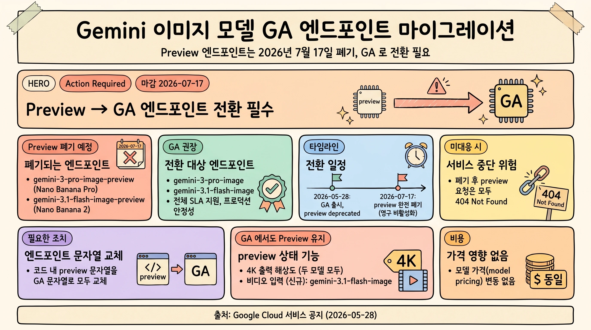

## 개요

Google Cloud 가 Gemini 이미지 생성 모델의 preview 엔드포인트 두 개를 폐기하고 GA(Generally Available) 엔드포인트로의 전환을 요청했습니다. 대상은 `gemini-3-pro-image-preview`(Nano Banana Pro) 와 `gemini-3.1-flash-image-preview`(Nano Banana 2) 이며, 두 엔드포인트는 **2026년 7월 17일** 에 완전히 폐기됩니다. 폐기 이후 해당 preview 엔드포인트로 들어오는 모든 요청은 `404 Not Found` 오류를 반환합니다.

이 문서는 해당 공지의 핵심 사실과 필요한 조치를 정리한 대응 가이드입니다. Google Cloud의 공식 서비스 공지(2026년 5월 28일 발송)를 기준으로 정리했습니다.

> [!IMPORTANT]
> **Action Required.** preview 엔드포인트는 2026년 7월 17일에 영구 비활성화됩니다. 그 전에 코드의 엔드포인트 문자열을 GA 엔드포인트로 교체해야 서비스 중단을 피할 수 있습니다.

## 무엇이 바뀌는가

### 엔드포인트 폐기 및 전환 매핑

preview 엔드포인트를 동일 모델의 GA 엔드포인트로 1:1 교체합니다. 모델 자체는 그대로이며, 호출 문자열에서 `-preview` 접미사가 제거됩니다.

| 구분 | 폐기 대상 (Preview) | 전환 대상 (GA) |
|---|---|---|
| Nano Banana Pro | `gemini-3-pro-image-preview` | `gemini-3-pro-image` |
| Nano Banana 2 | `gemini-3.1-flash-image-preview` | `gemini-3.1-flash-image` |

### GA 엔드포인트가 제공하는 것

GA 엔드포인트(`gemini-3-pro-image`, `gemini-3.1-flash-image`)는 preview 에서 제공되지 않던 다음을 제공합니다.

- **전체 SLA 지원**: 정식 서비스 수준 계약이 적용됩니다.
- **프로덕션 안정성**: 운영 환경에 적합한 안정성을 보장합니다.

> [!NOTE]
> **가격 변동 없음.** 이번 전환으로 모델 가격(model pricing)은 변경되지 않습니다.

### GA 엔드포인트에서도 preview 상태로 남는 기능

다음 기능은 GA 엔드포인트에서 사용할 수 있으나, 기능 자체는 여전히 preview 상태로 유지됩니다.

- **4K 출력 해상도**: `gemini-3.1-flash-image`와 `gemini-3-pro-image` 두 모델 모두 해당합니다.
- **비디오 입력(신규)**: `gemini-3.1-flash-image` 에서 비디오 입력을 받습니다.

## 타임라인

| 날짜 | 내용 |
|---|---|
| 2026-05-28 | GA 엔드포인트가 프로덕션 트래픽용으로 출시되고, preview 엔드포인트는 deprecated 상태로 전환됩니다. |
| 2026-07-17 | preview 엔드포인트가 완전히 폐기됩니다. 이 날짜에 preview 엔드포인트 접근이 영구 비활성화됩니다. |

서비스 중단을 피하려면 가능한 한 빨리 마이그레이션을 완료하시기 바랍니다.

## 미대응 시 영향

> [!WARNING]
> 폐기일 이전에 API 호출을 갱신하지 않으면, preview 엔드포인트로 전송되는 **모든 요청이 `404 Not Found` 오류**를 반환합니다. 이는 곧 이미지 생성 기능의 중단으로 이어집니다.

## 필요한 조치

- [ ] 코드베이스에서 preview 엔드포인트 문자열(`gemini-3-pro-image-preview`, `gemini-3.1-flash-image-preview`)을 모두 찾습니다.
- [ ] 각각을 GA 엔드포인트 문자열(`gemini-3-pro-image`, `gemini-3.1-flash-image`)로 교체합니다.
- [ ] 영향 프로젝트 전반에서 변경 사항을 검증하고 배포합니다.
- [ ] 4K 출력과 비디오 입력 등 preview 상태 기능을 사용하는 경우, 해당 기능이 계속 preview 임을 인지하고 운영 의존도를 점검합니다.

핵심 조치는 **엔드포인트 문자열 교체** 단 하나입니다. 모델과 요청 본문, 응답 형식은 동일하므로, 호출부의 모델 식별자만 정확히 바꾸면 됩니다.

Google Cloud 기록상 preview 엔드포인트를 사용한 것으로 확인된 프로젝트가 있다면, 해당 프로젝트의 코드베이스와 배포 파이프라인을 점검해 preview 엔드포인트 사용처를 모두 GA 로 전환해야 합니다.

## 참고 자료

- [gemini-3-pro-image 모델 문서](https://docs.cloud.google.com/gemini-enterprise-agent-platform/models/gemini/3-pro-image)
- [gemini-3.1-flash-image 모델 문서](https://docs.cloud.google.com/gemini-enterprise-agent-platform/models/gemini/3-1-flash-image)
- [Generate images with Gemini 문서](https://docs.cloud.google.com/gemini-enterprise-agent-platform/models/capabilities/image-generation)
- [모델 가격표](https://cloud.google.com/gemini-enterprise-agent-platform/generative-ai/pricing#standard)
- [Google Cloud Support](https://support.google.com/)

> [!TIP]
> 문의나 지원이 필요한 경우 Google Cloud Support를 이용하세요.
