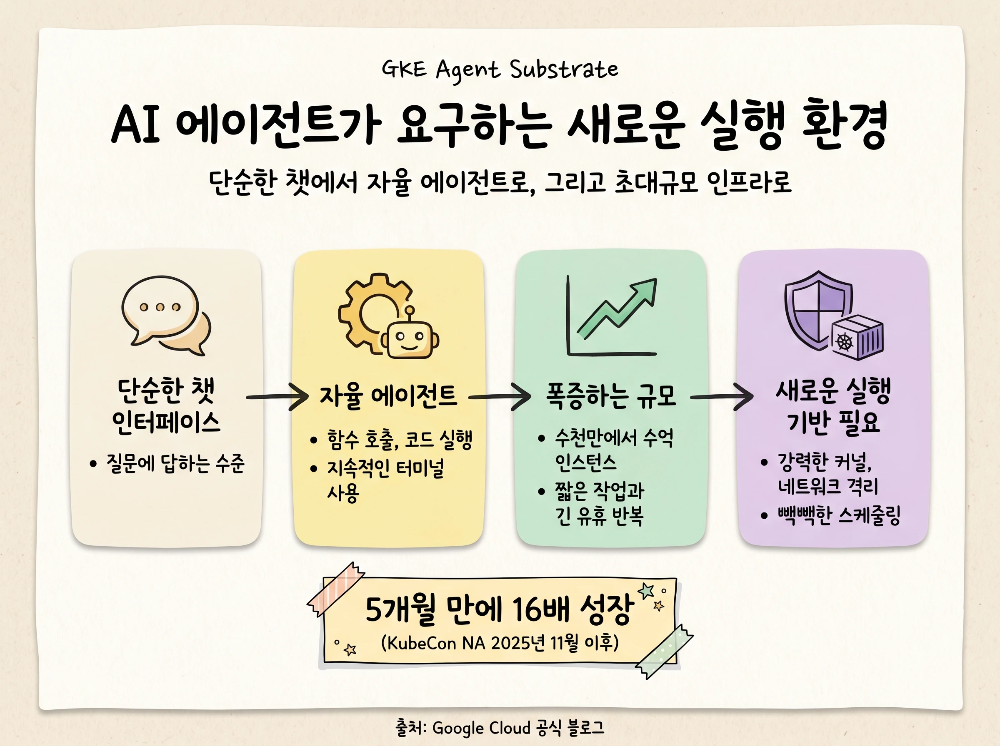
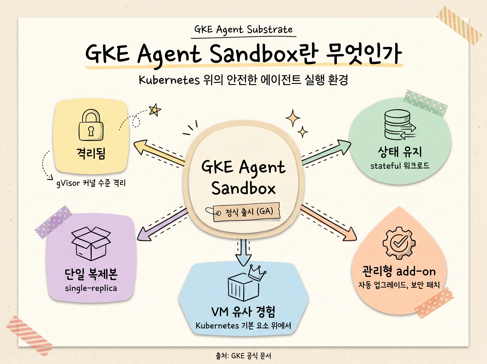
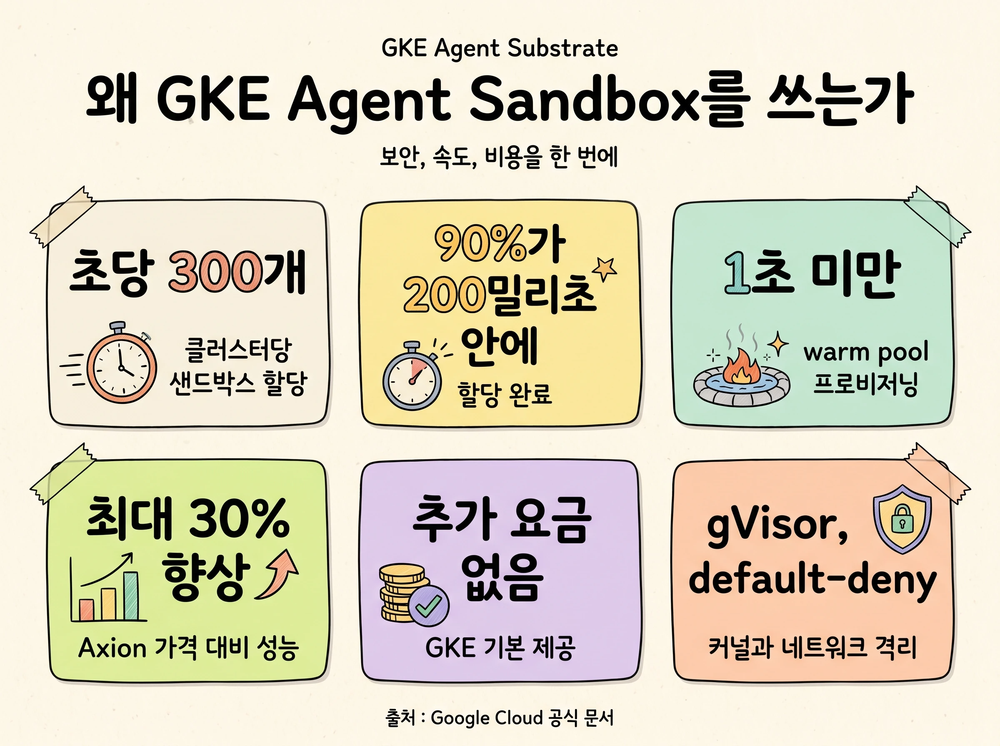
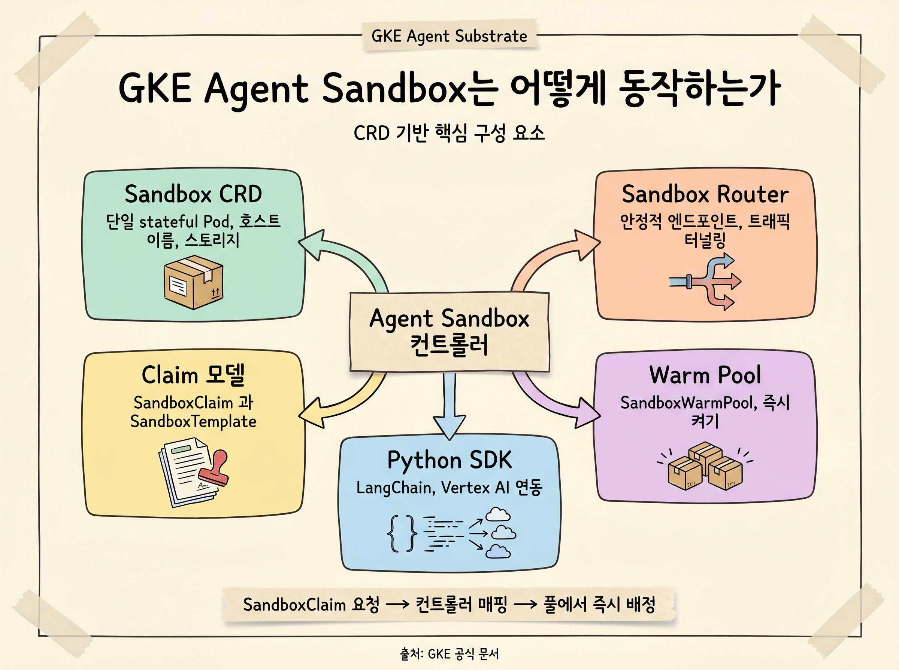
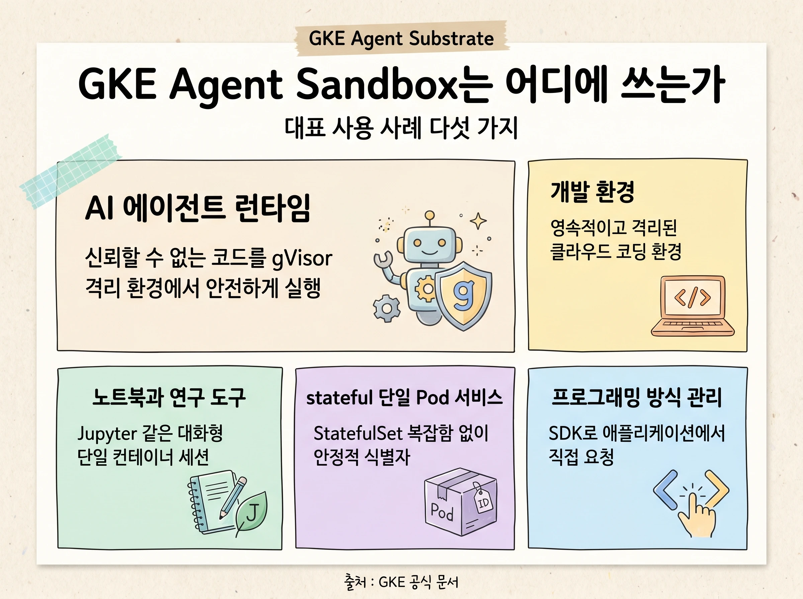
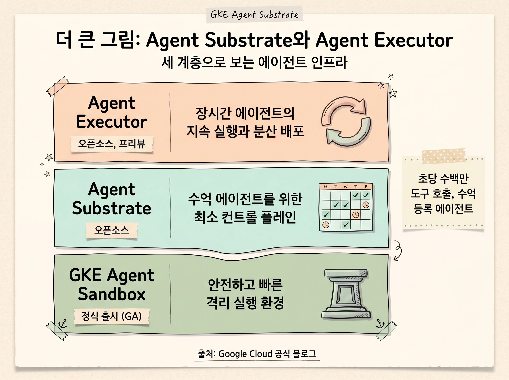
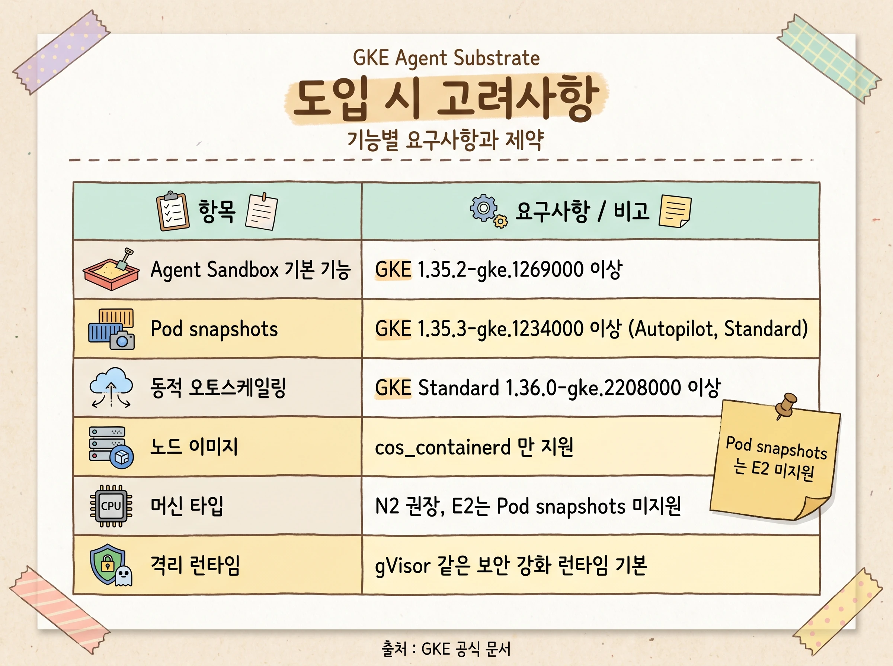

## 배경: AI 에이전트가 요구하는 새로운 실행 환경

짧은 시간 동안 AI는 단순한 챗 인터페이스에서 함수 호출, 코드 실행, 지속적인 터미널 사용까지 스스로 수행하는 자율 에이전트로 발전했습니다. 그런데 이런 능력을 안전하게 조율하려면 에이전트에게는 지능만으로는 부족합니다. 코드를 실제로 실행할, 견고하고 매우 큰 규모로 확장되며 안전한 컴퓨트 환경이 필요합니다.

문제는 이 워크로드의 성격이 기존 애플리케이션과 다르다는 점입니다. 에이전트 워크로드는 한편으로는 수천만에서 수억 개 인스턴스 규모로 늘어나면서, 동시에 사람의 입력이나 이벤트, 트리거를 기다리며 점점 더 많은 시간을 유휴 상태로 보냅니다. 그러면서도 강력한 커널 격리와 네트워크 격리를 계속 요구하기 때문에, 한 노드에 빽빽하게 모아 스케줄링하기가 까다롭습니다. 표준 Kubernetes는 오래 실행되는 서비스 수천 개를 다루는 데 최적화되어 있지만, 에이전트는 초당 수백만 건의 짧은 도구 호출을 쏟아내며 이런 부하는 일반적인 컨트롤 플레인을 압도할 수 있습니다.

이 수요는 빠르게 현실이 되고 있습니다. 2025년 11월 KubeCon NA에서 GKE Agent Sandbox를 프리뷰로 공개한 이후, 5개월이 채 지나지 않아 GKE 위의 샌드박스 사용량이 16배 넘게 증가했습니다. Langchain, Lovable 같은 주요 고객을 포함해 많은 팀이 이미 수백만 개의 에이전트를 프로덕션에 배포하고 있습니다.[^blog-sandbox]

> [!NOTE]
> 이 문서는 이름이 비슷한 세 가지를 구분해 설명합니다. 혼동하지 않도록 먼저 정리합니다.
>
> - **GKE Agent Sandbox**: GKE의 정식 출시(GA) 관리형 기능. 격리된 에이전트 실행 환경을 제공합니다. gVisor, warm pool, Pod snapshots, 각종 CRD는 모두 이 Agent Sandbox의 기능입니다.
> - **Agent Substrate**: 새로 공개된 오픈소스 프로젝트. 수억 개 규모의 에이전트를 다루기 위한 최소 컨트롤 플레인입니다.
> - **Agent Executor**: 오픈소스 분산 에이전트 런타임. 장시간 실행되는 에이전트의 지속 실행과 재개를 담당합니다.

## GKE Agent Sandbox란 무엇인가

GKE Agent Sandbox는 격리되고(isolated), 상태를 유지하며(stateful), 단일 복제본(single-replica)으로 동작하는 워크로드를 GKE에서 관리하도록 돕는 기능입니다. 특히 신뢰할 수 없는 LLM 생성 코드를 안전하고 성능 좋게 실행해야 하는 AI 에이전트 런타임 같은 용도에 최적화되어 있습니다.[^sandbox-docs]

Agent Sandbox는 오픈소스 Agent Sandbox 컨트롤러 프로젝트를 기반으로 하며, 그 릴리스 주기를 따릅니다.[^sandbox-oss] 동시에 GKE 관리형 add-on이기 때문에 컨트롤러의 전체 수명 주기를 Google이 관리합니다. 자동 업그레이드와 보안 패치가 여기에 포함됩니다. 즉 오픈소스의 투명성과 관리형 서비스의 운영 편의를 함께 얻습니다.

선언적이고 표준화된 API를 제공한다는 점도 핵심입니다. 그 결과 Agent Sandbox는 가상 머신(VM)과 비슷한 격리성과 영속성을 갖춘 단일 컨테이너 경험을 제공하면서도, 그 전부를 Kubernetes 기본 요소(primitive) 위에서 구현합니다. 별도의 가상화 스택을 새로 들이지 않고도 VM에 가까운 경험을 얻는 셈입니다.

> [!IMPORTANT]
> GKE Agent Sandbox는 현재 정식 출시(GA) 상태입니다. 에이전트 워크로드를 위한 안전하고 확장 가능한 기반으로 바로 사용할 수 있습니다.

## 왜 사용하는가: 핵심 이점

Agent Sandbox는 높은 확장성, 확장 가능성(extensibility), 보안을 동시에 요구하는 에이전트 워크로드를 위해 만들어졌습니다. 이 기능이 해결하는 대표적인 과제는 다음과 같습니다.

| 이점 | 무엇을 해결하나 | 핵심 수치 |
|---|---|---|
| 커널 수준 격리 | 신뢰할 수 없는 LLM 생성 코드를 안전하게 실행 | gVisor 기본 지원, default-deny 네트워크 |
| 빠른 프로비저닝 | 요청마다 발생하는 수 초의 콜드 스타트 제거 | 클러스터당 초당 300개 샌드박스 할당, 90%가 200밀리초 안에 완료 |
| 유휴 컴퓨트 절감 | 짧게 일하고 길게 노는 에이전트의 낭비 제거 | Pod snapshots로 일시 중단 후 수 초 내 재개 |
| 비용 효율 | warm pool 유지 비용 부담 완화 | standby capacity buffer(중단된 VM)로 저렴한 콜드 풀 운영 |

**커널 수준 격리.** Agent Sandbox는 GKE Sandbox(gVisor) 같은 GKE 내장 기능을 사용해 신뢰할 수 없는 코드에 강력한 커널 수준 격리를 제공합니다. 오픈소스 Kata Containers도 지원해 사용자가 커널 격리 방식을 직접 선택할 수 있습니다. 여기에 default-deny 네트워크 정책이 더해져, 샌드박스 안의 코드는 기본적으로 허가되지 않은 내부 네트워크나 GKE 컨트롤 플레인에 접근할 수 없습니다.

**빠른 프로비저닝.** 요청이 들어올 때마다 새 샌드박스를 처음부터 띄우면 수 초의 콜드 스타트 지연이 생깁니다. Agent Sandbox는 미리 준비해 둔 인스턴스를 두는 warm pool을 내장한 Sandbox API를 제공합니다. 이 통합 warm pool 덕분에 GKE는 클러스터당 초당 300개의 샌드박스를 1초 미만의 지연으로 할당하며, 할당의 90%가 200밀리초 안에 끝납니다.

**유휴 컴퓨트 절감.** 에이전트는 짧고 폭발적인 작업 구간 뒤에 긴 유휴 구간을 갖는 경우가 많습니다. 그동안 컴퓨트를 켜 두면 낭비입니다. Agent Sandbox는 Pod snapshots와 연동해 유휴 상태의 에이전트 워크로드를 일시 중단했다가, 요청이 오면 수 초 안에 다시 재개합니다.

**비용 효율적인 warm pool.** warm pool은 미리 프로비저닝한 복제본을 준비 상태로 유지해 시작 지연을 줄입니다. 그 유지 비용을 낮추기 위해 Agent Sandbox는 standby capacity buffer(중단된 VM)와 통합됩니다. 중단된 샌드박스로 이루어진 저렴한 콜드 풀을 두고, 필요할 때 warm pool을 빠르게 다시 채우는 방식입니다.

여기에 더해 GKE Agent Sandbox는 Axion 프로세서에서 실행할 때, 비교 대상이 되는 다른 하이퍼스케일러 클라우드 사업자 대비 최대 30% 더 나은 가격 대비 성능을 제공합니다. 비용 측면의 좋은 소식이 하나 더 있습니다. Agent Sandbox 자체는 GKE에서 추가 요금 없이 제공되며, 생성한 리소스에 대해 일반적인 GKE 요금만 적용됩니다.[^blog-sandbox]

## 어떻게 동작하는가: 핵심 구성 요소

Agent Sandbox는 커스텀 컨트롤러와 여러 Kubernetes 커스텀 리소스 정의(CRD)를 사용해 샌드박스 환경의 수명 주기를 관리합니다.

**핵심 아키텍처.** 세 가지 축으로 동작합니다.

- **Sandbox CRD**: 단일 stateful Pod을 나타내는 기본 리소스입니다. 안정적인 호스트 이름, 네트워크 식별자, 영속 스토리지를 관리합니다.
- **Sandbox Router**: 안정적인 엔드포인트를 제공하고, 트래픽을 적절한 Sandbox Pod으로 터널링합니다. 복잡한 내부 네트워킹을 추상화하는 역할입니다.
- **Pod snapshots 연동**: 컨테이너의 전체 상태를 저장하고 복원해, 워크로드를 일시 중단하고 재개할 수 있게 합니다.

**Claim 모델.** Agent Sandbox는 "어떤 환경이 필요한가"라는 요청을, "그 환경을 어디에 어떻게 띄울 것인가"라는 구현 세부에서 분리합니다. 표준 Kubernetes의 `StatefulSet`과 달리, 사용자는 그 아래의 Pod이나 스토리지 구성을 직접 다루지 않고도 샌드박스를 요청할 수 있습니다. 동작은 `SandboxClaim`과 `SandboxTemplate` 두 CRD로 이루어집니다.

1. 사용자나 애플리케이션이 `SandboxTemplate`을 참조하는 `SandboxClaim`을 생성해 샌드박스를 요청합니다.
2. 컨트롤러가 그 claim을 실제 샌드박스 인스턴스에 연결합니다. 이때 기존 샌드박스를 재사용하거나 풀에서 할당하는 등 유연한 백엔드 관리가 가능합니다.

**Warm Pool.** 시작 지연을 최소화하는 기능으로, 대화형 AI 에이전트 시나리오에서 특히 중요합니다. `SandboxWarmPool` CRD로 관리하며, 미리 준비된 Pod을 보유하다가 `SandboxClaim`이 들어오면 이미지 풀링과 부팅을 기다리지 않고 풀에서 즉시 Pod을 배정합니다. Pod snapshots와 결합하면 미리 구성된 상태에서 복원하는 "즉시 켜기(instant-on)" 동작까지 가능합니다.

**프로그래밍 방식 접근.** AI 엔지니어는 제공되는 클라이언트 라이브러리로 Agent Sandbox 리소스를 코드에서 직접 다룰 수 있습니다. 예를 들어 Python SDK는 `SandboxClaim`과 `SandboxTemplate` 구성을 감싸는 고수준 인터페이스를 제공합니다.[^sdk] 덕분에 LangChain이나 Vertex AI Agentic SDK 같은 Python 기반 에이전트 프레임워크에서 Kubernetes YAML을 직접 작성하지 않고도 격리 환경을 만들고 다룰 수 있습니다.

## 어디에 쓰는가: 대표 사용 사례

Agent Sandbox는 격리성, 영속성, 안정적인 식별자가 필요한 워크로드에 적합합니다. 대표적인 사용 사례는 다음과 같습니다.

- **AI 에이전트 런타임**: gVisor 같은 보안 중심 런타임으로 격리된 환경에서 신뢰할 수 없는 코드를 안전하게 실행합니다.
- **개발 환경**: 개발자에게 영속적이고 격리된 클라우드 기반 코딩 환경을 제공합니다.
- **노트북과 연구 도구**: Jupyter Notebook 같은 대화형 도구를 위한 단일 컨테이너 세션을 호스팅합니다.
- **stateful 단일 Pod 서비스**: `StatefulSet`의 복잡함 없이, 안정적인 식별자와 스토리지가 필요한 애플리케이션을 실행합니다.
- **프로그래밍 방식 환경 관리**: Python SDK 같은 클라이언트 라이브러리로 애플리케이션 로직에서 직접 샌드박스를 요청하고 관리합니다.

> [!TIP]
> 사용 사례를 관통하는 공통점은 "신뢰할 수 없거나 임의의 입력을 다루는 작업"입니다. 에이전트가 코드를 생성하거나 여러 테넌트와 사용자 데이터를 동시에 처리하는 상황에서 격리의 가치가 가장 큽니다.

## 더 큰 그림: Agent Substrate와 Agent Executor

Agent Sandbox가 개별 샌드박스를 안전하고 빠르게 제공한다면, 그다음 질문은 규모입니다. 에이전트 워크로드가 수억 인스턴스로 늘고 점점 더 오래 실행되면, 기존 컴퓨트 추상화의 한계에 부딪힙니다. 빠른 일시 중단과 재개를 이만한 규모로 처리하는 일은 Kubernetes 컨트롤 플레인을 한계까지 밀어붙입니다.

**Agent Substrate**는 이 문제를 정면으로 다루는 새 오픈소스 프로젝트입니다.[^substrate] 준비된 컴퓨트 용량 위로 에이전트를 실시간으로 올리고 내리는 새로운 추상화 계층을 도입합니다. Agent Sandbox의 보안 런타임과 스냅샷 기능을 그대로 가져오되, 여기에 Kubernetes의 일부 한계를 우회하는 최소 컨트롤 플레인을 결합합니다. 나머지를 다시 만들지는 않는다는 점이 핵심입니다. 표준 Kubernetes가 오래 실행되는 서비스 수천 개에 최적화되어 있다면, Agent Substrate는 일반적인 컨트롤 플레인을 압도할 만한 초당 수백만 건의 짧은 도구 호출을 위해 설계되었습니다. 스케줄러 핵심에 데이터 지역성(data locality)을 들여, 에이전트 상태와 스케줄링이 함께 움직이며 가능한 모든 지연을 줄이는 방향을 탐색합니다.

**Agent Executor**는 에이전트 실행과 재개, 분산 배포를 위한 Google의 오픈소스 런타임 표준입니다.[^executor] 모델과 harness가 좋아지면서 에이전트는 몇 시간에서 며칠씩 걸리는 복잡한 작업을 맡게 되었는데, 이런 장시간 워크플로는 프로덕션에서 안정적이고 효율적으로 관리하기가 매우 어렵습니다. Agent Executor는 다음을 기본 기능으로 제공해 이 문제를 풉니다.

- **지속 실행(durable execution)**: 이벤트 로그와 스냅샷을 통해, 장애나 사람 개입(HITL) 같은 중단 이후에도 작업을 다시 이어갑니다.
- **안전한 격리**: 구성 요소를 secure-by-design 샌드박스에 가둬 악의적 활동이 서비스 전체로 번지지 않게 합니다.
- **세션 일관성**: 단일 작성자(single-writer) 구조로 분산 워크플로에서 공유 상태가 손상될 위험을 줄입니다.
- **연결 복구**: 클라이언트가 끊겼다가 다시 연결하면, 마지막으로 받은 지점부터 응답을 채워 줍니다.

Agent Executor는 harness에 종속되지 않도록 설계되어, 직접 만든 harness나 다른 벤더의 harness를 그대로 쓸 수 있고 업계 표준 프레임워크와 프로토콜로 만든 에이전트도 지원합니다. 그 결과 자체 인프라에서 에이전트를 실행해 데이터 위치와 비용을 직접 통제하면서 특정 사업자에 묶이지 않을 수 있습니다. 두 프로젝트의 관계는 다음과 같이 정리됩니다.

| 계층 | 정체성 | 역할 | 상태 |
|---|---|---|---|
| GKE Agent Sandbox | GKE 관리형 기능 | 개별 에이전트의 안전하고 빠른 격리 실행 환경 | 정식 출시(GA) |
| Agent Substrate | 오픈소스 프로젝트 | 수억 에이전트를 위한 최소 컨트롤 플레인 | 오픈소스 공개 |
| Agent Executor | 오픈소스 런타임 | 장시간 에이전트의 지속 실행과 분산 배포 | 프리뷰 |

> [!NOTE]
> Google은 초기 Kubernetes가 그랬듯 다양한 기여자의 관점이 중요한 시점이라고 보고, Agent Substrate를 공개적으로 시작했습니다. 오늘 Agent Sandbox로 워크로드를 운영하고, 오픈소스 커뮤니티에서 Agent Substrate와 Agent Executor의 설계에 함께 참여하는 것이 권장되는 방향입니다.[^blog-executor]

## 도입 시 고려사항

도입을 검토한다면 다음 요구사항과 제약을 먼저 확인하는 것이 좋습니다. 기능마다 요구하는 GKE 버전이 다르다는 점에 유의합니다.

| 항목 | 요구사항 |
|---|---|
| Agent Sandbox 기본 기능 | GKE 버전 1.35.2-gke.1269000 이상 |
| Pod snapshots | GKE 버전 1.35.3-gke.1234000 이상 (Autopilot과 Standard 모두 지원) |
| 동적 오토스케일링 | GKE Standard 클러스터, 버전 1.36.0-gke.2208000 이상 |
| 노드 이미지 | Container-Optimized OS with containerd(`cos_containerd`)만 지원 |
| 권장 머신 타입 | N2 등으로 최적화. Pod snapshots는 E2 머신 타입을 지원하지 않음 |
| 격리 런타임 | 여러 런타임을 지원하나 gVisor 같은 보안 강화 런타임 사용이 기본 전제 |

> [!WARNING]
> Pod snapshots는 E2 머신 타입을 지원하지 않습니다. 스냅샷을 사용할 계획이라면 처음부터 N2 같은 호환 머신 타입으로 노드 풀을 구성해야 합니다. 또한 Pod snapshots처럼 일부 기능은 Preview 단계이거나 리전별 가용성에 차이가 있을 수 있으므로, 대상 리전의 지원 여부를 사전에 확인합니다.

## 맺음말

AI 에이전트는 단순한 응답기를 넘어, 코드를 실행하고 도구를 호출하며 오래 살아 있는 워크로드가 되었습니다. 이 변화는 격리, 빠른 시작, 유휴 절감, 그리고 무엇보다 거대한 규모를 동시에 만족하는 새로운 실행 기반을 요구합니다.

GKE Agent Sandbox는 이 요구에 대한 오늘 당장 쓸 수 있는 답입니다. gVisor 기반 커널 격리, warm pool을 통한 1초 미만 프로비저닝, Pod snapshots를 통한 유휴 절감을 추가 요금 없이 GKE 위에서 제공합니다. 그 위에서 Agent Substrate는 수억 규모의 컨트롤 플레인을, Agent Executor는 장시간 에이전트의 지속 실행을 오픈소스로 채워 갑니다. 세 계층은 각각 다른 문제를 풀지만, 함께 모이면 가장 큰 규모의 에이전트 배포를 위한 기반이 됩니다.

시작점은 분명합니다. 격리된 에이전트 실행 환경이 필요하다면 GKE Agent Sandbox를 사용하고, 초대규모와 분산 실행을 내다본다면 Agent Substrate와 Agent Executor 오픈소스 커뮤니티를 함께 살펴보는 것을 권합니다.

## 참고 자료

본문 각주에 인용한 1차 출처는 다음과 같습니다. 모든 수치와 버전 정보는 아래 공식 문서와 블로그에서 확인했습니다.

- [GKE Agent Sandbox 개념 문서](https://docs.cloud.google.com/kubernetes-engine/docs/concepts/machine-learning/agent-sandbox): 정의, 이점, 아키텍처, 사용 사례, 요구사항
- [Agent Sandbox 오픈소스 컨트롤러 프로젝트](https://github.com/kubernetes-sigs/agent-sandbox/): 관리형 add-on의 기반이 되는 OSS
- [Agent Substrate 오픈소스 프로젝트](https://github.com/agent-substrate/substrate): 초대규모 에이전트를 위한 최소 컨트롤 플레인
- [Agent Executor 오픈소스 저장소](https://github.com/google/ax): 분산 에이전트 런타임
- [Google Cloud 블로그: Bringing you Agent Sandbox on GKE and Agent Substrate](https://cloud.google.com/blog/products/containers-kubernetes/bringing-you-agent-sandbox-on-gke-and-agent-substrate): 도입 규모, 성능 수치, Agent Substrate 발표
- [Google Cloud 블로그: Agent Executor, Google's distributed agent runtime](https://cloud.google.com/blog/products/ai-machine-learning/agent-executor-googles-distributed-agent-runtime): Agent Executor의 기능과 배포 모델

[^sandbox-docs]: GKE Agent Sandbox의 정의, 격리 방식, 아키텍처, 대표 사용 사례, 도입 요구사항은 [GKE Agent Sandbox 개념 문서](https://docs.cloud.google.com/kubernetes-engine/docs/concepts/machine-learning/agent-sandbox)를 근거로 합니다 (2026년 6월 확인).
[^sandbox-oss]: 관리형 add-on이 기반으로 삼고 릴리스 주기를 따르는 [Agent Sandbox 오픈소스 컨트롤러 프로젝트](https://github.com/kubernetes-sigs/agent-sandbox/)입니다.
[^sdk]: LangChain, Vertex AI 같은 Python 프레임워크와 연동하는 [Agent Sandbox Python SDK](https://github.com/kubernetes-sigs/agent-sandbox/tree/main/clients/python/agentic-sandbox-client)입니다.
[^substrate]: 초대규모 에이전트를 위한 최소 컨트롤 플레인 [Agent Substrate 오픈소스 프로젝트](https://github.com/agent-substrate/substrate)입니다.
[^executor]: 분산 에이전트 런타임 [Agent Executor 오픈소스 저장소](https://github.com/google/ax)이며, 현재 프리뷰로 제공됩니다.
[^blog-sandbox]: 도입 규모(5개월간 16배 증가)와 성능 수치(클러스터당 초당 300개 할당, 90%가 200밀리초 이내 완료, Axion에서 최대 30% 향상된 가격 대비 성능)는 Google Cloud 블로그 [Bringing you Agent Sandbox on GKE and Agent Substrate](https://cloud.google.com/blog/products/containers-kubernetes/bringing-you-agent-sandbox-on-gke-and-agent-substrate)에서 확인했습니다 (2026년 6월 확인).
[^blog-executor]: Agent Substrate를 공개 개발로 시작한 배경과 Agent Executor의 기능, 배포 모델은 Google Cloud 블로그 [Agent Executor, Google's distributed agent runtime](https://cloud.google.com/blog/products/ai-machine-learning/agent-executor-googles-distributed-agent-runtime)에서 확인했습니다 (2026년 6월 확인).
