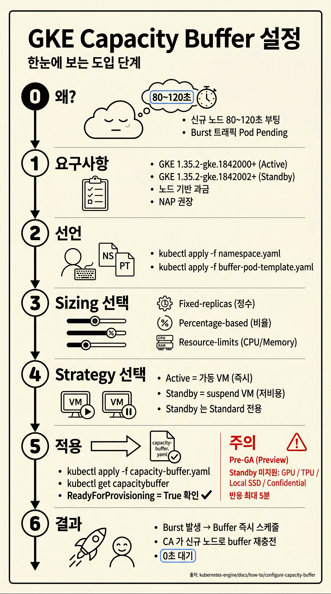
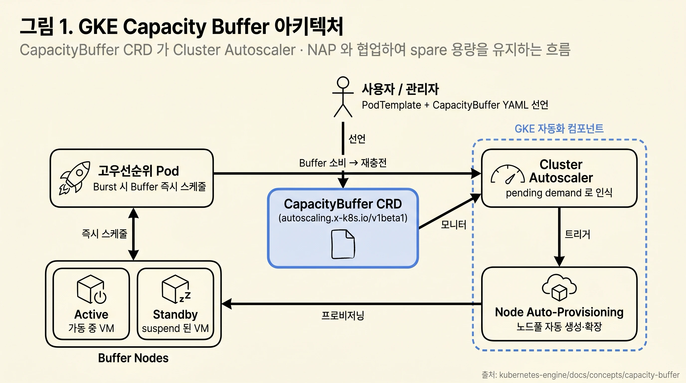
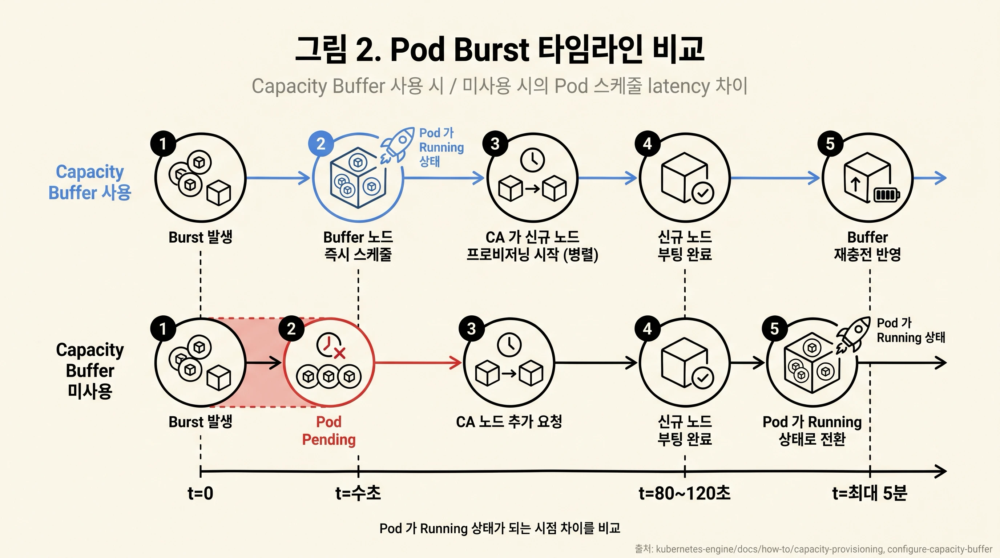
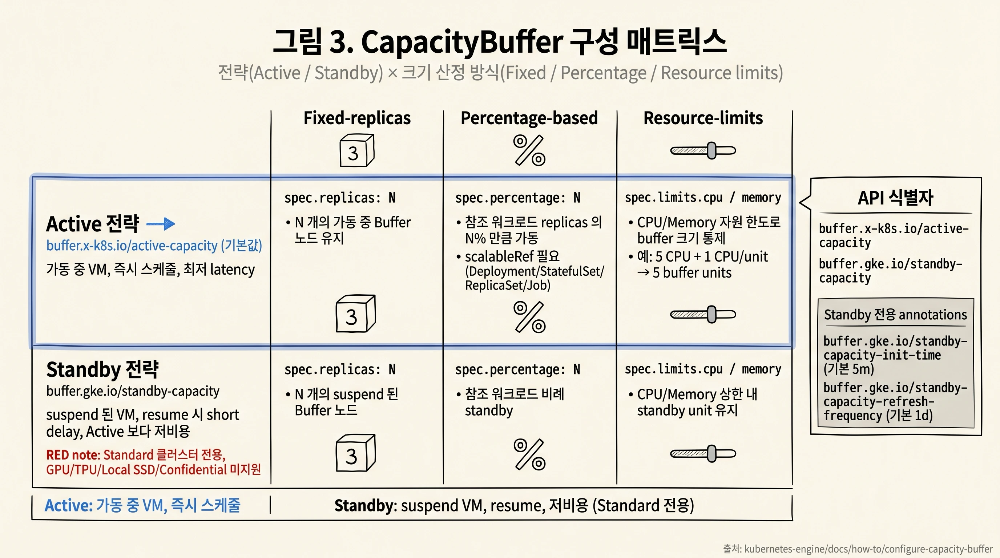

> **Preview 상태:** Capacity Buffer 는 본 가이드 작성 시점 기준 Pre-GA (Preview) 단계입니다. Google Cloud Service Specific Terms 의 "Pre-GA Offerings Terms" 가 적용되며, 프로덕션 도입 전 launch stage 와 지원 정책을 확인해야 합니다 ([About capacity buffers](https://docs.cloud.google.com/kubernetes-engine/docs/concepts/capacity-buffer)).

## Executive Summary

- GKE 에서 신규 노드 부팅에는 약 80~120 초가 소요되며, 이 사이 burst 트래픽으로 생성된 Pod 는 Pending 상태로 대기합니다 ([Provision extra compute capacity](https://docs.cloud.google.com/kubernetes-engine/docs/how-to/capacity-provisioning)).
- Capacity Buffer 는 Kubernetes CapacityBuffer Custom Resource Definition (CRD) 으로 spare 용량을 사전 선언하면 Cluster Autoscaler 가 이를 pending demand 로 인식하여 노드를 미리 확보하는 자동화된 메커니즘입니다 ([About capacity buffers](https://docs.cloud.google.com/kubernetes-engine/docs/concepts/capacity-buffer)).
- Active 와 Standby 두 가지 프로비저닝 전략, 그리고 fixed-replicas / percentage / resource-limits 세 가지 크기 산정 방식을 조합해 워크로드 특성에 맞게 구성합니다 ([About capacity buffers](https://docs.cloud.google.com/kubernetes-engine/docs/concepts/capacity-buffer)).
- 활성화 요구사항은 GKE 버전 `1.35.2-gke.1842000` 이상 (Active) 또는 `1.35.2-gke.1842002` (Standby) 이며, 노드 기반 과금 모델 워크로드만 지원합니다 ([About capacity buffers](https://docs.cloud.google.com/kubernetes-engine/docs/concepts/capacity-buffer)).

> **본 가이드 대상 독자:** GKE 를 이미 운영 중이며, AI 추론·게임 서버·이벤트성 트래픽 등 startup latency 에 민감한 워크로드의 burst 응답을 개선하고자 하는 플랫폼/SRE 엔지니어.

## 0. At-a-Glance

본 가이드는 다음 7 단계로 Capacity Buffer 도입을 안내합니다. 아래 도식(그림 0)은 각 단계와 §1~§6 의 매핑 관계를 시각화합니다.

- **0. 왜?** — 신규 노드 부팅 80~120 초로 인한 burst 지연 (§1).
- **1. 요구사항** — GKE 버전·과금 모델·NAP 확인 (§3).
- **2. 선언** — Namespace + PodTemplate 생성 (§4.2).
- **3. Sizing 선택** — Fixed-replicas / Percentage / Resource-limits (§4.4).
- **4. Strategy 선택** — Active (가동 VM) / Standby (suspend VM) (§2.4).
- **5. 적용** — `kubectl apply` → `ReadyForProvisioning` 확인 (§4.4, §5.1).
- **6. 결과** — Burst 시 Buffer 즉시 스케줄, CA 가 재충전 (§2.1).


*그림 0: 도입 단계 0~6 을 한 페이지로 정리한 요약.*

## 1. 개요 — Capacity Buffer 가 해결하는 문제

### 1.1 스케일링 지연의 원인

GKE Autopilot 클러스터와 Node Auto-Provisioning 이 활성화된 Standard 클러스터는 기존 노드 용량이 부족할 때 신규 노드를 생성하여 pending Pod 를 수용합니다. 다만 신규 노드 한 대의 부팅에는 대략 **80~120 초** 가 걸리며, GKE 는 노드가 Ready 상태가 된 후에야 해당 노드에 Pod 를 배치합니다 ([Provision extra compute capacity](https://docs.cloud.google.com/kubernetes-engine/docs/how-to/capacity-provisioning)).

이 80~120 초 구간은 다음 시나리오에서 사용자 경험에 직접적인 영향을 미칩니다.

- 게임 출시 / 신규 컨텐츠 업데이트 직후의 로그인 burst
- 이커머스 플래시 세일 / 한정 판매 트래픽 burst
- AI 추론 워크로드에서 동시 사용자 수의 급격한 증가
- AI 에이전트 / 인터랙티브 워크로드의 burst-then-idle 패턴

### 1.2 기존 패턴: PriorityClass + placeholder Pod (수동 방식)

GKE 에는 동일한 문제를 수동으로 해결하기 위한 **PriorityClass + placeholder Pod 패턴** 이 있습니다. 낮은 우선순위 (`-10`) 의 placeholder Pod 를 Deployment 또는 Job 으로 실행해 노드를 미리 확보하고, 운영 워크로드가 스케일 업할 때 GKE 가 placeholder 를 evict 하여 자리를 내어 주는 구조입니다 ([Provision extra compute capacity](https://docs.cloud.google.com/kubernetes-engine/docs/how-to/capacity-provisioning)).

이 방식은 GKE Autopilot 및 Standard 의 공식 가이드 ([Provision extra compute capacity](https://docs.cloud.google.com/kubernetes-engine/docs/how-to/capacity-provisioning)) 에 명시된 패턴이지만 다음과 같은 운영 부담이 있습니다.

- 사용자가 PriorityClass, placeholder Deployment/Job, eviction 로직을 직접 설계·유지보수해야 합니다.
- 워크로드 크기 변화에 placeholder replica 수를 수동으로 맞춰야 합니다.
- placeholder Pod 의 resource request 가 운영 Pod 보다 작으면 자리가 부족해 production Pod 가 Pending 으로 남을 수 있습니다 ([Provision extra compute capacity](https://docs.cloud.google.com/kubernetes-engine/docs/how-to/capacity-provisioning)).

### 1.3 Capacity Buffer 가 제공하는 가치

Capacity Buffer 는 위 패턴을 Kubernetes CRD 로 표준화하여 GKE 가 자동 관리합니다. 공식 문서가 정리하는 효과는 다음 세 가지입니다 ([About capacity buffers](https://docs.cloud.google.com/kubernetes-engine/docs/concepts/capacity-buffer)).

- **스케일링 지연 최소화** — Active buffer 는 가동 중인 VM 을 보유하여 즉시 스케줄을 제공하고, Standby buffer 는 suspend 된 VM 을 resume 하여 fresh 노드보다 빠르게 용량을 제공합니다.
- **비용 효율적인 over-provisioning** — 고정 크기의 safety net 을 유지하므로, HPA 활용률을 일괄적으로 낮추는 방식 (클러스터 규모에 선형으로 idle 용량이 증가) 보다 비용 효율적입니다.
- **워크로드 요구사항 정합** — buffer 크기 산정 방식·DaemonSet·image preloading 을 모두 사용자가 통제할 수 있습니다.

공식 권장 대상 워크로드는 **AI 에이전트, AI 추론, 세일 이벤트의 리테일 애플리케이션, 피크 시간대 게임 서버** 등 startup latency 에 민감하고 빠른 스케일 업이 필요한 워크로드입니다. 배치 처리처럼 startup latency 에 둔감한 워크로드에는 권장되지 않습니다 ([About capacity buffers](https://docs.cloud.google.com/kubernetes-engine/docs/concepts/capacity-buffer)).

## 2. 동작 원리 — Buffer, Cluster Autoscaler, NAP 의 관계

### 2.1 구성 요소 흐름


*그림 1: CapacityBuffer CR 이 placeholder Pod 를 통해 Cluster Autoscaler 에 pending demand 로 노출되고, 필요 시 Node Auto-Provisioning 이 신규 노드풀을 생성하여 buffer 를 채우는 흐름.*

핵심 동작 사실 ([About capacity buffers](https://docs.cloud.google.com/kubernetes-engine/docs/concepts/capacity-buffer)):

- 사용자는 Kubernetes CapacityBuffer CRD 인스턴스를 만들어 spare capacity 를 선언합니다.
- GKE Cluster Autoscaler 는 CapacityBuffer 리소스를 모니터링하고 이를 **pending demand** 로 취급하여 노드가 부족하면 노드를 추가 프로비저닝합니다.
- 고우선순위 워크로드가 스케일 업하면 GKE 는 buffer 의 가용 용량에 **즉시 스케줄** 합니다. 이때 일반적인 노드 프로비저닝 지연이 발생하지 않습니다.
- 워크로드가 buffer unit 을 소비하면 Cluster Autoscaler 는 신규 노드를 프로비저닝하여 buffer 를 재충전합니다.

### 2.2 Cluster Autoscaler 의 역할

Cluster Autoscaler 는 node pool 단위로 동작하며 Pod 의 리소스 요청 (실제 사용량이 아님) 을 기준으로 노드 추가·제거를 결정합니다. 주요 동작은 다음과 같습니다 ([About cluster autoscaling](https://docs.cloud.google.com/kubernetes-engine/docs/concepts/cluster-autoscaler)).

- 현재 노드에 스케줄이 안 되는 Pod 가 있으면 노드 풀의 최대 크기까지 노드를 추가합니다.
- 한 노드의 부팅을 기다리지 않고 필요한 노드 수를 결정한 즉시 **병렬로** 생성합니다.
- 스케일 업 실패 (쿼터/IP 고갈 등) 시 초기 **5 분 backoff** 후 재시도, 실패가 계속되면 지수적으로 증가하여 최대 **30 분** 까지 늘어납니다.
- 우선순위 `-10` 미만의 Pod 는 신규 노드 생성을 트리거하지 않으며, 자리가 없으면 계속 Pending 으로 남습니다.

### 2.3 Node Auto-Provisioning (NAP) 과의 관계

Node Auto-Provisioning 은 Cluster Autoscaler 의 확장으로, 기존 노드풀의 스케일링뿐 아니라 **새로운 노드풀 자체를 자동 생성** 합니다 ([About node pool auto-creation](https://docs.cloud.google.com/kubernetes-engine/docs/concepts/node-auto-provisioning)).

- Autopilot 클러스터는 NAP 가 항상 활성 상태입니다.
- Standard 클러스터는 NAP 를 명시적으로 활성화해야 합니다.
- GKE 1.33.3-gke.1136000 이상에서는 ComputeClass 의 `nodePoolAutoCreation.enabled: true` 로 워크로드 단위 NAP 사용이 가능하며, 클러스터 레벨 NAP 없이도 동작합니다.

Capacity Buffer 공식 문서는 **클러스터에 NAP 를 활성화할 것을 권장** 합니다. NAP 가 없으면 Cluster Autoscaler 는 **기존 노드풀만 확장** 하므로, CapacityBuffer 의 리소스 요구를 기존 노드풀이 못 맞추면 buffer 가 채워지지 않습니다 ([About capacity buffers](https://docs.cloud.google.com/kubernetes-engine/docs/concepts/capacity-buffer)).

### 2.4 Active 와 Standby 두 가지 전략

| 전략 | API 식별자 | 노드 상태 | 특성 |
|---|---|---|---|
| Active buffer | `buffer.x-k8s.io/active-capacity` (기본값) | 가동 중 VM | 초기 buffer 소비 시 최저 latency. Standby 의 Standard 한정 제약(아래 §2.4 후술) 에 해당하지 않음. |
| Standby buffer | `buffer.gke.io/standby-capacity` | suspend 된 VM | resume 단계로 약간의 delay 추가. Active 보다 저비용. |

Standby 전략의 추가 제한 ([About capacity buffers](https://docs.cloud.google.com/kubernetes-engine/docs/concepts/capacity-buffer)):

- Standard 클러스터에서만 지원합니다.
- GPU/TPU 가 부착된 VM 미지원.
- Local SSD 미지원.
- Confidential Google Kubernetes Engine Nodes 미지원.
- Compute Engine suspend / resume 관련 제약 (메모리 한도 등) 이 동일하게 적용됩니다.

### 2.5 시퀀스 비교 — Capacity Buffer 유무 차이


*그림 2: Burst 발생 시 (A) Capacity Buffer 사용과 (B) 미사용의 latency 차이. Active buffer 사용 시 고우선순위 Pod 는 즉시 스케줄되며, CA 는 병렬로 다음 burst 를 위한 buffer 를 재충전합니다.*

## 3. 사전 요구사항

### 3.1 GKE 버전 / 클러스터 유형

Capacity Buffer 의 활성화 조건 ([About capacity buffers](https://docs.cloud.google.com/kubernetes-engine/docs/concepts/capacity-buffer), [Configure capacity buffers](https://docs.cloud.google.com/kubernetes-engine/docs/how-to/configure-capacity-buffer)):

| 항목 | 조건 |
|---|---|
| GKE 버전 (Active buffer) | `1.35.2-gke.1842000` 이상 |
| GKE 버전 (Standby buffer) | `1.35.2-gke.1842002` 이상 |
| 클러스터 유형 (Active) | Standby 의 Standard 한정 제약 (다음 행) 에 해당하지 않음 |
| 클러스터 유형 (Standby) | Standard 전용 |
| 과금 모델 | 노드 기반 과금 (Pod-based billing 미지원) |
| Node Auto-Provisioning | 권장 (없으면 기존 노드풀만 확장) |
| Release Channel | Standby 버전을 명시 지정할 때 `--release-channel=None` 사용 가능 (공식 문서는 production 환경에서 release channel 미사용을 권장하지 않음) |

> **주의:** Pod-based billing model 을 사용하는 워크로드는 CapacityBuffer 가 `ReadyForProvisioning` 상태에 도달하지 않으며, `kubectl describe capacitybuffer` 결과 `ReadyForProvisioning` 조건이 `False` 로 나타납니다 ([Configure capacity buffers](https://docs.cloud.google.com/kubernetes-engine/docs/how-to/configure-capacity-buffer)).

### 3.2 API 및 도구

- Google Kubernetes Engine API 활성화 ([Configure capacity buffers](https://docs.cloud.google.com/kubernetes-engine/docs/how-to/configure-capacity-buffer)).
- gcloud CLI 설치 및 `gcloud components update` 로 최신 버전 유지. 이전 버전은 본 가이드의 명령을 지원하지 않을 수 있습니다.
- `compute/region` 또는 `compute/zone` 기본값 설정 (미설정 시 `One of [--zone, --region] must be supplied` 오류 발생).

### 3.3 권한 (RBAC)

CustomResourceDefinitions (CRD) 의 `scale` subresource 를 사용하는 커스텀 워크로드를 `scalableRef` 로 참조하는 경우, Cluster Autoscaler 가 해당 scale subresource 를 읽을 수 있도록 RBAC 권한을 수동 부여해야 합니다 ([Configure capacity buffers](https://docs.cloud.google.com/kubernetes-engine/docs/how-to/configure-capacity-buffer)).

```yaml
apiVersion: rbac.authorization.k8s.io/v1
kind: ClusterRole
metadata:
  name: custom-scale-getter
rules:
- apiGroups: ["api.example.com"]
  resources: ["customreplicatedresources/scale"]
  verbs: ["get"]
---
apiVersion: rbac.authorization.k8s.io/v1
kind: ClusterRoleBinding
metadata:
  name: ca-custom-scale-getter
subjects:
- kind: User
  name: "system:cluster-autoscaler"
  namespace: kube-system
roleRef:
  apiGroup: rbac.authorization.k8s.io
  kind: ClusterRole
  name: custom-scale-getter
```

## 4. 설정 절차

### 4.1 구성 옵션 매트릭스


*그림 3: CapacityBuffer 의 크기 산정 방식 3종 × 프로비저닝 전략 2종 매트릭스와 Standby 전용 annotations.*

CapacityBuffer 는 다음 세 가지 크기 산정 방식 중 하나를 사용합니다 ([About capacity buffers](https://docs.cloud.google.com/kubernetes-engine/docs/concepts/capacity-buffer)).

- **Fixed replicas** — `spec.replicas` 에 고정 개수 지정. PodTemplate 참조 필요.
- **Percentage-based** — `spec.percentage` 에 참조 워크로드 replicas 의 백분율 지정. `scale` subresource 를 가진 객체 (Deployment, StatefulSet, ReplicaSet, Job 등) 만 참조 가능. PodTemplate 는 `replicas` 필드가 없어 사용 불가.
- **Resource limits** — `spec.limits.cpu` / `spec.limits.memory` 에 총량 지정. Controller 가 PodTemplate 의 단위 자원 요청으로 buffer Pod 수를 산출.

### 4.2 사전 객체 생성 (Namespace + PodTemplate + 예시 Deployment)

CapacityBuffer 와 PodTemplate 은 동일 namespace 에 있어야 합니다 ([Configure capacity buffers](https://docs.cloud.google.com/kubernetes-engine/docs/how-to/configure-capacity-buffer)).

```yaml
# namespace.yaml
apiVersion: v1
kind: Namespace
metadata:
  name: capacity-buffer-example
  labels:
    name: capacity-buffer-example
```

```yaml
# buffer-pod-template.yaml
apiVersion: v1
kind: PodTemplate
metadata:
  name: buffer-unit-template
  namespace: capacity-buffer-example
template:
  spec:
    terminationGracePeriodSeconds: 0
    containers:
    - name: buffer-container
      image: registry.k8s.io/pause:3.9
      resources:
        requests:
          cpu: "1"
          memory: "1Gi"
        limits:
          cpu: "1"
          memory: "1Gi"
```

```yaml
# sample-workload-deployment.yaml (percentage-based 예시에서 참조)
apiVersion: apps/v1
kind: Deployment
metadata:
  name: critical-workload-ref
  namespace: capacity-buffer-example
spec:
  replicas: 10
  selector:
    matchLabels:
      app: critical-workload
  template:
    metadata:
      labels:
        app: critical-workload
    spec:
      containers:
      - name: busybox
        image: busybox
        command: ["sleep", "3600"]
        resources:
          requests:
            cpu: 100m
```

적용 및 검증:

```bash
kubectl apply -f namespace.yaml -f buffer-pod-template.yaml -f sample-workload-deployment.yaml
kubectl get podtemplate -n capacity-buffer-example
kubectl get deployment critical-workload-ref -n capacity-buffer-example
```

PodTemplate 의 `resources.requests` 는 **buffer unit 의 크기** 를 결정합니다. 위 예시는 1 CPU + 1 GiB 단위로 buffer 가 잡히므로, 1 CPU / 1 GiB 미만의 가용 자원만 있는 노드는 buffer 의 일부로 인정되지 않습니다 ([Configure capacity buffers](https://docs.cloud.google.com/kubernetes-engine/docs/how-to/configure-capacity-buffer)).

### 4.3 Standby buffer 용 클러스터 생성

Standby buffer 가 필요한 경우 클러스터는 `1.35.2-gke.1842002` 버전으로 생성해야 합니다. 다음은 공식 문서의 예시입니다 ([Configure capacity buffers](https://docs.cloud.google.com/kubernetes-engine/docs/how-to/configure-capacity-buffer)).

```bash
gcloud container clusters create CLUSTER_NAME \
    --region=COMPUTE_REGION \
    --cluster-version=1.35.2-gke.1842002 \
    --release-channel=None
```

- `CLUSTER_NAME` — 새 클러스터 이름.
- `COMPUTE_REGION` — Compute Engine 리전 (예: `us-central1`).

> **주의:** 공식 문서는 release channel 에 등록되지 않은 클러스터를 production 환경 또는 장기 운영에 사용할 것을 권장하지 않습니다 ([Configure capacity buffers](https://docs.cloud.google.com/kubernetes-engine/docs/how-to/configure-capacity-buffer)).

### 4.4 CapacityBuffer 적용

> **반응 시간:** CapacityBuffer 가 변경에 반응하는 데 최대 **5 분** 이 소요될 수 있습니다 ([Configure capacity buffers](https://docs.cloud.google.com/kubernetes-engine/docs/how-to/configure-capacity-buffer)).

#### 4.4.1 Fixed replicas

```yaml
# cb-fixed-replicas.yaml
apiVersion: autoscaling.x-k8s.io/v1beta1
kind: CapacityBuffer
metadata:
  name: fixed-replica-buffer
  namespace: NAMESPACE
spec:
  podTemplateRef:
    name: POD_TEMPLATE
  replicas: 3
  provisioningStrategy: "STRATEGY"
```

- `NAMESPACE` — `capacity-buffer-example` 등 namespace 이름.
- `POD_TEMPLATE` — PodTemplate 이름 (예: `buffer-unit-template`).
- `STRATEGY` — `"buffer.x-k8s.io/active-capacity"` (기본) 또는 `"buffer.gke.io/standby-capacity"`.

```bash
kubectl apply -f cb-fixed-replicas.yaml
kubectl get capacitybuffer fixed-replica-buffer -n NAMESPACE
```

`replicas` 필드가 `3`, `STATUS` 필드가 `ReadyForProvisioning` 으로 표시되어야 합니다.

#### 4.4.2 Percentage-based

```yaml
# cb-percentage-based.yaml
apiVersion: autoscaling.x-k8s.io/v1beta1
kind: CapacityBuffer
metadata:
  name: percentage-buffer
  namespace: NAMESPACE
spec:
  scalableRef:
    apiGroup: apps
    kind: Deployment
    name: SCALABLE_RESOURCE_NAME
  percentage: 20
  provisioningStrategy: "STRATEGY"
```

- `SCALABLE_RESOURCE_NAME` — scale subresource 를 가진 워크로드 이름 (예: `critical-workload-ref`).
- `percentage` — 참조 워크로드 replicas 대비 백분율. **100 초과 값 설정 가능** (참조 워크로드보다 큰 buffer 가 필요한 경우).

위 예시는 `critical-workload-ref` 의 10 replicas 대비 20% 인 **2 buffer units** 를 생성합니다.

```bash
kubectl apply -f cb-percentage-based.yaml
kubectl get capacitybuffer percentage-buffer -n NAMESPACE

# 워크로드 스케일 변화에 따른 buffer 동적 조정 확인
kubectl scale deployment critical-workload-ref -n NAMESPACE --replicas=20
# CapacityBuffer controller 가 4 replicas 로 자동 조정
```

#### 4.4.3 Resource limits

```yaml
# cb-resource-limits.yaml
apiVersion: autoscaling.x-k8s.io/v1beta1
kind: CapacityBuffer
metadata:
  name: resource-limit-buffer
  namespace: NAMESPACE
spec:
  podTemplateRef:
    name: POD_TEMPLATE
  limits:
    cpu: "5"
    memory: "5Gi"
  provisioningStrategy: "STRATEGY"
```

PodTemplate 가 1 CPU / 1 GiB 단위라면 위 매니페스트는 **5 buffer units** 를 생성합니다.

```bash
kubectl apply -f cb-resource-limits.yaml
kubectl get capacitybuffer resource-limit-buffer -n NAMESPACE
```

### 4.5 Standby buffer 동작 커스터마이징

`metadata.annotations` 에 다음 키를 추가하여 Standby 노드의 라이프사이클을 조정합니다 ([Configure capacity buffers](https://docs.cloud.google.com/kubernetes-engine/docs/how-to/configure-capacity-buffer)).

| Annotation key | 의미 | 기본값 |
|---|---|---|
| `buffer.gke.io/standby-capacity-init-time` | 노드 생성 후 suspend 되기 전까지 active 상태로 유지되는 시간 (duration 문자열) | `5m` |
| `buffer.gke.io/standby-capacity-refresh-frequency` | suspend 된 노드가 refresh 되는 주기 (duration 문자열) | `1d` |

```yaml
apiVersion: autoscaling.x-k8s.io/v1beta1
kind: CapacityBuffer
metadata:
  name: customized-standby-buffer
  namespace: my-namespace
  annotations:
    buffer.gke.io/standby-capacity-init-time: "15m"
    buffer.gke.io/standby-capacity-refresh-frequency: "12h"
spec:
  podTemplateRef:
    name: buffer-unit-template
  replicas: 3
  provisioningStrategy: "buffer.gke.io/standby-capacity"
```

### 4.6 Standby 노드용 이미지 사전 로드

Standby 노드가 resume 될 때 워크로드 startup 을 더 빠르게 하려면 DaemonSet 으로 이미지를 사전 로드합니다 ([Configure capacity buffers](https://docs.cloud.google.com/kubernetes-engine/docs/how-to/configure-capacity-buffer)).

```yaml
apiVersion: apps/v1
kind: DaemonSet
metadata:
  name: image-prefetch-daemonset
  namespace: NAMESPACE
spec:
  selector:
    matchLabels:
      name: image-prefetch
  template:
    metadata:
      labels:
        name: image-prefetch
    spec:
      tolerations:
      - key: "buffer.gke.io/standby-node-suspended"
        operator: "Exists"
      initContainers:
      - name: image-puller
        image: IMAGE_NAME
        command: ["sh", "-c", "true"]
      containers:
      - name: pause
        image: registry.k8s.io/pause:3.9
```

- DaemonSet 은 `buffer.gke.io/standby-node-suspended` taint 에 대한 toleration 이 필요합니다.
- init container 가 노드 suspend 이전의 startup 구간 동안 이미지를 로컬에 가져옵니다.

### 4.7 Capacity Buffer 제거

CapacityBuffer 객체를 삭제하면 placeholder Pod 가 제거되고 Cluster Autoscaler 가 해당 노드를 스케일 다운할 수 있게 됩니다 ([Configure capacity buffers](https://docs.cloud.google.com/kubernetes-engine/docs/how-to/configure-capacity-buffer)).

```bash
kubectl delete capacitybuffer CAPACITY_BUFFER_NAME -n NAMESPACE
```

## 5. 운영 모니터링

### 5.1 상태 확인 명령

```bash
# CapacityBuffer 상태 요약 (replicas 와 STATUS 컬럼)
kubectl get capacitybuffer -A
kubectl get capacitybuffer CAPACITY_BUFFER_NAME -n NAMESPACE

# 상세 상태 (조건/이벤트 포함)
kubectl describe capacitybuffer CAPACITY_BUFFER_NAME -n NAMESPACE
```

- `replicas` — 현재 산정된 buffer unit 개수 (fixed 는 그대로, percentage 는 환산값, resource-limits 는 limits ÷ PodTemplate 자원으로 산출).
- `STATUS` 컬럼 / `ReadyForProvisioning` 조건 — `True` 일 때 정상 동작 ([Configure capacity buffers](https://docs.cloud.google.com/kubernetes-engine/docs/how-to/configure-capacity-buffer)).

### 5.2 비용 영향 — 클러스터 유형별

| 클러스터 유형 | 과금 대상 | 비고 |
|---|---|---|
| GKE Autopilot | (PriorityClass + placeholder Pod 패턴 사용 시) 실행 중인 placeholder Pod 의 리소스 요청에 과금 ([Provision extra compute capacity](https://docs.cloud.google.com/kubernetes-engine/docs/how-to/capacity-provisioning)) | CapacityBuffer 자체는 노드 기반 과금 워크로드만 지원하므로 ([About capacity buffers](https://docs.cloud.google.com/kubernetes-engine/docs/concepts/capacity-buffer)) Autopilot 의 Pod 기반 과금 시나리오는 별개로 구분 |
| GKE Standard | GKE 가 프로비저닝한 Compute Engine VM 자체 (Pod 사용 여부 무관) | Standby 노드 운영 시 Compute Engine 의 suspend / resume 관련 제약 (예: 메모리 한도) 을 검토해야 합니다 ([About capacity buffers](https://docs.cloud.google.com/kubernetes-engine/docs/concepts/capacity-buffer)) |

### 5.3 비용·운영상 추가 고려 사항

- **Active vs Standby 선택의 기준** — Active 는 latency 최우선, Standby 는 비용 최적화. Standby 는 GPU/TPU/Local SSD/Confidential GKE Nodes 미지원이므로 가속기 워크로드는 Active 만 가능합니다 ([About capacity buffers](https://docs.cloud.google.com/kubernetes-engine/docs/concepts/capacity-buffer)).
- **NAP 가 활성화된 클러스터의 노드풀 한도** — NAP 가 자동 생성한 node pool 의 총 수가 클러스터당 200 을 초과하면 autoscaling latency 가 증가합니다. ComputeClass / 워크로드 격리 설정이 노드풀 수를 늘리는 주된 요인입니다 ([About node pool auto-creation](https://docs.cloud.google.com/kubernetes-engine/docs/concepts/node-auto-provisioning)).
- **Cluster Autoscaler 스케일 업 실패 시 backoff** — 쿼터 / IP 고갈 등으로 노드 생성이 실패하면 MIG 가 5 분 backoff 후 재시도하며, 실패 지속 시 최대 30 분까지 backoff 가 지수적으로 증가합니다 ([About cluster autoscaling](https://docs.cloud.google.com/kubernetes-engine/docs/concepts/cluster-autoscaler)).

## 6. 한계와 주의사항

### 6.1 Capacity Buffer 공통 제약

- **Pre-GA (Preview) 상태** — Service Specific Terms 의 "Pre-GA Offerings Terms" 가 적용되며, 지원이 제한될 수 있습니다 ([About capacity buffers](https://docs.cloud.google.com/kubernetes-engine/docs/concepts/capacity-buffer)).
- **노드 기반 과금 모델만 지원** — Pod-based billing model 워크로드는 CapacityBuffer 가 `ReadyForProvisioning` 에 도달하지 않습니다.
- **GKE 버전 요구** — Active 는 `1.35.2-gke.1842000` 이상, Standby 는 `1.35.2-gke.1842002` 이상.
- **반응 지연** — CapacityBuffer 변경이 반영되기까지 최대 5분 소요 가능 ([Configure capacity buffers — Make sure your buffer is healthy](https://docs.cloud.google.com/kubernetes-engine/docs/how-to/configure-capacity-buffer#make-sure-your-buffer-is-healthy)).
- **PodTemplate 과 CapacityBuffer 의 namespace 배치** — 공식 문서의 예제는 PodTemplate 과 CapacityBuffer 를 동일 namespace 에 배치합니다 ([Configure capacity buffers](https://docs.cloud.google.com/kubernetes-engine/docs/how-to/configure-capacity-buffer)).
- **Percentage-based 의 참조 제한** — `scale` subresource 를 정의한 객체 (Deployment, StatefulSet, ReplicaSet, Job 등) 만 가능. PodTemplate 는 `replicas` 필드가 없어 percentage 방식 사용 불가.

### 6.2 Standby 전용 제약

- Standard 클러스터에서만 지원 (Autopilot 미지원).
- GPU / TPU 부착 VM 미지원.
- Local SSD 미지원.
- Confidential Google Kubernetes Engine Nodes 미지원.
- Compute Engine suspend / resume 제약 (메모리 한도 등) 이 동일하게 적용됩니다 ([About capacity buffers](https://docs.cloud.google.com/kubernetes-engine/docs/concepts/capacity-buffer)).

### 6.3 NAP / Cluster Autoscaler 측 한계가 함께 작용함

Capacity Buffer 는 Cluster Autoscaler 와 NAP 의 한계를 그대로 상속합니다. 운영 중 자주 마주칠 항목은 다음과 같습니다 ([About cluster autoscaling](https://docs.cloud.google.com/kubernetes-engine/docs/concepts/cluster-autoscaler), [About node pool auto-creation](https://docs.cloud.google.com/kubernetes-engine/docs/concepts/node-auto-provisioning)).

- Cluster Autoscaler 의 클러스터 크기 상한: **최대 15,000 노드**.
- Pod 우선순위가 `-10` 미만이면 Cluster Autoscaler 가 신규 노드를 생성하지 않습니다.
- IP 주소 공간 부족 시 스케일 업 실패 (`scale.up.error.ip.space.exhausted`). Primary subnet 확장 또는 discontiguous multi-Pod CIDR 추가가 필요할 수 있습니다.
- DaemonSet Pod 가 노드 가용 자원을 차감하므로, Cluster Autoscaler 의 가용 자원 예측은 100% 정확하지 않습니다. 특정 instance type 에 워크로드를 빡빡하게 fit 시키지 말고 ComputeClass / 자원 여유분을 확보하는 패턴이 권장됩니다.
- NAP 가 만든 node pool 수가 200 초과로 늘어나면 autoscaling latency 가 증가합니다.
- NAP 미지원 구성: GKE Sandbox, Windows OS, Local PersistentVolume autoscaling, 전용 Local SSD ephemeral storage, custom Filter scheduling, SMT, PMU.

### 6.4 트러블슈팅 — 자주 발생하는 케이스

- **`STATUS` 가 `ReadyForProvisioning` 이 아님 + Pod-based billing 워크로드 참조** — 노드 기반 과금 워크로드 또는 PodTemplate 로 변경합니다 ([Configure capacity buffers](https://docs.cloud.google.com/kubernetes-engine/docs/how-to/configure-capacity-buffer)).
- **`scalableRef` 가 custom CRD 인 경우 buffer 가 채워지지 않음** — Cluster Autoscaler 가 해당 CRD 의 `scale` subresource 에 대해 `get` 권한을 가지도록 §3.3 의 ClusterRole/ClusterRoleBinding 을 추가합니다.
- **CapacityBuffer 는 정상이나 노드가 안 늘어남** — Cluster Autoscaler 한계 (쿼터, IP 공간, PriorityClass `-10` 미만 등) 또는 NAP 가 비활성화되어 새 노드풀 생성이 막혔는지 점검합니다.
- **Standby 노드의 워크로드 startup 이 느림** — 공식 문서 ([Configure capacity buffers](https://docs.cloud.google.com/kubernetes-engine/docs/how-to/configure-capacity-buffer)) 의 *Preload container images on standby buffer nodes* 섹션에서 제시한 DaemonSet 예제 (§4.6) 로 컨테이너 이미지를 사전 로드할 수 있습니다 (효과의 정량 수치는 공식 문서에 명시되어 있지 않음).

## 7. 참고 문서

- [About capacity buffers](https://docs.cloud.google.com/kubernetes-engine/docs/concepts/capacity-buffer)
- [Configure capacity buffers](https://docs.cloud.google.com/kubernetes-engine/docs/how-to/configure-capacity-buffer)
- [About cluster autoscaling](https://docs.cloud.google.com/kubernetes-engine/docs/concepts/cluster-autoscaler)
- [About node pool auto-creation](https://docs.cloud.google.com/kubernetes-engine/docs/concepts/node-auto-provisioning)
- [Provision extra compute capacity for rapid Pod scaling](https://docs.cloud.google.com/kubernetes-engine/docs/how-to/capacity-provisioning)
