## 개요

Cloud Run 에서 운영 중인 복수의 HTTP 서비스를 **GKE Standard 로 이전하고 그 위에 Istio (또는 Cloud Service Mesh) 를 얹어 API Gateway · mTLS · 트래픽 관리 · Observability를 한 곳으로 집중**하는 구현 가이드. Cloud Run 자체로 해결되지 않는 서비스 간 Cross-cutting concerns — Distributed Tracing, mTLS, CORS, Circuit Breaker, 공인 IP 고정 — 을 서비스 메시 레이어에서 표준화하는 표준 경로를 다룬다.

본 문서는 배경 개념, 권장 아키텍처, 클러스터 토폴로지 설계, OSS Istio 와 Cloud Service Mesh(ASM) 의 의사결정, gcloud · kubectl 기반 단계별 구성, 검증 절차, 주의사항까지 Discovery 에서 프로덕션 안착까지의 전체 흐름을 포함한다.

---

## 0. 배경: GKE, Istio, 서비스 메시 개념

### 0.1 개념 요약

- **GKE Standard / Autopilot** — Google Cloud 의 관리형 Kubernetes 서비스. **Standard** 는 노드 풀 · 머신 타입 · taint · 네트워킹을 직접 설계할 수 있고, **Autopilot** 은 GKE 가 이 레이어를 대신 관리한다. Istio egress 전용 노드 풀이나 공인 IP 고정 같은 제어가 필요하면 Standard 를 선택한다.
- **Istio / Cloud Service Mesh (ASM)** — Kubernetes 위에 **사이드카 프록시 (Envoy) 를 Pod 에 주입해 서비스 간 트래픽을 가로채고**, 그 위에서 라우팅 · mTLS · Circuit Breaker · 정책 · Observability를 수행하는 **서비스 메시**. **OSS Istio** 는 고객이 컨트롤 플레인을 설치 · 업그레이드하고, **ASM (Cloud Service Mesh)** 은 Google 이 관리형으로 제공한다.
- **사이드카 인젝션 (Sidecar Injection)** — 네임스페이스에 `istio-injection=enabled` 라벨 (OSS Istio) 또는 `istio.io/rev=asm-managed` (ASM) 을 달면 해당 네임스페이스의 Pod 가 생성될 때 사이드카 컨테이너가 자동 부착된다. 사이드카가 없으면 그 Pod 는 메시 외부로 간주되어 정책 적용을 받지 않는다.
- **Ingress / Egress Gateway** — 메시의 **진입점과 출구점**을 책임지는 전용 Envoy 인스턴스. 일반 트래픽은 사이드카가 직접 처리하므로 게이트웨이는 "메시의 경계" 에서만 필요하다. Ingress 는 서비스별 외부 LB 통합에, Egress 는 선별된 외부 호출의 통제에 쓰인다.
- **mTLS (Mutual TLS)** — 클라이언트와 서버 사이드카가 서로 인증서를 교환해 양방향 인증하는 방식. Istio 의 **Auto mTLS** 는 기본적으로 `PERMISSIVE` (Plaintext · TLS 모두 허용) 로 동작하고, `STRICT` 로 승격하면 Plaintext를 거부한다.
- **DestinationRule Circuit Breaker** — 대상 호스트 풀 단에서 **connection pool 한도** 와 **outlier detection** (연속 5xx 오류 시 Pod 격리) 을 선언적으로 정의하는 Istio CRD. 앱 레벨 라이브러리 대비 언어 독립이고, 호출자 간 공유 보호 효과가 있다.
- **Fleet** — 여러 GKE 클러스터를 논리적으로 묶는 등록 단위. ASM · Config Sync · Multi-cluster Services 같은 플랫폼 기능의 전제가 되며, 등록 자체에는 비용이 없다.
- **Release Channel** — GKE 가 새 Kubernetes 버전을 **Rapid → Regular → Stable** 순서로 제공하는 채널. 릴리스 간격은 약 3 개월이며, 이 주기와 Istio 버전 호환이 OSS 운영의 부담 포인트다.

### 0.2 이 마이그레이션이 해결하는 문제

Cloud Run 에서 GKE + Istio 로의 이전 결정은 대체로 다음 네 가지 제약에서 동시에 촉발된다.

- **서비스별 LB 파편화** — Cloud Run 의 외부 노출은 서비스당 프런트엔드 또는 Serverless NEG 연결 LB 를 사용해, 서비스 수가 늘어나면 LB 수가 선형으로 증가한다. 이 제약은 비용보다 **변경 속도 · 정책 일관성**에서 더 심하게 드러난다.
- **Distributed Tracing 공백** — 요청 단위 Distributed Tracing을 중앙에서 보려면 OpenTelemetry Collector 와 Cloud Trace 연동을 애플리케이션마다 별도 구성해야 한다. ASM 을 쓰면 사이드카가 자동 송신한다.
- **Cross-cutting concerns의 언어별 중복 구현** — mTLS · CORS · Circuit Breaker 같은 정책이 언어 · 프레임워크별 라이브러리에 흩어져, 정책 변경이 곧 모든 서비스의 재배포로 번진다. 메시 CRD 는 이를 선언적으로 한 곳에서 다룬다.
- **상시 트래픽의 Cost Inversion** — 꾸준한 트래픽이 있는 서비스는 Per-request Billing이 노드 기반 GKE 대비 TCO 에서 불리해지는 구간이 명확히 생긴다.

### 0.3 대상 워크로드 프로파일

다음 프로파일의 2~3 개 축이 맞으면 이 가이드가 주 대상으로 삼는 상황에 부합한다.

| 축 | 전형적 규모 |
|---|---|
| Cloud Run 에서 운영 중인 서비스 수 | 수 개 ~ 수십 개 (두 자리 수 규모) |
| 팀 · 조직 단위 | 서비스가 팀 경계로 나뉨 |
| 환경 구분 | dev / stage / prod 이상 |
| 예상 총 프로젝트 수 (환경 × 팀) | 10 ~ 40 개 |
| 이전 기간 | 수개월 ~ 2~3 분기 |
| 일정 제약 | 이벤트 · 프로모션 주기를 피해 이동 |
| 고객 내부 GKE 이해도 | 낮음 ~ 중간, 표준 가이드라인 필요 |

### 0.4 권장 아키텍처 개요

허용된 외부 트래픽이 Cloud Load Balancing → Istio Ingress Gateway → 사이드카 체인 → (선택적으로) Istio Egress Gateway → 외부 SaaS 또는 온프렘으로 흐르는 기본 경로는 다음과 같다.

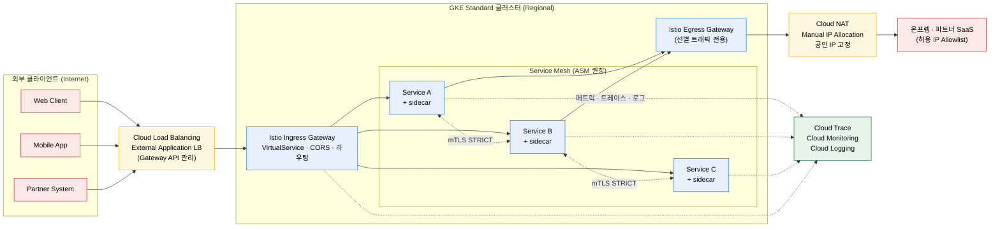


| 다이어그램 요소 | 본 가이드에서의 구성 |
|---|---|
| 외부 LB (XLB) | Cloud Load Balancing External Application LB, GKE Gateway API 로 관리 |
| Istio Ingress Gateway | `Gateway` + `VirtualService` 로 호스트 · 경로 · CORS 라우팅 |
| Service Mesh | Cloud Service Mesh (ASM) 권장, 요구에 따라 OSS Istio |
| mTLS | `PeerAuthentication` 을 `STRICT` 로 단계적 승격 |
| Istio Egress Gateway | 선별 트래픽 (온프렘 라이센스 서버 · 파트너 Allowlist · 감사 대상 SaaS) 만 경유 |
| Cloud NAT | `Manual IP Allocation` 으로 공인 IP 고정, egress 전용 노드 풀에 귀속 |
| Observability | ASM 자동 연동 (Cloud Trace · Monitoring · Logging) |

### 0.5 용어 정리

- **Service Mesh** — 사이드카 프록시 기반으로 서비스 간 트래픽을 가로채 정책 · 라우팅 · Observability를 수행하는 L7 플랫폼 레이어. 애플리케이션 코드와 분리되어 동작.
- **Sidecar Proxy** — 각 Pod 에 주입되는 Envoy 컨테이너. 애플리케이션 컨테이너의 인 · 아웃바운드 트래픽을 iptables 로 탈취.
- **Gateway (Istio)** — 메시의 경계에서 L7 리스너를 정의하는 Istio CRD. `Gateway` + `VirtualService` 조합으로 라우팅을 완성.
- **VirtualService** — 호스트 · 경로 · 헤더 · Weight-based Routing 규칙. CORS · 타임아웃 · 재시도 · 미러링을 선언적으로 기술.
- **DestinationRule** — 특정 대상 서비스의 traffic policy (connection pool · outlier detection · TLS · Load Balancing) 를 정의.
- **PeerAuthentication** — 네임스페이스 · 워크로드 단위 mTLS 모드 (`DISABLE` / `PERMISSIVE` / `STRICT`) 설정.
- **AuthorizationPolicy** — 누가 누구에게 어떤 메서드로 호출할 수 있는지 선언하는 L7 인가 규칙.
- **ServiceEntry** — 메시 외부 서비스를 메시에 "등록" 하는 객체. Egress Gateway 라우팅에 필수.
- **Fleet** — 여러 GKE 클러스터를 논리적으로 묶는 GCP 등록 단위.
- **Release Channel** — GKE 가 새 Kubernetes 버전을 제공하는 채널 (Rapid / Regular / Stable).
- **Blue-Green 노드 풀 업그레이드** — 신 버전 노드 풀을 나란히 올려 트래픽 이동 후 구 버전을 회수하는 전략. 중단 시간 실질적 0.
- **NodeLocal DNSCache** — 각 노드에 DaemonSet 으로 올라가는 DNS 캐시 레이어. Cache Miss 연쇄와 재시도를 줄임.
- **Cloud DNS for GKE** — CoreDNS 를 대체하는 GKE 내부 DNS 프로바이더. 메타데이터 서버를 통해 해결, SPOF 제거.

---

## 1. 대상 워크로드와 마이그레이션 동기

Cloud Run 은 Stateless HTTP 서비스를 가장 빠르게 올릴 수 있는 플랫폼이다. 초기 스타트업에는 대안이 잘 보이지 않을 정도로 적합하다. 그러나 서비스 수가 두 자리로 늘고, 서비스 간 호출이 촘촘해지며, 보안 · Observability · 비용 요구가 동시에 올라오는 단계가 오면 Cloud Run 의 단순함이 도리어 장벽이 된다.

| 제약 | 구체 증상 | 이전 후 기대 |
|---|---|---|
| LB 비용 증가 | 서비스 수와 LB 수가 선형 비례 | Ingress Gateway 에서 n → 1 통합 |
| Distributed Tracing 부재 | 서비스마다 OpenTelemetry Collector 를 따로 구성 | 사이드카가 자동으로 Cloud Trace 송신 |
| Cross-cutting concerns 분산 | mTLS · CORS · Circuit Breaker가 언어별로 흩어짐 | 메시 CRD 에서 한 곳으로 집중 |
| Cost Inversion | 상시 트래픽에서 Per-request Billing이 불리 | 노드 기반 GKE 가 TCO 우위 |

이 가이드는 위 네 가지 제약을 서비스 메시 레이어에서 한 번에 해소하는 표준 경로를 다룬다. GKE Autopilot 과 Standard 의 선택, 클러스터 토폴로지, OSS Istio 와 ASM 의 의사결정, mTLS · Ingress · Egress · Circuit Breaker의 구체 설정, 그리고 DNS 와 노드 풀 최적화까지 순서대로 정리한다.

---

## 2. GKE Standard 를 고르는 기준

GKE 에서 가장 먼저 결정해야 하는 것은 Autopilot 과 Standard 중 어디를 쓸지다. 이 선택은 단순한 Billing Model 비교가 아니라 **"노드 레이어를 얼마나 제어하고 싶은가"** 에 대한 답이다.

| 관점 | Autopilot | Standard |
|---|---|---|
| 노드 인프라 제어 | GKE 가 관리 | 직접 설계 |
| Billing Model | Pod 리소스 기준 | 노드 기준 |
| 머신 타입 선택 | 제한 | 자유 |
| 전용 노드 풀 (예: egress IP 고정) | 불가 | 가능 |
| Spot VM · GPU · TPU | 제한 | 지원 |
| 보안 하드닝 | 프리셋 제공 | 직접 설정 |
| 운영 자동화 수준 | 높음 | 중간 (옵션 조합 필요) |
| 학습 곡선 | 완만 | 가파름 |

실제 프로덕션에서는 **Standard 를 기본값으로 고르고, 운영 편의를 Autopilot 수준으로 끌어올리는 조합**을 가장 많이 만난다. 구체적으로는 Regional 클러스터 · Node Auto Provisioning · ComputeClasses · Cluster Autoscaler · Node Auto Repair 를 함께 켜면 일상 운영의 부담은 Autopilot 에 크게 못지않다. 반면 특수한 제어가 필요할 때 제약이 풀려 있다는 점이 Standard 의 실질적 이득이다.

팀 단위로 요구가 다르면 **클러스터별로 모드를 섞어도 된다.** 특수 제어가 필요 없는 내부 관리 도구용 클러스터는 Autopilot 으로, 프로덕션 트래픽이 몰리는 클러스터는 Standard 로 분리하는 방식이다. 모드를 통일하지 않는다고 해서 관리 도구나 Observability가 갈라지지는 않는다.

(공식 문서: *Choose a GKE cluster mode*, *GKE Autopilot overview*)

---

## 3. 클러스터 토폴로지 설계

### 3.1 단일 클러스터 통합의 함정 (The Single Cluster Pitfall)

GKE 를 처음 도입할 때 가장 흔한 실수는 모든 팀 · 서비스 · 환경을 하나의 대형 클러스터에 몰아넣는 것이다. 초기엔 관리 포인트가 적어 보이지만, 이 방식은 **Blast Radius 제어 · Resource Visibility** 세 축을 동시에 무너뜨린다. 반대로 모든 서비스에 각자 클러스터를 주면 관리 대상이 폭증한다.

| 접근 | 장점 | 치명적 약점 | 권장 |
|---|---|---|---|
| 단일 대형 클러스터 | 관리 포인트 최소 | IAM · Blast Radius · 쿼터 통제 실패 | 비권장 |
| 서비스당 1 클러스터 | 완벽한 격리 | 관리 대상이 폭증 | 비권장 |
| 팀 · 환경당 클러스터 | Blast Radius와 관리 부담의 균형 | Shared VPC 설계가 선행 과제 | 기본값 |

중간 해는 **조직 구조에 맞춘 적절한 Granularity 의 클러스터 분리** 다. 팀 간 호출이 드물다면 팀당 하나, 호출이 빈번하다면 공유 클러스터에 네임스페이스로 분리하는 식이다. 환경 (dev / stage / prod) 은 거의 항상 프로젝트를 나눠야 한다. 쿼터 · billing · IAM 이 프로젝트 경계에서 작동하기 때문이다. 결과적으로 **클러스터당 하나의 프로젝트, 팀당 별도 클러스터, 환경당 별도 프로젝트** 의 삼중 규칙이 대부분 조직에 맞는다.

### 3.2 Shared VPC — 먼저 결정해야 할 단 하나

네트워크 설계에서 가장 먼저 결정해야 하는 것은 Shared VPC 를 쓸지 여부다. 플랫폼 팀이 host project 에 네트워크를 두고 각 팀의 service project 가 서브넷을 공유하는 구조인데, 이것이 성립하면 Firewall · 라우트 · NAT · Cloud Armor 를 한 곳에서 일관되게 통제할 수 있다. **VPC-native (alias IP)** 와 **Shared VPC** 는 한 번 정하면 클러스터 재생성 없이는 되돌릴 수 없으므로, Discovery 단계에서 반드시 확정해 두어야 한다.

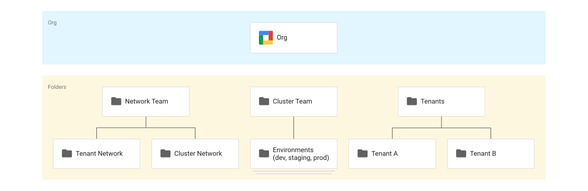

*그림: 엔터프라이즈 멀티테넌시 폴더 계층. Network · Cluster · Tenant 를 역할별로 나누고, 팀은 Tenant 폴더 아래 `dev / stage / prod` 프로젝트만 책임진다. (출처: Google Cloud 공식 문서 — Best practices for enterprise multi-tenancy)*


### 3.3 Regional 클러스터는 타협하지 않는다

프로덕션 클러스터는 예외 없이 Regional 로 만든다. 컨트롤 플레인이 3 존에 복제되어 Rolling Upgrade 중에도 API 가 살아 있고, 노드도 multi-zone 풀로 펼치면 Compute Engine host 이벤트에 덜 취약해진다. 비용 차이는 실운영에서 체감되는 수준이 아니며, 단일 존 클러스터의 장애 대응 비용과 비교하면 오히려 저렴하다.

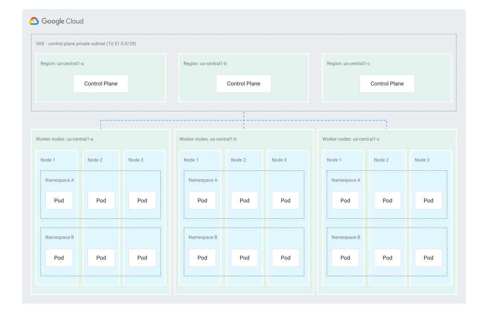

*그림: Regional 클러스터의 컨트롤 플레인 3-zone 복제 구조. (출처: Google Cloud 공식 문서 — Best practices for enterprise multi-tenancy)*

### 3.4 Multi-cluster 는 필요할 때만

Fleet · Multi-cluster Services (MCS) · Multi Cluster Ingress (MCI) 는 강력하지만, 초반부터 도입할 필요는 없다. 팀 간 호출이 드문 구조라면 MCS 의 `svc.clusterset.local` 같은 스키마 복잡도나 Cloud DNS 추가 비용이 득보다 크다. 단 **Fleet 등록** 자체는 비용이 없고 ASM · Config Sync · 향후 확장의 전제가 되므로, **모든 클러스터를 처음부터 Fleet 에 등록해 두는 것** 을 권장한다.

| 구성 | 도입 | 근거 |
|---|---|---|
| Multi-cluster Services (MCS) | 초기 비권장 | 팀 간 호출 빈도가 낮으면 Cloud DNS 비용과 스키마 복잡도가 이득을 상회 |
| Multi Cluster Ingress (MCI) | 초기 비권장 | 글로벌 LB 의 100+ PoP 에지는 단일 리전 운영에서 활용도 낮음 |
| Fleet 등록 | 모든 클러스터 | 비용 없음, ASM · 향후 확장의 전제 |

---

## 4. 서비스 메시 선택: OSS Istio vs Cloud Service Mesh (ASM)

Istio 를 도입한다는 결정 다음에 오는 분기는 **오픈소스 Istio 를 직접 설치할 것인가, 아니면 Google 관리형 Cloud Service Mesh (ASM) 를 쓸 것인가** 다. 많은 조직이 이 결정을 뒤로 미룬 채 OSS 로 먼저 시작하고, 몇 분기 뒤 버전 호환과 업그레이드 피로에 시달리다 ASM 으로 이전한다. 처음부터 명확히 판단하는 것이 이전 비용을 피하는 길이다.

### 4.1 책임 경계의 차이

| 항목 | OSS Istio | Cloud Service Mesh |
|---|---|---|
| 컨트롤 플레인 운영 | 고객 | Google |
| Istio ↔ K8s 버전 호환 | 고객이 분기마다 직접 확인 | Google 이 GKE 릴리스 채널별로 관리 |
| Cloud Trace · Monitoring · Logging 통합 | 애드온 · Collector 별도 구성 | 사이드카가 자동 송신 |
| GCP 공식 지원 | Best-effort (커뮤니티 의존) | Managed support (SLA) |
| 구성 전파 지연 | 수 초 | 수 초 ~ 수십 초 |
| 비용 | 노드 · LB 자원 | 노드 · LB 자원 + GKE Enterprise 에디션 |
| 초기 학습 곡선 | 가파름 | 완만 |

실무에서 가장 뼈아픈 포인트는 **GKE 의 3 개월 릴리스 채널과 Istio upstream 호환표를 수작업으로 맞춰야 한다는 점**이다. 작은 차이처럼 보이지만, 플랫폼 팀의 분기당 1~2 주가 이 검증에 녹는다. ASM 은 이 부분을 제거한다.

### 4.2 의사결정 체크리스트

두 옵션 중 어디가 맞는지는 아래 여섯 축을 직접 답해 보면 빠르게 드러난다.

| 판단 축 | OSS Istio 권장 지표 | ASM (Managed) 권장 지표 |
|---|---|---|
| Istio 내재화 · 학습 의지 | 지향 | 낮음 |
| 컨트롤 플레인 업그레이드 지휘 팀 | 있음 | 없음 |
| Cloud Trace · Monitoring 자동 연동 필요성 | 낮음 | 높음 |
| GKE 3-month 채널 호환 검증 여력 | 분기마다 가능 | 여력 부족 |
| Google 표준 Managed SLA 필요 | 불필요 | 필요 |
| GKE Enterprise 에디션 비용 수용 | 어려움 | 수용 가능 |

조직이 Istio 의 내부 동작을 학습하는 데 시간을 투자할 의향이 있고, 컨트롤 플레인 업그레이드를 직접 지휘할 팀이 있으며, 커뮤니티 의존을 감수할 수 있다면 OSS 도 합리적이다. 대형 플랫폼 기업이 OSS 를 선택하는 배경이 여기에 있다.

반대로 대부분의 비 (非) 인프라 중심 조직은 **ASM 부터 시작하는 편이 낫다.** Cloud Trace · Monitoring 의 자동 연동이 주는 Visibility 이득은 초기 Istio 운영에서 실수를 줄여준다. 경험상 가장 실용적인 결론은 이렇다. **처음 도입이라면 ASM 을 기본값으로 두고, OSS 는 스테이지 한 개 클러스터에만 얹어 학습 트랙으로 분리하는 것**이 총 비용이 가장 낮다.

### 4.3 마이그레이션 경로 — Canary 클러스터

OSS Istio 에서 ASM 으로의 이전은 *같은 클러스터에서 In-place로 컨트롤 플레인을 갈아끼우는 방식* 이 **공식적으로 지원되지 않는다**. 별도의 ASM 클러스터를 만들어 **Canary 클러스터 (50/50 트래픽 분할)** 로 이행하는 것이 공식 권고다.


(공식 문서: *Cloud Service Mesh managed control plane overview*, *Migrate from Istio to Cloud Service Mesh*)

---

## 5. 사전 준비

다음 권한과 활성화가 선행되어야 구성 단계로 넘어갈 수 있다.

1. **권한 확보**
   - `roles/container.admin` (Kubernetes Engine Admin)
   - `roles/compute.networkAdmin`, Shared VPC host project 에서는 `roles/compute.xpnAdmin`
   - `roles/gkehub.admin` (Fleet 관리)
   - ASM 도입 시 `roles/anthos.admin`

2. **필요 API 활성화 확인**

   ```bash
   gcloud services enable \
     container.googleapis.com \
     gkehub.googleapis.com \
     mesh.googleapis.com \
     anthos.googleapis.com \
     cloudtrace.googleapis.com \
     monitoring.googleapis.com \
     logging.googleapis.com \
     dns.googleapis.com \
     --project=PROJECT_ID
   ```

3. **Shared VPC 결정 및 host project 확정** — 3.2 절 참조. 한 번 정하면 클러스터 재생성 없이는 되돌릴 수 없다. 서브넷 · Pod · Service 의 보조 범위 CIDR 를 중첩 없이 사전 설계.

4. **허용할 공인 IP 대역 및 외부 호출 인벤토리 확정**
   - Ingress 로 열어둘 외부 호스트 (`*.example.com` 등)
   - Egress Gateway 를 통과시킬 대상 도메인 목록 → §6 Step 5 의 `ServiceEntry` 입력
   - 파트너 Allowlist용 Cloud NAT Manual IP CIDR

5. **릴리스 채널 결정** — 프로덕션은 Stable, 일반 dev · stage 는 Regular 를 기본값으로 검토. OSS Istio 와 병행이라면 Stable 이 안전하다.

---

## 6. 구성 단계

### Step 1. GKE Standard 클러스터 생성

Regional · VPC-native · Shared VPC 조합으로 생성한다.

```bash
gcloud container clusters create CLUSTER_NAME \
  --project=SERVICE_PROJECT \
  --location=REGION \
  --release-channel=stable \
  --enable-ip-alias \
  --network=projects/HOST_PROJECT/global/networks/VPC_NAME \
  --subnetwork=projects/HOST_PROJECT/regions/REGION/subnetworks/SUBNET \
  --cluster-secondary-range-name=PODS_RANGE \
  --services-secondary-range-name=SVCS_RANGE \
  --workload-pool=SERVICE_PROJECT.svc.id.goog \
  --enable-dataplane-v2 \
  --cluster-dns=clouddns \
  --cluster-dns-scope=cluster \
  --addons=NodeLocalDNS
```

- `--cluster-dns=clouddns` 는 §6 Step 8 에서 다룰 Cloud DNS for GKE 사전 활성화.
- `--workload-pool` 은 Workload Identity 로 사이드카 및 애플리케이션 Pod 의 GCP 자격 증명 관리 체계를 준비.
- 프로덕션은 `--num-nodes` 를 노드 풀별로 나누어 두 번째 풀부터 `gcloud container node-pools create` 로 분리 구성 (§7.3 참조).

### Step 2. Fleet 등록 및 Cloud Service Mesh 설치

ASM 을 기본 경로로 제시한다. OSS Istio 를 선택한 경우 본 단계를 `istioctl install` 절차로 대체한다.

```bash
# 클러스터를 Fleet 에 등록
gcloud container fleet memberships register MEMBERSHIP_ID \
  --gke-cluster=REGION/CLUSTER_NAME \
  --enable-workload-identity \
  --project=FLEET_PROJECT

# Cloud Service Mesh (managed control plane) 활성화
gcloud container fleet mesh update \
  --management=automatic \
  --memberships=MEMBERSHIP_ID \
  --project=FLEET_PROJECT

# 설치 상태 확인 (PROVISIONING → ACTIVE)
gcloud container fleet mesh describe --project=FLEET_PROJECT
```

활성화가 완료되면 ASM 이 GKE 릴리스 채널과 호환되는 Istio 버전을 자동으로 배포한다.

### Step 3. 사이드카 인젝션 활성화

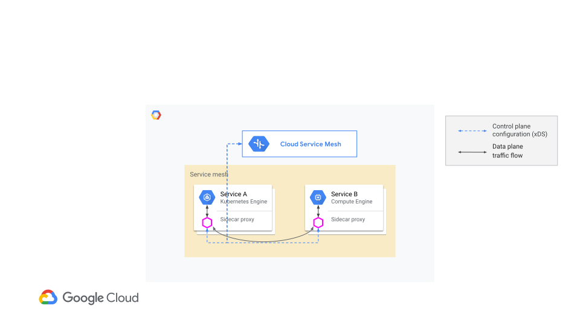

*그림: 사이드카 기반 Service Mesh 의 데이터 플레인 구조. (출처: Google Cloud 공식 문서 — Handle ingress traffic for your service mesh)*

애플리케이션 네임스페이스에 인젝션 라벨을 붙이고, 재배포로 반영한다.

```bash
# ASM (managed)
kubectl label namespace payments \
  istio.io/rev=asm-managed --overwrite

# OSS Istio
kubectl label namespace payments \
  istio-injection=enabled --overwrite

# 기존 Pod 를 재시작해 사이드카 주입
kubectl rollout restart deployment -n payments
```

`kube-system` · `istio-system` 은 절대 인젝션 대상이 아니며, **배치 · Job · CronJob · GPU 워크로드** 네임스페이스는 인젝션 여부를 개별 검토한다.

| 네임스페이스 유형 | 사이드카 주입 | 이유 |
|---|---|---|
| 일반 애플리케이션 | 활성화 | 기본 동작 |
| `kube-system`, `istio-system` | 제외 | 플랫폼 안정성 보호 |
| 배치 · Job · CronJob | 개별 검토 | 종료 순서 문제로 Job 이 멈추는 전형적 장애 |
| GPU · ML · Latency-sensitive 워크로드 | 개별 검토 | 사이드카 홉이 p99 레이턴시에 영향 |

Ambient (사이드카리스) 모드는 빠르게 성숙하고 있지만 공식 문서의 참조 비중이 아직 작다. 초기 도입은 보수적으로 사이드카 방식을 표준으로 삼고, 안정화 이후 재평가하는 순서를 권장한다.

### Step 4. Ingress Gateway 구성

Cloud Run 에서 서비스마다 LB 를 두던 패턴은 GKE + Istio 환경에서 **Ingress Gateway 한 곳에 호스트 · 경로 라우팅을 모으는 패턴** 으로 정리된다. 이 통합의 가장 큰 이점은 비용보다 **변경 속도** 다. CORS · 리라이트 · 헤더 기반 라우팅 · Canary · Traffic Mirroring 같은 변경이 모두 VirtualService CRD 한 곳에서 일어나며, 배포 재빌드 없이 수 초 안에 반영된다.

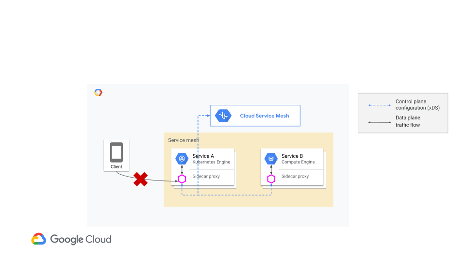

*그림: 사이드카는 Pod-to-Pod 트래픽만 처리하므로 인바운드는 반드시 Gateway 를 경유해야 한다. (출처: Google Cloud 공식 문서 — Handle ingress traffic for your service mesh)*

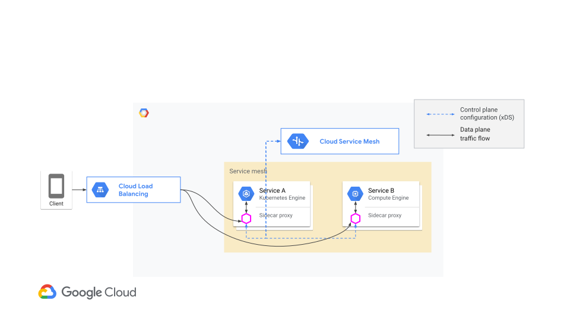

*그림: Cloud Load Balancing 이 프런트, Istio Ingress Gateway 가 메시 진입점, 뒤에 사이드카 기반 서비스들. (출처: Google Cloud 공식 문서 — Handle ingress traffic for your service mesh)*

`gateway.yaml`:

```yaml
apiVersion: networking.istio.io/v1beta1
kind: Gateway
metadata:
  name: edge-gateway
  namespace: istio-ingress
spec:
  selector: { istio: ingressgateway }
  servers:
    - port: { number: 443, name: https, protocol: HTTPS }
      tls: { mode: SIMPLE, credentialName: wildcard-tls }
      hosts: ["*.example.com"]
```

`virtualservice.yaml`:

```yaml
apiVersion: networking.istio.io/v1beta1
kind: VirtualService
metadata:
  name: api-route
  namespace: payments
spec:
  hosts: ["api.example.com"]
  gateways: ["istio-ingress/edge-gateway"]
  http:
    - match: [{ uri: { prefix: /v1/ } }]
      route: [{ destination: { host: payments-api, port: { number: 8080 } } }]
      corsPolicy:
        allowOrigins: [{ exact: "https://www.example.com" }]
        allowMethods: ["GET","POST","PUT","DELETE","OPTIONS"]
        allowHeaders: ["authorization","content-type"]
        maxAge: "600s"
```

```bash
kubectl apply -f gateway.yaml -f virtualservice.yaml
```

GKE 의 네이티브 **Gateway API** 와 Istio Ingress Gateway 는 배타적이지 않다. 바깥 L7 LB 를 Gateway API 로 관리하고, 메시 내부 라우팅은 VirtualService 에 맡기는 **2 층 구성** 이 실무에서 가장 자주 보인다.

| 기능 | Gateway API (GKE 네이티브) | Istio Ingress Gateway |
|---|---|---|
| Managed SSL (Certificate Manager) | 강함 | 불가 |
| Cloud Armor 연동 | 강함 | 불가 |
| 글로벌 외부 LB (100+ PoP) | 강함 | 불가 |
| Weight-based Traffic Splitting | 제한적 | 강함 |
| 헤더 · 경로 기반 라우팅 | 지원 | 강함 |
| Traffic Mirroring · retry · fault injection | 불가 | 강함 |
| CORS 정책 집중 관리 | 제한적 | 강함 |

요약하면 **"바깥 L7 는 Gateway API, 메시 내부는 Istio"** 다.

### Step 5. Egress Gateway — 선별 적용

Egress Gateway 는 "모든 외부 호출을 이 곳으로 통과시키자" 는 용도로 설계하면 대부분 실패한다. 성능 · 비용 · 운영 복잡도가 이득을 넘는다. 다음 세 시나리오에 한정해 사용한다.

| 시나리오 | 핵심 구성 | 놓치기 쉬운 지점 |
|---|---|---|
| 온프렘 라이센스 서버 호출 | Egress Gateway + TLS origination (`DestinationRule.tls.mode`) | 인증서 회전 자동화 · TLS 버전 호환 |
| 파트너 Allowlist 공인 IP 고정 | 전용 노드 풀 + Cloud NAT Manual IP allocation | NetworkPolicy 로 일반 Pod 의 직접 egress 차단 |
| 외부 SaaS 호출 감사 | ServiceEntry + 메시 로그 라우팅 | 외부 도메인 변경 시 정책 업데이트 누락 |

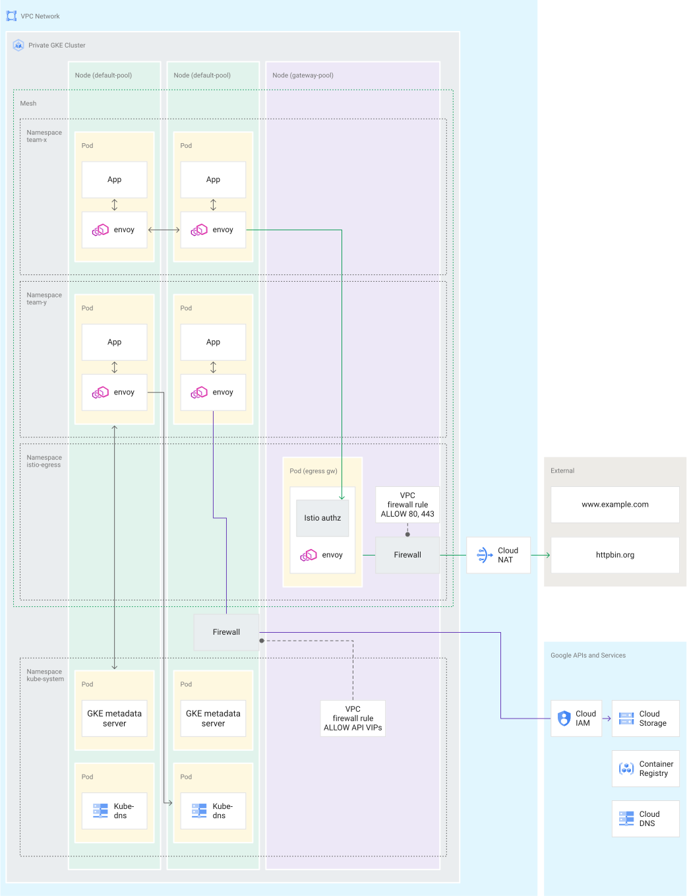

*그림: Egress 통제의 defense-in-depth 구조. 한 컴포넌트로는 통제가 완성되지 않는다. (출처: Google Cloud 공식 문서 — Egress gateways best practices)*

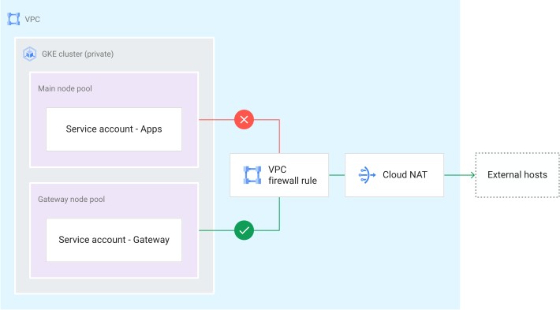

*그림: Egress gateway Pod 를 taint 가 있는 전용 노드 풀에만 스케줄하고, Cloud NAT 의 Manual IP Allocation 공인 IP 를 이 노드 풀에만 묶어 IP 를 고정. (출처: Google Cloud 공식 문서 — Egress gateways best practices)*

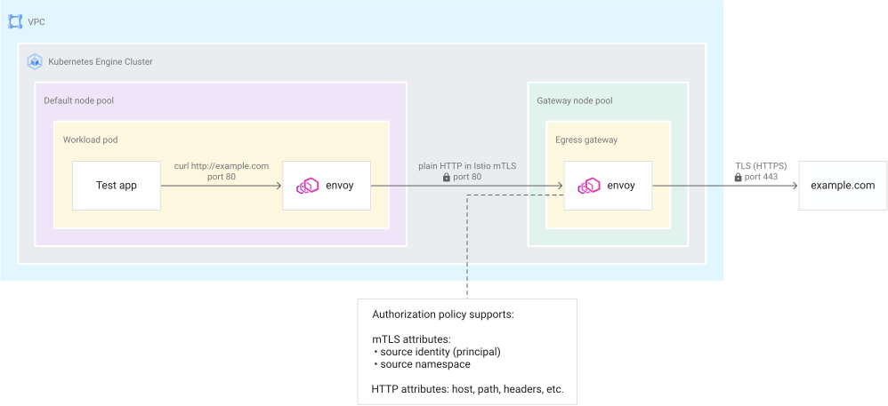

*그림: 애플리케이션은 Plaintext로 내부 Service 를 호출하고, egress gateway 가 외부 TLS 핸드셰이크를 수행한다. 애플리케이션 코드에서 인증서 관리 부담이 사라진다. (출처: Google Cloud 공식 문서 — Egress gateways best practices)*

`egress.yaml` (파트너 API 호출 예시):

```yaml
apiVersion: networking.istio.io/v1beta1
kind: ServiceEntry
metadata: { name: partner-api, namespace: istio-egress }
spec:
  hosts: ["api.partner.example.com"]
  ports: [{ number: 443, name: tls, protocol: TLS }]
  resolution: DNS
  location: MESH_EXTERNAL
---
apiVersion: networking.istio.io/v1beta1
kind: Gateway
metadata: { name: egress-gateway, namespace: istio-egress }
spec:
  selector: { istio: egressgateway }
  servers:
    - port: { number: 443, name: tls, protocol: TLS }
      hosts: ["api.partner.example.com"]
      tls: { mode: PASSTHROUGH }
```

```bash
kubectl apply -f egress.yaml

# 전용 노드 풀에 egress gateway 스케줄 고정
gcloud container node-pools create egress-pool \
  --cluster=CLUSTER_NAME --location=REGION \
  --num-nodes=2 \
  --node-taints=dedicated=egress-gateway:NoSchedule \
  --project=SERVICE_PROJECT

# Cloud NAT Manual IP 를 egress 노드 풀 전용으로 귀속
gcloud compute routers nats update NAT_NAME \
  --router=ROUTER_NAME --region=REGION \
  --nat-custom-subnet-ip-ranges=EGRESS_SUBNET \
  --nat-external-ip-pool=EGRESS_STATIC_IP
```

> [!IMPORTANT]: Egress Gateway 만 띄우고 NetworkPolicy 를 걸지 않으면 애플리케이션 Pod 가 여전히 직접 외부로 나갈 수 있다. `NetworkPolicy` 로 일반 Pod 의 egress 를 Gateway 로만 제한하고, VPC Firewall · Cloud NAT 바인딩 · `AuthorizationPolicy` 를 함께 걸어야 비로소 "Non-bypassable" 가 된다.

### Step 6. mTLS 단계적 STRICT 승격

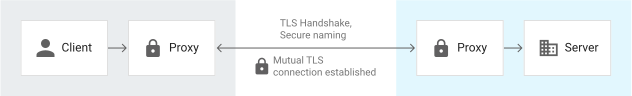

*그림: Client sidecar 와 Server sidecar 간 인증서 기반 상호 인증. (출처: Google Cloud 공식 문서 — Apply Istio mutual TLS)*

Istio 의 Auto mTLS 는 기본적으로 `PERMISSIVE` 모드로 동작한다. 사이드카가 상대 사이드카를 감지하면 자동으로 mTLS 로 전환하고, 감지하지 못하면 Plaintext를 허용한다. 문제는 많은 팀이 **PERMISSIVE 를 그대로 두고 mTLS 가 켜져 있다고 착각하는 것** 이다.

승격은 한 번에 전체 메시에 적용하지 않는다. 4 단계로 나눠 진행한다.

| 단계 | `PeerAuthentication` 모드 | 적용 범위 | 종료 기준 |
|---|---|---|---|
| 1 | 미설정 (Auto mTLS, 실효 PERMISSIVE) | 전체 | CSM 콘솔에서 암호화 비중 가시화 |
| 2 | PERMISSIVE 명시 | 전체 | Plaintext 허용이 의도된 상태임을 문서화 |
| 3 | STRICT | 저위험 네임스페이스 1~2 개 | 1~2 주 장애 없음 |
| 4 | STRICT | 전체 메시 | Unauthenticated workload = 0 |

`peer-auth.yaml`:

```yaml
apiVersion: security.istio.io/v1beta1
kind: PeerAuthentication
metadata:
  name: default
  namespace: payments
spec:
  mtls: { mode: STRICT }
```

```bash
# 승격 전 반드시 precheck
istioctl x precheck

# 사이드카 미주입 Pod 전수 목록
kubectl get pods -A -o json | \
  jq -r '.items[] | select(.metadata.namespace|test("^(kube|istio)-")|not) |
         select(.spec.containers|map(.name)|contains(["istio-proxy"])|not) |
         "\(.metadata.namespace)/\(.metadata.name)"'

kubectl apply -f peer-auth.yaml
```

> [!WARNING]: CronJob · Job · Init Container 같은 Ephemeral Workload가 주된 누락 후보다. 승격 시점 이후 새로 뜬 Pod 도 전수 점검에 포함해야 하므로, 승격 직전 `precheck` 를 반드시 한 번 더 돌린다. (공식 문서: *Apply Istio mutual TLS*, *Security best practices in Istio APIs*)

### Step 7. Circuit Breaker (DestinationRule)

Circuit Breaker는 **어디에서** 구현하느냐로 운영 성격이 크게 갈린다.

| 축 | 앱 레벨 라이브러리 | Istio DestinationRule |
|---|---|---|
| 언어 종속성 | 언어 · 프레임워크별 구현체 필요 | 언어 독립 |
| 정책 변경 | 앱 재배포 | CRD 수정으로 수 초 내 반영 |
| 격리 층위 | 호출자 프로세스 내부 | 호스트 풀 단에서 비정상 Pod 제외 |
| Observability 연동 | 앱 지표 (별도 수집) | 메시 메트릭 → Cloud Monitoring |
| 커스텀 fallback 로직 | 자유 | 제한 |
| 운영 주체 | 애플리케이션 팀 | 플랫폼 팀 |

플랫폼 팀이 메시 운영 권한을 갖고 있는 환경에서는 **Istio 레벨을 기본으로 가고, 비즈니스 fallback 로직이 필요한 부분만 앱 레벨로 보완**하는 조합이 가장 안정적이다.

`dest-rule.yaml`:

```yaml
apiVersion: networking.istio.io/v1beta1
kind: DestinationRule
metadata: { name: payments-api-cb, namespace: payments }
spec:
  host: payments-api
  trafficPolicy:
    connectionPool:
      tcp:  { maxConnections: 200 }
      http:
        http1MaxPendingRequests: 64
        http2MaxRequests:        1000
        maxRequestsPerConnection: 10
    outlierDetection:
      consecutive5xxErrors: 5
      interval:             10s
      baseEjectionTime:     30s
      maxEjectionPercent:   50
    tls: { mode: ISTIO_MUTUAL }
```

| 필드 | 의미 | 초기값 예시 | 튜닝 신호 |
|---|---|---|---|
| `connectionPool.tcp.maxConnections` | 대상 호스트당 최대 TCP 연결 | 200 | 정상 부하에서 TCP 포화 시 상향 |
| `connectionPool.http.http1MaxPendingRequests` | Pending HTTP/1 요청 한도 | 64 | Queue Timeout이 잦으면 상향, Cascading Failure이면 하향 |
| `connectionPool.http.http2MaxRequests` | 호스트당 HTTP/2 동시 요청 | 1000 | HTTP/2 에서만 적용 |
| `outlierDetection.consecutive5xxErrors` | 연속 5xx 오류 기준 | 5 | 정상 Pod 차단이 잦으면 상향 |
| `outlierDetection.baseEjectionTime` | Base Ejection Time | 30 s | Retry Storm이 보이면 상향 |
| `outlierDetection.maxEjectionPercent` | Max Ejection Percent | 50 | 너무 높이면 가용 Pod 부족 위험 |

> [!WARNING]: 위 값은 일반적 HTTP JSON API 의 초기 시작점이지 범용 권고치가 아니다. 실제 운영값은 Load Testing의 p95 레이턴시와 최대 동시 요청을 기준으로 튜닝해야 한다.

현장에서 자주 마주치는 함정 하나. **앱 레벨 재시도와 메시 레벨 재시도가 중첩되면** 실패가 exponential 하게 증폭된다. 재시도는 반드시 한 레이어에서만 수행하도록 결정하고, 타임아웃은 상위에서 하위로 갈수록 짧아지는 계단 구조로 잡는다.

### Step 8. DNS 전환 — Cloud DNS for GKE + NodeLocal DNSCache

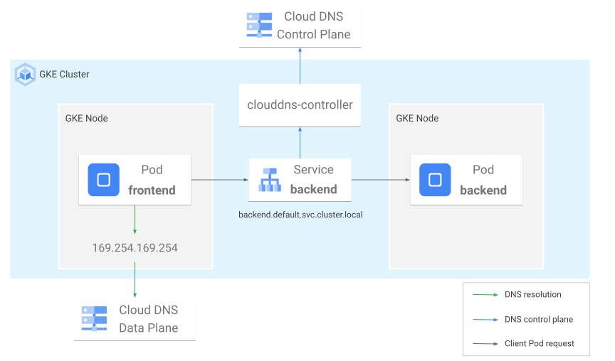

*그림: Cloud DNS for GKE 질의 흐름. 클러스터 내부에 CoreDNS Pod 가 없어 SPOF 가 제거된다. (출처: Google Cloud 공식 문서 — About Cloud DNS for GKE)*

클러스터 내부 DNS 는 대부분 조용히 동작하다가 특정 조건에서 갑작스럽게 문제를 드러낸다.

| 증상 | 추정 뿌리 원인 | 트리거 |
|---|---|---|
| 특정 길이 이상 도메인 질의 실패 | UDP 버퍼 한계 · 응답 Truncation | 긴 FQDN · 다수의 CNAME 체인 |
| 트래픽 급증 시 레이턴시 폭증 | Cache Miss 연쇄 | Scale-out 직후 신규 호스트 질의 집중 |
| 전체 DNS 일시 중단 | CoreDNS Pod 재시작 · OOM | 메모리 한계 · leader 선출 지연 |

세 요소를 조합한다.

| 구성 | 역할 | 초기 도입 시 |
|---|---|---|
| Cloud DNS for GKE | 클러스터 내부 DNS 프로바이더 | 기본값으로 전환 |
| NodeLocal DNSCache | 노드당 캐시 레이어 | 병용 |
| External DNS | 외부 공개 도메인 자동 레코드 관리 | 기존 사용 유지 |

Cloud DNS 스코프는 세 가지가 있다. 팀 간 호출이 드문 구조라면 **cluster-scope 로 시작** 해도 충분하고, 뒤에서 확장이 필요해지면 스코프만 바꾸면 된다.

```bash
gcloud container clusters update CLUSTER_NAME \
  --location=REGION \
  --cluster-dns=clouddns \
  --cluster-dns-scope=cluster \
  --project=SERVICE_PROJECT
```

> [!WARNING]: 이 전환은 클러스터 재생성 없이 가능한 경우가 많지만 노드 풀 Rolling Upgrade가 유발될 수 있다. 실시간 트래픽이 있는 클러스터는 반드시 유지보수 윈도우에 수행하고, §7.2 의 blue-green 노드 풀 업그레이드 전략과 함께 적용한다. (공식 문서: *About Cloud DNS for GKE*, *Service discovery and DNS*)

---

## 7. Observability 및 GKE 최적화

### 7.1 ASM Observability 자동 연동

ASM 을 쓸 때 체감되는 이득 중 가장 큰 것은 Observability다. Cloud Monitoring · Cloud Logging · Cloud Trace 가 별도 설정 없이 연결되고, 서비스 토폴로지도 자동으로 그려진다. 4 골든 시그널 중 latency · traffic · errors 세 가지는 기본 대시보드에서 바로 확인할 수 있다.

| 프로토콜 | 메트릭 수집 | 콘솔 기본 대시보드 | 대안 |
|---|---|---|---|
| HTTP | 수집 | 제공 | 없음 — 기본 대시보드 사용 |
| gRPC | 수집 | 미제공 | Cloud Monitoring 커스텀 대시보드 |
| TCP (raw) | 부분 수집 | 미제공 | 애플리케이션 계층 지표 병행 |

gRPC · TCP 중심 서비스가 많다면 Cloud Monitoring 에서 커스텀 대시보드를 만들어 두는 편이 낫다. (공식 문서: *Cloud Service Mesh observability overview*)

### 7.2 업그레이드 — Regional + Blue-Green + Release Channel

| 채널 | 신버전 제공 속도 | 안정도 | 적합 클러스터 |
|---|---|---|---|
| Rapid | 가장 빠름 | 낮음 | 새 기능 실험용 dev |
| Regular | 중간 | 중간 | 일반 dev · stage |
| Stable | 3~6 개월 지연 | 높음 | 프로덕션 · Istio OSS 병행 |
| No channel | 수동 | 관리 부담 큼 | 권장하지 않음 |

프로덕션에서 Rapid 를 쓰다가 Istio upstream 호환 이슈로 업그레이드가 막히는 상황을 몇 번 겪고 나면, Stable 의 가치가 선명해진다.

노드 풀 업그레이드 전략은 **Blue-Green** 을 기본으로 한다. Surge 는 빠르지만 롤백 경로가 좁다.

```bash
# Blue-green 으로 노드 풀 업그레이드
gcloud container node-pools update POOL_NAME \
  --cluster=CLUSTER_NAME --location=REGION \
  --enable-blue-green-upgrade \
  --standard-rollout-policy=batch-node-count=1,batch-soak-duration=60s \
  --node-pool-soak-duration=1h
```

> **중요 — Compute Engine host 이벤트**: VM live migration · 보안 패치는 유지보수 윈도우를 무시한다. `PodDisruptionBudget` 과 multi-zone 노드 풀을 필수로 걸어야 예상 못한 노드 재시작에도 애플리케이션 가용이 유지된다. (공식 문서: *About cluster upgrades*, *Maintenance windows and exclusions*)

### 7.3 노드 풀 — 역할 분리

노드 풀을 하나로 두는 것은 초기 실수 중 하나다. 시스템 컴포넌트와 애플리케이션, Spot 워크로드와 상시 워크로드, 그리고 Istio egress gateway 같은 IP 고정 노드가 한 풀에 섞이면 업그레이드 · 스케줄링 · 비용이 모두 꼬인다.

| 노드 풀 | 역할 | 특성 |
|---|---|---|
| `system` | kube-system · istio-system · Observability 에이전트 | e2-standard, 재시작 민감 |
| `app-general` | 대부분의 애플리케이션 Pod | n2-standard, Cluster Autoscaler |
| `app-spot` | 배치 · 비동기 · 재시도 가능 워크로드 | Spot VM, `spot=true:NoSchedule` taint |
| `egress-gateway` | Istio egress gateway 전용 | 소형 풀, Manual NAT IP 고정 |
| `ingress-gateway` (선택) | Istio ingress gateway 전용 | 네트워크 성능 우선 인스턴스 |

Node Auto Provisioning 과 ComputeClasses 를 조합하면 **특수 워크로드가 들어왔을 때 필요한 노드 풀이 자동으로 생성** 되도록 확장할 수 있다. 모든 경우에 미리 풀을 만들어둘 필요는 없다.

### 7.4 비용 최적화 레버 — 적용 순서

| 순서 | 레버 | 기대 효과 | 리스크 |
|---|---|---|---|
| 1 | Vertical Pod Autoscaler (VPA) | Over-provisioning 회수 | 초기 추천값으로 인한 OOM 재시작 |
| 2 | Horizontal Pod Autoscaler (HPA) | 수요 기반 Pod 수 조정 | 메트릭 선택 오류 시 Thrashing |
| 3 | Cluster Autoscaler + Node Auto Provisioning | 노드 자동 조정 | 잦은 스케일링이 지연을 유발 |
| 4 | Spot VM | 배치 · 비동기 비용 절감 | 중단 가능 — 재시작 내성 필요 |
| 5 | Committed Use Discount (CUD) | 장기 고정 워크로드 할인 | 약정 대비 수요 감소 시 비용 고착 |
| 6 | 사이드카 주입 제외 (배치 네임스페이스) | 메시 오버헤드 제거 | 메시 정책 필요한 워크로드 누락 위험 |
| 7 | 이미지 최적화 · 로그 볼륨 조정 | 디스크 I/O · 로깅 비용 절감 | 디버깅 정보 부족 위험 |

대부분의 조직에서 비용 절감의 7~8 할은 1~3 단계에서 나온다. 나머지는 누적 효과다.

### 7.5 Observability 기본값

Managed OpenTelemetry for GKE 를 활성화해 메시 지표와 애플리케이션 지표를 단일 파이프라인으로 수집한다. VPC Service Controls 를 쓰고 있다면 **Policy Denied Audit Log (`cloudaudit.googleapis.com/policy`) 가 프로젝트 스코프** 에 저장된다는 점을 기억해둘 만하다. 조직 전역에서 위반을 분석하려면 Aggregated Log Sink 를 구성해 별도 BigQuery 또는 Logging bucket 으로 라우팅한다.

---

## 8. 검증 (실제 테스트 절차)

### 8.1 Ingress 라우팅 검증

- 외부 브라우저에서 `https://api.example.com/v1/health` 호출 → 200 OK.
- `curl -sI` 로 `server: istio-envoy` 응답 헤더 확인.
- Cloud Load Balancing 콘솔에서 NEG backend 에 사이드카 엔드포인트가 등록되어 있음을 확인.

```bash
curl -sI https://api.example.com/v1/health | grep -i '^server'
# 기대: server: istio-envoy
```

### 8.2 사이드카 주입 확인

```bash
istioctl x precheck

# 미주입 Pod 전수 조회 (kube-system · istio-system 제외)
kubectl get pods -A -o json | \
  jq -r '.items[] | select(.metadata.namespace|test("^(kube|istio)-")|not) |
         select(.spec.containers|map(.name)|contains(["istio-proxy"])|not) |
         "\(.metadata.namespace)/\(.metadata.name)"'
```

출력이 비어 있어야 STRICT 승격이 안전하다.

### 8.3 mTLS STRICT 검증

```bash
# 사이드카가 없는 임시 Pod 에서 서비스 호출 → 차단 기대
kubectl run debug --rm -it \
  --image=curlimages/curl --restart=Never -- \
  curl -v http://payments-api.payments:8080/health
# 응답: Connection reset / 커넥션 거부
```

### 8.4 Egress 통제 검증 — 공인 IP 고정 확인

```bash
# Egress gateway 경유로 외부 API 호출, 상대가 본 source IP 확인
kubectl exec -n payments deploy/payments-api -- \
  curl -sS https://api.partner.example.com/echo-ip
# 응답의 IP 가 Cloud NAT Manual IP CIDR 에 속해야 함
```

### 8.5 DNS 질의 응답 검증

```bash
kubectl run dns-test --rm -it \
  --image=busybox:1.36 --restart=Never -- \
  sh -c 'nslookup long-subdomain-name.internal.svc.cluster.local; \
         time nslookup payments-api.payments.svc.cluster.local'
# 응답 정상 + 레이턴시 수 ms 수준 기대
```

### 8.6 Cloud Trace · Monitoring 연동 확인

- Google Cloud 콘솔 → Cloud Trace → 최근 요청 중 서비스 간 span 이 연결된 trace 가 나타나는지 확인.
- Cloud Monitoring → Anthos Service Mesh 대시보드 → latency · traffic · error 세 시그널이 기본 제공되는지 확인.

### 8.7 회귀 테스트 체크리스트

- [ ] Cloud Run 시절과 동일한 트래픽 패턴으로 Load Testing 통과 (p95 레이턴시 증가 10% 이내)
- [ ] 사이드카 주입 정책이 네임스페이스별로 의도대로 적용 (precheck 0 건)
- [ ] mTLS STRICT 상태에서 정상 서비스 호출 성공, 사이드카 없는 워크로드는 차단
- [ ] Egress Allowlist 공인 IP 대역에서만 외부 SaaS 접근 가능
- [ ] DNS 전환 후 CoreDNS Pod 없음 확인, Cloud Monitoring 에 DNS 질의 메트릭 수집
- [ ] Cloud Trace 에 서비스 간 span 연결 확인
- [ ] Cloud Monitoring ASM 대시보드에서 latency · traffic · errors 3 시그널 가시
- [ ] Blue-green 노드 풀 업그레이드 리허설 성공, 트래픽 이동 중 에러 0
- [ ] PodDisruptionBudget 이 걸려 있어 노드 드레인 중 서비스 가용 유지

---

## 9. 마이그레이션 로드맵

Cloud Run 에서 GKE + Istio 로의 이전은 한 번에 끝나지 않는다. 아래 4 단계는 많은 조직에서 반복적으로 유효했던 진행 순서다.


| 단계 | 범위 | 종료 기준 | 예상 기간 | 주 리스크 |
|---|---|---|---|---|
| Phase 1 — 기반 플랫폼 | Shared VPC · 조직 정책 · Fleet 등록 · 첫 dev GKE Standard 클러스터 | CI/CD 가 해당 클러스터에 정상 배포 | 3~4 주 | Shared VPC 설계 오류로 인한 재작업 |
| Phase 2 — Pilot 서비스 | 1 개 서비스를 ASM 과 함께 프로덕션 이관 | Istio Ingress 경유 트래픽 100%, Cloud Trace 대시보드 확보 | 4~6 주 | Cloud Run ↔ GKE 동작 차이 (Cold Start · 헤더 · 리소스) |
| Phase 3 — 확산 + LB 통합 | 4~5 개 서비스 확산 + 기존 Cloud Run LB 통합 | 서비스별 개별 LB 수 ≤ 2 | 6~10 주 | CORS · TLS 인증서 이행 이슈 |
| Phase 4 — 전면 확산 · STRICT mTLS | 전체 이전 + STRICT mTLS + SLO 정착 | Unauthenticated workload = 0, SLO 90 일 연속 만족 | 8~12 주 | STRICT 승격 시 사이드카 미주입 워크로드 누락 |

**Phase 1 — 기반 플랫폼.** 이 단계의 가장 큰 리스크는 Shared VPC 를 잘못 설계해 이후 재작업하는 비용이다. 서두르지 않는 것이 빠른 길이다.

**Phase 2 — Pilot 서비스.** Cloud Run 과 GKE 의 동작 차이 (Cold Start · Resource Allocation · 헤더 처리) 가 여기에서 드러난다. Pilot 대상은 "비즈니스 중요도는 중간, 트래픽 특성은 대표적" 인 서비스를 고른다.

**Phase 3 — 확산과 LB 통합.** CORS · TLS 인증서 이행이 이 단계에서 가장 까다롭다. 도메인별로 점진적으로 옮기되, 매 이행 때 롤백 경로를 미리 잡아둔다.

**Phase 4 — 전면 확산과 STRICT mTLS.** "Unauthenticated workload 가 0" 을 운영 지표로 추적하고, SLO 가 90 일 연속 만족하는 시점을 이 단계의 실제 종료로 본다.

**기술 지원 구분.** 운영 중 문제는 결국 지원 채널에서 풀린다. OSS Istio 는 GCP 기준 Best-effort 지원이고, ASM 은 Google 의 Managed SLA 가 적용된다. 파트너 운영 지원을 계약한다면 **설치 · 튜닝 · 업그레이드 · 장애 대응** 네 축에서 응답 시간과 on-call 커버리지를 구체적으로 문서화해 두는 것이 뒤의 분쟁을 예방한다.

---

## 10. 주의사항 / 한계

1. **Shared VPC 는 되돌리기 어렵다** — VPC-native + Shared VPC 선택은 클러스터 재생성 없이 전환이 사실상 불가능하다. 사전에 host project · 서브넷 CIDR · Pod · Service 보조 범위를 확정해 두어야 한다.

2. **STRICT mTLS 전환 시 Ephemeral Workload 누락** — CronJob · Job · Init Container 에 사이드카 주입이 빠진 채로 STRICT 로 승격하면 전환 순간 차단된다. `istioctl x precheck` 는 반드시 승격 직전 (새로 뜬 Pod 포함) 한 번 더 실행한다.

3. **Egress Gateway 는 혼자서 Allowlist를 보장하지 않는다** — 전용 노드 풀 · Cloud NAT Manual IP · NetworkPolicy (일반 Pod egress 차단) · AuthorizationPolicy 가 동시에 성립해야 외부에서 보는 공인 IP 가 예측 가능한 값으로 수렴한다. 단일 컴포넌트로 충분하다고 생각하면 반드시 우회 경로가 생긴다.

4. **OSS Istio 와 GKE 3-month 릴리스 채널의 호환 관리** — 분기마다 Kubernetes ↔ Istio 버전 호환표를 수작업으로 맞춰야 한다. 플랫폼 팀의 분기당 1~2 주가 이 검증에 녹는다. ASM 을 쓰면 이 부분을 Google 이 관리한다.

5. **ASM 콘솔 대시보드는 HTTP 메트릭 중심** — gRPC · TCP 는 메트릭이 수집되지만 콘솔 시각화가 제한된다. gRPC 중심 서비스가 많다면 Cloud Monitoring 에서 커스텀 대시보드를 사전에 준비한다.

6. **Compute Engine host 이벤트는 유지보수 윈도우를 무시한다** — VM live migration 과 보안 패치는 maintenance window / exclusion 설정을 따르지 않는다. `PodDisruptionBudget` + multi-zone 노드 풀이 있어야 가용성이 유지된다.

7. **Multi-cluster Services (MCS) 는 Cloud DNS 추가 비용을 수반** — 팀 간 호출이 드문 구조에서는 이득보다 비용 · 복잡도가 크다. Fleet 등록은 무료이지만 MCS 활성화는 선별적으로.

8. **Circuit Breaker 임계값은 공식 권고치가 없다** — GKE · Istio 레퍼런스 모두 예시값만 제공한다. 실제 임계값은 각 서비스의 p95 레이턴시 · 동시 요청 · 재시도 정책을 기준으로 Load Testing로 결정해야 한다.

9. **Ambient (사이드카리스) 모드는 아직 초기 도입 비권장** — 공식 문서의 참조 비중이 작고 패턴이 성숙하지 않았다. 사이드카 방식을 표준으로 도입한 뒤 재평가하는 순서를 권장한다.

10. **Cloud Run → GKE 동작 차이** — Cold Start · Resource Allocation · 헤더 처리 · 환경 변수 주입이 플랫폼마다 다르다. Pilot 단계에서 한 서비스의 end-to-end 동작을 Load Testing로 비교 확인하는 절차를 반드시 포함한다.

---

## 11. 참고 (공식 문서)

- Choose a GKE cluster mode — `https://cloud.google.com/kubernetes-engine/docs/concepts/choose-cluster-mode`
- GKE Autopilot overview — `https://cloud.google.com/kubernetes-engine/docs/concepts/autopilot-overview`
- Best practices for enterprise multi-tenancy — `https://cloud.google.com/kubernetes-engine/docs/best-practices/enterprise-multitenancy`
- Setting up clusters with Shared VPC — `https://cloud.google.com/kubernetes-engine/docs/how-to/cluster-shared-vpc`
- GKE networking best practices — `https://cloud.google.com/kubernetes-engine/docs/best-practices/networking`
- About Cloud DNS for GKE — `https://cloud.google.com/kubernetes-engine/docs/concepts/about-cloud-dns`
- Service discovery and DNS — `https://cloud.google.com/kubernetes-engine/docs/concepts/service-discovery`
- Multi-cluster Services — `https://cloud.google.com/kubernetes-engine/docs/concepts/multi-cluster-services`
- Multi Cluster Ingress — `https://cloud.google.com/kubernetes-engine/docs/concepts/multi-cluster-ingress`
- GKE Gateway API — `https://cloud.google.com/kubernetes-engine/docs/concepts/gateway-api`
- External Application Load Balancer Ingress — `https://cloud.google.com/kubernetes-engine/docs/concepts/ingress-xlb`
- About cluster upgrades — `https://cloud.google.com/kubernetes-engine/docs/concepts/cluster-upgrades`
- Maintenance windows and exclusions — `https://cloud.google.com/kubernetes-engine/docs/concepts/maintenance-windows-and-exclusions`
- Best practices for upgrading clusters — `https://cloud.google.com/kubernetes-engine/docs/best-practices/upgrading-clusters`
- About node pools — `https://cloud.google.com/kubernetes-engine/docs/concepts/node-pools`
- Node auto-provisioning — `https://cloud.google.com/kubernetes-engine/docs/concepts/node-auto-provisioning`
- Managed OpenTelemetry for GKE — `https://cloud.google.com/kubernetes-engine/docs/concepts/managed-otel-gke`
- Cloud Service Mesh overview — `https://cloud.google.com/service-mesh/docs/overview`
- Cloud Service Mesh managed control plane overview — `https://cloud.google.com/service-mesh/docs/managed-control-plane-overview`
- Migrate from Istio to Cloud Service Mesh — `https://cloud.google.com/service-mesh/docs/migrate-istio-to-anthos-service-mesh`
- Handle ingress traffic for your service mesh — `https://cloud.google.com/service-mesh/docs/service-routing/ingress-traffic`
- Egress gateways best practices — `https://cloud.google.com/service-mesh/docs/security/egress-gateways-best-practices`
- Apply Istio mutual TLS — `https://cloud.google.com/service-mesh/docs/tutorials/mtls`
- Security best practices in Istio APIs — `https://cloud.google.com/service-mesh/docs/istio-apis/security-best-practices`
- Cloud Service Mesh observability overview — `https://cloud.google.com/service-mesh/docs/observability-overview`
