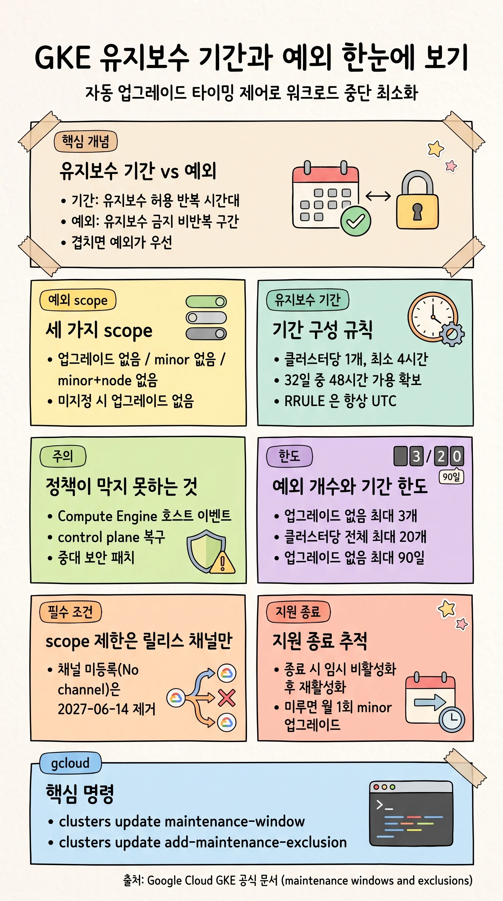

## 개요

GKE 유지보수 정책은 자동 업그레이드 같은 일부 클러스터 유지보수가 **언제 일어날 수 있고 없는지**를 통제하는 정책입니다. 유지보수 기간(maintenance window)과 유지보수 예외(maintenance exclusion) 두 가지로 구성합니다. 예를 들어 유통 기업은 유지보수를 평일 저녁으로만 제한하고, 주요 세일 이벤트 기간에는 자동 유지보수를 막을 수 있습니다.

- **유지보수 기간**은 GKE 자동 유지보수가 **허용되는 반복 시간대**입니다. 클러스터당 하나만 설정합니다.
- **유지보수 예외**는 GKE 자동 유지보수가 **금지되는 비반복 시간대**입니다. 클러스터당 여러 개를 설정할 수 있습니다.
- GKE 는 열린 유지보수 기간이 있고 활성 유지보수 예외가 없을 때 정책을 존중하는 자동 변경을 수행합니다 ([Maintenance windows and exclusions](https://docs.cloud.google.com/kubernetes-engine/docs/concepts/maintenance-windows-and-exclusions)).
- 예외와 유지보수 기간이 겹치면 **예외가 우선**합니다.

> [!IMPORTANT]
> 유지보수 기간과 예외는 특정 유형의 GKE 클러스터 유지보수 타이밍만 제어합니다. GKE 가 의존하는 서비스(Compute Engine 등)의 유지보수 타이밍은 제어하지 않습니다. 정책을 설계하기 전에 어떤 변경이 정책을 존중하고 존중하지 않는지 반드시 확인해야 합니다 ([Maintenance windows and exclusions](https://docs.cloud.google.com/kubernetes-engine/docs/concepts/maintenance-windows-and-exclusions)).

> **본 가이드 대상 독자:** GKE 클러스터의 자동 업그레이드 타이밍을 제어해 업그레이드로 인한 워크로드 중단을 관리하려는 플랫폼/SRE 엔지니어를 대상으로 합니다.

## 정책을 존중하는 변경과 존중하지 않는 변경

정책을 구성하기 전에, 유지보수 기간과 예외가 무엇을 막고 무엇을 막지 못하는지 이해해야 합니다.

### 정책을 존중하는 자동 유지보수

- 자동 클러스터 업그레이드(control plane 업그레이드와 node 업그레이드 포함)
- 노드를 재생성하거나 클러스터 내부 네트워크 토폴로지를 크게 바꾸는, 사용자가 시작한 구성 변경

### 정책을 존중하지 않는 자동 유지보수

> [!CAUTION]
> 다음 유형의 유지보수는 유지보수 기간과 예외를 따르지 않습니다. 정책만으로 모든 중단을 막을 수 없으므로 워크로드가 중단에 대비되어 있는지 확인해야 합니다 ([Maintenance windows and exclusions](https://docs.cloud.google.com/kubernetes-engine/docs/concepts/maintenance-windows-and-exclusions)).

- **기타 Google Cloud 유지보수**: GKE 노드는 GKE 가 관리하는 Compute Engine VM 이며, 호스트 이벤트(유지보수 이벤트, 호스트 오류)를 겪을 수 있습니다. 대부분 VM 은 기본적으로 live migration 으로 처리해 거의 무중단이지만, GPU 나 TPU 등 [일부 VM 은 live migration 을 수행할 수 없습니다](https://docs.cloud.google.com/compute/docs/instances/live-migration-process#limitations). 가속기를 사용한다면 노드 유지보수로 인한 중단 처리 방법을 미리 확인합니다.
- **자동 복구와 크기 조정**: control plane 복구(크기 조정, 재시작)는 대부분 유지보수 기간과 예외를 무시합니다. 복구를 못 하면 클러스터가 동작 불능이 될 수 있기 때문입니다. control plane 복구는 비활성화할 수 없습니다. 다만 Autopilot 클러스터와 Standard regional 클러스터는 control plane 복제본이 여러 개라 유지보수 중에도 Kubernetes API 서버 고가용성을 유지합니다. control plane 이 하나뿐인 **Standard zonal 클러스터**는 유지보수 중 일시적으로 수정할 수 없으며, 워크로드 배포도 불가합니다.
- **중대 보안 취약점 패치**: 유지보수 기간과 예외가 보안 패치를 지연시킬 수 있으나, GKE 는 [중대 보안 취약점](https://docs.cloud.google.com/kubernetes-engine/docs/resources/security-patching#how_vulnerabilities_are_classified)에 대해 정책을 무시하고 패치할 권리를 유지합니다.
- **Spanner 기반 클러스터 상태 데이터베이스 유지보수**: 일부 GKE 클러스터는 Kubernetes API 리소스 상태를 Spanner 키값 DB 에 저장합니다. 이 DB 유지보수는 활성 기간/예외를 무시하지만, 복제되어 있어 유지보수 중에도 가용합니다.

### 정책을 존중하는 수동 변경

일부 노드/네트워크 구성 변경은 새 구성을 적용하기 위해 노드를 재생성해야 합니다. 다음 변경은 GKE 유지보수 정책을 존중하므로, 열린 유지보수 기간과 활성 예외 없음 조건을 기다립니다.

- control plane IP 주소 회전, control plane 자격 증명 회전
- shielded node 구성, network policy 구성, intranode visibility 구성
- NodeLocal DNSCache 구성, GKE Sandbox 구성

이 변경들을 노드에 수동 적용하려면, 노드 풀이 이미 실행 중인 버전과 동일한 GKE 버전을 `--cluster-version` 에 지정해 `gcloud container clusters upgrade` 를 호출합니다.

## 유지보수 기간

유지보수 기간은 control plane 과 node 의 자동 업그레이드 등 적용 대상 자동 유지보수가 발생할 시간을 제어해 일시적 중단을 완화합니다. 대표적인 활용 시나리오는 다음과 같습니다.

- **비피크 시간대**: 트래픽이 적은 시간에 자동 업그레이드를 예약해 다운타임 가능성을 최소화합니다.
- **온콜 대응**: 담당자가 모니터링할 수 있는 업무 시간에 업그레이드가 일어나도록 합니다.
- **다중 클러스터 업그레이드**: 여러 리전의 클러스터에 지정 간격으로 하나씩 업그레이드를 롤아웃합니다.

> [!NOTE]
> GKE 는 유지보수 기간 밖에서도 계획되지 않은 긴급 업그레이드를 롤아웃할 권리를 유지하며, 폐기되거나 오래된 소프트웨어에 대한 필수 업그레이드는 유지보수 기간 밖에서 자동으로 일어날 수 있습니다. 수동 업그레이드는 즉시 시작되며 유지보수 기간을 무시합니다 ([Maintenance windows and exclusions](https://docs.cloud.google.com/kubernetes-engine/docs/concepts/maintenance-windows-and-exclusions)).

### 유지보수 기간 구성 시 고려사항

- 클러스터당 유지보수 기간은 하나만 설정할 수 있고, 새 기간을 설정하면 이전 기간을 덮어씁니다.
- 32일 rolling window 안에 최소 48시간의 유지보수 가용 시간을 허용해야 합니다. 연속된 4시간 이상 구간만 가용 시간으로 인정됩니다.
- 요일 반복은 항상 UTC 기준입니다. 따라서 요일 반복이 있는 유지보수 기간은 gcloud CLI 로 전부 UTC 로 설정할 것을 권장합니다.

### 시간대 처리

- 시간은 항상 UTC 로 저장됩니다. 일반 `--maintenance-window` 플래그로 구성할 때는 시간대를 지정할 수 없어 gcloud/API 는 UTC 를, 콘솔은 로컬 시간대를 표시합니다.
- `--maintenance-window-start` 같은 세분화 플래그에서는 값에 시간대를 포함할 수 있으며, 생략하면 로컬 시간대가 사용됩니다.
- 조회 시 콘솔은 로컬 시간대, gcloud 는 UTC 로 표시합니다. 어느 경우든 `RRULE` 은 항상 UTC 입니다.

### gcloud 로 유지보수 기간 구성

```bash
gcloud container clusters update CLUSTER_NAME \
    --maintenance-window-start START_TIME \
    --maintenance-window-duration DURATION \
    --maintenance-window-recurrence RRULE
```

- `START_TIME`: 반복 유지보수 기간의 시작 시각. [RFC-5545](https://tools.ietf.org/html/rfc5545) DTSTART 값으로 표현합니다.
- `DURATION`: 유지보수 기간의 길이. [ISO 8601 duration](https://en.wikipedia.org/wiki/ISO_8601#Durations) 으로 표현하며 최소 4시간(`4H`) 이상이어야 합니다.
- `RRULE`: 반복 규칙. [RFC-5545](https://tools.ietf.org/html/rfc5545) RRULE 로 표현합니다.

다음 예시는 2024년 8월 23일 금요일 UTC 02:00 에 시작해 30시간 지속되고, 매주 월요일과 금요일에 반복되는 유지보수 기간을 설정합니다.

```bash
gcloud container clusters update my-cluster \
    --maintenance-window-start 2024-08-23T02:00:00Z \
    --maintenance-window-duration 30H \
    --maintenance-window-recurrence 'FREQ=WEEKLY;BYDAY=MO,FR'
```

콘솔에서는 클러스터의 **Automation > Edit maintenance policy** 에서 **Enable Maintenance Window** 를 선택하고 시작 시각, 길이, 요일을 지정합니다. `RRule` 을 직접 편집하려면 **Custom editor** 를 선택합니다.

### 유지보수 기간 예시

다음은 여러 유지보수 기간 구성 방식입니다. 새 클러스터 생성과 기존 클러스터 갱신에서 플래그 문법은 동일합니다.

**주말 전체(2026년 8월 22일부터)**

```bash
--maintenance-window-start 2026-08-22T00:00:00Z
--maintenance-window-duration 48H
--maintenance-window-recurrence 'FREQ=WEEKLY;BYDAY=SA'
```

**평일 매일 09:00~17:00 (UTC-4)**

```bash
--maintenance-window-start 2026-09-02T09:00:00-04:00
--maintenance-window-duration 8H
--maintenance-window-recurrence 'FREQ=WEEKLY;BYDAY=MO,TU,WE,TH,FR'
```

**평일 야간(UTC-7, 20:00부터 다음날 04:00까지)**

```bash
--maintenance-window-start 2026-08-15T20:00:00-7:00
--maintenance-window-duration 8H
--maintenance-window-recurrence 'FREQ=WEEKLY;BYDAY=MO,TU,WE,TH'
```

### 유지보수 기간 제거

```bash
gcloud container clusters update CLUSTER_NAME --clear-maintenance-window
```

### 미완료 유지보수의 수동 마무리

업그레이드나 자동 유지보수가 유지보수 기간 안에 끝나지 않으면, GKE 는 진행 중인 작업을 멈추고 다음 유지보수 기간에 재개합니다. 자동 업그레이드가 취소되고 node auto-upgrade 가 켜져 있으면 노드가 혼합 버전 상태가 될 수 있으나, 클러스터는 정상 동작해야 합니다. 부분 업그레이드를 수동 마무리하거나 롤백하려면 [클러스터 수동 업그레이드](https://docs.cloud.google.com/kubernetes-engine/docs/how-to/upgrading-a-container-cluster) 문서를 따릅니다.

## 유지보수 예외

유지보수 예외로 특정 기간 동안 적용 대상 자동 유지보수를 막을 수 있습니다. 예를 들어 많은 유통 기업이 연말 성수기 인프라 변경을 금지하며, 폐기 예정 API 에서 마이그레이션할 시간을 벌기 위해 [minor 업그레이드](https://docs.cloud.google.com/kubernetes-engine/upgrades#automatic_upgrades)를 멈추기도 합니다.

예외에는 반복이 없습니다. 주기적 예외가 필요하면 각 인스턴스를 개별로 생성합니다. 예외와 유지보수 기간이 겹치면 예외가 우선합니다. 알려진 고영향 이벤트에는 이벤트 시작 1주일 전부터 이벤트 종료 시까지 지속되는 예외를 권장합니다.

> [!CAUTION]
> 유지보수 예외로 노드 자동 업그레이드를 막는다면, 클러스터가 [GKE 버전 skew 정책](https://docs.cloud.google.com/kubernetes-engine/versioning#version-skew)을 준수하고 [지원되는 버전](https://docs.cloud.google.com/kubernetes-engine/docs/release-schedule#schedule-for-release-channels)을 사용하도록 해당 노드 풀을 수동으로 업그레이드해야 합니다. GKE 는 지원 종료 시점에 노드 풀을 자동 업그레이드해 클러스터의 지원 가능성과 안정성을 유지합니다 ([Maintenance windows and exclusions](https://docs.cloud.google.com/kubernetes-engine/docs/concepts/maintenance-windows-and-exclusions)).

### 클러스터 유지보수 예외의 세 가지 scope

클러스터 수준에서는 자동 유지보수를 막을 시점과 함께, 어떤 범위의 자동 업데이트를 대상으로 할지 scope 를 지정할 수 있습니다. 세 가지 scope 가 control plane 과 node 의 minor/patch 업그레이드를 어떻게 제한하는지는 다음과 같습니다.

| scope (gcloud 값) | control plane minor | control plane patch | node minor | node patch | 최대 기간 |
|---|---|---|---|---|---|
| 업그레이드 없음 `no_upgrades` (기본값) | 불가 | 불가 | 불가 | 불가 | 90일 초과 불가 |
| minor 업그레이드 없음 `no_minor_upgrades` | 불가 | 허용 | 불가 | 허용 | fixed end time 또는 지원 종료 추적 |
| minor/node 업그레이드 없음 `no_minor_or_node_upgrades` | 불가 | 허용 | 불가 | 불가 | fixed end time 또는 지원 종료 추적 |

> [!CAUTION]
> `no_upgrades` scope 는 30일 미만으로 제한할 것을 권장합니다. 30일보다 길게 설정하는 것은 30일 이상 걸리는 버전 검증 절차나 고영향 이벤트가 있을 때만 권장합니다. 업그레이드 주기가 30일보다 길면 중대 패치를 놓칠 수 있습니다. `no_minor_upgrades` 와 `no_minor_or_node_upgrades` scope 는 6개월 미만으로 제한할 것을 권장합니다. 긴 예외는 minor 업그레이드를 미뤄, 지원 버전 유지를 위해 GKE 가 연속으로 여러 minor 업그레이드를 수행하게 만들 수 있습니다 ([Maintenance windows and exclusions](https://docs.cloud.google.com/kubernetes-engine/docs/concepts/maintenance-windows-and-exclusions)).

fixed end time 은 클러스터 minor 버전과 릴리스 채널의 지원 종료 시점까지 설정할 수 있습니다. Rapid, Regular, Stable 채널은 [표준 지원 종료](https://docs.cloud.google.com/kubernetes-engine/docs/release-schedule), Extended 채널은 [확장 지원 종료](https://docs.cloud.google.com/kubernetes-engine/versioning#end-of-extended-support)가 기준입니다.

control plane 과 node 를 업그레이드하면 각각의 VM 이 재시작됩니다. Autopilot 과 regional Standard 클러스터는 API 서버 가용성을 유지하지만, control plane 이 하나인 zonal 클러스터는 일시적으로 control plane 이 비가용 상태가 됩니다. node 의 경우 VM 재시작이 Pod 재스케줄링을 유발해 기존 워크로드를 일시 중단시킬 수 있으므로, [Pod Disruption Budget(PDB)](https://kubernetes.io/docs/tasks/run-application/configure-pdb/)로 워크로드 중단 허용치를 설정할 수 있습니다.

### 노드 풀 유지보수 예외

Standard 클러스터에서 일부 노드 풀만 자동 업그레이드를 막고 싶을 때는 노드 풀 유지보수 예외를 사용합니다. 이 예외를 켜면 GKE 는 해당 노드 풀의 minor 버전이 지원 종료에 도달할 때만 필요한 자동 업그레이드를 수행합니다.

| 예외 유형 | node minor | node patch | 최대 기간 |
|---|---|---|---|
| 노드 풀 | 불가 | 불가 | 클러스터 minor 버전의 지원 종료를 추적 |

노드 풀 유지보수 예외에는 다음 제한이 있습니다.

- 클러스터가 릴리스 채널에 등록되어 있어야 합니다.
- 노드 풀당 하나의 노드 풀 예외만 설정할 수 있습니다.
- 미래 시점 시작을 지정할 수 없으며, 활성화하면 즉시 시작됩니다.
- Autopilot 클러스터에는 사용할 수 없습니다. GKE 가 노드를 관리하기 때문입니다.
- 노드 버전 업그레이드만 막고, 다른 유형의 노드 업데이트는 막지 않습니다.

### 예외 만료와 지원 종료 추적

클러스터 예외는 즉시 또는 지정한 시점에 활성화됩니다. 만료 또는 비활성화 시점은 다음과 같습니다.

- **fixed end time**: 지정한 종료 시각이 지나면 만료됩니다.
- **지원 종료 추적**: 클러스터가 다음 minor 버전으로 아직 업그레이드되지 않은 상태에서, 지원 종료 시작 시점에 예외가 일시적으로 비활성화됩니다. 이후 GKE 가 지원 종료 시점의 필수 자동 업그레이드를 수행하거나 사용자가 다음 minor 버전으로 수동 업그레이드하면, 새 minor 버전의 지원 종료를 추적하도록 예외를 재활성화합니다.

예외가 여러 minor 업그레이드를 놓치게 만들었다면, GKE 는 지원 버전 유지를 위해 대략 **월 1회 minor 업그레이드**로 control plane 과 node 를 함께 올립니다. 수동 업그레이드로 원하는 버전에 더 빨리 도달할 수도 있습니다.

### 예외 구성의 제한사항

- scope 제한은 [릴리스 채널](https://docs.cloud.google.com/kubernetes-engine/docs/concepts/release-channels)에 등록된 클러스터에만 적용됩니다. 채널 미등록 클러스터는 기본 `no_upgrades` scope 로만 예외를 만들 수 있습니다.
- `no_upgrades` scope 예외는 최대 3개까지 추가할 수 있으며, 32일 rolling window 안에 최소 48시간의 유지보수 가용 시간을 남겨야 합니다.
- 클러스터당 유지보수 예외는 최대 20개입니다.
- scope 를 지정하지 않으면 기본값은 `no_upgrades` 입니다.
- 응급 임시 조치를 제외하면, 예외 종료 시각을 클러스터 minor 버전의 지원 종료 시점 이상으로 설정할 수 없습니다.

> [!WARNING]
> 응급 임시 조치로서, 다른 방법이 없을 때에 한해 `no_upgrades` scope 예외로 지원 종료 후 자동 업그레이드를 최대 90일까지 미룰 수 있습니다. 지원되지 않는 버전을 운영하면 GKE 가 보안 패치와 버그 수정을 제공하지 않으므로 보안, 안정성, 호환성 위험이 큽니다. 권장하지 않습니다 ([Maintenance windows and exclusions](https://docs.cloud.google.com/kubernetes-engine/docs/concepts/maintenance-windows-and-exclusions)).

### 여러 예외가 겹칠 때

한 클러스터에 scope 가 다르고 시간대가 겹치는 여러 예외를 설정할 수 있습니다. 겹칠 때 활성 예외 중 하나라도 업그레이드를 막으면, 그 업그레이드는 연기됩니다. 예를 들어 다음 세 예외가 있다고 가정합니다.

- minor 업그레이드 없음: 9월 30일 ~ 1월 15일
- 업그레이드 없음: 11월 19일 ~ 12월 4일
- 업그레이드 없음: 12월 15일 ~ 1월 5일

이 경우 11월 25일 노드 풀 patch 업그레이드, 12월 20일 control plane minor 업그레이드, 12월 25일 control plane patch 업그레이드, 1월 1일 노드 풀 minor 업그레이드가 차단됩니다. 반면 11월 10일 control plane patch 업그레이드와 12월 10일 유지보수로 인한 VM 중단은 "minor 업그레이드 없음" 예외 아래 허용됩니다.

### 예외가 막지 않는 변경

유지보수 예외는 기존 control plane 과 node 의 **자동** 업그레이드만 막습니다. 다음은 막지 않습니다.

- 클러스터 control plane 이나 node 의 수동 업그레이드
- 예외가 자동 업그레이드를 막고 있는 기존 노드 풀보다 높은 버전의 새 Standard 노드 풀 생성
- node auto-provisioning 이 만드는 새 Standard 노드 풀이나 Autopilot 클러스터의 새 노드

즉 control plane 은 자동 업그레이드하되 node 는 막는 예외를 설정한 경우, 새로 생성되거나 auto-provisioning 된 노드가 기존 노드보다 최신 patch 버전을 실행할 수 있습니다. 노드는 control plane 과 같거나 낮은 버전만 실행할 수 있기 때문입니다.

## 유지보수 예외 구성 방법

### gcloud 로 클러스터 예외 구성

**fixed end time**

```bash
gcloud container clusters update CLUSTER_NAME \
    --add-maintenance-exclusion-name EXCLUSION_NAME \
    --add-maintenance-exclusion-start START_DATE_TIME \
    --add-maintenance-exclusion-end END_DATE_TIME \
    --add-maintenance-exclusion-scope SCOPE
```

`SCOPE` 는 `no_upgrades`, `no_minor_upgrades`, `no_minor_or_node_upgrades` 중 하나입니다. `--add-maintenance-exclusion-start` 를 생략하면 예외가 즉시 시작됩니다.

**지원 종료까지 추적**

```bash
gcloud container clusters update CLUSTER_NAME \
    --add-maintenance-exclusion-name EXCLUSION_NAME \
    --add-maintenance-exclusion-until-end-of-support \
    --add-maintenance-exclusion-scope SCOPE
```

콘솔에서는 클러스터의 **Automation > Edit maintenance exclusions > Add Maintenance Exclusion** 에서 scope, 시작 시각, 종료 시각을 선택합니다. 새 클러스터 생성 시에도 콘솔의 **Automation > Maintenance exclusions** 에서 예외를 추가할 수 있으나, 이 작업은 gcloud CLI 로는 수행할 수 없습니다.

### gcloud 로 노드 풀 예외 구성

새 노드 풀에 예외를 붙이거나 기존 노드 풀에 예외를 추가합니다.

```bash
gcloud container node-pools update POOL_NAME \
    --cluster CLUSTER_NAME \
    --location=CONTROL_PLANE_LOCATION \
    --add-maintenance-exclusion-until-end-of-support
```

`CONTROL_PLANE_LOCATION` 은 클러스터 control plane 의 Compute Engine 위치입니다. regional 클러스터는 리전을, zonal 클러스터는 존을 지정합니다.

### 예외 제거

```bash
# 클러스터 예외 제거
gcloud container clusters update CLUSTER_NAME \
    --remove-maintenance-exclusion EXCLUSION_NAME

# 노드 풀 예외 제거
gcloud container node-pools update POOL_NAME \
    --cluster CLUSTER_NAME \
    --location=CONTROL_PLANE_LOCATION \
    --remove-maintenance-exclusion-until-end-of-support
```

### Black Friday 예외 예시

다음은 Black Friday 부터 Cyber Monday 까지 나흘간 모든 유지보수를 막는 예시입니다. 미국 동부(UTC-5) 자정부터 태평양(UTC-8) 23:59:59 까지의 구간을 지정합니다.

```bash
gcloud container clusters update sample-cluster \
    --add-maintenance-exclusion-name black-friday \
    --add-maintenance-exclusion-start 2021-11-26T00:00:00-05:00 \
    --add-maintenance-exclusion-end 2021-11-29T23:59:59-08:00 \
    --add-maintenance-exclusion-scope no_upgrades
```

## 정책 조회와 권장 사항

클러스터의 유지보수 정책(유지보수 기간과 모든 예외)을 조회합니다.

```bash
gcloud container clusters describe CLUSTER_NAME
```

GKE 는 유지보수 기간이 없는 클러스터를 식별해 [Recommender](https://docs.cloud.google.com/recommender/docs/overview) 서비스로 인사이트와 권장 사항을 제공합니다. gcloud CLI 나 Recommender API 에서는 `CLUSTER_MAINTENANCE_WINDOW_AND_EXCLUSIONS` recommender subtype 으로 확인합니다. GKE 가 정책을 존중하는 자동 유지보수를 편리한 시간에 수행하도록, 모든 클러스터에 유지보수 기간을 구성할 것을 권장합니다.

## 사용 예제

- **연말 성수기 준비 유통 기업**: minor 업그레이드 없음(9월 30일 ~ 1월 15일)으로 patch 만 허용하고, 업그레이드 없음 예외를 11월 19일 ~ 12월 4일과 12월 15일 ~ 1월 5일에 둡니다.
- **폐기 예정 beta API 사용 기업**: `apiextensions.k8s.io/v1beta1` 에서 `v1` 로 애플리케이션을 마이그레이션하는 3개월간 minor 업그레이드 없음 예외를 설정합니다.
- **노드 풀 업그레이드에 취약한 레거시 DB**: 노드 재스케줄링에 민감한 DB 를 위해 minor/node 업그레이드 없음 예외를 3개월 두고, 다운타임을 감수할 준비가 되면 수동 노드 업그레이드를 트리거합니다.
- **혼합 워크로드 클러스터**: 자동 업그레이드를 감내할 수 있는 노드 풀과 그렇지 못한 노드 풀이 섞인 경우, 수동 업그레이드가 필요한 노드 풀에만 노드 풀 유지보수 예외를 사용합니다.

## 트러블슈팅

### 유지보수 기간이 노드 업데이트 완료를 막는 경우

노드 업데이트가 예약된 유지보수 기간 안에 끝나지 못하면 업그레이드 속도가 느려지거나 변경 완료가 지연될 수 있습니다. 업그레이드 속도에 영향을 주는 요인은 다음과 같습니다.

- 낮은 유지보수 가용 시간(예: 짧은 유지보수 기간)
- 큰 Standard 노드 풀
- 중단 최소화 대 속도 우선 사이의 [node 업그레이드 전략](https://docs.cloud.google.com/kubernetes-engine/docs/concepts/node-pool-upgrade-strategies) 구성
- 일부 Pod 구성 선택

### scope 제한은 릴리스 채널에만 적용

예외에서 자동 업그레이드 scope 를 제한하려면 클러스터가 릴리스 채널에 등록되어 있어야 합니다. 그렇지 않으면 다음과 같은 오류가 발생할 수 있습니다.

```text
ERROR: (gcloud.container.clusters.update) INVALID_ARGUMENT: Cannot update to
STATIC channel since following maintenancePolicy.maintenanceExclusions can only
apply to release channels. Please remove those maintenance exclusions.
```

> [!WARNING]
> 클러스터를 릴리스 채널에 등록하지 않는 구성(No channel, 과거 명칭 Static)은 폐기된 옵션이며 2027년 6월 14일에 제거됩니다. 채널 미등록 클러스터는 이 날짜 전에 등록하는 것을 권장합니다. 제거일 이후 GKE 는 남은 클러스터를 Stable 채널에 등록합니다 ([Maintenance windows and exclusions](https://docs.cloud.google.com/kubernetes-engine/docs/how-to/maintenance-windows-and-exclusions)).

### 예외 개수 한도 초과

`no_upgrades` scope 예외는 최대 3개, 전체 예외는 최대 20개입니다. 초과하면 다음 오류가 발생합니다.

```text
ERROR: (gcloud.container.clusters.update) ResponseError: code=400,
message=Number of active maintenance exclusions exceeds limit (3).

ERROR: (gcloud.container.clusters.update) ResponseError: code=400,
message=Number of total maintenance exclusions exceeds limit (20).
```

## 요약과 다음 단계

- 유지보수 기간은 자동 유지보수가 허용되는 반복 시간대, 유지보수 예외는 금지되는 비반복 시간대입니다. 겹치면 예외가 우선합니다.
- 정책은 자동 클러스터 업그레이드와 일부 수동 구성 변경만 존중합니다. Compute Engine 호스트 이벤트, control plane 복구, 중대 보안 패치, Spanner 상태 DB 유지보수는 정책과 무관하게 일어납니다.
- 예외 scope 는 `no_upgrades`, `no_minor_upgrades`, `no_minor_or_node_upgrades` 세 가지이며, scope 제한은 릴리스 채널 등록 클러스터에만 적용됩니다.
- 유지보수 기간은 32일 rolling window 에 최소 48시간(연속 4시간 이상) 가용 시간이 필요하고, `no_upgrades` 예외는 최대 3개, 전체 예외는 최대 20개라는 한도를 설계에 반영합니다.

다음 단계로 [클러스터와 노드 업그레이드](https://docs.cloud.google.com/kubernetes-engine/docs/concepts/cluster-upgrades) 개념과 [node 업그레이드 전략](https://docs.cloud.google.com/kubernetes-engine/docs/concepts/node-pool-upgrade-strategies)을 검토하고, [클러스터 알림](https://docs.cloud.google.com/kubernetes-engine/docs/concepts/cluster-notifications)을 설정해 유지보수 이벤트를 추적하는 것을 권장합니다.
