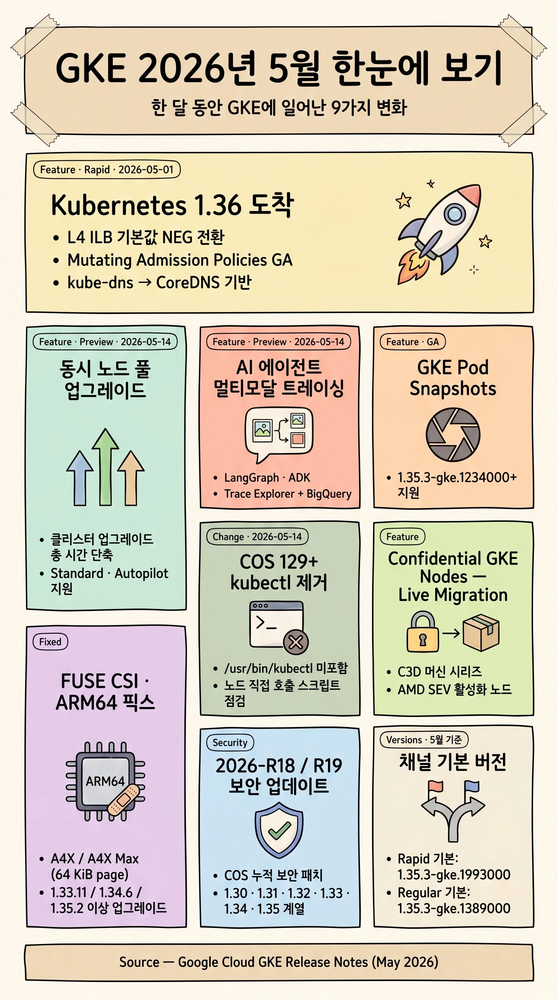
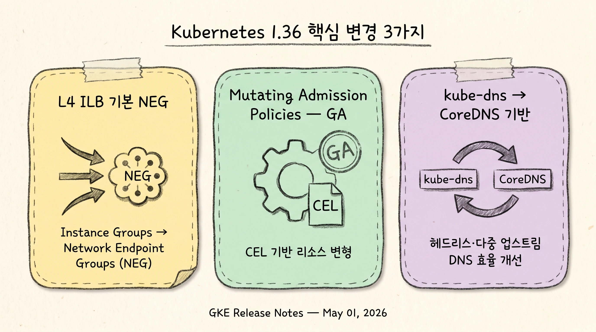
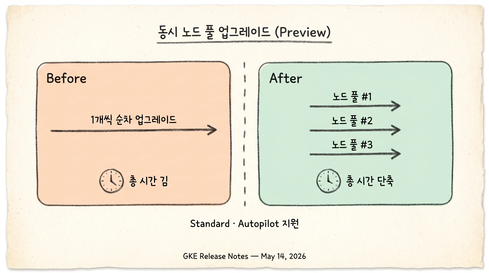
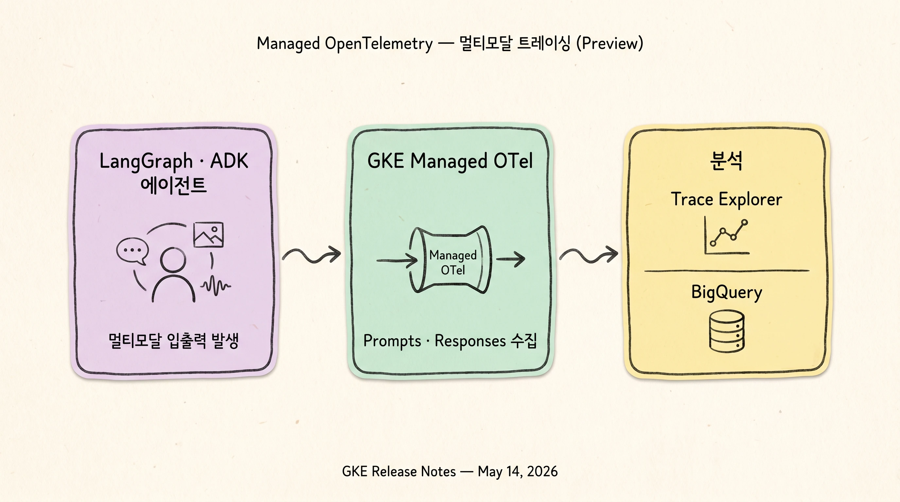
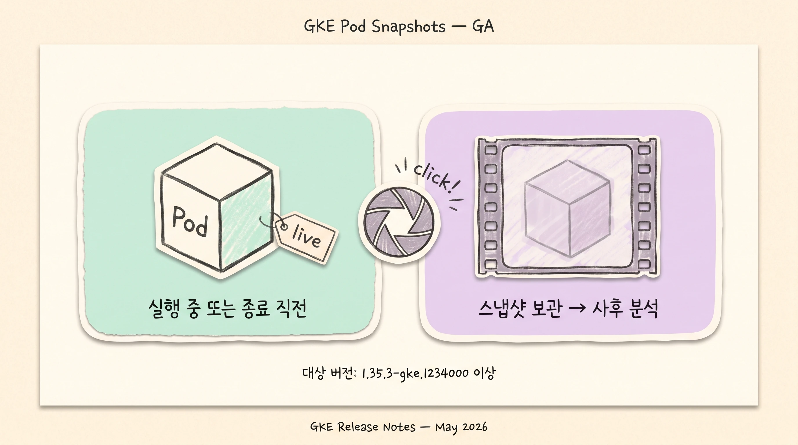
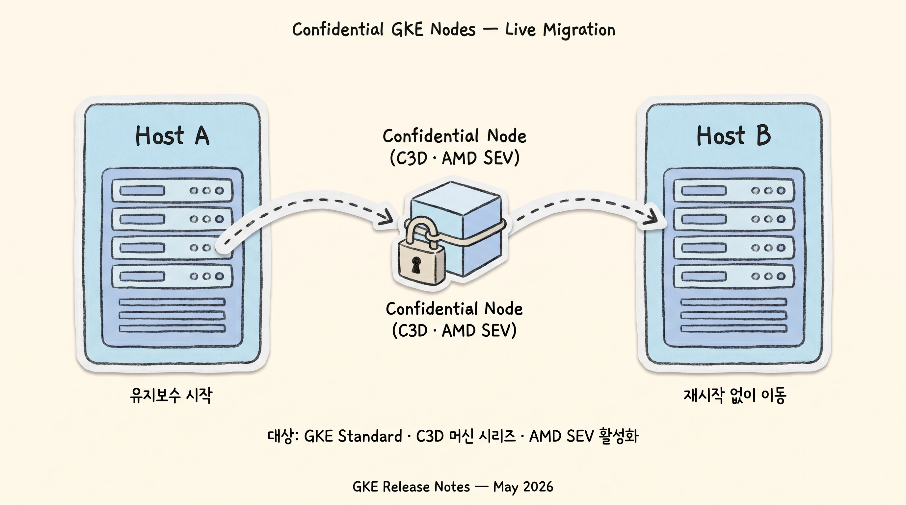
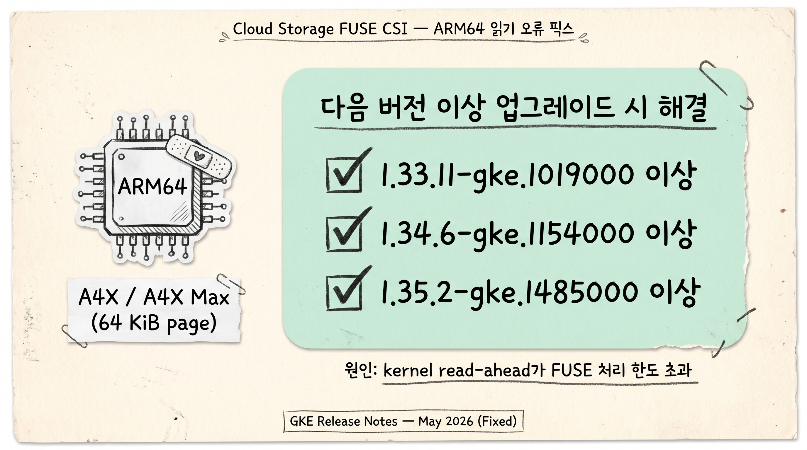
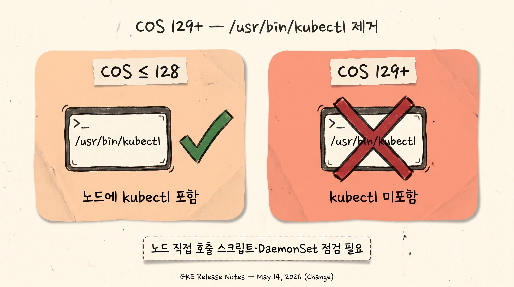
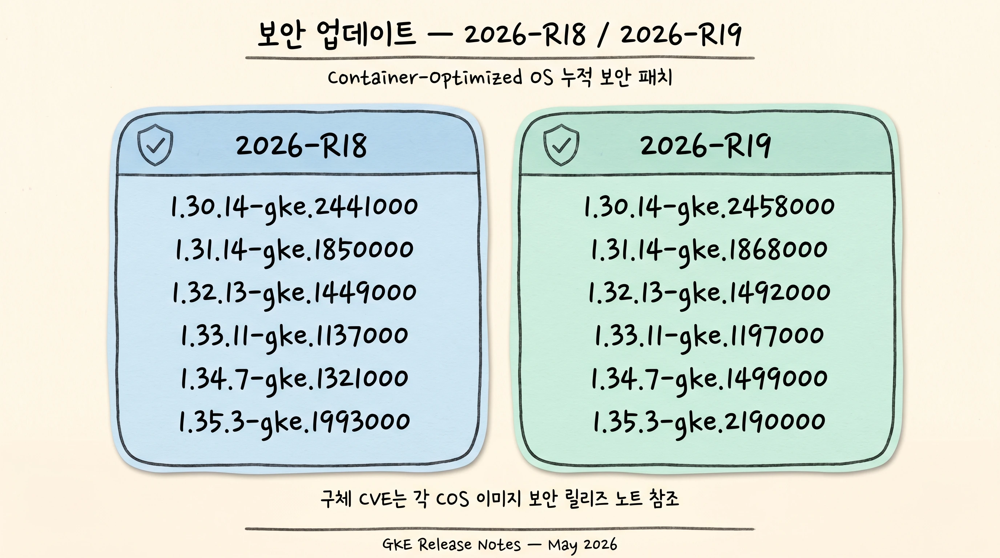
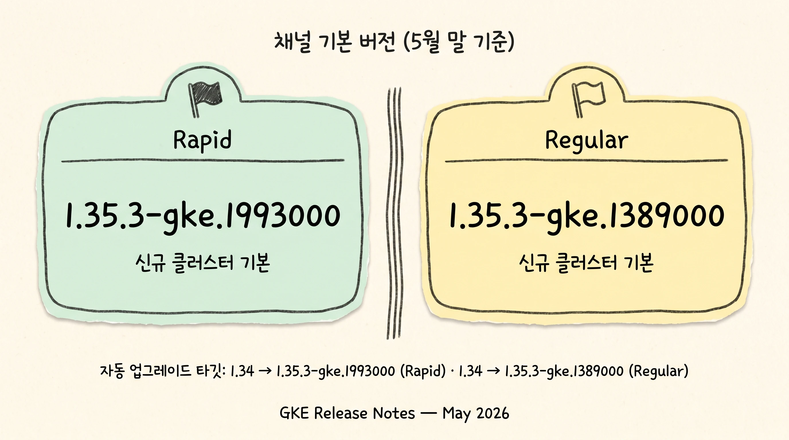

2026년 5월에 공개된 GKE 릴리즈 노트의 주요 변경 사항을 한국어로 정리합니다. 출시일 기준 May 01 ~ May 14, 2026에 게시된 항목을 다룹니다.

## 한눈에 보기

## Kubernetes 1.36 — Rapid 채널 출시 (May 01)

Kubernetes 1.36이 Rapid 채널에서 사용 가능합니다. 이 릴리즈에 포함된 GKE 관련 변경은 다음과 같습니다.

- **L4 Internal Load Balancer가 기본적으로 GKE 서브셋팅 사용** — 새로 생성되는 L4 ILB 서비스의 기본 구현이 Instance Groups에서 **Network Endpoint Groups(NEG)** 로 전환됩니다. NEG 기반 구현은 동기화 속도와 확장성이 개선됩니다. 기존 ILB 서비스는 영향을 받지 않으며 그대로 Instance Groups를 사용합니다.
- **Mutating Admission Policies — GA** — CEL(Common Expression Language) 표현식을 사용해 리소스를 변형할 수 있는 admission policy가 GA로 승격됐습니다. 기존 mutating admission webhook의 대안으로 사용할 수 있습니다.
- **kube-dns 이미지 구현 변경** — kube-dns 이미지가 `kubernetes/dns` 기반에서 **CoreDNS 기반** 구현으로 전환됩니다. 헤드리스 서비스, 다중 업스트림 DNS, 동시 연결 처리에 대한 효율이 개선됩니다.

### 주의점

> [!WARNING]
> - 새로 생성하는 L4 ILB 서비스는 NEG 기반이므로, 기존 Instance Group 기반 모니터링·자동화 스크립트가 NEG 경로에서도 동작하는지 확인이 필요합니다.
> - mutating admission webhook을 운영 중인 클러스터는 CEL 기반 Mutating Admission Policy로의 이관 가능성을 검토할 수 있습니다.
> - kube-dns API와 사용 방식 자체는 동일하지만, 운영 메트릭·로그 포맷에 차이가 있을 수 있습니다.

## 동시 노드 풀 업그레이드 (Preview, May 14)

GKE는 기본적으로 한 번에 하나의 노드 풀만 자동 업그레이드합니다. 이번 Preview를 통해 **동시에 자동 업그레이드되는 노드 풀의 최대 개수를 구성**할 수 있게 됐습니다. 클러스터 업그레이드의 총 소요 시간을 단축할 수 있으며 Standard, Autopilot 클러스터 모두 지원합니다 ([Configure concurrent node pool upgrades](https://cloud.google.com/kubernetes-engine/docs/how-to/upgrading-a-cluster#concurrent-upgrades)).

### 주의점

> [!CAUTION]
> - Preview 단계이므로 프로덕션 도입 전 별도 테스트 클러스터에서 동작·롤백 시나리오 검증이 필요합니다.
> - 동시 업그레이드 시 PDB(PodDisruptionBudget)와 maintenance window 설정이 의도대로 동작하는지 사전 점검이 권장됩니다.

## Managed OpenTelemetry — 멀티모달 프롬프트·응답 수집 (Preview, May 14)

GKE의 Managed OpenTelemetry가 **LangGraph 및 Agent Development Kit(ADK) 에이전트의 멀티모달 프롬프트·응답 데이터 수집**을 지원합니다. 수집된 데이터는 Trace Explorer와 BigQuery에서 조회·분석할 수 있습니다 ([Collect multimodal prompts and responses data](https://docs.cloud.google.com/kubernetes-engine/docs/how-to/managed-otel-gke#multimodal-prompts-responses)).

### 주의점

> [!WARNING]
> - Preview 단계이므로 인터페이스 변경 가능성이 있습니다.
> - 멀티모달 입출력에는 이미지·오디오·문서 등 민감 정보가 포함될 수 있으므로, 트레이스 수집 활성화 전에 데이터 거버넌스 정책 확인이 필요합니다.

## GKE Pod Snapshots — GA

GKE Pod Snapshots가 `1.35.3-gke.1234000` 이상에서 GA로 제공됩니다. 파드 상태를 스냅샷으로 보존해 사후 분석에 사용할 수 있습니다.

### 주의점

> [!NOTE]
> 사용을 위해 클러스터 버전이 `1.35.3-gke.1234000` 이상이어야 합니다.

## Confidential GKE Nodes — Live Migration 지원

GKE Standard 클러스터에서 **AMD SEV가 활성화된 C3D 머신 시리즈** 기반 Confidential GKE Nodes가 라이브 마이그레이션을 지원합니다.

### 주의점

> [!NOTE]
> 적용 대상은 GKE Standard 클러스터의 C3D + AMD SEV Confidential 노드입니다. 다른 머신 시리즈는 지원 범위에 포함되지 않습니다.

## Cloud Storage FUSE CSI 드라이버 — ARM64 읽기 오류 수정 (Fixed)

64 KiB 페이지 크기를 사용하는 ARM64 노드(A4X, A4X Max 등)에서 Cloud Storage FUSE CSI 드라이버를 사용할 때 발생하던 **불완전한 파일 읽기 및 조기 EOF 오류**가 수정됐습니다. 커널 read-ahead 메커니즘이 Cloud Storage FUSE 레이어 처리 한도를 초과하는 read 요청을 발생시킨 것이 원인입니다.

다음 버전 중 하나로 업그레이드 시 해결됩니다.

- `1.33.11-gke.1019000` 이상
- `1.34.6-gke.1154000` 이상
- `1.35.2-gke.1485000` 이상

### 주의점

> [!CAUTION]
> A4X / A4X Max를 운영 중이면서 위 버전 미만을 사용 중인 클러스터는 업그레이드를 검토해야 합니다.

## Container-Optimized OS milestone 129+ — `kubectl` 제거 (Change, May 14)

> Container-Optimized OS (COS) milestone 129 and higher no longer include the `kubectl` binary in the `/usr/bin/` directory.

COS milestone 129 이상 이미지에는 `kubectl` 바이너리가 `/usr/bin/` 디렉터리에 포함되지 않습니다.

### 주의점

> [!IMPORTANT]
> - 노드에 SSH로 접속해 `/usr/bin/kubectl`을 직접 호출하던 운영·트러블슈팅 스크립트.
> - DaemonSet 또는 init 스크립트에서 호스트 파일시스템의 `kubectl`을 셸로 호출하던 패턴.
> - 위 경로에 의존하는 모든 자동화는 컨테이너 이미지 내부의 `kubectl` 호출 또는 Kubernetes API 직접 호출로 대체해야 합니다.

## 보안 업데이트 — 2026-R18 / 2026-R19

이번 5월 릴리즈에는 **2026-R18** 및 **2026-R19** 보안 업데이트가 포함됐습니다. 모두 업데이트된 Container-Optimized OS 이미지를 사용하는 새로운 GKE 버전을 포함하며, 이미지는 이전 GKE 릴리즈 이후 공개된 모든 COS 보안 수정을 누적해 반영합니다.

영향 GKE 버전 계열:

| Release  | GKE 버전 |
| -------- | --- |
| 2026-R18 | `1.30.14-gke.2441000`, `1.31.14-gke.1850000`, `1.32.13-gke.1449000`, `1.33.11-gke.1137000`, `1.34.7-gke.1321000`, `1.35.3-gke.1993000` |
| 2026-R19 | `1.30.14-gke.2458000`, `1.31.14-gke.1868000`, `1.32.13-gke.1492000`, `1.33.11-gke.1197000`, `1.34.7-gke.1499000`, `1.35.3-gke.2190000` |

### 주의점

> [!NOTE]
> 구체적인 CVE 매핑은 각 COS 이미지의 보안 릴리즈 노트를 통해 확인해야 합니다.

## 채널 기본 버전 (5월 기준)

| 채널    | 기본 버전 |
| ------- | --- |
| Rapid   | `1.35.3-gke.1993000` |
| Regular | `1.35.3-gke.1389000` |

추가로 Rapid 채널에는 `1.33.11-gke.1197000`, `1.34.7-gke.1499000`, `1.35.3-gke.2190000`, `1.36.0-gke.1759000` 버전이 새로 제공됩니다. Regular 채널에는 `1.33.11-gke.1013000`, `1.34.6-gke.1307000` 버전이 추가됐습니다.

자동 업그레이드 타깃(주요):

- 1.34 → `1.35.3-gke.1993000` (Rapid)
- 1.33 → `1.34.6-gke.1237000` (Regular)
- 1.34 → `1.35.3-gke.1389000` (Regular)

### 주의점

> [!WARNING]
> - maintenance exclusion이나 deprecated API 사용 등 자동 업그레이드 차단 요인이 있는 클러스터는 마이너 버전 대신 패치 버전 업그레이드 타깃으로 이동합니다.
> - Rapid 채널의 `1.33.11-gke.1137000`, `1.34.7-gke.1321000` 등은 deprecated 상태이며 90일 이내 또는 지원 종료 시 제거 예정입니다.

## 참고 링크

- [Configure concurrent node pool upgrades](https://cloud.google.com/kubernetes-engine/docs/how-to/upgrading-a-cluster#concurrent-upgrades)
- [Managed OpenTelemetry on GKE — multimodal prompts/responses](https://docs.cloud.google.com/kubernetes-engine/docs/how-to/managed-otel-gke#multimodal-prompts-responses)
- [GKE versioning and support](https://cloud.google.com/kubernetes-engine/versioning)
- [About GKE cluster upgrades](https://cloud.google.com/kubernetes-engine/upgrades)
- [Maintenance windows and exclusions](https://cloud.google.com/kubernetes-engine/docs/concepts/maintenance-windows-and-exclusions#exclusions)
- [Patch version support](https://docs.cloud.google.com/kubernetes-engine/versioning#patch-version-support)
- [Kubernetes 1.35 CHANGELOG](https://github.com/kubernetes/kubernetes/blob/master/CHANGELOG/CHANGELOG-1.35.md#v1353)
- [Kubernetes 1.36 CHANGELOG](https://github.com/kubernetes/kubernetes/blob/master/CHANGELOG/CHANGELOG-1.36.md#v1360)
