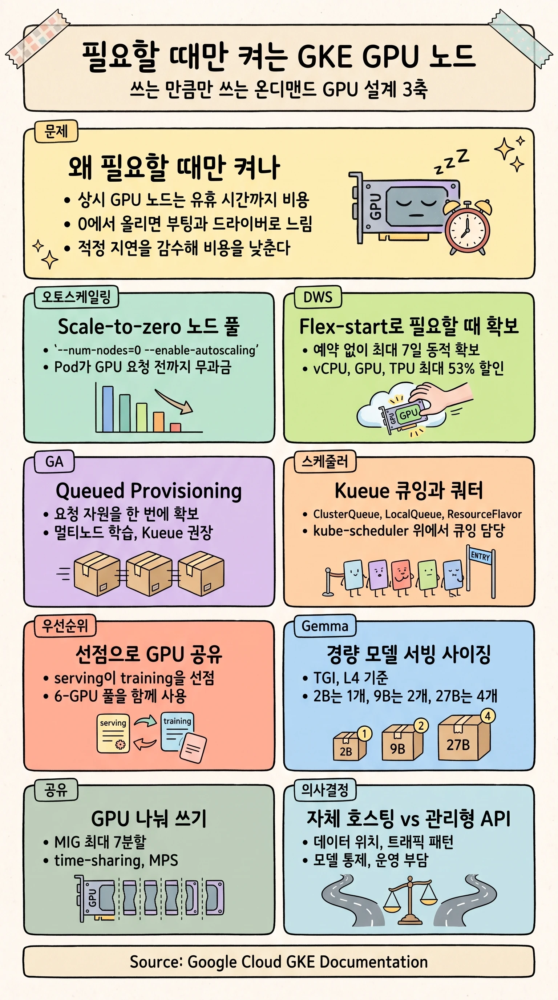
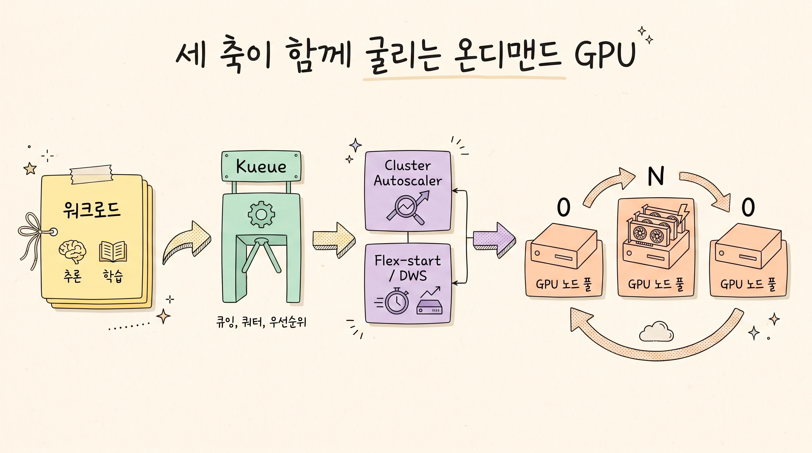
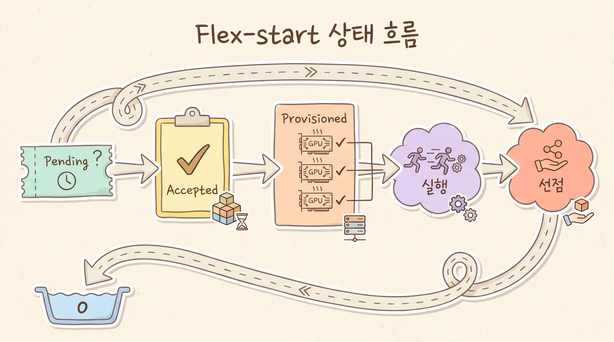

> **본 문서 대상 독자:** GKE에서 GPU 워크로드를 운영하는 플랫폼 관리자와 ML 엔지니어, 그리고 GPU 비용을 관리해야 하는 클라우드 아키텍트. GKE 노드 풀과 오토스케일링, Kubernetes Job의 기본 개념을 안다고 가정합니다.

> **범위 안내:** 이 문서의 정량 수치와 명령어, 매니페스트는 Google Cloud GKE 공식 문서(2026년 7월 기준)를 근거로 합니다. 자체 호스팅과 관리형 API 비교, 비용 고려사항은 특정 서비스의 단가나 성능 벤치마크를 단정하지 않고, 확인된 수치(Flex-start 최대 53% 할인, Pod 요청 전 GPU 무과금)와 판단 기준을 중심으로 서술합니다.

## Executive Summary

- GPU 노드를 "필요할 때만 띄우는" 목표는 GKE에서 세 가지 축의 조합으로 달성합니다: 오토스케일링 노드 풀의 스케일 투 제로, 필요할 때만 용량을 확보하는 Flex-start(Dynamic Workload Scheduler), 그리고 여러 워크로드가 한정된 GPU 풀을 질서 있게 나눠 쓰도록 하는 Kueue입니다.
- 스케일 투 제로만으로도 큰 절감이 가능합니다. GPU 노드 풀을 `--num-nodes=0 --enable-autoscaling`으로 만들면 "GPU를 요청하는 Pod를 띄우기 전까지는 GPU 요금이 청구되지 않습니다" ([여러 GPU로 LLM 서빙](https://docs.cloud.google.com/kubernetes-engine/docs/tutorials/serve-multiple-gpu)).
- Flex-start는 예약 없이 필요할 때 GPU/TPU를 최대 7일간 동적으로 확보하며, Dynamic Workload Scheduler 요금으로 vCPU, GPU, TPU에 대해 최대 53% 할인이 적용됩니다 ([Flex-start 개요](https://docs.cloud.google.com/kubernetes-engine/docs/concepts/dws)).
- Kueue는 kube-scheduler와 클러스터 오토스케일러를 대체하지 않고 그 위에서 Job 큐잉과 쿼터, 우선순위 선점을 담당합니다. 추론(고우선순위)과 학습(저우선순위)이 같은 GPU 풀을 공유하다가 수요가 몰리면 학습을 선점해 추론에 자리를 내주는 구성이 가능합니다 ([혼합 워크로드 튜토리얼](https://docs.cloud.google.com/kubernetes-engine/docs/tutorials/mixed-workloads)).
- 워크로드가 경량 오픈 모델(Gemma)이라면 GKE에서 직접 서빙할 수 있고, 모델 크기별 GPU 사이징이 문서로 제공됩니다. 예를 들어 Gemma 2 9B는 L4 GPU 2개(g2-standard-24)로 서빙합니다 ([Gemma를 TGI로 서빙](https://docs.cloud.google.com/kubernetes-engine/docs/tutorials/serve-gemma-gpu-tgi)).

## 0. 한눈에 보기

아래 도식은 이 문서의 핵심 메시지를 한 장으로 요약합니다. 상시 GPU 노드의 비용 문제에서 출발해, 세 가지 축(스케일 투 제로, Flex-start, Kueue)과 경량 오픈 모델 서빙, 그리고 자체 호스팅 대 관리형 API 판단까지 이어집니다.



읽는 순서는 다음과 같습니다.

1. **문제 정의:** 상시 GPU는 비싸고, 0에서 올리면 부팅과 드라이버 설치 때문에 느립니다.
2. **솔루션 지형도:** 세 가지 축이 무엇이고 어떻게 맞물리는지 봅니다.
3. **구현:** 스케일 투 제로 노드 풀, Flex-start 프로비저닝, Kueue 공유를 차례로 설정합니다.
4. **워크로드와 의사결정:** Gemma 서빙 사이징과 비용, 그리고 자체 호스팅 대 관리형 API 판단 기준을 정리합니다.

## 1. 문제 정의: 왜 "필요할 때만 뜨는" GPU 노드인가

### 1.1 GPU 상시 노드의 비용 구조

GPU 노드는 일반 노드보다 훨씬 비쌉니다. 하루 중 실제로 추론이나 학습이 도는 시간이 짧은데도 노드를 상시 켜 두면, 유휴 시간 전체가 그대로 비용이 됩니다. 특히 개발과 실험, 배치성 파인튜닝, 간헐적 추론처럼 수요가 들쭉날쭉한 워크로드는 상시 프로비저닝이 낭비를 키웁니다.

GKE는 이 낭비를 세 방향에서 줄입니다. 첫째, 수요가 없을 때 노드 수를 0으로 내리는 스케일 투 제로. 둘째, 장기 예약 없이 필요할 때만 용량을 확보하고 할인까지 받는 Flex-start. 셋째, 한정된 GPU 풀을 여러 워크로드가 질서 있게 공유하도록 하는 Kueue입니다.

### 1.2 0에서 올릴 때의 지연: 부팅과 드라이버

스케일 투 제로의 반대급부는 지연입니다. 노드가 0인 상태에서 새 Pod가 GPU를 요청하면, 클러스터 오토스케일러가 노드를 만들고 부팅한 뒤 NVIDIA 드라이버를 설치하는 시간이 필요합니다. GKE는 드라이버 설치를 자동화해 이 부담을 줄입니다. 제어 플레인이 1.32.2-gke.1297000 이상이면 노드 자동 프로비저닝으로 만든 노드를 포함해 모든 GPU 노드에 기본 NVIDIA 드라이버를 자동 설치합니다 ([GPU 실행 방법](https://docs.cloud.google.com/kubernetes-engine/docs/how-to/gpus)).

반대로 노드를 내릴 때는 실행 중이던 워크로드를 안전하게 종료해야 합니다. 제어 플레인이 1.29.1-gke.1425000 이상인 클러스터의 GPU 노드는 종료 임박을 알리는 `SIGTERM` 신호를 지원하며, 이 알림 시간은 최대 60분까지 설정할 수 있습니다 ([GPU 실행 방법](https://docs.cloud.google.com/kubernetes-engine/docs/how-to/gpus)).

> [!NOTE]
> 지연을 완전히 없애려면 상시 노드가 필요하지만, 그러면 비용 목표와 충돌합니다. 이 문서는 "적정 지연을 감수하고 비용을 낮추는" 균형점을 다룹니다. 지연 자체를 0으로 만들고 싶다면 사전 용량 버퍼(Capacity Buffer) 같은 별도 기법을 검토하십시오.

### 1.3 이 문서의 범위

이 문서는 GPU 노드를 중심으로 다룹니다. TPU도 동일한 메커니즘(Flex-start, Kueue, JobSet 기반 큐잉)을 그대로 사용하며, 예를 들어 Flex-start는 GPU뿐 아니라 TPU와 H4D 머신 시리즈까지 동적으로 프로비저닝합니다 ([Flex-start 개요](https://docs.cloud.google.com/kubernetes-engine/docs/concepts/dws)). TPU 고유의 슬라이스 구성이나 멀티호스트 배치는 이 문서의 범위를 벗어나므로 필요 시 관련 튜토리얼을 참고하십시오.

## 2. 솔루션 지형도: 세 가지 축

### 2.1 Scale-to-zero 오토스케일링 노드 풀

가장 기본이 되는 축입니다. GPU 노드 풀에 오토스케일링을 켜고 최소 노드 수를 0으로 두면, GPU를 요청하는 Pod가 없을 때 노드가 0으로 내려갑니다. GKE 문서는 이 상태를 두고 "GPU를 요청하는 Pod를 띄우기 전까지는 어떤 GPU 요금도 청구되지 않는다"고 명시합니다 ([여러 GPU로 LLM 서빙](https://docs.cloud.google.com/kubernetes-engine/docs/tutorials/serve-multiple-gpu)). 온디맨드 서빙의 출발점입니다.

### 2.2 Flex-start / Dynamic Workload Scheduler (DWS)

Flex-start는 Dynamic Workload Scheduler가 구동하는 프로비저닝 방식으로, 장기 예약 없이 필요할 때만 GPU, TPU, H4D를 최대 7일간 동적으로 확보합니다. 시작 시점이 고정되지 않아 수요가 변동하거나 짧게 도는 중소 규모 워크로드에 적합합니다. 요금은 Dynamic Workload Scheduler 요금 체계를 따르며 vCPU, GPU, TPU에 대해 최대 53% 할인과 사용한 만큼 지불(pay as you go)이 적용됩니다 ([Flex-start 개요](https://docs.cloud.google.com/kubernetes-engine/docs/concepts/dws)).

### 2.3 Kueue: 잡 큐잉, 쿼터, 우선순위

Kueue는 클라우드 네이티브 Job 스케줄러입니다. 중요한 점은 Kueue가 kube-scheduler, Job 컨트롤러, 클러스터 오토스케일러를 대체하지 않는다는 것입니다. 오토스케일링이나 Pod 배치, Job 수명 관리를 다시 구현하지 않고, 그 위에서 "Job 큐잉"만 담당합니다. 즉 쿼터와 자원 공유 계층에 따라 어떤 Job이 기다리고 어떤 Job이 시작할지 결정합니다 ([Kueue 기초](https://docs.cloud.google.com/kubernetes-engine/docs/tutorials/kueue-intro)).

Kueue를 쓰면 한정된 GPU 쿼터 안에서 여러 팀과 워크로드가 충돌 없이 자원을 나눠 쓰고, 우선순위에 따라 선점이 일어나며, Flex-start의 ProvisioningRequest 수명까지 자동으로 관리됩니다.

### 2.4 세 축이 함께 동작하는 방식

세 축은 경쟁 관계가 아니라 계층으로 맞물립니다. 워크로드는 Kueue의 큐에 들어가 쿼터와 우선순위 판정을 받고, 통과하면 클러스터 오토스케일러가 노드를 확보하며, 그 노드는 스케일 투 제로 노드 풀이거나 Flex-start 노드 풀입니다. 작업이 끝나면 노드는 다시 0으로 돌아갑니다.



| 축 | 역할 | 핵심 설정 | 언제 쓰나 |
|---|---|---|---|
| Scale-to-zero 노드 풀 | 수요 없을 때 GPU 노드를 0으로 | `--enable-autoscaling --num-nodes=0` | 거의 항상. 온디맨드의 기본기 |
| Flex-start / DWS | 예약 없이 필요할 때 용량 확보, 할인 | `--flex-start` (+`--enable-queued-provisioning`) | 예약 용량이 없고 시작 시점이 유연할 때 |
| Kueue | 큐잉, 쿼터, 우선순위 선점 | ClusterQueue, LocalQueue, ResourceFlavor | 여러 워크로드가 한 GPU 풀을 공유할 때 |

## 3. Scale-to-zero GPU 노드 풀

### 3.1 노드 풀 생성

오토스케일링을 켜고 최소 노드 수를 0으로 두는 것이 핵심입니다. 다음은 리전 클러스터에 P100 GPU 2개짜리 노드를 최대 5개까지 오토스케일하는 노드 풀 예시입니다. 최소 0이므로 유휴 시 0으로 내려갑니다 ([GPU 실행 방법](https://docs.cloud.google.com/kubernetes-engine/docs/how-to/gpus)).

```bash
gcloud container node-pools create p100 \
  --accelerator type=nvidia-tesla-p100,count=2,gpu-driver-version=default \
  --cluster p100-cluster \
  --location us-central1 \
  --node-locations us-central1-c \
  --min-nodes 0 --max-nodes 5 --enable-autoscaling
```

서빙 워크로드에서도 같은 패턴을 씁니다. 예를 들어 여러 GPU로 LLM을 서빙하는 튜토리얼은 `g2-standard-24` 노드 풀을 `--num-nodes=0 --min-nodes=0 --max-nodes=3`으로 만들고 Spot VM을 함께 사용합니다. `--spot` 플래그와 `cloud.google.com/gke-spot` 노드 셀렉터를 제거하면 온디맨드 VM으로 바꿀 수 있습니다 ([여러 GPU로 LLM 서빙](https://docs.cloud.google.com/kubernetes-engine/docs/tutorials/serve-multiple-gpu)).

### 3.2 GPU 드라이버 자동 설치

`gpu-driver-version` 값은 세 가지입니다.

| 값 | 동작 |
|---|---|
| `default` | GKE 버전에 맞는 기본 드라이버 설치. 1.30.1-gke.1156000 이상에서 플래그를 생략하면 이 값이 기본 |
| `latest` | 사용 가능한 최신 드라이버 설치. Container-Optimized OS 노드에서만 |
| `disabled` | 자동 설치 생략. 노드 풀 생성 후 드라이버를 수동 설치해야 함 |

자동 설치 적용 범위는 버전에 따라 다릅니다. 제어 플레인 1.32.2-gke.1297000 이상은 노드 자동 프로비저닝으로 만든 노드를 포함한 모든 GPU 노드에, 1.30.1-gke.1156000부터 1.32.2-gke.1297000까지는 노드 자동 프로비저닝이 아닌 노드에 기본 드라이버를 자동 설치합니다 ([GPU 실행 방법](https://docs.cloud.google.com/kubernetes-engine/docs/how-to/gpus)).

### 3.3 taint/toleration과 빠른 스케일 다운

클러스터에 GPU가 아닌 노드 풀이 하나라도 있으면, GKE는 GPU 노드에 다음 taint를 자동으로 추가합니다.

- **Key:** `nvidia.com/gpu`
- **Value:** `present`
- **Effect:** `NoSchedule`

이 taint 덕분에 GPU를 요청하지 않는 Pod는 GPU 노드에 배치되지 않고, 결과적으로 GPU 노드가 비면 빠르게 스케일 다운될 수 있습니다. GPU가 필요한 Pod만 대응하는 toleration을 달고 GPU 노드에 올라갑니다 ([GPU 실행 방법](https://docs.cloud.google.com/kubernetes-engine/docs/how-to/gpus)).

### 3.4 GPU 쿼터 계산

오토스케일링 상한을 실제로 쓰려면 GPU 쿼터가 충분해야 합니다. 필요한 쿼터는 노드당 GPU 수와 최대 노드 수의 곱입니다. 예를 들어 노드당 2개, 최대 3개 노드라면 최소 6개의 GPU 쿼터가 필요합니다.

> [!IMPORTANT]
> 오토스케일링 상한만 높이고 쿼터를 확보하지 않으면, 스케일 업이 조용히 실패합니다. 노드 풀을 만들기 전에 대상 리전의 해당 GPU 유형 쿼터를 먼저 확인하십시오.

## 4. Flex-start로 필요할 때만 프로비저닝

### 4.1 두 가지 구성: Flex-start vs Queued Provisioning

Flex-start에는 두 가지 구성이 있습니다. 노드를 하나씩 확보하는 **Flex-start**와, 요청한 자원을 한 번에 원자적으로 확보하는 **Flex-start with queued provisioning**입니다. 아래 표는 공식 문서의 비교를 옮긴 것입니다 ([Flex-start 개요](https://docs.cloud.google.com/kubernetes-engine/docs/concepts/dws)).

| 항목 | Flex-start | Flex-start with queued provisioning |
|---|---|---|
| 제공 단계 | Preview | 정식 출시(GA) |
| 권장 워크로드 크기 | 소규모에서 중간(단일 노드에서 실행 가능) | 중간에서 대규모(여러 노드에서 동시에 실행) |
| 프로비저닝 방식 | 자원이 생기는 대로 노드를 하나씩 | 요청한 모든 자원을 동시에 확보 |
| 설정 복잡도 | 낮음(on-demand, Spot과 유사) | 높음(Kueue 같은 쿼터 관리 도구 강력 권장) |
| Custom Compute Class 지원 | 예 | 아니요 |
| 노드 재활용 | 예 | 아니요 |
| gcloud 플래그 | `--flex-start` | `--flex-start`, `--enable-queued-provisioning` |

정리하면, 단일 노드로 끝나는 소규모 학습이나 오프라인 추론, 배치 작업에는 Flex-start가, 모든 노드가 동시에 준비되어야 시작하는 분산 학습에는 Queued Provisioning이 맞습니다.

### 4.2 동작 흐름과 수명

Flex-start의 동작은 다음과 같이 진행됩니다 ([Flex-start 개요](https://docs.cloud.google.com/kubernetes-engine/docs/concepts/dws)).

1. 워크로드가 즉시 가용하지 않은 용량을 요청합니다.
2. GKE는 노드가 Flex-start로 설정되어 있음을 인지합니다. `--request-valid-for-duration` 플래그가 없으면 GPU 워크로드는 최대 14일까지 자원을 기다립니다. TPU는 무기한 대기합니다.
3. 클러스터 오토스케일러가 요청을 수락하고 필요한 노드 수를 하나의 단위로 계산합니다.
4. 가용해지면 노드를 프로비저닝합니다. 이 노드는 최대 7일간, 또는 `maxRunDurationSeconds`에 지정한 더 짧은 시간 동안 실행됩니다(미지정 시 기본 7일).
5. 지정한 실행 시간이 끝나면 노드와 Pod가 선점됩니다.
6. Pod가 더 일찍 끝나 노드가 유휴가 되면, 오토스케일러가 오토스케일링 프로필에 따라 노드를 제거합니다.

수치가 여러 개 얽혀 있으므로, 아래 그림은 상태의 "흐름"만 보여 줍니다. 정확한 지속 시간과 상태 전이는 아래 상태 표를 정본으로 삼으십시오.



Queued Provisioning을 Kueue와 함께 쓸 때, ProvisioningRequest의 상태는 다음과 같이 전이합니다. 특히 `Provisioned=true` 이후 Pod를 시작할 수 있는 시간이 10분으로 제한된다는 점이 중요합니다 ([대규모 워크로드 프로비저닝](https://docs.cloud.google.com/kubernetes-engine/docs/how-to/provisioningrequest)).

| 상태 | 의미 | 이후 결과 |
|---|---|---|
| `Pending` | 아직 처리되지 않음 | 처리 후 `Accepted` 또는 `Failed`로 전이 |
| `Accepted=true` | 수락됨, 자원 가용을 대기 | 자원을 찾으면 `Provisioned`로. 기본적으로 GPU는 최대 14일 대기, 미충족 시 `Failed` |
| `Provisioned=true` | 노드 준비 완료 | Pod를 시작할 시간 10분. 이후 오토스케일러가 불필요 노드로 보고 제거 |
| `Failed=true` | 오류로 프로비저닝 불가(종료 상태) | `Reason`과 `Message`를 보고 새 요청으로 재시도 |
| `Provisioned=false` | 아직 미프로비저닝 | `NotProvisioned`(일시적), `QuotaExceeded`(쿼터 부족), `ResourcePoolExhausted`(존/리전 조정 필요) |

### 4.3 노드 풀 생성 예시

Queued Provisioning 노드 풀은 `--flex-start`와 `--enable-queued-provisioning`을 함께 지정하고, 0개 노드에서 시작하도록 만듭니다 ([대규모 워크로드 프로비저닝](https://docs.cloud.google.com/kubernetes-engine/docs/how-to/provisioningrequest)).

```bash
gcloud container node-pools create NODEPOOL_NAME \
    --cluster=CLUSTER_NAME \
    --location=LOCATION \
    --enable-queued-provisioning \
    --accelerator type=GPU_TYPE,count=AMOUNT,gpu-driver-version=DRIVER_VERSION \
    --machine-type=MACHINE_TYPE \
    --flex-start \
    --enable-autoscaling \
    --num-nodes=0 \
    --total-max-nodes TOTAL_MAX_NODES \
    --location-policy=ANY \
    --reservation-affinity=none \
    --no-enable-autorepair
```

이 명령은 다음을 수행합니다.

- `--flex-start`와 `--enable-queued-provisioning`이 함께 지정되어 노드 풀에 `cloud.google.com/gke-queued` taint를 추가합니다.
- 큐잉 프로비저닝과 클러스터 오토스케일링을 켭니다.
- 노드 풀은 0개 노드에서 시작합니다.
- `--no-enable-autorepair`로 자동 복구를 끕니다(복구된 노드에서 워크로드가 끊기는 것을 방지).

> [!NOTE]
> 클러스터는 GKE 1.32.2-gke.1652000 이상이어야 하며, 노드 자동 프로비저닝으로 Queued Provisioning 노드 풀을 관리하려면 1.29.2-gke.1553000 이상이어야 합니다. Standard 클러스터에서는 클러스터가 정상 동작하도록 Flex-start가 아닌 노드 풀을 최소 하나 유지하십시오.

### 4.4 노드 재활용(nodeRecycling)과 ComputeClass

Flex-start 노드는 최대 7일 뒤 선점됩니다. 장시간 도는 서빙 워크로드라면 이 경계에서 다운타임이 생깁니다. 노드 재활용은 노드가 수명 끝에 다다르기 전에 미리 대체 노드를 준비해 이를 완화합니다. Custom Compute Class의 `flexStart.nodeRecycling.leadTimeSeconds`로 "얼마나 일찍" 새 노드를 만들지 지정합니다 ([Flex-start 개요](https://docs.cloud.google.com/kubernetes-engine/docs/concepts/dws)).

```yaml
apiVersion: cloud.google.com/v1
kind: ComputeClass
metadata:
  name: dws-model-inference-class
spec:
  priorities:
    - machineType: g2-standard-24
      spot: true
    - machineType: g2-standard-24
      maxRunDurationSeconds: 72000
      flexStart:
        enabled: true
        nodeRecycling:
          leadTimeSeconds: 3600
  nodePoolAutoCreation:
    enabled: true
```

이 ComputeClass는 먼저 Spot `g2-standard-24`를 시도하고, 없으면 Flex-start로 넘어갑니다. `leadTimeSeconds: 3600`은 수명 종료 1시간 전에 대체 노드 프로비저닝을 시작한다는 뜻입니다. 이 패턴은 Mixtral 8x7b를 Spot과 Flex-start, ComputeClass로 비용 최적화해 서빙하는 튜토리얼에서 실제로 쓰입니다 ([비용 최적화 LLM 서빙](https://docs.cloud.google.com/kubernetes-engine/docs/how-to/dws-flex-start-inference)).

### 4.5 제약과 쿼터

Flex-start(DWS)에는 분명한 제약이 있습니다. 설계 단계에서 미리 반영해야 합니다 ([Flex-start 개요](https://docs.cloud.google.com/kubernetes-engine/docs/concepts/dws)).

> [!WARNING]
> - **Spot VM은 지원되지 않습니다.** DWS 요청이 만드는 모든 VM은 선점형 쿼터(preemptible quota)를 사용합니다.
> - **예약(reservation)은 지원되지 않습니다.** 노드 풀 생성 시 `--reservation-affinity=none`을 지정해야 하고, 위치 정책은 `ANY`만 지원합니다.
> - 단일 DWS 요청은 최대 1,000개의 VM을 만들 수 있습니다(노드 풀당 존별 최대 노드 수).
> - 대기 중인 DWS 요청 수는 Compute Engine `ACTIVE_RESIZE_REQUESTS` 쿼터로 제한되며, 기본값은 프로젝트당 100개입니다.
> - Pod 간 안티어피니티(inter-pod anti-affinity)는 지원되지 않습니다.
> - 임시 볼륨(ephemeral volume)은 지원되지 않으며 영구 볼륨을 써야 합니다.
> - 단일 `ProvisioningRequest`의 `podSets`에는 항목이 하나만 들어갑니다.

## 5. Kueue로 여러 워크로드가 GPU 풀을 공유

### 5.1 핵심 객체: ResourceFlavor / ClusterQueue / LocalQueue

Kueue의 자원 모델은 세 객체로 구성됩니다 ([Kueue 기초](https://docs.cloud.google.com/kubernetes-engine/docs/tutorials/kueue-intro)).

- **ResourceFlavor:** 노드의 변형을 표현합니다. `nodeLabels`나 taint로 Spot 대 온디맨드, x86 대 ARM, A100 대 L4 같은 차이를 구분합니다.
- **ClusterQueue:** 클러스터 범위의 자원 풀입니다. CPU, 메모리, `nvidia.com/gpu` 같은 자원마다 flavor별 `nominalQuota`를 정합니다.
- **LocalQueue:** 네임스페이스 범위이며 `.spec.clusterQueue`로 특정 ClusterQueue를 가리킵니다. Job은 `kueue.x-k8s.io/queue-name` 레이블로 이 큐를 참조합니다.

Job은 `suspend: true`로 만들어 Kueue가 시작 시점을 제어하게 하고, 자원이 준비되면 Kueue가 이를 `false`로 바꿉니다. Kueue 설치는 서버 사이드 apply 한 줄로 이뤄집니다.

```bash
VERSION=KUEUE_VERSION
kubectl apply --server-side -f \
  https://github.com/kubernetes-sigs/kueue/releases/download/$VERSION/manifests.yaml
```

### 5.2 ProvisioningRequest 연동 (AdmissionCheck)

Kueue를 Flex-start Queued Provisioning과 묶으면, ProvisioningRequest의 수명이 자동으로 관리됩니다. 연결 고리는 `AdmissionCheck`와 `ProvisioningRequestConfig`입니다. 아래는 DWS 전용 ClusterQueue 구성의 핵심 부분입니다 ([대규모 워크로드 프로비저닝](https://docs.cloud.google.com/kubernetes-engine/docs/how-to/provisioningrequest)).

```yaml
apiVersion: kueue.x-k8s.io/v1beta1
kind: AdmissionCheck
metadata:
  name: dws-prov
spec:
  controllerName: kueue.x-k8s.io/provisioning-request
  parameters:
    apiGroup: kueue.x-k8s.io
    kind: ProvisioningRequestConfig
    name: dws-config
---
apiVersion: kueue.x-k8s.io/v1beta1
kind: ProvisioningRequestConfig
metadata:
  name: dws-config
spec:
  provisioningClassName: queued-provisioning.gke.io
  managedResources:
    - nvidia.com/gpu
```

DWS 노드 풀만 쓰는 경우 ClusterQueue의 쿼터를 사실상 무한대(`nominalQuota: 1000000000`)로 두어, 큐잉 판정은 Flex-start의 admission check에 맡깁니다. Job은 `provreq.kueue.x-k8s.io/maxRunDurationSeconds` 어노테이션으로 노드 실행 시간을 지정합니다.

> [!NOTE]
> Kueue 0.7.0 미만 버전에서는 `ProvisioningACC` 피처 게이트를 `true`로 켜야 합니다. `maxRunDurationSeconds` 필드는 GKE 1.28.5-gke.1355000 이상에서 사용할 수 있고, ProvisioningRequest API는 `v1`(권장) 또는 `v1beta1`을 씁니다.

예약 용량과 DWS를 함께 쓰는 폴백 패턴도 가능합니다. ClusterQueue에 `reservation` flavor(유한 쿼터)를 먼저, `dws` flavor(무한 쿼터)를 뒤에 두고, admission check를 `dws` flavor에만 적용하면, Job은 예약 용량을 먼저 시도하고 부족할 때만 DWS로 넘어갑니다.

### 5.3 우선순위와 선점 (serving > training)

같은 GPU 풀을 추론과 학습이 공유할 때, 추론이 우선해야 합니다. Kueue는 Kubernetes `PriorityClass`와 결합해 이를 구현합니다. 혼합 워크로드 튜토리얼은 세 개의 PriorityClass를 정의합니다 ([혼합 워크로드 튜토리얼](https://docs.cloud.google.com/kubernetes-engine/docs/tutorials/mixed-workloads)).

| PriorityClass | value | preemptionPolicy | 용도 |
|---|---|---|---|
| `default-priority-nonpreempting` | 10 | `Never` | 기본값(globalDefault), 남을 밀어내지 않음 |
| `low-priority-preempting` | 20 | `PreemptLowerPriority` | 학습 등 저우선순위 |
| `high-priority-preempting` | 30 | `PreemptLowerPriority` | 서빙 등 고우선순위 |

서빙 Deployment는 `high-priority-preempting`을 달고, 수요가 몰리면 저우선순위 학습 Job을 선점해 GPU를 회수합니다.

### 5.4 실전: 추론과 학습이 6-GPU 풀을 나눠 쓰기

혼합 워크로드 튜토리얼의 구성을 그대로 보면 이해가 빠릅니다. 노드는 L4 GPU 2개가 달린 `g2-standard-24`(24 vCPU, 96 GB RAM)이고, ClusterQueue의 쿼터는 다음과 같습니다.

```yaml
resourceGroups:
  - coveredResources: [ "cpu", "memory", "nvidia.com/gpu", "ephemeral-storage" ]
    flavors:
      - name: default-flavor
        resources:
          - name: "cpu"
            nominalQuota: 72
          - name: "memory"
            nominalQuota: 288Gi
          - name: "nvidia.com/gpu"
            nominalQuota: 6
          - name: "ephemeral-storage"
            nominalQuota: 200Gi
```

서빙은 TGI로 `gemma-2-9b-it`를 Pod당 GPU 2개로 띄웁니다. 여기서 쿼터가 어떻게 강제되는지 드러납니다. 서빙 Deployment를 4개 레플리카로 스케일하면, GPU 쿼터가 6이므로 Pod당 2개 기준 최대 3개만 수용됩니다. 4번째 Pod는 `SchedulingGated` 상태로 대기합니다(3 레플리카 × 2 GPU = 6 GPU) ([혼합 워크로드 튜토리얼](https://docs.cloud.google.com/kubernetes-engine/docs/tutorials/mixed-workloads)).

> [!TIP]
> 이 동작이 온디맨드 운영의 안전판입니다. 쿼터를 넘겨 무한정 노드가 늘지 않도록 Kueue가 큐잉으로 막아 주므로, 비용이 예측 가능한 범위에 머뭅니다.

### 5.5 Cohort와 쿼터 대여, Spot 스필오버

여러 팀이 각자의 ClusterQueue를 가질 때, 같은 `.spec.cohort`(예: `all-teams`)에 묶으면 쓰지 않는 쿼터를 서로 빌려 줄 수 있습니다. `borrowingLimit`으로 대여 상한을 정합니다. 여기에 Spot VM 전용 ClusterQueue를 코호트에 더하면, 온디맨드 쿼터가 가득 찼을 때 Spot으로 넘치는(spillover) 구성이 됩니다 ([Kueue 코호트](https://docs.cloud.google.com/kubernetes-engine/docs/tutorials/kueue-cohort)).

### 5.6 모니터링 지표

Kueue는 큐 상태를 Prometheus 지표로 노출합니다. 대기와 승인 현황을 보고 쿼터를 조정하는 데 씁니다 ([Kueue 코호트](https://docs.cloud.google.com/kubernetes-engine/docs/tutorials/kueue-cohort)).

- `kueue_pending_workloads`: 대기 중 워크로드 수
- `kueue_admitted_active_workloads`: 승인되어 활성인 워크로드 수
- `kueue_cluster_queue_resource_usage`: ClusterQueue 자원 사용량
- `kueue_cluster_queue_nominal_quota`: ClusterQueue 명목 쿼터

## 6. 워크로드: 경량 오픈 모델(Gemma) 서빙

### 6.1 Gemma를 GKE에서 직접 서빙한다는 것

Gemma는 공개된 경량 생성형 AI 모델 모음으로, 오픈 라이선스로 제공됩니다 ([Gemma를 TGI로 서빙](https://docs.cloud.google.com/kubernetes-engine/docs/tutorials/serve-gemma-gpu-tgi)). GKE에서 직접 서빙하면 모델과 데이터가 자사 클러스터 안에 머물고, 앞서 다룬 온디맨드 GPU 메커니즘을 그대로 적용할 수 있습니다. 접근에는 Kaggle 동의와 Hugging Face 토큰(Read 이상)이 필요하며, 토큰은 `hf-secret` 같은 Kubernetes Secret으로 저장합니다.

서빙 런타임은 여러 선택지가 있습니다. TGI(Text Generation Inference)와 vLLM이 대표적이며, 둘 다 Flash Attention이나 PagedAttention, 연속 배칭(continuous batching), 텐서 병렬화를 지원합니다. vLLM은 OpenAI 호환 API를 8000 포트로 노출합니다 ([Gemma를 vLLM으로 서빙](https://docs.cloud.google.com/kubernetes-engine/docs/tutorials/serve-gemma-gpu-vllm)).

### 6.2 모델 크기별 GPU 사이징

가장 실무적인 정보입니다. TGI로 Gemma 2를 L4 GPU에 올릴 때의 사이징은 다음과 같습니다 ([Gemma를 TGI로 서빙](https://docs.cloud.google.com/kubernetes-engine/docs/tutorials/serve-gemma-gpu-tgi)).

| 모델 | L4 GPU 수 | 머신 타입 | 요청 CPU / 메모리 | NUM_SHARD |
|---|---|---|---|---|
| Gemma 2 2B-it | 1 | `g2-standard-8` | 2 / 10Gi | 1 |
| Gemma 2 9B-it | 2 | `g2-standard-24` | 4 / 30Gi | 2 |
| Gemma 2 27B-it | 4 | `g2-standard-48` (디스크 180) | 10 / 80Gi | 4 |
| CodeGemma 7B-it | 2 | (L4 2개) | 2 / 25Gi | 2 |

GPU 수를 정하는 계산법도 문서화되어 있습니다. 4비트 양자화(`QUANTIZE=bitsandbytes-nf4`)를 쓰면, 700억 파라미터 모델은 70B × 4비트 = 35 GB에 5 GB 오버헤드를 더해 최소 40 GB의 GPU 메모리가 필요합니다. L4 한 장(24 GB)으로는 부족하므로 L4 2장을 씁니다 ([여러 GPU로 LLM 서빙](https://docs.cloud.google.com/kubernetes-engine/docs/tutorials/serve-multiple-gpu)).

> [!NOTE]
> 최신 vLLM 튜토리얼은 Gemma 4 계열(E2B, E4B, 26B-A4B, 31B)을 다루며 B200, H100, L4 등 더 넓은 가속기를 지원합니다. 인용 시에는 각 페이지가 다루는 모델 버전(Gemma 2 대 Gemma 4)에 유의하십시오.

### 6.3 GPU 공유로 소형 모델 밀도 높이기

Gemma 2B처럼 작은 모델은 GPU 한 장을 다 쓰지 않습니다. GKE는 하나의 GPU를 여러 컨테이너가 나눠 쓰는 세 가지 전략을 제공합니다 ([GPU 정보](https://docs.cloud.google.com/kubernetes-engine/docs/concepts/gpus)).

| 전략 | 제공 | 특징 |
|---|---|---|
| Multi-instance GPU (MIG) | Autopilot, Standard | 하나의 GPU를 최대 7개의 하드웨어 격리 인스턴스로 분할 |
| Time-sharing | Autopilot, Standard | 여러 컨테이너가 시분할로 GPU 공유 |
| NVIDIA MPS | Standard 전용 | CUDA API 수준에서 다중 프로세스 동시 실행 |

MIG의 파티션 크기는 `[compute]g.[memory]gb` 형식으로 지정합니다(예: `1g.5gb`). 소형 모델을 여러 개 촘촘히 올릴 때 유용합니다 ([Multi-instance GPU 실행](https://docs.cloud.google.com/kubernetes-engine/docs/how-to/gpus-multi)).

> [!CAUTION]
> GPU 사용률 지표 `duty_cycle`은 time-sharing이나 MPS로 스케줄된 컨테이너에는 수집되지 않습니다. 공유 전략을 쓸 때는 모니터링 방식이 달라진다는 점을 감안하십시오.

### 6.4 언제 자체 호스팅하고 언제 관리형 API를 쓰나

> [!IMPORTANT]
> 이 절은 정량 비교표가 아니라 판단 기준을 제시합니다. 구체적 손익분기는 특정 서비스의 단가와 성능이 시점에 따라 달라지므로, 대상 워크로드의 트래픽과 지연 요구를 실측한 결과를 바탕으로 결정하시기 바랍니다.

경량 오픈 모델을 GKE에서 자체 호스팅하는 것과 관리형 API(예: Gemini API)를 쓰는 것 사이의 선택은 다음 축으로 정리됩니다.

- **데이터 위치와 규제:** 모델과 프롬프트, 응답이 자사 클러스터 안에 머물러야 한다면 자체 호스팅이 유리합니다.
- **트래픽 패턴:** 꾸준하고 예측 가능한 대량 트래픽은 온디맨드 GPU에 상시에 가까운 사용률을 만들어 자체 호스팅의 단가 이점을 살립니다. 간헐적이고 예측 불가한 트래픽은 관리형 API의 사용량 과금이 운영 부담 없이 맞을 수 있습니다.
- **모델 통제:** 특정 오픈 모델 가중치, 파인튜닝, 양자화, 서빙 파라미터를 직접 통제해야 하면 자체 호스팅입니다.
- **운영 부담:** 자체 호스팅은 노드 풀, 드라이버, 오토스케일링, 큐잉을 직접 운영해야 합니다. 이 문서의 세 가지 축은 바로 그 부담을 낮추기 위한 것입니다.

핵심은, 자체 호스팅을 택하더라도 "상시 GPU"가 전제는 아니라는 점입니다. 스케일 투 제로와 Flex-start(최대 53% 할인), Kueue 공유를 결합하면, 자체 호스팅의 통제력을 유지하면서도 사용한 만큼만 지불하는 구조에 가까워집니다.

## 7. 비용과 운영 고려사항

### 7.1 비용 절감 레버

온디맨드 GPU 운영의 절감은 세 레버의 합입니다.

| 레버 | 효과 | 근거 |
|---|---|---|
| Scale-to-zero | Pod가 GPU를 요청하기 전까지 GPU 무과금 | [여러 GPU로 LLM 서빙](https://docs.cloud.google.com/kubernetes-engine/docs/tutorials/serve-multiple-gpu) |
| Flex-start / DWS | vCPU, GPU, TPU 최대 53% 할인 | [Flex-start 개요](https://docs.cloud.google.com/kubernetes-engine/docs/concepts/dws) |
| Spot VM | 표준 대비 낮은 단가(가용성 보장 없음), ComputeClass로 Spot 우선 후 Flex-start 폴백 | [비용 최적화 LLM 서빙](https://docs.cloud.google.com/kubernetes-engine/docs/how-to/dws-flex-start-inference) |
| Kueue 쿼터 | 쿼터 상한으로 노드 폭증과 비용 폭주를 큐잉으로 억제 | [혼합 워크로드 튜토리얼](https://docs.cloud.google.com/kubernetes-engine/docs/tutorials/mixed-workloads) |

### 7.2 한계와 주의사항

설계 전에 반드시 반영할 제약을 한자리에 모읍니다.

- **Flex-start는 Spot과 예약을 지원하지 않습니다.** 선점형 쿼터를 쓰고 `--reservation-affinity=none`, `--location-policy=ANY`가 강제됩니다 ([Flex-start 개요](https://docs.cloud.google.com/kubernetes-engine/docs/concepts/dws)).
- **`Provisioned=true` 이후 Pod 시작 창은 10분입니다.** 이 시간을 넘기면 오토스케일러가 노드를 제거합니다 ([대규모 워크로드 프로비저닝](https://docs.cloud.google.com/kubernetes-engine/docs/how-to/provisioningrequest)).
- **동적 자원 할당(DRA) 드라이버는 스케일 투 제로가 불가합니다.** 서드파티 DRA 드라이버는 최소 1개 노드가 필요하므로, 완전한 0 스케일을 원하면 DRA 대신 앞의 메커니즘을 씁니다 ([DRA 개요](https://docs.cloud.google.com/kubernetes-engine/docs/concepts/about-dynamic-resource-allocation)).
- **쿼터가 사실상 상한입니다.** GPU 쿼터와 `ACTIVE_RESIZE_REQUESTS`(기본 100) 쿼터를 확인하지 않으면 스케일 업이 조용히 실패합니다.
- **GPU 노드는 기존 노드 풀에 GPU를 추가할 수 없고, 라이브 마이그레이션되지 않습니다.** 노드 풀을 새로 만들어야 합니다.

### 7.3 의사결정 매트릭스: 워크로드 성격별 권장 조합

| 워크로드 | 권장 조합 |
|---|---|
| 간헐적 소형 추론(예: Gemma 2 2B) | Scale-to-zero 노드 풀 + GPU 공유(MIG/time-sharing)로 밀도 향상 |
| 변동 큰 중형 서빙(예: Gemma 2 9B) | Scale-to-zero + Flex-start(node recycling) + Kueue 고우선순위 |
| 분산 학습, 파인튜닝(멀티노드) | Flex-start with queued provisioning + Kueue(ProvisioningRequest 연동) |
| 추론과 학습이 GPU 공유 | Kueue ClusterQueue + PriorityClass 선점(serving > training) |
| 다팀 공용 GPU 풀 | Kueue Cohort + borrowingLimit + Spot 스필오버 |

## 8. 참고 문서

- [Flex-start 개요(Dynamic Workload Scheduler)](https://docs.cloud.google.com/kubernetes-engine/docs/concepts/dws)
- [대규모 워크로드를 위한 Flex-start with queued provisioning](https://docs.cloud.google.com/kubernetes-engine/docs/how-to/provisioningrequest)
- [GKE에서 GPU 실행 방법](https://docs.cloud.google.com/kubernetes-engine/docs/how-to/gpus)
- [GKE의 GPU 정보](https://docs.cloud.google.com/kubernetes-engine/docs/concepts/gpus)
- [Multi-instance GPU 실행](https://docs.cloud.google.com/kubernetes-engine/docs/how-to/gpus-multi)
- [Kueue 기초(ResourceFlavor, ClusterQueue, LocalQueue)](https://docs.cloud.google.com/kubernetes-engine/docs/tutorials/kueue-intro)
- [Kueue 코호트와 쿼터 대여](https://docs.cloud.google.com/kubernetes-engine/docs/tutorials/kueue-cohort)
- [추론과 학습 혼합 워크로드 관리](https://docs.cloud.google.com/kubernetes-engine/docs/tutorials/mixed-workloads)
- [AI/ML 워크로드 우선순위 최적화 모범 사례](https://docs.cloud.google.com/kubernetes-engine/docs/best-practices/optimize-ai-utilization)
- [Gemma 오픈 모델을 GPU와 TGI로 서빙](https://docs.cloud.google.com/kubernetes-engine/docs/tutorials/serve-gemma-gpu-tgi)
- [Gemma 오픈 모델을 GPU와 vLLM으로 서빙](https://docs.cloud.google.com/kubernetes-engine/docs/tutorials/serve-gemma-gpu-vllm)
- [여러 GPU로 LLM 서빙과 GPU 계산법](https://docs.cloud.google.com/kubernetes-engine/docs/tutorials/serve-multiple-gpu)
- [비용 최적화와 고가용성 GPU 프로비저닝으로 LLM 서빙](https://docs.cloud.google.com/kubernetes-engine/docs/how-to/dws-flex-start-inference)
- [GKE의 동적 자원 할당(DRA) 정보](https://docs.cloud.google.com/kubernetes-engine/docs/concepts/about-dynamic-resource-allocation)
