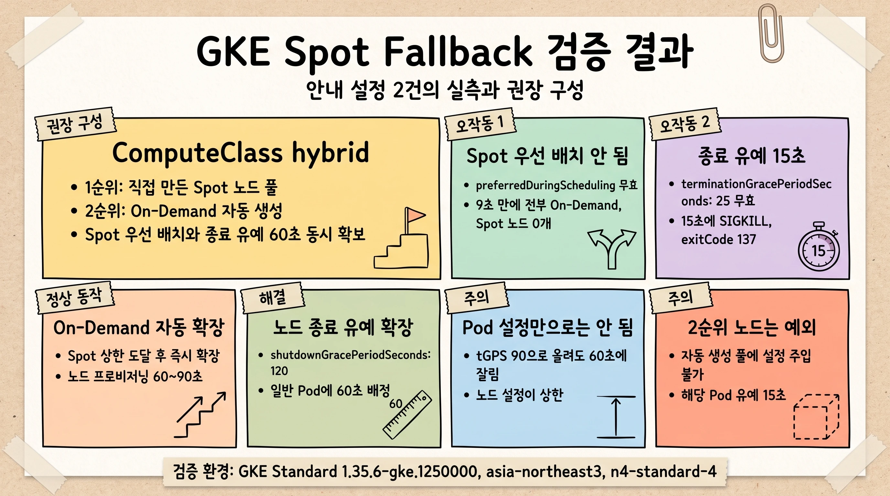
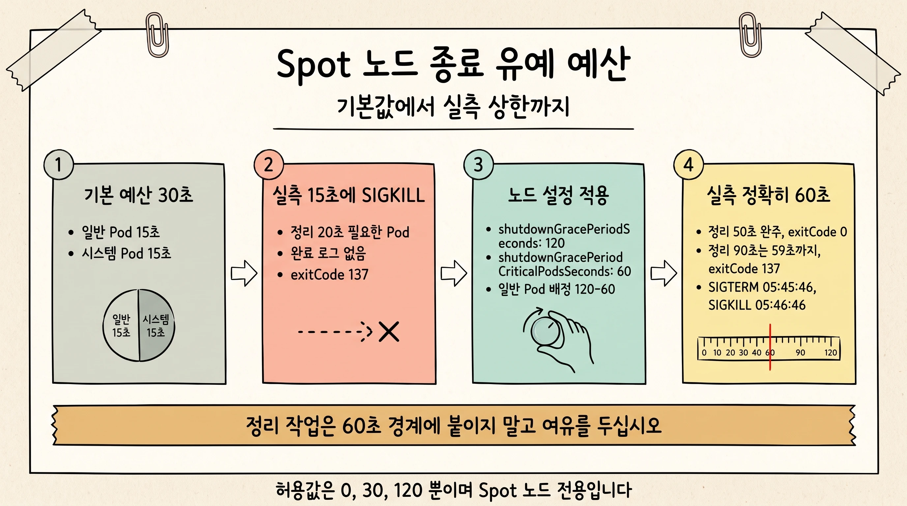
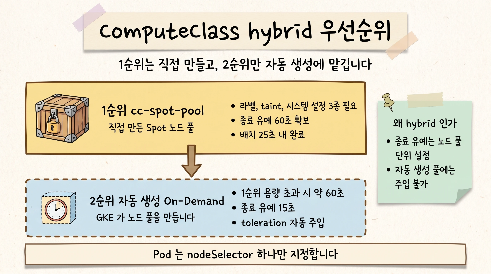

GKE 에서 GitHub Actions self-hosted runner 를 N2 Spot 노드로 운영하던 중 Spot 할당 실패가 반복되어 On-Demand 로 전환한 상태였고, 비용과 사용 지속성 관점에서 Spot 재도입을 검토할 필요가 있었습니다. 그래서 Spot 을 우선 사용하고 Spot 을 쓸 수 없을 때 On-Demand 로 넘기는 구성을 실측으로 검증했습니다. 기존에 안내되어 있던 두 가지 설정이 의도대로 동작하지 않았으며, 두 문제를 함께 해결하는 구성까지 확인했습니다.

## 요약

| 기존 설정과 의도 | 실측 결과 | 조치 |
|---|---|---|
| `preferred` nodeAffinity 로 Spot 노드에 먼저 배치 | Spot 우선이 되지 않습니다. On-Demand 노드에 여유가 있으면 Pod 전부가 그쪽으로 배치됩니다 | ComputeClass 로 전환 |
| `terminationGracePeriodSeconds: 25` 로 선점 시 25초의 정리 시간 확보 | 25초가 확보되지 않습니다. 15초에 강제 종료(SIGKILL)됩니다 | 노드 풀에 종료 유예 설정 추가 |

Spot 노드 수 상한 도달 시 On-Demand 노드 풀이 자동 확장되는 동작 자체는 정상이었습니다. 아래 도식은 두 가지 오작동과 그 해결책, 권장 구성을 한 장으로 정리한 것입니다.

{width=78%}

## Spot 우선 배치가 되지 않습니다

검증 대상은 Spot 노드를 `preferredDuringSchedulingIgnoredDuringExecution` 로 선호하게 두고 Spot 이 부족하면 On-Demand 노드 풀로 넘어가게 하는 패턴입니다. Google Cloud 블로그가 소개한 구성입니다 ([Running a GKE application on spot nodes with on-demand nodes as fallback](https://cloud.google.com/blog/topics/developers-practitioners/running-gke-application-spot-nodes-demand-nodes-fallback)).

이 조건은 **이미 떠 있는 노드들 사이에서만** 순위를 매깁니다. Spot 노드가 없고 On-Demand 노드에 여유가 있으면 스케줄러는 Pending 을 만들지 않고 즉시 On-Demand 에 배치하며, Pending 이 없으니 오토스케일러가 Spot 노드를 만들 이유도 없습니다.

Spot 노드 0개, On-Demand 노드 1개(3 Pod 여유) 상태에서 replicas 를 3으로 배포한 결과, 9초 만에 3개 Pod 전부가 On-Demand 노드에서 Running 되었고 Spot 노드는 생성 시도 자체가 없어 0개였습니다.

결국 이 설정은 비용 목적에 역행합니다. Runner 부하가 오르내리며 On-Demand 노드에 여유가 생기는 구간마다 Pod 가 비싼 쪽으로 배치되기 때문입니다.

### 해결: 세 가지 배치 방식 중 하나만 성립합니다

Spot 우선 배치에 쓰이는 세 가지를 나란히 두면, Fallback 까지 함께 성립하는 것은 ComputeClass 뿐입니다.

| 방식 | 배치 동작 | Fallback |
|---|---|---|
| `preferred` nodeAffinity | 떠 있는 노드들 사이 순위만 매깁니다 | Spot 노드가 없고 **On-Demand 에 여유가 있으면** 그쪽으로 배치되고, Pending 이 없으니 Spot 확장도 일어나지 않습니다 |
| `required` nodeAffinity | Spot 노드에만 배치됩니다 | Spot 을 쓸 수 없으면 Pending 으로 남습니다. On-Demand 전환 자체가 불가능합니다 |
| ComputeClass `priorities` | 순위대로 노드 생성을 시도합니다 | 1순위로 노드를 만들 수 없으면 2순위로 넘어갑니다 |

`required` 는 Spot 에 고정하는 성질 때문에 Fallback 과 함께 쓸 수 없습니다. 본 검증에서는 측정 대상 Pod 를 특정 Spot 노드에 고정하기 위한 시험 장치로만 사용했습니다.

## 종료 유예가 15초에 끊깁니다

Compute Engine 이 Spot VM 을 회수할 때는 VM 메타데이터의 `preempted` 값을 `TRUE` 로 바꾸고 ACPI G2 Soft Off 신호를 보내 종료 구간을 시작합니다 ([Spot VMs](https://cloud.google.com/compute/docs/instances/spot)). kubelet 이 이를 감지해 Pod 에 SIGTERM 을 보내고 systemd 에 시스템 종료 지연을 요청합니다. 중요한 것은 이 예산이 두 구간으로 **나뉘어** 있다는 점입니다. 일반 Pod 가 먼저 자기 구간을 쓰고, 그 구간이 끝난 뒤에 시스템 Pod 구간이 시작됩니다. 기본값은 총 30초에 각 구간 15초이며, 구간을 초과한 Pod 는 SIGKILL 됩니다 ([GKE Spot VMs](https://cloud.google.com/kubernetes-engine/docs/concepts/spot-vms)). 같은 노드에 있던 Pod 들은 같은 초에 SIGTERM 을 받았습니다. 강제 종료된 Pod 의 `exitCode 137` 은 `128 + 9`, 즉 SIGKILL 을 뜻합니다.

{width=78%}

정리 작업에 20초가 필요한 Pod 에 `terminationGracePeriodSeconds: 25` 를 지정해 선점시킨 결과, SIGTERM 15초 후 정리 완료 로그 없이 종료 코드 137 로 강제 종료되었습니다. Runner 로 치면 빌드 아티팩트 업로드나 GitHub 으로의 job 결과 보고가 15초를 넘기는 순간 유실된다는 뜻입니다.

확장 설정을 적용한 뒤에는 실제로 몇 초가 확보되는지를 따로 측정했습니다. 정리 20초짜리 Pod 로는 예산이 25초든 60초든 똑같이 통과하므로 확장이 실제로 얼마를 주는지 알 수 없습니다. 그래서 예산 경계 양쪽을 조준해 정리 50초가 필요한 Pod 와 90초가 필요한 Pod 를 같은 노드에 올린 뒤 한 번의 선점으로 동시 관측했습니다. B 의 `tGPS` 를 90 으로 둔 것도 의도적입니다. Pod 가 90초를 요구해도 노드 예산이 상한이라는 점을 함께 확인하기 위한 것입니다.

| 측정 항목 | A. 정리 50초 필요 (`tGPS: 60`) | B. 정리 90초 필요 (`tGPS: 90`) |
|---|---|---|
| SIGTERM | 05:45:46 | 05:45:46 |
| 결과 | 05:46:36 정리 완료 | 05:46:45 까지 59초 진행 후 05:46:46 강제 종료 |
| 정리 완료 로그 | 있음 | 없음 |
| 종료 코드 | 0 (정상) | 137 (SIGKILL) |

> [!IMPORTANT]
> 확보된 시간은 정확히 60초였고 설정값의 `120 - 60 = 60초` 가 실측으로 확인되었습니다. B 의 `terminationGracePeriodSeconds` 를 90 으로 올렸는데도 60초에 잘렸습니다. 노드 설정이 상한이며 Pod 설정만 키워서는 시간을 늘릴 수 없습니다. 두 값을 함께 맞추셔야 합니다.

### 해결: 노드 풀에 종료 유예를 확장합니다

```yaml
# spot_node_system_config.yaml
kubeletConfig:
  shutdownGracePeriodSeconds: 120
  shutdownGracePeriodCriticalPodsSeconds: 60    # 일반 Pod 배정 = 120-60 = 60초
```

기존 노드 풀에 적용할 때는 다음 명령을 씁니다. 노드 풀을 새로 만드는 경우는 권장 구성 절의 생성 명령에 포함되어 있습니다.

```bash
gcloud container node-pools update <NODE_POOL> \
  --cluster=<CLUSTER> --location=<LOCATION> \
  --system-config-from-file=spot_node_system_config.yaml
```

`shutdownGracePeriodSeconds` 는 0, 30, 120 만 허용되며 임의값을 쓸 수 없습니다. `shutdownGracePeriodCriticalPodsSeconds` 는 `shutdownGracePeriodSeconds` 보다 작아야 합니다. Spot 노드 전용이고 GKE 1.35.0-gke.1171000 이상, Standard 모드에서만 사용할 수 있습니다 ([Node system configuration](https://cloud.google.com/kubernetes-engine/docs/how-to/node-system-config)).

> [!CAUTION]
> 기존 노드 풀에 이 설정을 나중에 추가하면 노드가 재생성됩니다. 유지보수 시간대에 진행하시고 PodDisruptionBudget 을 함께 검토하십시오. 반면 노드 풀을 새로 만들 때 `--system-config-from-file` 을 함께 지정하면 재생성이 발생하지 않으므로, 신규 구성이라면 이 방식이 운영 부담이 훨씬 적습니다.

> [!WARNING]
> 정리 작업은 60초 경계에 붙이지 말고 여유를 두고 설계해 주십시오. 이미지 풀이나 디스크 I/O 같은 변동 요인 때문에 경계에 붙은 작업은 잘릴 수 있습니다.

## On-Demand 자동 확장은 정상 동작합니다

Spot 노드 풀 상한을 2노드로 둔 상태에서 replicas 를 15로 확장하자, 오토스케일러 결정 로그에 Spot 노드 풀 확장 직후 On-Demand 노드 풀 확장 결정 2건이 기록되었고 두 건 모두 트리거가 runner Pod 였습니다.

```text
06:41:41  nodepool-spot-n4  +2   (Spot 이 상한까지 확장)
06:41:42  default-pool      +2   (On-Demand 로 Fallback)
06:42:22  default-pool      +1
```

15개 Pod 전부가 Running 되었습니다. 다만 노드가 준비되기까지 일부 Pod 는 `FailedScheduling` 을 거쳐 Pending 으로 대기했고, 노드 프로비저닝 자체에 60초에서 90초가 걸립니다. CI job 대기 시간이 그만큼 늘어납니다.

로그를 읽을 때 알아 둘 점이 하나 있습니다. `default-pool` 은 1노드에서 4노드로 확장되었지만 runner Pod 가 실제로 올라간 노드는 3대입니다. 마지막 1대는 위 세 번째 결정으로 생성되었는데, 준비되기 전에 트리거 Pod 가 먼저 준비된 다른 노드에 배치되어 빈 노드로 남았습니다. 오토스케일러의 일반적인 과다 프로비저닝이며 잠시 후 축소 대상이 되지만, 축소되기 전까지는 실행 중인 노드이므로 비용 관점에서 알고 계실 값입니다.

## 권장 구성: ComputeClass hybrid

앞의 두 해결책을 합칠 때 제약이 하나 생깁니다. ComputeClass 로도 kubelet 설정을 줄 수는 있습니다(`priorities[].nodeSystemConfig.kubeletConfig`). 다만 그 스키마에 `shutdownGracePeriodSeconds` 가 없고, 수동 노드 풀을 지정하는 `nodepools` 항목은 `priorities` 의 다른 필드와 함께 쓸 수 없어 `nodeSystemConfig` 를 붙일 수조차 없습니다 ([ComputeClass CRD](https://cloud.google.com/kubernetes-engine/docs/reference/crds/computeclass)). 실제로 자동 생성된 노드 풀의 `kubeletConfig` 를 확인해 보니 `maxParallelImagePulls` 와 `insecureKubeletReadonlyPortEnabled` 만 있고 종료 유예 관련 항목은 없었습니다. 따라서 종료 유예가 필요한 1순위 Spot 노드 풀은 `--system-config-from-file` 로 직접 만들고, 2순위만 자동 생성에 맡깁니다.

{width=78%}

### 노드 풀 생성

노드 풀에는 라벨, taint, 시스템 설정 세 가지가 모두 필요합니다. 수동으로 만든 노드 풀은 노드 라벨과 taint 로 ComputeClass 와 연결해야 합니다 ([ComputeClass CRD](https://cloud.google.com/kubernetes-engine/docs/reference/crds/computeclass)). 라벨은 ComputeClass 와 Pod 의 `nodeSelector` 가 이 노드 풀을 찾는 기준이고, taint 는 다른 워크로드가 Spot 노드에 올라오지 않게 막습니다.

```bash
gcloud container node-pools create cc-spot-pool \
  --cluster=<CLUSTER> --location=<LOCATION> \
  --machine-type=n4-standard-4 --spot \
  --enable-autoscaling --total-min-nodes=1 --total-max-nodes=<N> \
  --node-labels=cloud.google.com/compute-class=spot-fallback-class \
  --node-taints=cloud.google.com/compute-class=spot-fallback-class:NoSchedule \
  --system-config-from-file=spot_node_system_config.yaml
```

플래그 두 가지에 주의가 필요합니다.

- **`--total-max-nodes` 를 쓰십시오.** `--max-nodes` 는 존당 값이라 3개 존에 걸친 노드 풀에서 `--max-nodes=2` 를 쓰면 상한이 2가 아니라 6이 됩니다 ([Autoscaling a cluster](https://cloud.google.com/kubernetes-engine/docs/how-to/cluster-autoscaler)). 또한 오토스케일러가 상한 변경을 인지하는 데 수 초가 걸리므로 상한은 노드 풀 생성 시점에 확정하는 것이 안전합니다. `--total-max-nodes` 와 `--total-min-nodes` 는 `--max-nodes` 와 `--min-nodes` 와 **함께 쓸 수 없으며**, GKE 1.24 이상에서 사용할 수 있습니다 ([Autoscaling a cluster](https://cloud.google.com/kubernetes-engine/docs/how-to/cluster-autoscaler)).
- **`--total-min-nodes=1` 은 웜 스탠바이입니다.** 노드 프로비저닝에 시간이 걸리므로 최소 1노드를 띄워 두면 첫 job 의 대기 시간이 줄어듭니다.

### ComputeClass

```yaml
apiVersion: cloud.google.com/v1
kind: ComputeClass
metadata:
  name: spot-fallback-class
spec:
  nodePoolAutoCreation:
    enabled: true
  whenUnsatisfiable: DoNotScaleUp
  priorities:
  - nodepools: [cc-spot-pool]     # 1순위. 종료 유예가 설정된 Spot 노드 풀
  - machineType: n4-standard-4    # 2순위. GKE 가 On-Demand 노드를 자동 생성
    spot: false
```

`nodepools` 한 항목에 여러 노드 풀을 적으면 GKE 는 그 안에서 순서를 두지 않습니다. 풀 사이에 우선순위를 두려면 항목을 나눠야 합니다 ([ComputeClass CRD](https://cloud.google.com/kubernetes-engine/docs/reference/crds/computeclass)).

**Fallback 은 노드를 만들 수 없을 때 발동합니다.** GKE 는 `priorities` 의 첫 규칙에 맞는 노드를 만들려 시도하고, 만들 수 없으면 다음 규칙을 시도하며 목록을 소진할 때까지 반복합니다. ([Custom compute classes](https://cloud.google.com/kubernetes-engine/docs/concepts/about-custom-compute-classes), [ComputeClass CRD](https://cloud.google.com/kubernetes-engine/docs/reference/crds/computeclass)). 본 검증은 1순위 노드 풀의 노드 수 상한을 채워 노드를 만들 수 없는 상태로 만들어 전환을 확인했습니다.

**`whenUnsatisfiable`** 은 어느 순위로도 노드를 만들 수 없을 때의 처리를 정합니다. `ScaleUpAnyway` 는 클러스터 기본 노드 구성으로 노드를 만들고, `DoNotScaleUp` 은 우선순위 규칙을 만족하는 노드를 만들 수 있을 때까지 Pod 를 Pending 으로 둡니다. GKE 1.33 이상은 `DoNotScaleUp` 이 기본값입니다 ([ComputeClass CRD](https://cloud.google.com/kubernetes-engine/docs/reference/crds/computeclass)). 사양이 다른 노드에 빌드가 조용히 배치되는 것보다 Pending 으로 남아 알람이 뜨는 편이 진단에 유리하다고 판단해 `DoNotScaleUp` 을 명시했습니다. 가용성을 최우선으로 두신다면 `ScaleUpAnyway` 로 바꾸시되 클러스터 기본 노드 사양을 먼저 확인하십시오.

**클러스터 레벨 노드 자동 프로비저닝은 켜지 않아도 됩니다.** `nodePoolAutoCreation: enabled` 만으로 동작했습니다. `--enable-autoprovisioning` 이 별도로 필요한 것은 GKE 1.33.3-gke.1136000 미만입니다 ([Custom compute classes](https://cloud.google.com/kubernetes-engine/docs/concepts/about-custom-compute-classes)).

위 매니페스트에 넣지 않은 항목이 하나 있습니다. `activeMigration.optimizeRulePriority` 를 켜면 상위 순위 자원이 다시 확보될 때 GKE 가 워크로드를 상위 순위 노드로 옮깁니다. 기본값은 `false` 이며 위 구성도 기본값을 그대로 씁니다 ([ComputeClass CRD](https://cloud.google.com/kubernetes-engine/docs/reference/crds/computeclass)). 2순위로 밀려난 Pod 를 Spot 으로 되돌린다는 점에서 비용에 유리하지만, 이동 시 실행 중인 job 이 함께 내려가므로 runner 워크로드에서는 job 이 짧고 재시도가 설정된 경우에만 검토하십시오.

### Pod 와 ARC 적용

클러스터에 ComputeClass 를 먼저 배포하고, 그다음 ARC `values.yaml` 의 `template.spec` 에 아래를 지정합니다. Pod 쪽에 필요한 것은 `nodeSelector` 하나입니다.

```yaml
template:
  spec:
    nodeSelector:
      cloud.google.com/compute-class: spot-fallback-class
    terminationGracePeriodSeconds: 60
```

`terminationGracePeriodSeconds` 는 노드의 일반 Pod 몫에 맞춥니다. 앞에서 설정한 120과 60 조합에서는 일반 Pod 몫이 60초이므로 60을 씁니다.

> [!CAUTION]
> toleration 과 nodeAffinity 는 넣지 마십시오. GKE 는 ComputeClass 에 대응 필드가 있는 시스템 라벨을 Pod 가 셀렉터로 함께 지정하면 그 Pod 를 거부합니다. 이 구성에서 문제가 되는 것은 `cloud.google.com/gke-spot`(`priorities.spot` 에 대응)과 `cloud.google.com/machine-family`(`priorities.machineFamily` 에 대응)입니다. 거부되지 않더라도 셀렉터가 ComputeClass 설정과 충돌하면 1순위 노드가 생성되지 않고 Pod 가 Pending 에 머물 수 있습니다 ([Custom compute classes](https://cloud.google.com/kubernetes-engine/docs/concepts/about-custom-compute-classes)). compute-class taint 의 toleration 은 GKE 가 자동 주입하는 것을 Pod spec 에서 확인했습니다.

본 검증은 ARC 를 연결하지 않고 Pod spec 만 동일하게 맞춘 mock runner Pod 로 수행했습니다. Fallback 동작은 컨테이너 안에서 무엇이 도는지가 아니라 `nodeSelector`, `terminationGracePeriodSeconds`, `resources.requests` 세 필드로 결정되므로 같은 결과를 기대할 수 있습니다. 다만 ARC 적용 후 첫 배포에서는 Pod 가 1순위 노드에 올라갔는지와 선점 시 정리 로그가 남는지를 한 번 확인해 주십시오.

### 적용 후 확인한 동작

1순위 풀을 1노드로 고정한 상태에서 replicas 를 3으로 배포했을 때, 25초 내에 3개 Pod 전부가 1순위 `cc-spot-pool` 노드에 배치되었습니다. 그 노드를 선점시키자 20초짜리 정리 작업이 완주해 3개 Pod 전부 `exitCode=0` 으로 종료되었습니다. 노드가 재생성된 뒤 대체 Pod 3개는 다시 1순위 Spot 노드에 배치되었습니다. 위 구성은 `activeMigration` 을 켜지 않았으므로, 1순위가 다시 가용해진 상태에서 새 Pod 가 스케줄된 결과입니다.

replicas 를 6으로 올려 1순위 용량(1노드에 3 Pod)을 넘기자 GKE 가 On-Demand 노드 풀을 자동 생성하고 초과 3개 Pod 를 배치했습니다. 노드 풀 생성부터 Pod 가 Running 이 되기까지 약 60초가 걸렸습니다.

> [!WARNING]
> 2순위로 넘어간 On-Demand 노드의 종료 유예는 15초입니다. Spot 이 아니므로 선점 자체는 발생하지 않지만 노드 축소나 업그레이드 시에는 영향을 받을 수 있습니다.

## 운영 권고

- **정리 로직을 60초 안에 끝내도록 설계하십시오.** 넘길 가능성이 있다면 job 을 더 작게 쪼개거나, 장시간 작업은 On-Demand 전용 Runner 그룹으로 분리하는 방안을 권장합니다.
- **워크플로에 재시도 전략을 함께 두십시오.** Spot 선점은 언제든 발생합니다. 종료 유예를 60초로 늘려도 선점 자체를 막지는 못합니다.
- **피크 시간대에는 `--total-min-nodes` 를 1 이상으로 두십시오.** 노드 프로비저닝 지연이 CI 대기 시간에 직결되므로 웜 스탠바이를 확보하는 편이 유리합니다.
- **ComputeClass 가 사용할 노드 풀에는 시스템 설정을 미리 적용해 두십시오.** 노드 풀을 만들 때 함께 지정하면 재생성이 없습니다.

## 검증 환경

> [!NOTE]
> GKE Standard 1.35.6-gke.1250000, `asia-northeast3-a` 존, `n4-standard-4` 입니다. `kubectl describe node` 로 확인한 allocatable 은 3,920m 이고 On-Demand 노드의 kube-system 사용량이 778m 였습니다. Pod request 를 1,000m 으로 고정하면 노드당 정확히 3 Pod 가 들어갑니다. 선점은 `gcloud compute instances simulate-maintenance-event` 로 유발했습니다.

측정 목적에 따라 두 종류의 워크로드를 썼습니다. 배치와 Fallback 검증은 request 를 1,000m 으로 고정해 노드당 수용량을 정확히 3으로 떨어뜨렸습니다. 그래야 Fallback 때문에 노드가 늘어난 경우와 기존 노드의 남은 용량에 배치된 경우를 구분할 수 있습니다. 종료 유예 검증은 반대로 request 를 100m 으로 낮춰 두 Pod 를 한 노드에 함께 올렸고, 한 번의 선점으로 둘을 동시에 관측했습니다.

선점시킬 노드는 매번 특정했습니다. 노드를 특정하지 않으면 정리 완료 로그가 없다는 결과가 강제 종료 때문인지 애초에 그 노드에 Pod 가 없었기 때문인지 구분되지 않습니다.

## 참고 문서

- [GKE Spot VMs](https://cloud.google.com/kubernetes-engine/docs/concepts/spot-vms)
- [Spot VMs](https://cloud.google.com/compute/docs/instances/spot)
- [Node system configuration](https://cloud.google.com/kubernetes-engine/docs/how-to/node-system-config)
- [Custom compute classes](https://cloud.google.com/kubernetes-engine/docs/concepts/about-custom-compute-classes)
- [ComputeClass CRD](https://cloud.google.com/kubernetes-engine/docs/reference/crds/computeclass)
- [Autoscaling a cluster](https://cloud.google.com/kubernetes-engine/docs/how-to/cluster-autoscaler)
- [Running a GKE application on spot nodes with on-demand nodes as fallback](https://cloud.google.com/blog/topics/developers-practitioners/running-gke-application-spot-nodes-demand-nodes-fallback)
