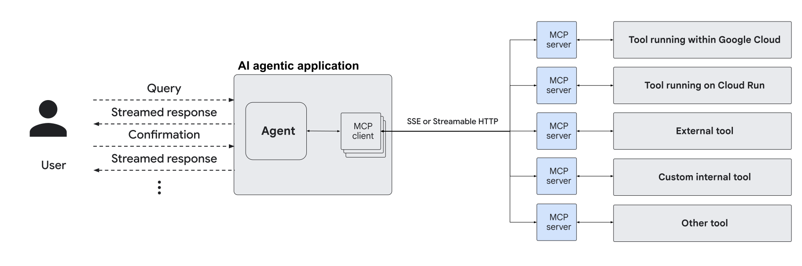
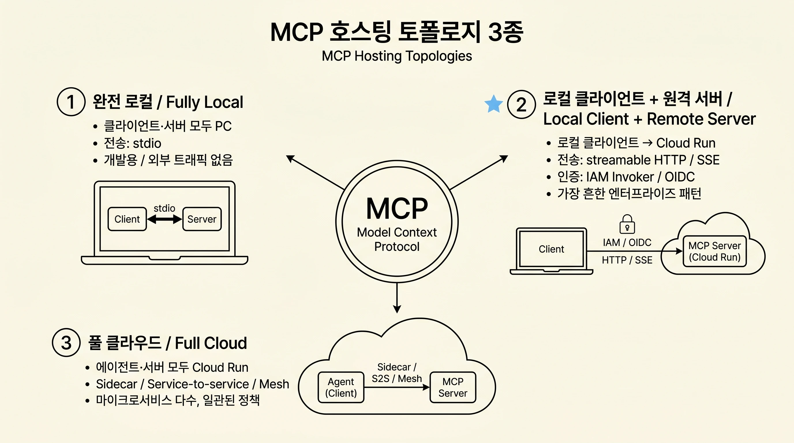
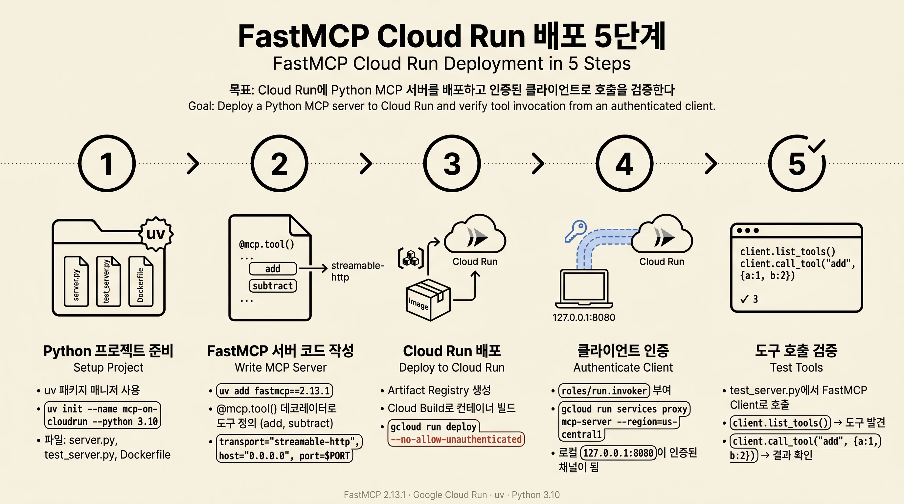
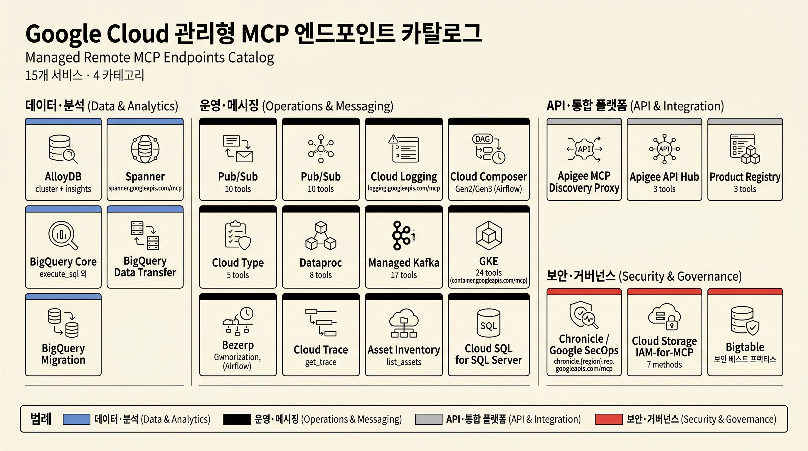
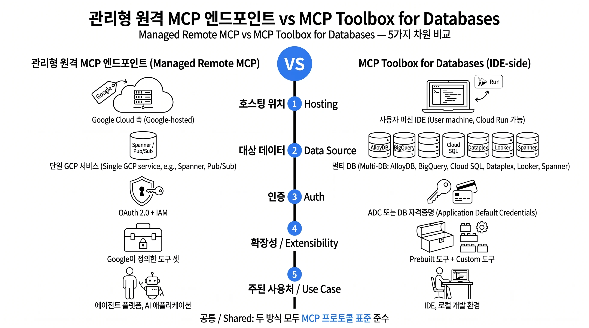
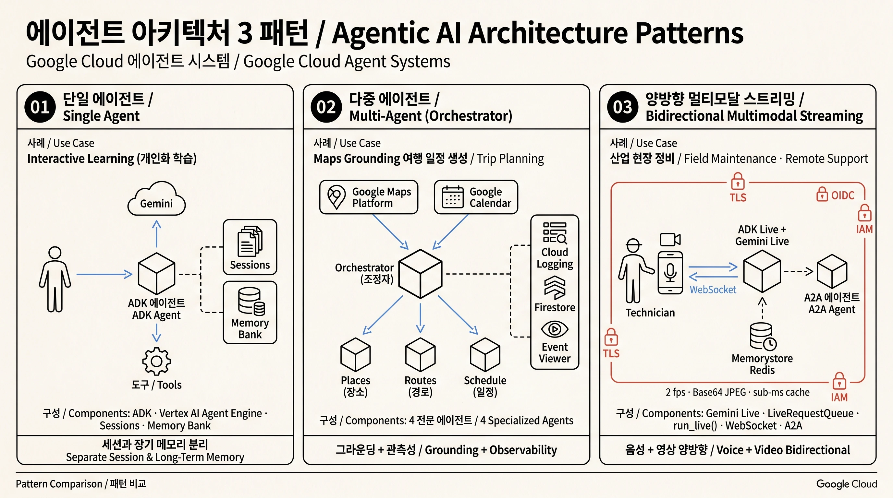
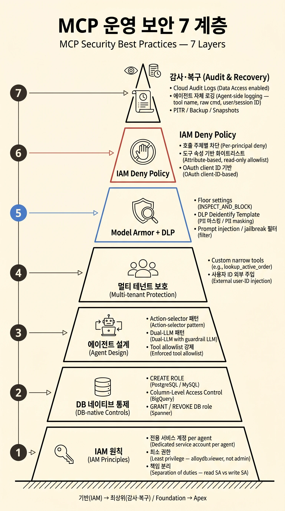

## 1. 개요

Model Context Protocol(MCP)은 생성형 AI 에이전트가 외부 데이터, 도구, 시스템과 상호작용하는 방식을 표준화한 오픈 프로토콜입니다. Google Cloud는 2025년부터 자사의 핵심 데이터와 운영 서비스 전반에 걸쳐 **관리형 원격 MCP 엔드포인트**, **Cloud Run 기반 사용자 정의 MCP 서버 호스팅**, **MCP Toolbox for Databases**, **Gemini Enterprise 커스텀 MCP 커넥터** 등 다층적인 MCP 통합 자산을 공급하고 있으며, 이는 단순한 라이브러리 패치가 아니라 IAM, OAuth, Model Armor, Audit Logs와 결합된 엔터프라이즈급 통제 평면으로 설계되어 있습니다.

본 백서는 Google Cloud 공식 문서 129개 페이지를 단일한 한국어 기술 가이드로 합성합니다. 다음과 같은 독자를 대상으로 합니다.

- **Cloud 아키텍트**: MCP를 조직의 AI 에이전트 아키텍처에 어떻게 안전하게 도입할지 설계하는 역할
- **백엔드와 플랫폼 엔지니어**: Cloud Run 위에 사용자 정의 MCP 서버를 직접 구축, 배포, 운영하는 역할
- **AI 에이전트 개발자**: Google Cloud 관리형 MCP 엔드포인트와 MCP Toolbox를 호출하는 클라이언트 및 에이전트를 만드는 역할

본 백서는 다음 영역을 포괄합니다.

- MCP 프로토콜 핵심 개념과 전송 방식
- Cloud Run에서의 사용자 정의 원격 MCP 서버 호스팅 및 인증
- FastMCP 기반 Cloud Run 배포 튜토리얼
- 약 15개 GCP 관리형 원격 MCP 부모 서비스(총 20여 개 엔드포인트)의 카테고리별 매핑
- MCP Toolbox for Databases와 IDE와 에이전트 통합
- Gemini Enterprise 커스텀 MCP 커넥터 워크플로
- 93개 MCP 도구의 서비스별 카탈로그(14개 서비스, mcp-tools-list 페이지 카운트 기반)
- 에이전트 시스템 참조 아키텍처 3종(Architecture Center 13개 가이드 중 본 백서가 선별: Interactive Learning / Maps Grounding / Bidirectional Multimodal Streaming)
- 운영 보안 베스트 프랙티스
- Cloud SQL Managed Connection Pooling(이름 충돌 주의)

---

## 2. MCP 핵심 개념

### 2.1 MCP가 표준화하는 것

MCP는 LLM과 AI 에이전트(MCP 클라이언트를 호스팅)와 외부 도구와 데이터 소스(MCP 서버로 노출)가 통신하는 방식을 단일 JSON-RPC 규약으로 정의합니다. AI 에이전트는 사용자의 의도를 해석한 뒤 MCP 클라이언트를 통해 표준화된 요청을 MCP 서버로 보내고, 서버가 동작(action)을 실행하여 결과를 일관된 형식으로 돌려줍니다.



*그림 1. Cloud Run에서 호스팅되는 MCP 서버는 MCP 클라이언트를 거쳐 AI 에이전트와 상호작용합니다. (출처: Host MCP servers on Cloud Run)*

### 2.2 전송 방식 비교

MCP는 세 가지 주요 전송 방식을 정의하며, 각각의 적합성과 호스팅 위치 제약이 다릅니다.

| 전송 방식 | 통신 채널 | 멀티 클라이언트 | Cloud Run 호환성 | 주요 사용 사례 |
|---|---|---|---|---|
| **stdio** | 표준 입출력 | 불가(단일 프로세스) | 미지원 | 로컬 머신, 동일 호스트에서 동작 |
| **Server-Sent Events(SSE)** | HTTP 단방향 스트림 | 가능 | 지원 | 원격 호스팅, 일방향 알림 위주 |
| **Streamable HTTP** | HTTP 양방향 스트림 | 가능 | 권장 | 원격 호스팅, 다중 클라이언트, 양방향 호출 |

Cloud Run은 **streamable HTTP**와 **SSE** 전송 방식만 지원하며 stdio는 지원하지 않습니다. Google Cloud의 관리형 원격 MCP 엔드포인트 또한 streamable HTTP 기반입니다. Gemini Enterprise 커스텀 MCP 커넥터는 SSE를 지원하지 않으며 **streamable HTTP만** 받아들입니다.

### 2.3 호스팅 토폴로지 3종

MCP 클라이언트와 서버의 배치 조합은 보안 경계와 운영 비용에 직접 영향을 미칩니다.

- **완전 로컬**: MCP 클라이언트와 서버가 모두 사용자 PC에서 동작합니다. stdio 전송이 일반적이며, 개발용으로 적합하고 외부 트래픽이 발생하지 않습니다.
- **로컬 클라이언트 + 원격 서버**: IDE/Gemini CLI/Claude 등 로컬에서 동작하는 클라이언트가 Cloud Run 혹은 Google 관리형 엔드포인트로 streamable HTTP/SSE 요청을 보냅니다. 가장 흔한 엔터프라이즈 패턴입니다.
- **풀 클라우드**: 에이전트(클라이언트)도 Cloud Run에서 호스팅되어 동일 또는 다른 Cloud Run 서비스의 MCP 서버를 호출합니다. 사이드카, 서비스-투-서비스 호출, Cloud Service Mesh를 활용해 인증을 단순화할 수 있습니다.



*인포그래픽 1: MCP 호스팅 토폴로지 3 종 (완전 로컬 / 로컬 클라이언트 + 원격 서버 / 풀 클라우드)*

---

## 3. Cloud Run에서 원격 MCP 서버 호스팅

### 3.1 배포 옵션

Cloud Run에 MCP 서버를 배포하는 방법은 두 가지로 나뉩니다.

- **컨테이너 이미지 배포**: MCP 서버가 컨테이너 형태로 패키징되어 있고 특정 포트에서 HTTP 요청을 받는 경우 Cloud Run의 [컨테이너 런타임 계약](https://docs.cloud.google.com/run/docs/container-contract#port)에 그대로 부합합니다. 다음 명령을 사용합니다.

  ```bash
  gcloud run deploy --image IMAGE_URL --port PORT
  ```

  예를 들어 `IMAGE_URL`은 `us-docker.pkg.dev/cloudrun/container/mcp` 같은 Artifact Registry URL이며, `PORT`는 컨테이너가 수신하는 포트 번호(예: `3000`)입니다.

- **소스 코드 배포**: Node.js와 Python 등으로 작성된 MCP 서버 리포지터리에서 곧장 배포하는 방식입니다.

  ```bash
  git clone https://github.com/ORGANIZATION/REPOSITORY.git
  cd REPOSITORY
  gcloud run deploy --source .
  ```

배포 후 Cloud Run은 HTTPS URL을 발급하며, Cloud Run의 내장 HTTP 응답 스트리밍 기능이 streamable HTTP/SSE 트래픽을 처리합니다.

### 3.2 인증 매트릭스

MCP 클라이언트의 위치에 따라 권장되는 인증 방식이 다릅니다.

| 클라이언트 위치 | 인증 방식 | 동작 방식 | 적합한 시나리오 |
|---|---|---|---|
| 로컬 | IAM Invoker + Cloud Run proxy | `gcloud run services proxy` 명령으로 로컬 포트를 열고, 사용자 ID 토큰을 자동 주입 | 개인 개발 환경, Gemini CLI/Claude Desktop 등 로컬 IDE |
| 로컬 | OIDC ID 토큰 | 클라이언트가 직접 `Authorization: Bearer <token>` 헤더로 ID 토큰 첨부, audience는 `*.run.app` URL 또는 [Custom Audience](https://docs.cloud.google.com/run/docs/configuring/custom-audiences) | 클라이언트가 헤더를 노출하는 경우 |
| Cloud Run | Sidecar 배포 | MCP 서버를 클라이언트와 동일 인스턴스 내 사이드카로 배포해 `http://localhost:PORT`로 호출 | 별도 인증 없이 가장 단순한 구조 |
| Cloud Run | Service-to-service 인증 | 표준 [Service-to-service 인증](https://docs.cloud.google.com/run/docs/authenticating/service-to-service): 호출 측 서비스 계정 ID 토큰을 자동 검증 | 클라이언트와 서버가 분리된 Cloud Run 서비스 |
| Cloud Run | Cloud Service Mesh | 메시 내 짧은 이름(`http://mcp-server`)으로 호출, 메시가 인증과 트래픽 관리 | 마이크로서비스 다수, 일관된 정책이 필요할 때 |

기본적으로 `--no-allow-unauthenticated` 옵션과 [Cloud Run Invoker](https://docs.cloud.google.com/run/docs/securing/managing-access#invoker)(`roles/run.invoker`) 역할의 조합이 가장 표준적인 보안 모델입니다.

### 3.3 MCP 클라이언트 구성 예시

로컬 클라이언트가 Cloud Run proxy(`gcloud run services proxy mcp-server --region REGION --port=3000`)를 통해 원격 서버에 접속하는 경우, MCP 클라이언트의 구성 파일은 다음과 같이 작성합니다.

- 네이티브 `url` 속성을 지원하는 클라이언트:

  ```json
  {
    "mcpServers": {
      "cloud-run": {
        "url": "http://localhost:3000/sse"
      }
    }
  }
  ```

- `url` 속성을 지원하지 않는 경우 `mcp-remote` npm 패키지로 우회합니다.

  ```json
  {
    "mcpServers": {
      "cloud-run": {
        "command": "npx",
        "args": [
          "-y",
          "mcp-remote",
          "http://localhost:3000/sse"
        ]
      }
    }
  }
  ```

---

## 4. 실습: FastMCP로 원격 MCP 서버 구축

본 절은 Cloud Run의 공식 튜토리얼(`run/docs/tutorials/deploy-remote-mcp-server`)을 한국어로 정리한 단계별 가이드입니다. FastMCP 2.13.1과 Python 3.10 이상이 필요하며, `uv` 패키지 매니저를 사용합니다.

### 4.1 사전 준비

다음 API를 활성화하고 IAM 역할을 부여합니다.

- Artifact Registry, Cloud Run Admin API, Cloud Build API 활성화
- `roles/run.admin`: Cloud Run 배포
- `roles/iam.serviceAccountUser`: 서비스 계정 사용
- `roles/run.invoker`: 인증된 호출 허용
- [Uv](https://docs.astral.sh/uv/getting-started/installation/) Python 패키지 매니저 설치

### 4.2 단계별 구현



*인포그래픽 2: FastMCP 로 Cloud Run 에 원격 MCP 서버를 배포하는 5 단계 (Python 프로젝트 → 서버 코드 → 배포 → 인증 → 검증)*

**1단계: Python 프로젝트 준비**

```bash
mkdir mcp-on-cloudrun
cd mcp-on-cloudrun
uv init --name "mcp-on-cloudrun" --description "Example of deploying an MCP server on Cloud Run" --bare --python 3.10
touch server.py test_server.py Dockerfile
```

프로젝트 구조는 다음과 같습니다.

```
mcp-on-cloudrun/
├── pyproject.toml
├── server.py
├── test_server.py
└── Dockerfile
```

**2단계: 의존성 추가 및 서버 코드 작성**

FastMCP를 의존성으로 추가합니다.

```bash
uv add fastmcp==2.13.1 --no-sync
```

`server.py`에 두 개의 도구(`add`, `subtract`)를 노출하는 MCP 서버를 구현합니다.

```python
import asyncio
import logging
import os

from fastmcp import FastMCP

logger = logging.getLogger(__name__)
logging.basicConfig(format="[%(levelname)s]: %(message)s", level=logging.INFO)

mcp = FastMCP("MCP Server on Cloud Run")

@mcp.tool()
def add(a: int, b: int) -> int:
    """Use this to add two numbers together."""
    logger.info(f">>> Tool: 'add' called with numbers '{a}' and '{b}'")
    return a + b

@mcp.tool()
def subtract(a: int, b: int) -> int:
    """Use this to subtract two numbers."""
    logger.info(f">>> Tool: 'subtract' called with numbers '{a}' and '{b}'")
    return a - b

if __name__ == "__main__":
    logger.info(f"MCP server started on port {os.getenv('PORT', 8080)}")
    asyncio.run(
        mcp.run_async(
            transport="streamable-http",
            host="0.0.0.0",
            port=os.getenv("PORT", 8080),
        )
    )
```

Cloud Run의 외부 트래픽 수신을 위해 `host="0.0.0.0"`이 반드시 필요합니다. 전송 방식은 `streamable-http`(권장) 또는 `sse`를 선택할 수 있으며, 그에 따라 클라이언트의 종단 경로가 `/mcp` 또는 `/sse`로 달라집니다.

**3단계: Dockerfile 작성과 Cloud Run 배포**

```dockerfile
FROM python:3.13-slim

COPY --from=ghcr.io/astral-sh/uv:latest /uv /uvx /bin/

COPY . /app
WORKDIR /app

ENV PYTHONUNBUFFERED=1

RUN uv sync

EXPOSE $PORT

CMD ["uv", "run", "server.py"]
```

Artifact Registry 리포지터리를 만들고 컨테이너 이미지를 빌드한 뒤 Cloud Run으로 배포합니다.

```bash
gcloud artifacts repositories create remote-mcp-servers \
  --repository-format=docker \
  --location=us-central1 \
  --description="Repository for remote MCP servers" \
  --project=PROJECT_ID

gcloud builds submit --region=us-central1 \
  --tag us-central1-docker.pkg.dev/PROJECT_ID/remote-mcp-servers/mcp-server:latest

gcloud run deploy mcp-server \
  --image us-central1-docker.pkg.dev/PROJECT_ID/remote-mcp-servers/mcp-server:latest \
  --region=us-central1 \
  --no-allow-unauthenticated
```

소스 직접 배포가 필요한 경우 다음 명령으로 단계를 축약할 수 있습니다.

```bash
gcloud run deploy mcp-server --no-allow-unauthenticated --region=us-central1 --source .
```

**4단계: 클라이언트 인증**

`--no-allow-unauthenticated` 옵션으로 배포했으므로 호출 측 ID에 `roles/run.invoker`를 부여하고 Cloud Run proxy를 실행합니다.

```bash
gcloud run services proxy mcp-server --region=us-central1
```

이 명령은 로컬 `http://127.0.0.1:8080`을 인증된 채널로 만들며, 모든 트래픽을 원격 MCP 서버로 전달합니다.

**5단계: 도구 호출 검증**

`test_server.py`로 FastMCP 클라이언트를 작성합니다.

```python
import asyncio
from fastmcp import Client

async def test_server():
    async with Client("http://localhost:8080/mcp") as client:
        tools = await client.list_tools()
        for tool in tools:
            print(f">>> Tool found: {tool.name}")
        print(">>> Calling add tool for 1 + 2")
        result = await client.call_tool("add", {"a": 1, "b": 2})
        print(f"<<< Result: {result.content[0].text}")
        print(">>> Calling subtract tool for 10 - 3")
        result = await client.call_tool("subtract", {"a": 10, "b": 3})
        print(f"<<< Result: {result.content[0].text}")

if __name__ == "__main__":
    asyncio.run(test_server())
```

별도 터미널에서 다음을 실행하면 도구가 정상적으로 발견되고 호출 결과가 출력됩니다.

```bash
uv run test_server.py
```

### 4.3 비용과 정리

이 튜토리얼은 Artifact Registry, Cloud Build, Cloud Run을 사용하며 이는 모두 과금 대상 컴포넌트입니다. 실습이 끝나면 다음을 정리합니다.

```bash
gcloud run services delete SERVICE-NAME
gcloud config unset run/region
gcloud config unset project
```

별도 프로젝트를 만들어 실습했다면 프로젝트 자체를 삭제하는 것이 가장 확실한 비용 정리 방법입니다.

---

## 5. Google Cloud 관리형 원격 MCP 엔드포인트

Google Cloud는 다수의 핵심 서비스에 대해 **관리형 원격 MCP 서버**를 제공합니다. 이들은 별도 배포와 운영 없이 해당 서비스 API만 활성화하면 즉시 사용할 수 있으며, 다음 공통 특성을 가집니다.

- 단순화된 중앙 집중식 디스커버리
- 글로벌 또는 리저널 HTTP 엔드포인트
- 세분화된 OAuth 2.0 + IAM 기반 권한 관리
- Model Armor를 통한 프롬프트와 응답 보호(옵션)
- 중앙 집중식 감사 로그(Cloud Audit Logs)

호출 시 공통적으로 다음 역할이 필요합니다.

- `roles/mcp.toolUser`: MCP 도구 호출 권한(`mcp.tools.call` 포함)
- 서비스별 작업에 필요한 IAM 역할(예: `roles/spanner.admin`, `roles/pubsub.editor`, `roles/logging.admin` 등)
- Claude.ai 또는 ChatGPT 등 OAuth 클라이언트를 사용하는 경우 `roles/oauthconfig.editor`

본 절은 약 15개 관리형 MCP 부모 서비스를 네 가지 카테고리로 그룹화합니다. 일부 서비스(BigQuery의 Core/Data Transfer/Migration, AlloyDB의 AlloyDB/Database Insights, Apigee의 Discovery Proxy/API Hub)는 하위 모듈로 분리되어 총 20여 개 MCP 엔드포인트로 확장됩니다.



*인포그래픽 3: Google Cloud 관리형 MCP 엔드포인트의 4 카테고리 (데이터와 분석 / 운영과 메시징 / API와 플랫폼 / 보안과 거버넌스). 하위 모듈을 모두 펼치면 약 20여 개 엔드포인트로 확장됩니다.*

### 5.1 데이터와 분석 서비스

| 서비스 | 엔드포인트 | OAuth 스코프 | 비고 |
|---|---|---|---|
| **AlloyDB for PostgreSQL** | 두 개의 서버: AlloyDB 서버(클러스터와 인스턴스 관리, SQL 실행)와 Database Insights 서버(성능 메트릭) | AlloyDB 관련 스코프 | 자세한 도구 명세는 [AlloyDB MCP reference](https://docs.cloud.google.com/alloydb/docs/reference/mcp) 참조 |
| **Spanner** | `https://spanner.googleapis.com/mcp` | `spanner.admin`, `spanner.data` | 도구 호출 시 자동 태깅(`mcp_execute_sql`, `mcp_execute_sql_readonly`, `mcp_commit`)으로 쿼리와 트랜잭션 식별 가능 |
| **BigQuery (Core)** | `https://bigquery.googleapis.com/mcp` | BigQuery 관련 스코프 | 실행된 쿼리에 `goog-mcp-server: true` job label 자동 부여 |
| **BigQuery Data Transfer** | BigQuery 도메인 하위 데이터 전송 | BigQuery 관련 스코프 | 전송 설정 생성, 조회, 수동 실행 |
| **BigQuery Migration** | BigQuery 도메인 하위 마이그레이션 | BigQuery 관련 스코프 | SQL 번역과 DDL 제안 분석 도구 |

AlloyDB의 두 서버는 역할이 명확하게 분리되어 있습니다.

- **AlloyDB 서버**: 클러스터와 인스턴스 라이프사이클 관리, SQL 실행 등 일반적인 데이터 조작과 운영을 담당합니다.
- **Database Insights 서버**: 성능 메트릭과 시스템 통계를 질의하기 위한 전용 도구를 제공합니다.

### 5.2 운영, 메시징, 플랫폼 서비스

| 서비스 | 엔드포인트 | OAuth 스코프 | 비고 |
|---|---|---|---|
| **Pub/Sub** | `https://pubsub.googleapis.com/mcp` (글로벌 GA), 로케이션과 리저널 엔드포인트(리저널은 Preview) | `pubsub` | 토픽, 구독, 스냅샷 CRUD, 메시지 publish. API 키 미지원 |
| **Cloud Logging** | `https://logging.googleapis.com/mcp` | `logging.admin`, `logging.read`, `logging.write` | 로그 뷰 조회 도구 제공. 예외적으로 API 키 허용 |
| **Cloud Composer (Managed Airflow Gen2/Gen3)** | Composer 엔드포인트(Preview) | `cloudcomposer.readonly`, `cloudcomposer` | 환경 관리, 실패한 DAG run 조회 등. Gen2와 Gen3 동일 도구 셋 |
| **Cloud Run** | Cloud Run 서비스로 호스팅(사용자 정의) | - | 본 백서 3, 4장 참조 |
| **Dataproc** | Dataproc 엔드포인트 | Dataproc 관련 스코프 | 클러스터, 배치, 세션, 잡 라이프사이클 |
| **Managed Service for Apache Kafka** | Kafka 엔드포인트 | Kafka 관련 스코프 | 토픽, ACL, 커넥터, 소비자 그룹 등 17개 도구 |
| **GKE** | `https://container.googleapis.com/mcp` | GKE 관련 스코프 | 클러스터, 노드풀, K8s 리소스 CRUD, 로그와 이벤트 조회 등 24개 도구 |
| **Cloud Trace** | Trace 엔드포인트 | Trace 관련 스코프 | `get_trace` 단일 도구 |
| **Asset Inventory** | Asset Inventory 엔드포인트 | Cloud Asset 관련 스코프 | `list_assets` 단일 도구 |
| **Cloud SQL for SQL Server** | `https://sqladmin.googleapis.com/mcp` | `cloud-platform`, `cloudsql.readonly` | 인스턴스 라이프사이클, 백업, 복원, 데이터 가져오기. SQL Server는 사용자/SQL 실행 도구가 별도로 노출되지 않음 |

Cloud Composer MCP 서버는 다음과 같이 환경별과 DAG별 운영 도구를 제공합니다.

- `list_environments`: 프로젝트 내 모든 Airflow 환경 조회
- `find_last_failed_dag_runs`: 가장 최근 실패한 DAG 실행 정보
- `list_failed_task_instances`: 실패한 태스크 인스턴스 목록
- `delete_environment`: 환경 삭제

### 5.3 API와 통합 플랫폼

| 서비스 | 엔드포인트/구조 | 비고 |
|---|---|---|
| **Apigee MCP Discovery Proxy** | Apigee 런타임 호스트(`$RUNTIME_HOSTNAME`)에 배포 | OpenAPI 3.0.x로 정의한 API 오퍼레이션을 MCP 도구로 노출 |
| **Apigee API Hub MCP Tools 관리** | `https://apihub.googleapis.com/v1/projects/.../operations` | MCP 도구를 API 버전 단위로 등록과 관리. annotation(readOnlyHint, destructiveHint, idempotentHint, openWorldHint) 지원 |
| **Agent Registry** | Agent Registry 엔드포인트 | `list_agents`, `list_endpoints`, `get_operation` 3개 도구 |
| **Product Registry** | Product Registry 엔드포인트 | `list_product_suites`, `get_logical_product_variant`, `lookup_entity_by_name` 3개 도구 |

Apigee MCP Discovery Proxy 구현 절차는 다음과 같습니다.

1. **OpenAPI 3.0.x 사양 작성**: 노출할 API 오퍼레이션을 정의(3.0.0~3.0.3 지원)
2. **MCP Discovery Proxy 생성**: Apigee에서 MCP Discovery Proxy 템플릿으로 프록시 생성
3. **(선택) 보안 정책 추가**: `VerifyAccessToken` 등 OAuth 토큰 검증 정책 적용
4. **프록시 배포**: Apigee 런타임에 배포
5. **(선택) MCP 서버 초기화**: initialize 호출
6. **도구 목록 조회**: `tools/list` JSON-RPC 호출로 검증

추가로 Apigee API Hub는 등록된 MCP API 버전에 대해 `Create operations` REST API로 도구 메타데이터(이름, 타이틀, 설명, annotation, input/output JSON Schema)를 명시적으로 관리할 수 있습니다.

### 5.4 보안과 거버넌스 서비스

| 서비스 | 엔드포인트 | OAuth 스코프 | 비고 |
|---|---|---|---|
| **Google SecOps (Chronicle)** | `https://chronicle.{region}.rep.googleapis.com/mcp` (리저널) | `chronicle` | 리저널 엔드포인트만 제공. 규칙 오류 조회와 규칙 생성 등. 추가 역할 필요: `roles/chronicle.admin`, `roles/chronicle.soarAdmin` |
| **Cloud Storage** | `https://storage.googleapis.com/mcp` (개념적) | Storage 관련 스코프 | `create_bucket`, `list_buckets`, `list_objects`, `read_object`, `read_text`, `write_text`, `get_object_metadata` 7개 메서드. 각 메서드별 `storage.*` 권한 필요 |
| **Bigtable** | Bigtable은 별도 관리형 MCP 엔드포인트 대신 **에이전트 상호작용 보안 베스트 프랙티스** 가이드를 제공 | - | 10장 보안 베스트 프랙티스의 주요 출처 |

### 5.5 공통 클라이언트 구성 패턴

본 절의 모든 관리형 엔드포인트는 동일한 호스트 프로그램(Gemini CLI, Claude.ai, ChatGPT, 커스텀 애플리케이션)에 대해 일관된 구성 절차를 따릅니다.

- **Gemini CLI**: `~/.gemini/extensions/<EXT_NAME>/gemini-extension.json` 확장 파일에 `mcpServers` 블록 작성

  ```json
  {
    "name": "EXT_NAME",
    "version": "1.0.0",
    "mcpServers": {
      "Spanner MCP Server": {
        "httpUrl": "https://spanner.googleapis.com/mcp",
        "authProviderType": "google_credentials",
        "oauth": {
          "scopes": ["https://www.googleapis.com/auth/cloud-platform"]
        },
        "timeout": 30000,
        "headers": {
          "x-goog-user-project": "PROJECT_ID"
        }
      }
    }
  }
  ```

- **Claude.ai**: Enterprise/Pro/Max/Team 플랜에서 **Custom Connector** 등록, OAuth 클라이언트 ID/시크릿 입력, 인증된 리다이렉트 URI는 `https://claude.ai/api/mcp/auth_callback`
- **ChatGPT**: Business 구독에서 **Developer Mode** 활성화 후 App 등록, 인증된 리다이렉트 URI는 `https://chatgpt.com/connector_platform_oauth_redirect`

`tools/list` 메서드는 인증이 필요하지 않으며, 직접 HTTP POST로 호출해 도구 카탈로그를 확인할 수 있습니다.

```http
POST /mcp HTTP/1.1
Host: spanner.googleapis.com
Content-Type: application/json

{ "jsonrpc": "2.0", "method": "tools/list" }
```

---

## 6. MCP Toolbox for Databases (IDE → DB)

### 6.1 관리형 엔드포인트와의 차이

Google Cloud는 단일 [MCP Toolbox for Databases](https://github.com/googleapis/mcp-toolbox) 오픈소스 바이너리를 통해 **IDE와 에이전트에서 데이터베이스로의 보안과 통제된 채널**을 제공합니다. 5장의 관리형 엔드포인트가 GCP 측에서 호스팅되는 단일 서비스 전용 채널이라면, MCP Toolbox는 사용자 측(IDE)에서 동작하는 멀티-DB 게이트웨이입니다.



*인포그래픽 4: 관리형 원격 MCP 엔드포인트 vs MCP Toolbox for Databases (호스팅 위치, 데이터 소스, 인증, 확장성, 사용처 5 차원 비교)*

| 항목 | 관리형 원격 MCP 엔드포인트 | MCP Toolbox for Databases |
|---|---|---|
| **호스팅 위치** | Google Cloud 측 | 사용자 머신(IDE 측), Cloud Run에 배포 가능 |
| **대상 데이터 소스** | 단일 GCP 서비스(예: Spanner, Pub/Sub) | 여러 DB 통합(AlloyDB, BigQuery, Cloud SQL, Dataplex, Looker, Spanner) |
| **인증** | OAuth 2.0 + IAM | Application Default Credentials(ADC) 또는 DB 자체 자격증명 |
| **확장성** | Google이 정의한 도구 셋 | Prebuilt 도구 + 사용자 정의(Custom) 도구 |
| **주된 사용처** | 에이전트 플랫폼, AI 애플리케이션 | IDE와 로컬 개발 환경 |

### 6.2 지원 IDE와 클라이언트

MCP Toolbox는 다음 IDE 및 에이전트와 통합됩니다.

- Gemini CLI (각 DB의 전용 extension)
- Antigravity (MCP Store에서 원클릭 설치)
- Claude desktop, Claude code
- Cursor, Windsurf (formerly Codeium)
- Visual Studio Code (Copilot, Cline)

Antigravity의 **MCP Store**는 BigQuery 등 GCP 데이터 서비스를 클릭 한 번으로 설치할 수 있게 해주며, 별도의 바이너리 다운로드 없이 작동합니다. 사용자 정의 구성이 필요한 경우 `mcp_config.json`에 다음과 같은 항목을 추가합니다.

```json
{
  "mcpServers": {
    "bigquery": {
      "command": "npx",
      "args": ["-y","@toolbox-sdk/server","--prebuilt","bigquery","--stdio"],
      "env": { "BIGQUERY_PROJECT": "PROJECT_ID" }
    }
  }
}
```

### 6.3 지원 데이터베이스와 환경변수 패턴

| 데이터베이스 | 핵심 환경변수 | 노출되는 주요 도구 |
|---|---|---|
| **AlloyDB** | `PROJECT`, `REGION`, `CLUSTER`, `INSTANCE`, `DATABASE` | 클러스터, 인스턴스, 사용자 관리, 옵저버빌리티, SQL 실행 |
| **BigQuery** | `BIGQUERY_PROJECT` | `execute_sql`, `list_datasets`, `get_table_info`, `ask_data_insights`, `analyze_contribution`, `forecast` |
| **Cloud SQL for MySQL** | `MYSQL_PROJECT`, `REGION`, `INSTANCE`, `DATABASE`, `USER`, `PASSWORD` | SQL 실행, 스키마 점검, 성능 모니터링 |
| **Cloud SQL for PostgreSQL** | `POSTGRES_PROJECT`, `REGION`, `INSTANCE`, `DATABASE`, `USER`, `PASSWORD` | 쿼리, 확장 관리, 인덱스 최적화, 복제 통계 |
| **Cloud SQL for SQL Server** | `SQLSERVER_PROJECT`, `REGION`, `INSTANCE`, `DATABASE`, `USER`, `PASSWORD` | 제한된 도구 셋(SQL Server 플랫폼 제약) |
| **Dataplex** | Dataplex 자격증명 | 자산과 데이터 제품 메타데이터 작업 |
| **Looker** | `LOOKER_BASE_URL`, `LOOKER_CLIENT_ID`, `LOOKER_CLIENT_SECRET` | 대시보드, explore, view 탐색, LookML 쿼리 실행 |
| **Spanner** | Spanner 자격증명 | 데이터와 관리 도구 |

### 6.4 설치

MCP Toolbox v0.7.0 이상 바이너리를 OS와 아키텍처에 맞춰 내려받아 실행 권한을 부여합니다.

```bash
# macOS darwin/arm64 예시
curl -O https://storage.googleapis.com/mcp-toolbox-for-databases/v0.7.0/darwin/arm64/toolbox
chmod +x toolbox
```

Gemini CLI 확장 형태로 통합되는 경우(예: BigQuery `gemini` extension)에는 별도 바이너리 설치가 필요 없습니다.

---

## 7. Gemini Enterprise 커스텀 MCP 서버 연동

Gemini Enterprise는 사내 시스템과 서드파티 도구를 **커스텀 MCP 데이터스토어**로 등록해 Google Cloud 콘솔 안에서 직접 통합할 수 있게 해줍니다. 이 기능은 현재 Preview 단계이며, **Streamable HTTP 전송만** 지원하고 SSE, Private Service Connect, VPC Service Controls는 지원하지 않습니다.

### 7.1 사전 작업: 조직 정책 오버라이드

기본적으로 `Disable custom mcp server connector for gemini enterprise` 제약이 활성화되어 있어 커스텀 MCP 데이터스토어 생성을 차단합니다. Organization Policy Administrator(`roles/orgpolicy.policyAdmin`) 역할을 가진 사용자가 다음 절차로 해제합니다.

1. Google Cloud 콘솔의 **조직 정책** 페이지로 이동합니다.
2. 변경 대상 프로젝트를 선택합니다(조직 단위로 변경하면 모든 하위 프로젝트에 영향).
3. 필터에 `Disable custom mcp server connector for gemini enterprise`를 입력해 정책을 찾습니다.
4. **Manage Policy**를 클릭합니다.
5. **Override parent's policy**를 선택하고 enforcement 토글을 **OFF**로 설정합니다.
6. **Set Policy**로 저장합니다.

정책 상태가 **Not enforced**로 표시되는지 확인하면 완료입니다.

### 7.2 OAuth 클라이언트 등록 및 데이터스토어 생성

사용자에게 **Discovery Engine Editor**(`roles/discoveryengine.editor`)를 부여한 뒤, Okta, Azure AD, Google 등 IdP에 Gemini Enterprise를 OAuth 클라이언트로 등록합니다. 인증 리다이렉트 URL은 다음 값을 사용합니다.

```
https://vertexaisearch.cloud.google.com/oauth-redirect
```

발급된 `client_id`와 `client_secret`을 보관합니다. 콘솔에서 **Gemini Enterprise → Data stores → Create data store → Custom MCP Server(Preview)** 카드를 선택하고 다음 필드를 입력합니다.

| 필드 | 입력 값 |
|---|---|
| **MCP Server URL** | MCP 서버의 HTTPS 엔드포인트(보통 `/mcp`로 끝남) |
| **Authorization URL** | 사용자 인가용 베이스 URL(파라미터 제외) |
| **Authorization URL Parameters** | 필요 시 `&access_type=offline&prompt=consent`, `&audience=...` 등 |
| **Token URL** | 토큰 교환 엔드포인트 |
| **Client ID / Client Secret** | IdP에서 발급받은 값 |
| **Scopes** | 공백 구분 스코프 리스트. `offline_access`가 흔히 사용됨 |

로그인과 인가가 완료되면 **MCP Server Description**을 작성한 뒤 데이터스토어 위치를 지정해 생성합니다. 데이터스토어 상태가 `Creating`에서 `Active`로 바뀌면 사용 가능합니다.

### 7.3 액션 활성화

기본적으로 모든 도구와 액션은 비활성 상태입니다. **Actions → Reload custom actions**를 클릭하면 Gemini Enterprise가 MCP 서버에 `tools/list`를 호출해 도구 목록을 가져오며, 사용할 도구를 선택해 활성화해야 비로소 호출 가능해집니다.

### 7.4 MCP Server Description 작성 가이드

라우팅 시스템과 에이전트가 데이터스토어를 올바르게 선택 및 사용하도록 하려면 description 필드를 정교하게 작성해야 합니다. 다음 항목을 반드시 포함합니다.

- **목적과 기능**: 데이터스토어의 주된 목적, 연결되는 서비스, 사용자가 수행할 수 있는 작업, 그리고 **지원하지 않는** 기능을 명시
- **트리거 예시 쿼리**: 명확한 쿼리와 추론이 필요한 모호한 쿼리를 함께 제공하고, 각 쿼리가 데이터스토어를 선택해야 하는 이유를 함께 기술
- **에이전트 역할 정의**: 페르소나(예: "당신은 Cymbal의 프로젝트 관리 시스템 비서입니다")
- **핵심 작업 항목**: 주요 동작 나열(쿼리, 필터링, 요약, 보고)
- **기본 동작**: 모호한 요청에 대한 처리 방식, 기본 필터와 파라미터
- **오류 처리**: 자원 미발견과 작업 실패 시 대응 메시지
- **데이터 표현**: 결과 요약과 서식 규칙
- **권한 제한 명시**: 읽기 전용과 쓰기 권한 등 한계

description은 Markdown 헤더와 불릿을 사용해 구조화하는 것이 권장됩니다. 배포 후 다양한 쿼리로 테스트하여 결과에 따라 description을 지속적으로 다듬는 절차가 필요합니다.

---

## 8. MCP 도구 카탈로그

본 절은 Google Cloud 관리형 원격 MCP 서버가 노출하는 RPC 도구를 서비스별로 정리합니다. 각 도구 페이지는 공통적으로 다음 항목을 담고 있습니다.

- 도구 설명(자연어)
- `curl` 호출 예시(`tools/call` 메서드)
- 입력 스키마(JSON 표현 + 필드 정의)
- 출력 스키마(JSON 표현 + 필드 정의)
- Tool Annotations: Destructive Hint / Idempotent Hint / Read Only Hint / Open World Hint

엔드포인트는 대부분 `https://<service>.googleapis.com/mcp` 형태를 따르며, SecOps 등 일부 서비스는 리저널 엔드포인트(`chronicle.{region}.rep.googleapis.com/mcp`)를 사용합니다.

### 8.1 도구 카탈로그(서비스 14종, 도구 93개)

| 서비스 | 도구 수 | 카테고리 | 대표 도구 | 엔드포인트 패턴 |
|---|---:|---|---|---|
| Agent Registry | 3 | read-only | `list_agents`, `list_endpoints`, `get_operation` | Agent Registry 도메인 |
| Asset Inventory | 1 | read-only | `list_assets` | Asset Inventory 도메인 |
| BigQuery (Core) | 5 | mixed | `execute_sql`, `execute_sql_readonly`, `get_dataset_info`, `get_table_info`, `list_dataset_ids` | `bigquery.googleapis.com/mcp` |
| BigQuery Data Transfer | 5 | mixed | `create_transfer_config`, `list_transfer_configs`, `list_data_sources`, `check_valid_creds`, `start_manual_transfer_runs` | BigQuery 도메인 |
| BigQuery Migration | 3 | read-only(분석) | `get_translation`, `explain_translation`, `fetch_ddl_suggestion` | BigQuery 도메인 |
| Cloud Composer | 4 | mixed | `list_environments`, `find_last_failed_dag_runs`, `list_failed_task_instances`, `delete_environment` | Composer 도메인 |
| Dataplex | 7 | mixed | `create_data_asset`, `update_data_asset`, `list_data_assets`, `create_data_product`, `update_data_product`, `list_data_products`, `lookup_context` | Dataplex 도메인 |
| Dataproc | 8 | mixed | `create_cluster`, `get_cluster`, `list_clusters`, `create_batch`, `delete_batch`, `list_batches`, `delete_session`, `list_jobs` | Dataproc 도메인 |
| GKE | 24 | mixed | `create_cluster`, `update_cluster`, `delete_cluster`, `patch_k8s_resource`, `get_k8s_logs`, `list_k8s_events`, `get_k8s_rollout_status`, `kube_get` 등 | `container.googleapis.com/mcp` |
| Cloud Logging | 2 | read-only | `list_views`, `get_view` | `logging.googleapis.com/mcp` |
| Managed Kafka | 17 | mixed | `create_topic`, `get_topic`, `delete_topic`, `get_cluster`, `delete_cluster`, `get_consumer_group`, `delete_consumer_group`, `get_acl`, `update_acl`, `delete_acl`, `list_connect_clusters`, `delete_connect_cluster`, `get_connect_cluster`, `create_connector`, `list_connectors`, `get_connector`, `pause_connector` | Kafka 도메인 |
| Product Registry | 3 | read-only | `list_product_suites`, `get_logical_product_variant`, `lookup_entity_by_name` | Product Registry 도메인 |
| Pub/Sub | 10 | mixed | `create_snapshot`, `delete_snapshot`, `get_snapshot`, `list_snapshots`, `get_topic`, `delete_topic`, `update_topic`, `list_topics`, `delete_subscription`, `update_subscription` | `pubsub.googleapis.com/mcp` |
| Cloud Trace | 1 | read-only | `get_trace` | Trace 도메인 |
| **합계** | **93** | | | |

### 8.2 카탈로그 활용

각 도구는 자체 도구 어노테이션(Destructive / Idempotent / Read-Only / Open-World 힌트)을 노출하며, 에이전트 측 라우터와 정책 엔진이 이를 활용해 동적으로 호출 가능 여부를 판정할 수 있습니다. 예를 들어 BigQuery `execute_sql`은 Destructive ✓, Open World ✓로 표기되어 있어 광범위한 부수효과 가능성을 명시합니다. 운영 환경에서는 read-only 또는 idempotent 도구만 허용하는 IAM deny policy 패턴이 권장됩니다(10장 참조).

### 8.3 BigQuery `execute_sql` 호출 예시

```bash
curl --location 'https://bigquery.googleapis.com/mcp' \
  --header 'content-type: application/json' \
  --header 'accept: application/json, text/event-stream' \
  --data '{
    "method": "tools/call",
    "params": {
      "name": "execute_sql",
      "arguments": {
        "projectId": "PROJECT_ID",
        "query": "SELECT 1 AS x",
        "dryRun": false
      }
    },
    "jsonrpc": "2.0",
    "id": 1
  }'
```

`execute_sql`로 실행된 모든 쿼리는 `goog-mcp-server: true` job label이 자동 부여되어 BigQuery INFORMATION_SCHEMA 조회 시 MCP 발신 트래픽만 별도로 추적할 수 있습니다.

---

## 9. 에이전트 시스템 아키텍처 패턴

Google Cloud의 [Agentic AI 아키텍처 가이드](https://docs.cloud.google.com/architecture/agentic-ai-overview)는 13개의 참조 아키텍처를 카탈로그화합니다. 본 절은 그 중 MCP를 가장 직관적으로 활용하는 세 가지 패턴을 정리합니다.



*인포그래픽 5: Google Cloud 에이전트 시스템 3 패턴 (단일 에이전트(Interactive Learning) / 다중 에이전트(Maps Grounding) / 양방향 멀티모달 스트리밍)*

### 9.1 단일 에이전트: Interactive Learning

지정된 주제에 대해 사용자의 지식 수준을 평가하고 개인화된 학습 경험을 생성하는 단일 에이전트 아키텍처입니다. ADK(Agent Development Kit)와 Vertex AI Agent Engine Sessions, Memory Bank가 핵심 구성 요소입니다.

- **구성 요소**: Cloud Run에서 호스팅되는 퀴즈 애플리케이션, ADK 기반 단일 에이전트, Vertex AI의 Gemini 모델, Agent Engine Sessions(영구 상호작용 기록), Memory Bank(장기 메모리)
- **데이터 흐름**
  1. 사용자가 퀴즈를 시작하거나 답을 제출
  2. 애플리케이션이 입력을 에이전트로 전달
  3. 에이전트가 Gemini 모델을 통해 의도를 해석하고 적절한 도구를 호출(세션 시작, 답 평가, 다음 문항 생성)
  4. 응답을 사용자에게 반환
  5. 백그라운드 작업으로 진행 상황을 Agent Engine Sessions에 기록하고, 퀴즈 데이터를 Memory Bank가 장기 기억으로 변환
- **설계 고려 사항**: 세션과 메모리는 분리해 단기와 장기 컨텍스트를 명확히 구분합니다. 적용 가능 영역은 교육뿐 아니라 사용자 상태가 누적되어야 하는 모든 상호작용형 애플리케이션으로 확장 가능합니다.

### 9.2 다중 에이전트: Maps Grounding

Gemini Enterprise Agent Platform에서 동작하는 4개 전문 에이전트(Orchestrator, Places, Routes, Schedule)가 Google Maps Platform 및 Calendar와 연동되어 여행 일정을 생성하는 멀티 에이전트 시스템입니다.

- **구성 요소**
  - **Orchestrator agent**: 사용자 요청을 받고 의도를 분해, 전문 에이전트 간 조정
  - **Places agent**: 위치 기반 검색(영업시간과 POI)
  - **Routes agent**: 경로와 이동 시간 계산
  - **Schedule agent**: 캘린더 조회와 일정 재배치
  - **그라운딩 데이터**: Grounding with Google Maps, Places Insights, Google Calendar
  - **관측성**: Cloud Logging에 에이전트 이벤트 기록, Firestore에 게시, Event Viewer 앱(Cloud Run)으로 사고 흐름과 에이전트 동작을 시각화
- **설계 고려 사항**
  - **보안**: 제로 트러스트, 에이전트별 최소 권한
  - **신뢰성**: 환불 불가 예약 등 중요한 작업에 Human-in-the-Loop(HITL) 검증
  - **성능**: Coordinator 패턴으로 Places와 Schedule을 병렬 실행
  - **비용**: 자주 조회되는 경로와 인기 장소는 캐시 활용
  - **거버넌스**: 에이전트별 역할과 데이터 처리 가이드라인을 명확화
- **확장 사례**: 출장 예약 자동화, 현장 서비스 디스패치, 물류와 공급망 조정

### 9.3 양방향 멀티모달 스트리밍

산업 현장 정비와 원격 기술 지원 등 음성과 영상이 양방향으로 실시간 흐르는 시나리오를 위한 멀티 에이전트 아키텍처입니다. Gemini Live, ADK `LiveRequestQueue`/`run_live()`, WebSocket/TLS, A2A(Agent-to-Agent) 프로토콜이 핵심입니다.

- **기술 가이드 워크플로(8단계)**
  1. 사용자가 클라이언트 대시보드에서 음성 기술 문의를 시작
  2. WebSocket이 영구 연결을 수립
  3. ADK `LiveRequestQueue`가 멀티미디어 `Blob` 스트림을 전달
  4. Dispatcher 에이전트가 스트림을 Gemini Live 모델로 전달
  5. Gemini가 오디오 키워드와 시각 단서를 식별
  6. function calling으로 추가 컨텍스트 필요 여부를 판정
  7. A2A 프로토콜로 적절한 에이전트 카드 조회 후 Architect 에이전트가 Serverless VPC Access → Memorystore Redis → Compute Engine 지식 DB를 질의
  8. ADK `run_live()`로 멀티모달 응답을 생성하고 WebSocket으로 클라이언트에 전달
- **안전 모니터링 워크플로(7단계)**: 영상 스트림이 백그라운드 루프를 통해 Gemini의 위험 감지로 입력되고, 위험 감지 시 WebSocket이 음성 경고와 자막을 푸시
- **설계 고려 사항**
  - **에이전트 설계**: 제어 루프 스크립트를 페르소나가 아닌 상태 머신처럼 다룸. 백그라운드 스트리밍은 전용 도구로 분리
  - **프로덕션**: 기본 `run.app` URL 비활성화, Regional External ALB + Cloud Armor 정책, 스레드-세이프 FIFO 버퍼로 오디오와 영상 입력을 추론과 분리
  - **데이터 수집 비용**: 저주파 프레임 샘플링(2 fps)과 Base64 JPEG 압축
  - **인-메모리 캐싱**: Memorystore Redis로 Architect 에이전트의 도식 vault를 sub-millisecond 응답
  - **WebSocket 보안**: 양방향 TLS 암호화
  - **A2A 보안**: 인증된 확장 에이전트 카드, OIDC ID 토큰, IAM 검증
- **활용 사례**: 스마트 글래스를 활용한 산업 현장 정비, 휴대전화 카메라 기반 원격 기술 지원

### 9.4 그 외 참조 아키텍처 13선(Architecture Center)

| 가이드 | 핵심 주제 |
|---|---|
| Administer interactive learning | 9.1과 동일 |
| Automate data science workflows | 데이터 분석과 ML 워크로드 자동화 다중 에이전트 |
| Build a multicloud open data lakehouse | 멀티클라우드 통합 데이터 파이프라인 + 에이전트 |
| Build a trusted agentic system with Google Maps Platform | 9.2와 동일 |
| Classify multimodal data | 다양한 모달리티의 데이터를 고신뢰도로 분류 |
| Guide technical workflows with bidirectional multimodal streaming | 9.3과 동일 |
| Multimodal GraphRAG resource orchestration | 분산 멀티모달 자료를 지식 그래프로 통합 |
| Orchestrate access to disparate enterprise systems | 이종 기업 시스템 오케스트레이션 |
| Orchestrate security operations workflows | SOC 조사와 트리아지 멀티 에이전트 |
| Choose a design pattern for your agentic AI system | 디자인 패턴 선택 가이드 |
| Choose your agentic AI architecture components | 컴포넌트 선택 가이드 |
| Multi-agent AI system in Google Cloud | 멀티 에이전트 참조 아키텍처 |
| Single-agent AI system using ADK and Cloud Run | ADK, Cloud Run, MCP 기반 단일 에이전트 |

---

## 10. 운영 보안 베스트 프랙티스

MCP 도구 호출은 IAM, DB 네이티브 통제, 에이전트 설계, Model Armor 등 다층 방어가 필요합니다. 본 절은 7 계층 베스트 프랙티스를 정리합니다.



*인포그래픽 6: MCP 운영 보안 7 계층 베스트 프랙티스 (IAM 원칙 → DB 네이티브 → 에이전트 설계 → 멀티 테넌트 → Model Armor → Deny Policy → 감사와 복구)*

### 10.1 IAM 원칙: 최소 권한과 책임 분리

에이전트 보안의 1차 방어선은 최소 권한 IAM입니다.

- **전용 ID**: MCP 도구를 사용하는 모든 고유 에이전트와 애플리케이션마다 별도의 서비스 계정을 생성합니다. 광범위한 권한을 가진 기존 서비스 계정 재사용을 피해야 합니다.
- **최소 스코프**: 필요한 IAM 역할만 부여합니다(예: `alloydb.admin` 대신 `alloydb.viewer`). 특정 데이터셋에 대한 읽기만 필요하다면 커스텀 역할을 만들어 최소 권한으로 제한합니다.
- **책임 분리**: 데이터 읽기와 로그 및 임시 저장소 쓰기 양쪽 모두가 필요한 경우 두 개의 서비스 계정으로 분리합니다(고위험, 저위험).

### 10.2 DB 네이티브 세분화 통제

IAM 만으로는 부족합니다. DB 자체의 세밀한 권한 통제를 결합해야 토큰 탈취 시 피해 범위를 제한할 수 있습니다.

| 제품 | 세분화 통제 | 초점 |
|---|---|---|
| Cloud SQL과 AlloyDB | DB 레벨 역할(PostgreSQL과 MySQL의 `CREATE ROLE`) | 인스턴스 내 데이터베이스와 스키마별 권한 |
| BigQuery | Column-Level Access Control(정책 태그) | PII 등 민감 컬럼 보호 |
| Spanner | Fine-Grained Access Control(`GRANT`/`REVOKE` DB role) | 테이블과 컬럼 단위 read/write/update 통제 |
| Firestore | IAM 역할 + IAM Conditions | DB별 접근 권한 |
| Bigtable | IAM 역할 | 프로젝트, 인스턴스, 테이블 단위 통제 |
| Oracle Database@Google Cloud | IAM 역할 | 프로젝트와 리소스 단위 통제 |

### 10.3 에이전트 설계: 프롬프트 인젝션 방어

에이전트는 사용자 입력과 외부 데이터를 **모두 신뢰할 수 없는 입력**으로 다뤄야 합니다.

- **Action-selector 패턴**: 모델은 사전 정의된 안전한 함수 중 하나를 선택만 합니다. 액션 로직은 하드 코딩되어 LLM이 변경할 수 없습니다.
- **Dual-LLM 패턴**: 주 LLM(action LLM)이 핵심 작업을 수행하고, 별도의 보안 LLM(guardrail LLM)이 입력의 악의 여부와 출력의 비인가 동작과 데이터 유출을 사전과 사후 검사합니다.
- **도구 동적 등록 금지**: 에이전트가 런타임에 새 도구를 등록하거나 기존 도구의 권한을 바꾸지 못하도록 차단합니다.
- **Allowlist 강제**: 초기 시스템 프롬프트와 백엔드 코드에서 호출 가능한 함수와 테이블 화이트리스트를 명시합니다.

### 10.4 멀티 테넌트 데이터 보호

`execute_sql` 같은 범용 도구는 IAM과 DB 권한이 허용하는 모든 데이터에 접근할 수 있어 멀티 테넌트 환경에서 위험합니다.

- **커스텀 도구로 범위 좁히기**: [MCP Toolbox for Databases](https://github.com/googleapis/mcp-toolbox)로 `lookup_active_order` 같은 사용자 ID가 외부에서 주입되는 좁은 도구를 만들어 노출합니다.
- **에이전트에게 규칙을 지시하는 것은 충분치 않음**: 시스템 프롬프트로 강제하는 방식은 우회될 수 있습니다.

### 10.5 Model Armor와 Sensitive Data Protection

Model Armor는 프롬프트 인젝션, 탈옥, 민감 데이터 노출을 사전과 사후로 차단합니다.

- **Floor settings**: 프로젝트 차원에서 모든 MCP 도구 호출과 응답에 최소 안전 필터 적용

  ```bash
  gcloud model-armor floorsettings update \
    --full-uri='projects/PROJECT_ID/locations/global/floorSetting' \
    --enable-floor-setting-enforcement=TRUE \
    --add-integrated-services=GOOGLE_MCP_SERVER \
    --google-mcp-server-enforcement-type=INSPECT_AND_BLOCK \
    --enable-google-mcp-server-cloud-logging \
    --malicious-uri-filter-settings-enforcement=ENABLED \
    --add-rai-settings-filters='[{"confidenceLevel": "MEDIUM_AND_ABOVE", "filterType": "DANGEROUS"}]'
  ```

  `INSPECT_AND_BLOCK` 모드는 필터 매칭 시 프롬프트와 응답을 차단합니다.
- **DLP Deidentify Template**: Sensitive Data Protection 템플릿을 참조해 모델이 손상되더라도 PII가 사용자에게 노출되기 전에 마스킹과 리덕션 수행
- **자연어가 아닐 때 주의**: Prompt injection 및 jailbreak 필터는 MCP 트래픽이 자연어 데이터를 운반할 때만 활성화하는 것이 권장됩니다.

### 10.6 IAM Deny Policy로 MCP 사용 제어

[IAM deny policies](https://docs.cloud.google.com/iam/docs/deny-overview)는 다음 기준으로 MCP 도구 호출을 거부할 수 있습니다.

- 호출 주체(principal)
- 도구 속성(예: read-only 여부)
- 애플리케이션의 OAuth client ID

운영 환경에서는 read-only 또는 idempotent 어노테이션이 부여된 도구만 화이트리스트로 두는 deny policy가 권장됩니다.

### 10.7 감사와 복구

- **Cloud Audit Logs(Data Access)**: MCP 및 관련 GCP 서비스(BigQuery, Cloud SQL, AlloyDB, Firestore, Spanner, Oracle Database@Google Cloud)에 대해 Data Access 감사 로그를 활성화합니다. 기본값은 Admin Activity 로그만 활성화되어 있습니다.
- **에이전트 자체 로깅**: 호출된 MCP 도구명, LLM이 생성한 원본 명령(SQL 쿼리와 문서 경로), 최종 실행 여부(Agent-Only vs HITL 승인), 최초 요청자의 사용자/세션 ID를 모두 기록합니다.
- **이상 행동 알림**: Cloud Logging 로그 기반 알림으로 비정상적인 쓰기와 예외 패턴을 감지합니다. 다음은 Firestore 쓰기 작업을 수행하는 서비스 계정을 식별하는 예시 쿼리입니다.

  ```text
  resource.type="firestore_database"
  AND protoPayload.methodName="google.firestore.v1.Firestore.Commit"
  AND protoPayload.authenticationInfo.principalEmail=~".*@.*.gserviceaccount.com"
  AND NOT protoPayload.authenticationInfo.principalEmail=~"system-managed-service-account"
  ```

- **데이터 복구 전략**: IAM과 DB 통제가 뚫렸을 때를 대비해 백업, PITR, 스냅샷을 반드시 활성화합니다.

| 제품 | 백업과 복구 메커니즘 |
|---|---|
| Cloud SQL | 온디맨드와 자동 백업, Point-in-Time Recovery(PITR) |
| AlloyDB | 기본 활성화된 continuous backup + 마이크로초 단위 PITR |
| BigQuery | Time Travel(최대 7일) + Table Snapshots |
| Spanner | 온디맨드 백업 + PITR |
| Firestore | 자동 백업 + PITR(기본 비활성화) |
| Bigtable | 온디맨드와 자동 백업, 새 테이블로 복원 |
| Oracle Database@Google Cloud | 자동 백업 + PITR |

---

## 11. 부록: Cloud SQL Managed Connection Pooling(이름 충돌 주의)

> [!WARNING]
> **주의:** Cloud SQL for MySQL/PostgreSQL의 문서에 등장하는 **MCP**는 본 백서가 다루는 **Model Context Protocol**이 아니라 **Managed Connection Pooling**(관리형 연결 풀링)이라는 별개 기능입니다. 약어가 동일하므로 혼동에 주의해야 합니다.

### 11.1 무엇인가

Managed Connection Pooling은 Cloud SQL 인스턴스의 자원 사용과 연결 지연을 최적화하기 위한 스레드 풀입니다. 다음과 같이 동작합니다.

- 들어오는 요청을 처리하는 스레드 풀을 생성해 갑작스러운 연결 폭증을 흡수
- 서버에 스레드 수를 늘리지 않고도 확장된 연결에 대해 안정적인 성능 제공

### 11.2 요건과 제약

- Cloud SQL **Enterprise Plus** 에디션만 지원
- 최소 유지보수 버전: MySQL은 `MYSQL_<version>.R20250531.01_10` 이상
- 활성화하면 인스턴스 재시작이 일어남
- 활성 시 MySQL `thread_cache_size` 메트릭은 기본값 0
- PostgreSQL은 `max_connections` 서버 파라미터 구성이 함께 필요

### 11.3 구성 옵션과 메트릭

- `max_pool_size`: 동시성 제어. 기본값은 인스턴스의 vCPU 수에 의존
- MySQL 모니터링 메트릭: `threads`(idle/active), `pending_connection`, `avg_wait_time`
- PostgreSQL 모니터링 메트릭: `client_connections`(active/waiting), 연결 시도, 대기 시간, 에러 수, `num_pools`, `server_connections`

본 백서의 본문에서 다루는 MCP(Model Context Protocol)와는 무관하므로 보안 베스트 프랙티스(10장), 도구 카탈로그(8장) 적용 대상이 아닙니다.

---

## 12. 참고 문서

본 백서는 다음 Google Cloud 공식 문서 129개 페이지를 출처로 합니다.

### Cloud Run 호스팅
- [Host MCP servers on Cloud Run](https://docs.cloud.google.com/run/docs/host-mcp-servers)
- [Deploy a remote MCP server to Cloud Run](https://docs.cloud.google.com/run/docs/tutorials/deploy-remote-mcp-server)

### Agentic AI 아키텍처(Architecture Center)
- [Agentic AI overview](https://docs.cloud.google.com/architecture/agentic-ai-overview)
- [Agentic AI interactive learning](https://docs.cloud.google.com/architecture/agentic-ai-interactive-learning)
- [Agentic AI system with grounding using Maps](https://docs.cloud.google.com/architecture/agentic-ai-system-with-grounding-using-maps)
- [Agentic AI bidirectional multimodal streaming](https://docs.cloud.google.com/architecture/agentic-ai-bidirectional-multimodal-streaming)

### AlloyDB
- [AlloyDB MCP reference](https://docs.cloud.google.com/alloydb/docs/reference/mcp)
- [Connect IDE using MCP Toolbox](https://docs.cloud.google.com/alloydb/docs/connect-ide-using-mcp-toolbox)

### Apigee
- [Apigee MCP quickstart](https://docs.cloud.google.com/apigee/docs/api-platform/apigee-mcp/apigee-mcp-quickstart)
- [Manage API Hub MCP tools](https://docs.cloud.google.com/apigee/docs/apihub/manage-mcp-tools)

### Bigtable
- [Secure agent interactions with MCP](https://docs.cloud.google.com/bigtable/docs/secure-agent-interactions-mcp)

### Chronicle (Google SecOps)
- [Use the Google SecOps MCP server](https://docs.cloud.google.com/chronicle/docs/secops/use-google-secops-mcp)

### Cloud Composer (Managed Service for Apache Airflow)
- [Use the Composer MCP server (Composer 2)](https://docs.cloud.google.com/composer/docs/composer-2/use-composer-mcp)
- [Use the Composer MCP server (Composer 3)](https://docs.cloud.google.com/composer/docs/composer-3/use-composer-mcp)
- [delete_environment](https://docs.cloud.google.com/composer/docs/reference/mcp/tools_list/delete_environment)
- [find_last_failed_dag_runs](https://docs.cloud.google.com/composer/docs/reference/mcp/tools_list/find_last_failed_dag_runs)
- [list_environments](https://docs.cloud.google.com/composer/docs/reference/mcp/tools_list/list_environments)
- [list_failed_task_instances](https://docs.cloud.google.com/composer/docs/reference/mcp/tools_list/list_failed_task_instances)

### Gemini Enterprise
- [Override constraint for custom MCP data stores](https://docs.cloud.google.com/gemini/enterprise/docs/connectors/custom-mcp-server/override-constraint-for-custom-mcp-data-stores)
- [Set up custom MCP server](https://docs.cloud.google.com/gemini/enterprise/docs/connectors/custom-mcp-server/set-up-custom-mcp-server)
- [Writing MCP server descriptions](https://docs.cloud.google.com/gemini/enterprise/docs/connectors/custom-mcp-server/writing-mcp-server-descriptions)

### Cloud Logging
- [Use the Logging MCP server](https://docs.cloud.google.com/logging/docs/use-logging-mcp)
- [get_view](https://docs.cloud.google.com/logging/docs/reference/v2_mcp/mcp/tools_list/get_view)
- [list_views](https://docs.cloud.google.com/logging/docs/reference/v2_mcp/mcp/tools_list/list_views)

### Pub/Sub
- [Use the Pub/Sub MCP server](https://docs.cloud.google.com/pubsub/docs/use-pubsub-mcp)
- [create_snapshot](https://docs.cloud.google.com/pubsub/docs/reference/mcp/tools_list/create_snapshot)
- [delete_snapshot](https://docs.cloud.google.com/pubsub/docs/reference/mcp/tools_list/delete_snapshot)
- [delete_subscription](https://docs.cloud.google.com/pubsub/docs/reference/mcp/tools_list/delete_subscription)
- [delete_topic](https://docs.cloud.google.com/pubsub/docs/reference/mcp/tools_list/delete_topic)
- [get_snapshot](https://docs.cloud.google.com/pubsub/docs/reference/mcp/tools_list/get_snapshot)
- [get_topic](https://docs.cloud.google.com/pubsub/docs/reference/mcp/tools_list/get_topic)
- [list_snapshots](https://docs.cloud.google.com/pubsub/docs/reference/mcp/tools_list/list_snapshots)
- [list_topics](https://docs.cloud.google.com/pubsub/docs/reference/mcp/tools_list/list_topics)
- [update_subscription](https://docs.cloud.google.com/pubsub/docs/reference/mcp/tools_list/update_subscription)
- [update_topic](https://docs.cloud.google.com/pubsub/docs/reference/mcp/tools_list/update_topic)

### Spanner
- [Use the Spanner MCP server](https://docs.cloud.google.com/spanner/docs/use-spanner-mcp)
- [Pre-built tools with MCP Toolbox](https://docs.cloud.google.com/spanner/docs/pre-built-tools-with-mcp-toolbox)

### Cloud SQL (Managed Connection Pooling + Model Context Protocol + MCP Toolbox)
- [MCP overview (MySQL)](https://docs.cloud.google.com/sql/docs/mysql/mcp-overview)
- [Configure MCP (MySQL)](https://docs.cloud.google.com/sql/docs/mysql/configure-mcp)
- [Configure MCP (PostgreSQL)](https://docs.cloud.google.com/sql/docs/postgres/configure-mcp)
- [Use Cloud SQL MCP (SQL Server)](https://docs.cloud.google.com/sql/docs/sqlserver/use-cloudsql-mcp)
- [Pre-built tools with MCP Toolbox (MySQL)](https://docs.cloud.google.com/sql/docs/mysql/pre-built-tools-with-mcp-toolbox)
- [Pre-built tools with MCP Toolbox (PostgreSQL)](https://docs.cloud.google.com/sql/docs/postgres/pre-built-tools-with-mcp-toolbox)
- [Pre-built tools with MCP Toolbox (SQL Server)](https://docs.cloud.google.com/sql/docs/sqlserver/pre-built-tools-with-mcp-toolbox)

### Cloud Storage
- [Cloud Storage IAM for MCP](https://docs.cloud.google.com/storage/docs/access-control/iam-mcp)

### BigQuery
- [Pre-built tools with MCP Toolbox](https://docs.cloud.google.com/bigquery/docs/pre-built-tools-with-mcp-toolbox)
- [execute_sql](https://docs.cloud.google.com/bigquery/docs/reference/mcp/tools_list/execute_sql)
- [execute_sql_readonly](https://docs.cloud.google.com/bigquery/docs/reference/mcp/tools_list/execute_sql_readonly)
- [get_dataset_info](https://docs.cloud.google.com/bigquery/docs/reference/mcp/tools_list/get_dataset_info)
- [get_table_info](https://docs.cloud.google.com/bigquery/docs/reference/mcp/tools_list/get_table_info)
- [list_dataset_ids](https://docs.cloud.google.com/bigquery/docs/reference/mcp/tools_list/list_dataset_ids)
- [check_valid_creds](https://docs.cloud.google.com/bigquery/docs/reference/datatransfer/mcp/tools_list/check_valid_creds)
- [create_transfer_config](https://docs.cloud.google.com/bigquery/docs/reference/datatransfer/mcp/tools_list/create_transfer_config)
- [list_data_sources](https://docs.cloud.google.com/bigquery/docs/reference/datatransfer/mcp/tools_list/list_data_sources)
- [list_transfer_configs](https://docs.cloud.google.com/bigquery/docs/reference/datatransfer/mcp/tools_list/list_transfer_configs)
- [start_manual_transfer_runs](https://docs.cloud.google.com/bigquery/docs/reference/datatransfer/mcp/tools_list/start_manual_transfer_runs)
- [explain_translation](https://docs.cloud.google.com/bigquery/docs/reference/migration/mcp/tools_list/explain_translation)
- [fetch_ddl_suggestion](https://docs.cloud.google.com/bigquery/docs/reference/migration/mcp/tools_list/fetch_ddl_suggestion)
- [get_translation](https://docs.cloud.google.com/bigquery/docs/reference/migration/mcp/tools_list/get_translation)

### Dataplex
- [Pre-built tools with MCP Toolbox](https://docs.cloud.google.com/dataplex/docs/pre-built-tools-with-mcp-toolbox)
- [create_data_asset](https://docs.cloud.google.com/dataplex/docs/reference/mcp/tools_list/create_data_asset)
- [create_data_product](https://docs.cloud.google.com/dataplex/docs/reference/mcp/tools_list/create_data_product)
- [list_data_assets](https://docs.cloud.google.com/dataplex/docs/reference/mcp/tools_list/list_data_assets)
- [list_data_products](https://docs.cloud.google.com/dataplex/docs/reference/mcp/tools_list/list_data_products)
- [lookup_context](https://docs.cloud.google.com/dataplex/docs/reference/mcp/tools_list/lookup_context)
- [update_data_asset](https://docs.cloud.google.com/dataplex/docs/reference/mcp/tools_list/update_data_asset)
- [update_data_product](https://docs.cloud.google.com/dataplex/docs/reference/mcp/tools_list/update_data_product)

### Dataproc
- [create_batch](https://docs.cloud.google.com/dataproc/docs/reference/mcp/tools_list/create_batch)
- [create_cluster](https://docs.cloud.google.com/dataproc/docs/reference/mcp/tools_list/create_cluster)
- [delete_batch](https://docs.cloud.google.com/dataproc/docs/reference/mcp/tools_list/delete_batch)
- [delete_session](https://docs.cloud.google.com/dataproc/docs/reference/mcp/tools_list/delete_session)
- [get_cluster](https://docs.cloud.google.com/dataproc/docs/reference/mcp/tools_list/get_cluster)
- [list_batches](https://docs.cloud.google.com/dataproc/docs/reference/mcp/tools_list/list_batches)
- [list_clusters](https://docs.cloud.google.com/dataproc/docs/reference/mcp/tools_list/list_clusters)
- [list_jobs](https://docs.cloud.google.com/dataproc/docs/reference/mcp/tools_list/list_jobs)

### GKE
- [cancel_operation](https://docs.cloud.google.com/kubernetes-engine/docs/reference/mcp/tools_list/cancel_operation)
- [create_cluster](https://docs.cloud.google.com/kubernetes-engine/docs/reference/mcp/tools_list/create_cluster)
- [create_node_pool](https://docs.cloud.google.com/kubernetes-engine/docs/reference/mcp/tools_list/create_node_pool)
- [delete_cluster](https://docs.cloud.google.com/kubernetes-engine/docs/reference/mcp/tools_list/delete_cluster)
- [delete_k8s_resource](https://docs.cloud.google.com/kubernetes-engine/docs/reference/mcp/tools_list/delete_k8s_resource)
- [delete_node_pool](https://docs.cloud.google.com/kubernetes-engine/docs/reference/mcp/tools_list/delete_node_pool)
- [describe_k8s_resource](https://docs.cloud.google.com/kubernetes-engine/docs/reference/mcp/tools_list/describe_k8s_resource)
- [get_cluster](https://docs.cloud.google.com/kubernetes-engine/docs/reference/mcp/tools_list/get_cluster)
- [get_k8s_cluster_info](https://docs.cloud.google.com/kubernetes-engine/docs/reference/mcp/tools_list/get_k8s_cluster_info)
- [get_k8s_logs](https://docs.cloud.google.com/kubernetes-engine/docs/reference/mcp/tools_list/get_k8s_logs)
- [get_k8s_resource](https://docs.cloud.google.com/kubernetes-engine/docs/reference/mcp/tools_list/get_k8s_resource)
- [get_k8s_rollout_status](https://docs.cloud.google.com/kubernetes-engine/docs/reference/mcp/tools_list/get_k8s_rollout_status)
- [get_k8s_version](https://docs.cloud.google.com/kubernetes-engine/docs/reference/mcp/tools_list/get_k8s_version)
- [get_node_pool](https://docs.cloud.google.com/kubernetes-engine/docs/reference/mcp/tools_list/get_node_pool)
- [get_operation](https://docs.cloud.google.com/kubernetes-engine/docs/reference/mcp/tools_list/get_operation)
- [kube_api_resources](https://docs.cloud.google.com/kubernetes-engine/docs/reference/mcp/tools_list/kube_api_resources)
- [kube_get](https://docs.cloud.google.com/kubernetes-engine/docs/reference/mcp/tools_list/kube_get)
- [list_clusters](https://docs.cloud.google.com/kubernetes-engine/docs/reference/mcp/tools_list/list_clusters)
- [list_k8s_api_resources](https://docs.cloud.google.com/kubernetes-engine/docs/reference/mcp/tools_list/list_k8s_api_resources)
- [list_k8s_events](https://docs.cloud.google.com/kubernetes-engine/docs/reference/mcp/tools_list/list_k8s_events)
- [list_node_pools](https://docs.cloud.google.com/kubernetes-engine/docs/reference/mcp/tools_list/list_node_pools)
- [patch_k8s_resource](https://docs.cloud.google.com/kubernetes-engine/docs/reference/mcp/tools_list/patch_k8s_resource)
- [update_cluster](https://docs.cloud.google.com/kubernetes-engine/docs/reference/mcp/tools_list/update_cluster)
- [update_node_pool](https://docs.cloud.google.com/kubernetes-engine/docs/reference/mcp/tools_list/update_node_pool)

### Managed Service for Apache Kafka
- [create_connector](https://docs.cloud.google.com/managed-service-for-apache-kafka/docs/reference/mcp/tools_list/create_connector)
- [create_topic](https://docs.cloud.google.com/managed-service-for-apache-kafka/docs/reference/mcp/tools_list/create_topic)
- [delete_acl](https://docs.cloud.google.com/managed-service-for-apache-kafka/docs/reference/mcp/tools_list/delete_acl)
- [delete_cluster](https://docs.cloud.google.com/managed-service-for-apache-kafka/docs/reference/mcp/tools_list/delete_cluster)
- [delete_connect_cluster](https://docs.cloud.google.com/managed-service-for-apache-kafka/docs/reference/mcp/tools_list/delete_connect_cluster)
- [delete_consumer_group](https://docs.cloud.google.com/managed-service-for-apache-kafka/docs/reference/mcp/tools_list/delete_consumer_group)
- [delete_topic](https://docs.cloud.google.com/managed-service-for-apache-kafka/docs/reference/mcp/tools_list/delete_topic)
- [get_acl](https://docs.cloud.google.com/managed-service-for-apache-kafka/docs/reference/mcp/tools_list/get_acl)
- [get_cluster](https://docs.cloud.google.com/managed-service-for-apache-kafka/docs/reference/mcp/tools_list/get_cluster)
- [get_connect_cluster](https://docs.cloud.google.com/managed-service-for-apache-kafka/docs/reference/mcp/tools_list/get_connect_cluster)
- [get_connector](https://docs.cloud.google.com/managed-service-for-apache-kafka/docs/reference/mcp/tools_list/get_connector)
- [get_consumer_group](https://docs.cloud.google.com/managed-service-for-apache-kafka/docs/reference/mcp/tools_list/get_consumer_group)
- [get_topic](https://docs.cloud.google.com/managed-service-for-apache-kafka/docs/reference/mcp/tools_list/get_topic)
- [list_connect_clusters](https://docs.cloud.google.com/managed-service-for-apache-kafka/docs/reference/mcp/tools_list/list_connect_clusters)
- [list_connectors](https://docs.cloud.google.com/managed-service-for-apache-kafka/docs/reference/mcp/tools_list/list_connectors)
- [pause_connector](https://docs.cloud.google.com/managed-service-for-apache-kafka/docs/reference/mcp/tools_list/pause_connector)
- [update_acl](https://docs.cloud.google.com/managed-service-for-apache-kafka/docs/reference/mcp/tools_list/update_acl)

### Looker (MCP Toolbox 다중 버전)
- [Connect IDE to Looker using MCP Toolbox](https://docs.cloud.google.com/looker/docs/connect-ide-to-looker-using-mcp-toolbox)
- [Connect IDE to Looker using MCP Toolbox (2520)](https://docs.cloud.google.com/looker/docs/2520/connect-ide-to-looker-using-mcp-toolbox)
- [Connect IDE to Looker using MCP Toolbox (2600)](https://docs.cloud.google.com/looker/docs/2600/connect-ide-to-looker-using-mcp-toolbox)
- [Connect IDE to Looker using MCP Toolbox (2602)](https://docs.cloud.google.com/looker/docs/2602/connect-ide-to-looker-using-mcp-toolbox)
- [Connect IDE to Looker using MCP Toolbox (2604)](https://docs.cloud.google.com/looker/docs/2604/connect-ide-to-looker-using-mcp-toolbox)

### 기타 도구 카탈로그
- [get_operation](https://docs.cloud.google.com/agent-registry/reference/mcp/tools_list/get_operation)
- [list_agents](https://docs.cloud.google.com/agent-registry/reference/mcp/tools_list/list_agents)
- [list_endpoints](https://docs.cloud.google.com/agent-registry/reference/mcp/tools_list/list_endpoints)
- [list_assets](https://docs.cloud.google.com/asset-inventory/docs/reference/mcp/tools_list/list_assets)
- [get_logical_product_variant](https://docs.cloud.google.com/product-registry/reference/cloudproductregistry-api/mcp/tools_list/get_logical_product_variant)
- [list_product_suites](https://docs.cloud.google.com/product-registry/reference/cloudproductregistry-api/mcp/tools_list/list_product_suites)
- [lookup_entity_by_name](https://docs.cloud.google.com/product-registry/reference/cloudproductregistry-api/mcp/tools_list/lookup_entity_by_name)
- [get_trace](https://docs.cloud.google.com/trace/docs/reference/mcp/mcp/tools_list/get_trace)
