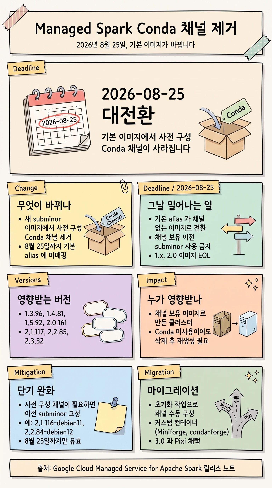

## 개요

Google Cloud **Managed Service for Apache Spark** 가 새 subminor 이미지 버전에서 **사전 구성된 Conda 채널을 제거**합니다. 새 이미지는 Conda 채널이 미리 설정되어 있지 않으며, 2026년 8월 25일까지는 `2.1-debian11`, `2.2-debian12`, `2.3-debian12` 같은 기본 alias 에도 매핑되지 않습니다. 8월 25일이 지나면 기본 alias 가 채널 없는 이미지로 전환되고, 채널을 가진 이전 subminor 사용이 금지됩니다.

이 변경의 핵심은 날짜 하나로 요약됩니다.

> [!IMPORTANT]
> **2026년 8월 25일**에 세 가지가 동시에 일어납니다.
>
> 1. 기본 alias 가 사전 구성 Conda 채널이 없는 최신 subminor 이미지로 전환됩니다.
> 2. 사전 구성 Conda 채널을 가진 이전 subminor 이미지 사용이 금지됩니다.
> 3. `1.x` 및 `2.0` 이미지 버전이 end-of-life 에 도달해 클러스터 생성에 사용할 수 없게 됩니다.
>
> 그 이후에는 사전 구성 Conda 채널이 있는 이미지로 만든 기존 클러스터를, **작업이 Conda 로 패키지를 설치하지 않더라도**, 삭제 후 채널 없는 이미지로 다시 만들어야 합니다 ([Managed Service for Apache Spark 릴리스 노트](https://docs.cloud.google.com/managed-spark/docs/release-notes)).

> **본 가이드 대상 독자:** Managed Service for Apache Spark(구 Dataproc on Compute Engine) 클러스터를 운영하며, 8월 25일 전환 전에 영향 범위를 파악하고 마이그레이션을 준비해야 하는 데이터 플랫폼 엔지니어와 SRE 입니다.

이 가이드는 무엇이 바뀌는지, 왜 바뀌는지, 누가 영향을 받는지, 그리고 8월 25일 전에 무엇을 해야 하는지를 정리합니다.

## Managed Service for Apache Spark와 이미지 버전 체계

Managed Service for Apache Spark 는 기존 Dataproc on Compute Engine 과 Google Cloud Serverless for Apache Spark 를 아우르는 통합 브랜드입니다. 릴리스 노트에서도 두 제품 모두 새 브랜드 이름 뒤에 이전 이름을 괄호로 병기합니다(예: formerly Dataproc on Compute Engine). 이번 Conda 채널 변경은 그중 **Compute Engine 기반 클러스터 이미지**에 적용됩니다.

클러스터 이미지 버전은 다음 형식을 따릅니다 ([버전 관리 개요](https://docs.cloud.google.com/managed-spark/docs/concepts/versioning/overview)).

```text
version_major.version_minor.version_sub_minor-os_distribution
예: 2.2.85-debian12
```

- 프로덕션에서는 `major.minor`(예: `2.2`) 만 지정하는 것이 권장 사례입니다. 이렇게 하면 subminor 와 OS 가 해당 minor 의 최신 주간 릴리스로 자동 설정됩니다.
- Debian 이미지는 OS 접미사를 생략할 수 있으나(`2.0` 은 `2.0-debian10` 으로 해석), Rocky 와 Ubuntu 는 접미사를 반드시 포함해야 합니다.
- 클러스터는 새 이미지 버전이 나와도 자동으로 업데이트되지 않습니다.

이 자동 해석 방식이 바로 이번 변경의 영향을 직접 받는 지점입니다. `2.2` 같은 alias 는 "최신 subminor" 를 가리키는데, 8월 25일 이후에는 그 최신 subminor 가 **Conda 채널이 없는 이미지**가 됩니다.

> [!NOTE]
> 이미지 버전은 최초 릴리스 후 24개월간 지원되고, 지원 종료일 이후 일반적으로 24개월간 사용 가능합니다. 다만 지원 기간이 연장되면 사용 가능 기간은 단축될 수 있습니다 ([지원 이미지 버전](https://docs.cloud.google.com/dataproc/docs/concepts/versioning/dataproc-version-clusters)).

## 변경 배경: Anaconda 라이선스에서 Pixi까지

이번 채널 제거는 갑작스러운 결정이 아니라 여러 해에 걸친 흐름의 연장선입니다.

- **2024년 5월 16일**: Anaconda 의 `default` 채널이 Dataproc on Compute Engine 의 패키지 설치에서 비활성화되었습니다(Breaking). Anaconda 상용 라이선스 정책 변화에 따른 조치였습니다.
- **2026년 6월**: 사전 구성 Conda 채널을 전면 제거하는 새 subminor 이미지가 출시되기 시작했습니다(이 가이드의 주제).
- **앞으로(3.0)**: 2026년 5월 3일 공개된 `3.0.0-RC2`(Preview) 부터 Python 패키지 관리자가 Conda 대신 **[Pixi](https://pixi.prefix.dev)** 로 바뀝니다. 같은 릴리스에서 Debian 13, Java 21, Apache Spark 4.1.1, Apache Hadoop 3.5.0 등으로 스택도 대폭 상향됩니다.

즉, Conda 사전 구성은 점진적으로 축소되어 왔고, 3.0 에서는 Conda 자체가 기본 도구 자리에서 물러납니다. 이번 8월 전환은 그 과도기를 매끄럽게 넘기기 위한 준비 단계로 볼 수 있습니다.

## 무엇이 바뀌나

두 건의 릴리스 노트가 이번 변경을 정의합니다.

### 2026년 6월 22일 (Breaking)

새 subminor 이미지 버전 `1.3.96`, `1.4.81`, `1.5.92`, `2.0.161`, `2.3.32` 가 사전 구성 Conda 채널 없이 출시되었고, 2026년 8월 25일까지 기본 alias(예: `2.3-debian12`, `2.3-ubuntu22`)에 매핑되지 않습니다. 이 시점에는 `2.1` 과 `2.2` 의 새 subminor 는 아직 사전 구성 Conda 채널을 유지했습니다.

- **영향:** 이 이미지로 클러스터를 만들 때는 정확한 subminor 버전을 지정해야 합니다(예: `2.3.32-debian12`). 클러스터 초기화 중에 채널을 수동으로 구성하지 않으면 Conda 로 패키지를 설치할 수 없습니다.
- **완화:** 워크로드가 사전 구성 Conda 채널이나 기본 alias 를 필요로 하면, 클러스터를 이전 이미지 버전에 고정합니다.
- **기본값 변경 일정:** subminor `1.3.96`, `1.4.81`, `1.5.92`, `2.0.161` 는 2026년 8월 25일 이후 기본값이 됩니다. 또한 8월 25일 이후 출시되는 `2.1`, `2.2`, `2.3` 의 새 subminor 도 사전 구성 Conda 채널 없이 기본 alias 에 매핑됩니다. 8월 25일 이후에는 사전 구성 Conda 채널을 가진 이전 subminor 사용이 금지되므로 모든 워크로드가 새 이미지를 사용해야 합니다.

### 2026년 6월 30일 (Announcement)

`2.1` 과 `2.2` 에도 같은 변경이 적용되었습니다. 새 subminor `2.1.117`, `2.2.85` 가 사전 구성 Conda 채널 없이 출시되었고, 2026년 8월 25일까지 기본 alias(예: `2.1-debian11`, `2.2-debian12`)에 매핑되지 않습니다. `2.3.33` 도 함께 발표되었습니다.

- **영향:** 클러스터 생성 시 정확한 subminor 버전을 지정해야 합니다(예: `2.1.117-debian11` 또는 `2.2.85-debian12`).
- **완화:** 사전 구성 Conda 채널이 필요하면 이전 이미지 버전에 고정합니다(예: `2.1.116-debian11` 또는 `2.2.84-debian12`).
- **기본값 변경 일정:** 8월 25일 이후 `2.1` 과 `2.2` 의 기본 alias 는 사전 구성 Conda 채널이 없는 최신 subminor 이미지를 가리킵니다.

### 채널 없는 subminor 정리

다음 표는 사전 구성 Conda 채널이 제거된 subminor 와, 채널을 유지하려 할 때 고정할 이전 subminor 를 정리한 것입니다.

| major.minor | 채널 없는 subminor | 채널 유지용 이전 subminor(완화책) |
|---|---|---|
| 1.3 | 1.3.96 | 해당 없음(8월 25일 EOL) |
| 1.4 | 1.4.81 | 해당 없음(8월 25일 EOL) |
| 1.5 | 1.5.92 | 해당 없음(8월 25일 EOL) |
| 2.0 | 2.0.161 | 해당 없음(8월 25일 EOL) |
| 2.1 | 2.1.117 | 2.1.116-debian11 |
| 2.2 | 2.2.85 | 2.2.84-debian12 |
| 2.3 | 2.3.32, 이후 2.3.33 | 이전 subminor |

> [!NOTE]
> `1.x` 와 `2.0` 이미지는 8월 25일에 end-of-life 에 도달하므로 이전 subminor 고정은 임시 방편일 뿐입니다. 이 계열은 고정이 아니라 상위 버전으로의 이전을 준비해야 합니다.

롤아웃 시점도 한 차례 조정되었습니다. 채널 없는 subminor 출시는 원래 2026년 6월 15일로 예정되었으나 2026년 6월 22일로 지연되어 시작되었습니다.

## 타임라인

| 날짜 | 이벤트 |
|---|---|
| 2026-05-03 | `3.0.0-RC2`(Preview) 공개. Python 패키지 관리자가 Conda 에서 Pixi 로 전환 |
| 2026-06-16 | 채널 없는 subminor 롤아웃이 6월 22일 시작으로 공지(기존 6월 15일 ETA 에서 지연) |
| 2026-06-22 | (Breaking) `1.3.96`, `1.4.81`, `1.5.92`, `2.0.161`, `2.3.32` 가 채널 없이 출시. 기본 alias 미매핑 |
| 2026-06-30 | (Announcement) `2.1.117`, `2.2.85` 채널 없이 출시, `2.3.33` 추가 |
| **2026-08-25** | **기본 alias 가 채널 없는 이미지로 전환. 채널 보유 이전 subminor 사용 금지. `1.x` 와 `2.0` 이미지 EOL** |

## 영향 범위

> [!WARNING]
> 8월 25일 이후에는 사전 구성 Conda 채널이 있는 이미지로 만든 기존 클러스터를, **작업이 Conda 로 패키지를 설치하지 않더라도**, 삭제한 뒤 채널 없는 이미지로 다시 만들어야 합니다. 채널 사용 여부와 무관하게 이미지 자체가 기준입니다 ([Managed Service for Apache Spark 릴리스 노트](https://docs.cloud.google.com/managed-spark/docs/release-notes)).

정리하면 다음과 같은 경우 영향을 받습니다.

- **alias 로 클러스터를 만드는 파이프라인**: `--image-version=2.2` 처럼 `major.minor` alias 를 쓰는 자동화는 8월 25일 이후 채널 없는 이미지로 클러스터를 생성하게 됩니다. Conda 로 패키지를 설치하던 초기화 로직이 있다면 클러스터 생성이 실패할 수 있습니다.
- **Conda 채널 기반 패키지 설치에 의존하는 워크로드**: 채널이 사전 구성되어 있다는 전제로 `conda install` 을 수행하는 초기화 작업이나 잡은 채널을 수동 구성하지 않으면 동작하지 않습니다.
- **채널 보유 이미지로 만든 장기간 실행 클러스터**: Conda 사용 여부와 관계없이 삭제 후 재생성 대상입니다.
- **`1.x` 또는 `2.0` 을 사용하는 모든 클러스터**: 8월 25일 EOL 로 클러스터 생성 자체가 불가능해집니다.

## 대응 방안

상황에 따라 다음 중 하나 이상을 선택합니다. 단기적으로는 버전 고정으로 시간을 확보하고, 최종적으로는 채널에 의존하지 않는 구조로 이전하는 것이 목표입니다.

### 단기 완화: 이전 subminor 고정

가장 빠른 임시 조치는 사전 구성 Conda 채널을 유지하는 이전 subminor 에 클러스터를 고정하는 것입니다.

- `2.1` 계열: `2.1.116-debian11`
- `2.2` 계열: `2.2.84-debian12`

다만 이 방법은 8월 25일 전까지만 유효합니다. 8월 25일 이후에는 채널 보유 이전 subminor 사용이 금지되므로, 고정은 마이그레이션을 준비하는 동안의 임시 조치로만 사용해야 합니다.

### 초기화 작업으로 Conda 채널 수동 구성

릴리스 노트의 완화 안내는 "클러스터 초기화 중에 채널을 수동으로 구성" 하는 방법을 명시합니다. 이는 초기화 작업(initialization actions)으로 구현합니다 ([초기화 작업](https://docs.cloud.google.com/managed-spark/docs/concepts/configuring-clusters/init-actions)).

- 초기화 작업 스크립트는 클러스터 생성 시 모든 노드에서 `root` 로 실행됩니다.
- 스크립트 안에서는 절대 경로를 사용하고, 파일은 LF 줄바꿈으로 저장합니다.
- 기본 초기화 작업 타임아웃은 10분(`--initialization-action-timeout=10m`)이며, 실행 로그는 각 노드의 `/var/log/dataproc-initialization-script-X.log` 에 남습니다.
- 스크립트는 버전이 고정된 Cloud Storage 버킷에 복사해 두고 그 경로를 참조하는 것이 안전합니다.

채널 없는 이미지에서 채널을 명시적으로 설정한 뒤 필요한 패키지를 설치하는 스크립트를 초기화 작업으로 등록하면, alias 전환 이후에도 동일한 패키지 구성을 재현할 수 있습니다.

### 커스텀 컨테이너 이미지로 전환

패키지 구성을 이미지에 고정하고 싶다면, 채널을 명시적으로 설정한 커스텀 컨테이너 이미지가 가장 견고한 방법입니다. 공식 문서의 "Extra configuration" Dockerfile 은 Miniforge3(conda-forge)를 직접 설치하고 채널 우선순위를 엄격하게 지정하는 정석 패턴을 보여줍니다 ([커스텀 컨테이너](https://docs.cloud.google.com/dataproc-serverless/docs/guides/custom-containers)).

```dockerfile
# Install and configure Miniconda3.
ENV CONDA_HOME=/opt/miniforge3
ENV PYSPARK_PYTHON=${CONDA_HOME}/bin/python
ENV PATH=${CONDA_HOME}/bin:${PATH}
ADD https://github.com/conda-forge/miniforge/releases/latest/download/Miniforge3-Linux-x86_64.sh .
RUN bash Miniforge3-Linux-x86_64.sh -b -p /opt/miniforge3 \
  && ${CONDA_HOME}/bin/conda config --system --set always_yes True \
  && ${CONDA_HOME}/bin/conda config --system --set auto_update_conda False \
  && ${CONDA_HOME}/bin/conda config --system --set channel_priority strict
RUN ${CONDA_HOME}/bin/mamba install ipython ipykernel
```

이 방식에서 유의할 점은 다음과 같습니다.

- 컨테이너는 `spark` 사용자로 실행되며 UID 와 GID 는 모두 `1099` 입니다.
- 런타임에 마운트되므로 Spark 나 JRE 를 이미지에 포함하지 않습니다.
- Spark 스크립트에 필요한 `procps`, `tini` 를 설치하고, XGBoost 를 쓰면 `libgomp1` 도 설치합니다.
- 이미지 빌드와 푸시는 `gcloud builds submit --region=REGION --tag REGION-docker.pkg.dev/PROJECT/REPOSITORY/IMAGE_NAME:IMAGE_VERSION` 로 수행합니다.

채널이 이미지 안에 명시적으로 포함되어 있으므로, 호스트의 사전 구성 채널 제거와 무관하게 재현성이 유지됩니다.

### 3.0과 Pixi 채택

중기적으로는 3.0 이전을 계획합니다. 3.0 부터 Python 패키지 관리자가 Conda 에서 Pixi 로 바뀌므로, 패키지 관리 방식 자체를 Pixi 기준으로 재설계하는 것이 근본적인 방향입니다. 다만 현재 3.0 은 Preview(`3.0.0-RC2`) 단계이므로, 프로덕션 도입 전에는 충분한 검증이 필요합니다.

### 클러스터 삭제 후 재생성과 확인

8월 25일 전에 채널 보유 이미지로 만든 클러스터를 채널 없는 이미지 기반으로 다시 만들어야 합니다. 구체적인 생성과 재생성 절차는 공식 가이드를 따릅니다.

- 새 클러스터 생성: [클러스터 만들기](https://docs.cloud.google.com/managed-spark/docs/guides/create-cluster)
- 기존 클러스터 재생성 및 업데이트: [클러스터 재생성](https://docs.cloud.google.com/managed-spark/docs/guides/recreate-cluster)

> [!TIP]
> 어떤 클러스터가 지원 종료 대상인지 먼저 파악하는 것이 좋습니다. 지원 종료 이미지 사용 클러스터를 식별하는 확인 스크립트가 공식 문서에 제공됩니다: `check-unsupported-dataproc-clusters.sh` ([지원 종료 이미지 버전](https://docs.cloud.google.com/dataproc/docs/concepts/versioning/dataproc-version-clusters)).

## 명령어와 코드 참조

이 절의 예시는 모두 Google Cloud 공식 문서에서 확인할 수 있는 명령입니다. 클러스터 생성과 재생성의 상세 명령은 위에 링크한 가이드를 참조합니다.

### Conda, pip 클러스터 속성

채널이 구성되어 있을 때 `base` 환경에 패키지를 추가하는 방식입니다. 채널 없는 이미지에서는 이 방식에 앞서 채널 구성이 필요합니다 ([Python 구성](https://docs.cloud.google.com/dataproc/docs/tutorials/python-configuration)).

```text
REGION=region
gcloud dataproc clusters create my-cluster \
    --image-version=2.0 \
    --region=${REGION} \
    --properties=^#^dataproc:conda.packages='pytorch==1.7.1,coverage==5.5'#dataproc:pip.packages='tokenizers==0.10.1,datasets==1.5.0'
```

- `dataproc:conda.packages` 와 `dataproc:pip.packages` 는 `base` 환경에 패키지를 추가하며, `pkg1==v1,pkg2==v2` 형식으로 지정합니다.
- 별도의 Conda 환경을 만들려면 `dataproc:conda.env.config.uri` 에 `environment.yaml` 의 Cloud Storage 절대 경로를 지정합니다. 이 방식과 위의 패키지 속성 방식은 함께 쓸 수 없습니다.
- 패키지 설치는 클러스터 생성 10분 타임아웃 안에 끝나야 합니다.

> [!CAUTION]
> 클러스터 노드는 커스텀 conda, pip 패키지를 설치할 때 외부 공개 Python 저장소에서 패키지를 내려받습니다. 공개 저장소 가용성 문제로 인한 클러스터 생성 실패를 피하려면, 커스텀 이미지를 만들거나 의존성을 Cloud Storage 버킷에 올려 두는 것이 좋습니다 ([Python 구성](https://docs.cloud.google.com/dataproc/docs/tutorials/python-configuration)).

## 점검 체크리스트

8월 25일 전에 다음 항목을 점검합니다.

- [ ] `--image-version` 에 `major.minor` alias 를 쓰는 클러스터 생성 자동화를 식별합니다.
- [ ] Conda 채널 기반 패키지 설치에 의존하는 초기화 작업과 잡을 식별합니다.
- [ ] 채널 보유 이미지로 만든 장기간 실행 클러스터 목록을 작성합니다(Conda 사용 여부 무관).
- [ ] `1.x` 또는 `2.0` 을 사용하는 클러스터를 상위 지원 버전으로 이전할 계획을 세웁니다.
- [ ] 확인 스크립트로 지원 종료 대상 클러스터를 조회합니다.
- [ ] 패키지 구성을 초기화 작업 또는 커스텀 컨테이너 이미지로 이전합니다.
- [ ] 채널 없는 이미지로 클러스터를 재생성하고, 잡이 정상 동작하는지 스테이징에서 검증합니다.
- [ ] 중기 계획으로 3.0 과 Pixi 기반 패키지 관리 검토를 일정에 반영합니다.

## 참고 자료

- [Managed Service for Apache Spark 릴리스 노트](https://docs.cloud.google.com/managed-spark/docs/release-notes)
- [클러스터 이미지 버전(지원, 지원 종료)](https://docs.cloud.google.com/dataproc/docs/concepts/versioning/dataproc-version-clusters)
- [버전 관리 개요](https://docs.cloud.google.com/managed-spark/docs/concepts/versioning/overview)
- [Python 구성(conda, pip 속성)](https://docs.cloud.google.com/dataproc/docs/tutorials/python-configuration)
- [클러스터 초기화 작업](https://docs.cloud.google.com/managed-spark/docs/concepts/configuring-clusters/init-actions)
- [Serverless 런타임 버전](https://docs.cloud.google.com/dataproc-serverless/docs/concepts/versions/dataproc-serverless-versions)
- [커스텀 컨테이너 이미지](https://docs.cloud.google.com/dataproc-serverless/docs/guides/custom-containers)
- [Dataproc on GKE 개요](https://docs.cloud.google.com/dataproc/docs/guides/dpgke/dataproc-gke-overview)
- [Dataproc on GKE 버전](https://docs.cloud.google.com/dataproc/docs/guides/dpgke/dataproc-gke-versions)
