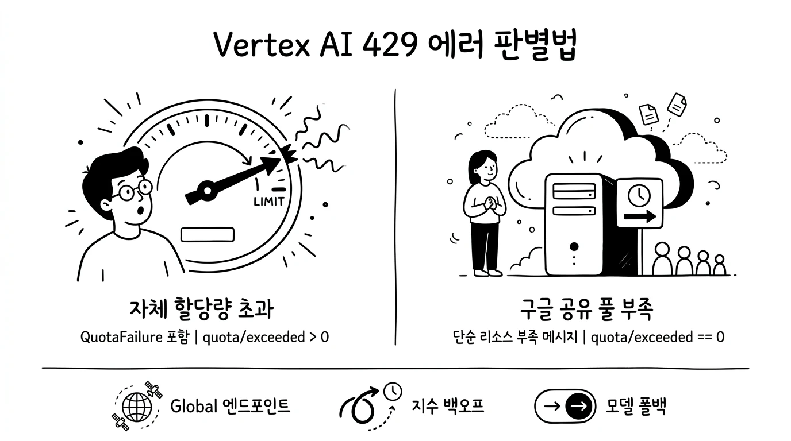
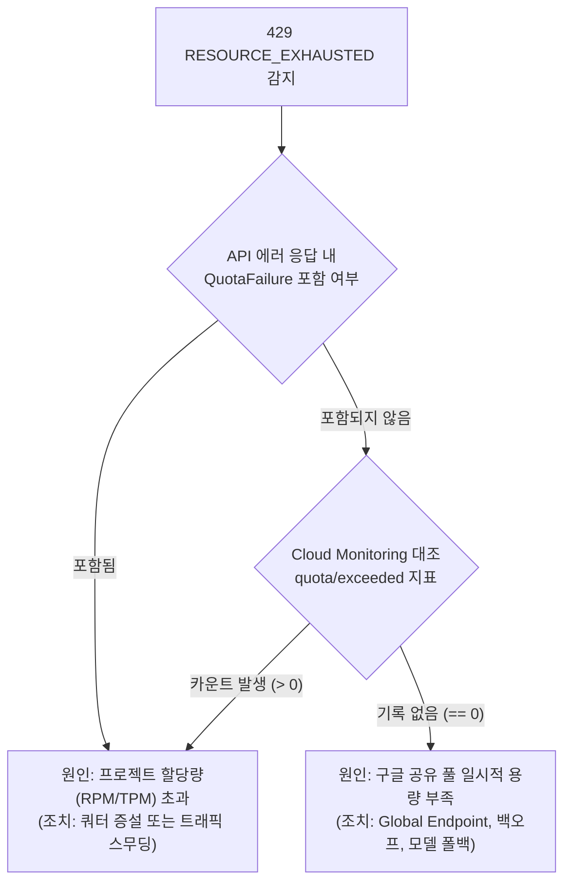
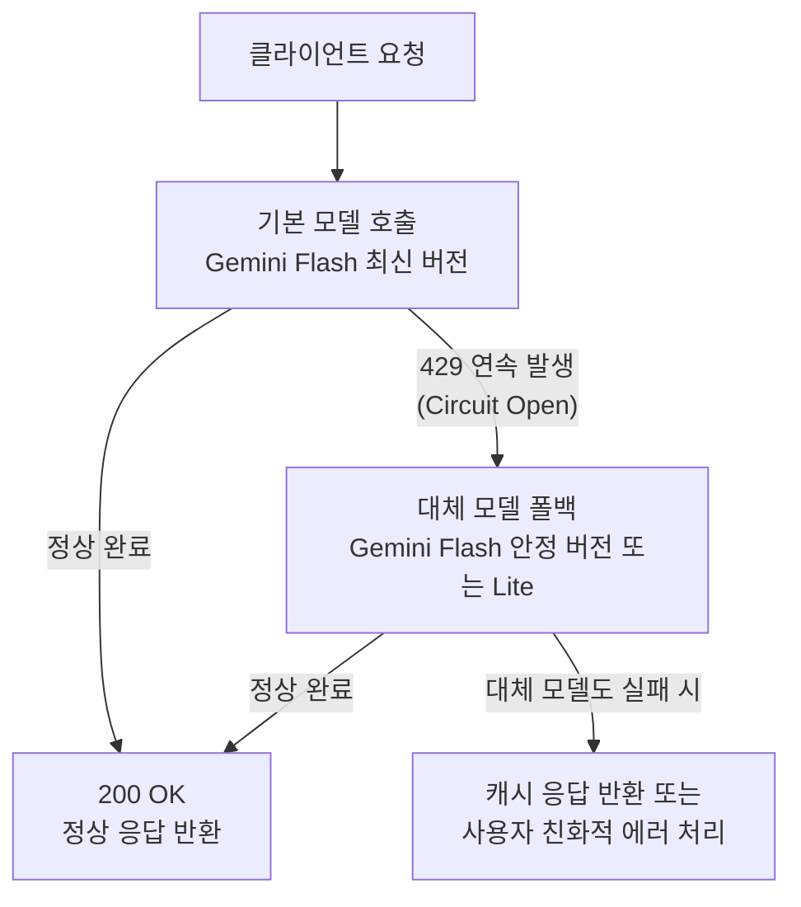

## 개요

생성형 AI 서비스를 운영할 때 가장 빈번하게 마주치는 장애는 HTTP 429(`RESOURCE_EXHAUSTED`) 상태 코드입니다. OpenAI, Anthropic뿐만 아니라 Google Cloud Vertex AI 환경에서도 동일하게 발생합니다.

단순히 429 에러 코드만 받아서는 장애의 원인이 애플리케이션의 호출량 급증(Rate Limit 초과) 때문인지, 아니면 Google Cloud 서빙 인프라의 가용 용량 부족(Capacity Crunch) 때문인지 파악하기 어렵습니다.

본 가이드는 Vertex AI 환경에서 429 에러의 발생 원인을 명확히 구분하는 진단법과, 서비스 중단을 방지하는 5가지 복원력(Resilience) 아키텍처 패턴을 정리합니다.

> [!NOTE]
> 본 가이드는 특정 기업이나 조직에 국한되지 않고, Google Cloud Vertex AI 기반의 서비스를 프로덕션 환경에서 운영하는 모든 엔지니어링 조직을 대상으로 작성되었습니다.



## 429 RESOURCE_EXHAUSTED의 두 가지 발생 메커니즘

Vertex AI의 429 에러는 성격이 완전히 다른 두 가지 원인으로 발생합니다.

### 1. 프로젝트 할당량 초과 및 가속 제한

애플리케이션 측의 트래픽이 프로젝트에 할당된 한도를 넘었을 때 발생합니다.

- **분당 요청 수(RPM) 및 토큰 수(TPM) 초과**: 리전 및 모델별로 할당된 분당 처리 한도를 초과한 경우입니다.
- **초 단위 순간 급증(Second-level Spikes)**: 분당 평균 사용량이 한도 이내라도, 1초 미만의 순간에 트래픽이 집중되면 인프라 보호를 위한 가속 제한(Acceleration Limits)이 발동되어 스로틀링이 발생합니다.

### 2. 구글 클라우드 공유 리소스 풀의 일시적 경합

프로젝트의 자체 할당량이 남아있더라도, Google Cloud 서빙 인프라의 여유 슬롯이 일시적으로 고갈되었을 때 발생합니다.

- **Standard PayGo의 Dynamic Shared Pool**: 종량제(Pay-as-you-go) 환경에서는 모든 테넌트가 거대한 물리적 가속기 풀(TPU 및 GPU)을 공유합니다.
- **글로벌 및 리전 트래픽 쏠림**: 특정 시점에 전 세계적인 수요가 몰리면 공유 풀의 가용 슬롯이 일시적으로 부족해져 신규 요청이 거부됩니다.

> [!NOTE]
> **Google Cloud 공식 문서의 리소스 경합 정의 (`standard-paygo`)**
> *"If you receive a 429 error, it doesn't indicate that you've hit a fixed quota. It indicates temporary high contention for a specific shared resource."*
>
> 429 에러를 받았다고 해서 고정 할당량에 도달했음을 의미하는 것은 아니며, 특정 공유 리소스에 대한 일시적인 높은 경합을 의미합니다.

## 원인 구분: 자체 쿼터 초과 vs 구글 인프라 용량 부족

장애 발생 시 문제 주체를 파악하는 두 가지 핵심 진단 기법입니다.

### 기법 1: API 에러 응답 본문(Payload) 분석

호출 실패 시 반환되는 JSON 본문의 `details` 구조를 통해 즉시 판별할 수 있습니다.

#### 자체 할당량(Quota) 초과 시 응답 구조
응답 메시지에 `Quota exceeded`가 표시되며, `details` 내에 초과된 쿼터 메트릭이 담긴 `QuotaFailure` 객체가 포함됩니다.

```json
{
  "error": {
    "code": 429,
    "message": "Quota exceeded for quota metric 'GenerateContent requests per minute' and limit 'GenerateContent requests per minute per project' of service 'aiplatform.googleapis.com' for consumer 'project_number:123456789'.",
    "status": "RESOURCE_EXHAUSTED",
    "details": [
      {
        "@type": "type.googleapis.com/google.rpc.ErrorInfo",
        "reason": "RATE_LIMIT_EXCEEDED",
        "domain": "aiplatform.googleapis.com",
        "metadata": {
          "service": "aiplatform.googleapis.com",
          "quota_metric": "aiplatform.googleapis.com/online_prediction_requests_per_base_model"
        }
      },
      {
        "@type": "type.googleapis.com/google.rpc.QuotaFailure",
        "violations": [
          {
            "quotaMetric": "aiplatform.googleapis.com/online_prediction_requests_per_base_model",
            "description": "Quota exceeded for online prediction requests"
          }
        ]
      }
    ]
  }
}
```

#### 구글 클라우드 공유 인프라 용량 부족 시 응답 구조
프로젝트 할당량은 남아있으나 공유 풀 슬롯이 부족한 경우입니다. 단순 메시지만 반환되며 `QuotaFailure` 객체는 포함되지 않습니다.

```json
{
  "error": {
    "code": 429,
    "message": "Resource exhausted, please try again later.",
    "status": "RESOURCE_EXHAUSTED",
    "details": [
      {
        "@type": "type.googleapis.com/google.rpc.ErrorInfo",
        "reason": "RESOURCE_EXHAUSTED",
        "domain": "aiplatform.googleapis.com"
      }
    ]
  }
}
```

#### 응답 특성 비교 요약

| 구분 항목 | ① 프로젝트 할당량 초과 | ② 구글 공유 풀 일시적 용량 부족 |
| --- | --- | --- |
| **발생 원인** | 프로젝트 부여 RPM 및 TPM 한도 초과 | Standard PayGo 공유 인프라 풀의 일시적 경합 |
| **대표 메시지** | `Quota exceeded for quota metric...` | `Resource exhausted, please try again later.` |
| **`QuotaFailure` 유무** | **포함됨** (초과 메트릭 상세 정보 명시) | **포함되지 않음** (일반 에러 상세만 전달) |
| **SLA 보상 대상** | 제외 (클라이언트 요청 초과) | 제외 (PayGo는 기본적으로 Best-effort 제공) |

> [!TIP]
> 애플리케이션 로깅 레이어에서 429 발생 시 `error.details` 내에 `QuotaFailure`가 존재하는지 여부를 태깅해 두면, 모니터링 대시보드에서 장애 주체를 자동으로 분류할 수 있습니다.

### 기법 2: Cloud Monitoring 지표 교차 검증 (객관적 팩트 체크)

사후 분석 단계에서는 Cloud Monitoring 지표를 대조하여 가장 객관적인 증거를 확보할 수 있습니다.

#### 핵심 검증 지표 2종
1. **프로젝트 할당량 초과 지표**: `serviceruntime.googleapis.com/quota/exceeded` (Filter: `service = "aiplatform.googleapis.com"`)
2. **실제 API 429 응답 지표**: `aiplatform.googleapis.com/prediction/online/response_count` (Filter: `response_code = 429`)

#### 진단 의사결정 흐름



모니터링 대시보드에서 429 응답 카운트가 급증했음에도 `quota/exceeded` 지표가 지속적으로 **0**을 유지한다면, 프로젝트의 쿼터 문제가 아니라 Google Cloud 측의 일시적 공유 풀 부족이었음이 명백히 입증됩니다.

## 모델 간 가용성 편차 분석: 신규 모델과 이전 모델의 차이

동일한 프로젝트, 동일한 호출 패턴에서도 최신 모델(예: Gemini Flash 신규 버전)에서는 429가 발생하고, 이전 버전(예: 구버전 Flash)은 정상 동작하는 경우가 있습니다.

이유는 세 가지입니다:

1. **모델별 독립 풀**: Standard PayGo 환경은 모델 버전별로 가속기 풀을 분리하여 서빙합니다.
2. **신규 모델 트래픽 쏠림**: 가성비가 높은 신규 모델이 공개되면 전 세계 트래픽이 해당 서빙 풀로 집중되어 일시적인 경합이 빈번해집니다.
3. **가용 용량 불균형**: 신규 모델 풀이 포화 상태인 동안에도, 이전 세대 모델 풀은 여유 슬롯이 충분하여 에러 없이 응답을 처리합니다.

따라서 특정 신규 모델에서 429가 발생한다고 해서 전체 아키텍처 결함으로 볼 수 없으며, 인프라 풀 단위의 경합을 고려한 대응이 필요합니다.

## 복원력 설계를 위한 5대 권장 아키텍처 패턴

일시적인 429 장애를 완화하고 서비스 연속성을 보장하는 5가지 핵심 아키텍처 패턴입니다.

### 패턴 1: 글로벌 엔드포인트(Global Endpoint) 전환

단일 리전(`us-central1` 등)으로 고정하면 해당 리전의 공유 풀 고갈 시 즉시 429가 발생합니다. Google Cloud는 **글로벌 엔드포인트(`location="global"`)** 사용을 공식적으로 강력 권장합니다.

```python
# 글로벌 엔드포인트 설정 예시 (Python Google Gen AI SDK)
from google import genai

client = genai.Client(
    vertexai=True,
    project="your-project-id",
    location="global"  # 단일 리전 대신 global 지정
)
```

- **동적 용량 라우팅**: 전 세계 여러 리전 중 순간 가용 슬롯이 가장 넉넉한 지역으로 요청을 자동 라우팅합니다.
- **버스팅 수용력 극대화**: 단일 리전보다 거대한 멀티 리전 공유 풀을 활용하므로 지역적 용량 부족 문제를 크게 줄여줍니다.

> [!IMPORTANT]
> 금융, 공공, 의료 등 데이터가 특정 국가 내에 머물러야 하는(Data Residency) 규제 요건이 있는 워크로드는 글로벌 엔드포인트 적용 전 컴플라이언스 요건을 확인해야 합니다.

### 패턴 2: 지수 백오프와 지터를 결합한 재시도 전략

429 발생 시 즉각 재시도(Immediate Retry)를 하거나 무한 루프를 돌리는 것은 인프라 경합을 악화시킵니다. 지수 백오프(Exponential Backoff)와 랜덤 지터(Jitter)를 적용해야 합니다.

```python
# 지수 백오프 및 지터 설정 예시
from google import genai
from google.genai import types

http_options = types.HttpOptions(
    retry_options=types.HttpRetryOptions(
        initial_delay=1.0,  # 첫 재시도 대기 시간: 1초
        attempts=5,         # 최대 재시도 횟수: 5회
        exp_base=2.0,       # 대기 시간 배수 (1s -> 2s -> 4s -> 8s)
        max_delay=60.0,     # 최대 대기 한도: 60초
        jitter=1.0,         # 대기 시간에 무작위 지터 추가
        http_status_codes=[408, 429, 500, 502, 503, 504]
    ),
    timeout=120 * 1000      # 요청 타임아웃: 120초
)

client = genai.Client(
    vertexai=True,
    project="your-project-id",
    location="global",
    http_options=http_options
)
```

- **지터(Jitter)**: 다수의 클라이언트가 동시에 재시도하여 발생하는 재충돌(Throttling 폭포)을 방지합니다.
- **최대 재시도 한도**: 대화형 서비스(챗봇 등)는 재시도를 2~3회로 제한(Fail-fast)하여 사용자 응답 지연을 방지합니다.

### 패턴 3: 클라이언트 측 트래픽 스무딩(Traffic Smoothing)

분당 평균 호출량이 한도 이내라도, 초 단위 마이크로 버스트가 발생하면 가속 제한에 걸립니다.

- **속도 제한기(Rate Limiter) 구성**: 토큰 버킷 또는 리키 버킷 알고리즘을 게이트웨이에 적용해 초당 요청량을 일정하게 유지합니다.
- **비동기 큐잉(Queueing)**: 배치 처리나 비동기 작업은 Redis, Cloud Tasks, Cloud Pub/Sub과 같은 큐 시스템을 통해 소비 속도를 완만하게 조절합니다.

### 패턴 4: 모델 서킷 브레이커와 단계적 폴백(Model Fallback)

신규 모델 풀이 일시적으로 완전히 포화되었을 때는 재시도만으로 해결되지 않습니다. 안정 버전이나 경량 버전으로 우회하는 서킷 브레이커 패턴이 필수적입니다.



- **가용성 우선 전략**: 최신 모델과 이전 안정 버전 간 지능 차이가 있더라도, 전체 서비스 장애보다는 이전 세대 모델을 통해 정상 응답을 제공하는 것이 우수한 사용자 경험을 유지하는 방법입니다.

### 패턴 5: 프로비저닝된 처리량(Provisioned Throughput) 도입

간헐적인 429 에러나 성능 변동성을 감내할 수 없는 엔터프라이즈 미션 크리티컬 워크로드라면, **프로비저닝된 처리량(Provisioned Throughput, PT)** 모델로 전환해야 합니다.

#### PayGo와 Provisioned Throughput 비교

| 항목 | Standard Pay-as-you-go | Provisioned Throughput (PT) |
| --- | --- | --- |
| **자원 할당 방식** | 멀티 테넌트 동적 공유 풀 | 전용 서빙 용량 사전 예약 (GSU 단위) |
| **처리량 보장** | 모범적 노력(Best-effort) 기반 | 예약된 처리량 100% 보장 |
| **429 에러 특성** | 공유 풀 경합 시 429 반환 가능 | 예약 용량 내에서는 429 발생 불가 |
| **SLA 가용률 반영** | 용량 부족에 의한 429는 SLA 제외 | 구글 측 인프라 문제 시 5xx 반환 및 SLA 보상 |
| **과금 방식** | 실제 소비 토큰 단위 후불 과금 | 예약 용량(GSU) 기반 고정 약정 과금 |

> [!NOTE]
> Provisioned Throughput에서도 구매한 GSU 용량을 초과하는 트래픽은 PayGo 방식으로 처리되거나 거부될 수 있으므로, 적절한 용량 산정이 필요합니다.

## 운영 및 트러블슈팅 체크리스트

프로덕션 환경에서 429 발생 시 단계별 점검 체크리스트입니다.

### 1단계: 실시간 에러 페이로드 점검
- [ ] 에러 JSON 본문에 `QuotaFailure` 객체가 포함되어 있는가?
- [ ] 에러 메시지가 `Quota exceeded...`인가, 아니면 `Resource exhausted, please try again later.`인가?

### 2단계: Cloud Monitoring 지표 교차 검증
- [ ] `serviceruntime.googleapis.com/quota/exceeded` 지표에 카운트가 발생하는가?
- [ ] 할당량 초과가 없다면 `prediction/online/response_count`의 429 발생 리전과 모델 버전을 확인하였는가?

### 3단계: 아키텍처 및 클라이언트 설정 점검
- [ ] 클라이언트 엔드포인트가 특정 리전으로 고정되지 않고 `location="global"`로 설정되어 있는가?
- [ ] 클라이언트 SDK에 지수 백오프와 랜덤 지터가 적용되어 있는가?
- [ ] 초 단위 마이크로 스파이크를 방지하는 속도 제한기가 구성되어 있는가?
- [ ] 429 지속 발생 시 이전 세대 모델이나 대체 모델로 자동 우회하는 폴백 로직이 작동하는가?

### 4단계: 엔터프라이즈 에스컬레이션
- [ ] 장시간(수 시간 이상) 구글 측 리소스 부족 429가 지속될 경우 Google Cloud 지원팀에 P1/P2 케이스를 오픈하였는가?
- [ ] 워크로드의 중요도에 비추어 볼 때 Provisioned Throughput(PT) 도입 검토가 필요한 수준인가?

## 참고 공식 문서

1. [Google Cloud - Error code 429 및 쿼터 프레임워크 개요](https://docs.cloud.google.com/gemini-enterprise-agent-platform/models/deploy/error-code-429)
2. [Google Cloud - Standard pay-as-you-go 및 리소스 경합(Contention) 메커니즘](https://docs.cloud.google.com/gemini-enterprise-agent-platform/models/standard-paygo)
3. [Google Cloud - Generative AI on Vertex AI API 에러 코드 레퍼런스](https://docs.cloud.google.com/gemini-enterprise-agent-platform/reference/models/api-errors)
4. [Google Cloud - Gen AI SDK 재시도 전략 및 HttpRetryOptions 설정](https://docs.cloud.google.com/gemini-enterprise-agent-platform/models/retry-strategy)
5. [Google Cloud Monitoring - 할당량 초과 에러(serviceruntime/quota/exceeded) 알림 정책 구축](https://docs.cloud.google.com/monitoring/alerts/using-quota-metrics)
6. [Google Cloud - Provisioned Throughput 개요 및 예약 모델](https://docs.cloud.google.com/gemini-enterprise-agent-platform/models/provisioned-throughput)
