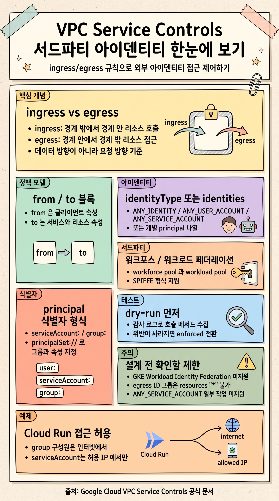

## 개요

VPC Service Controls 는 서비스 경계(service perimeter)를 만들어 Google Cloud 리소스에 대한 접근을 통제하는 보안 기능입니다. 경계 안팎으로 오가는 접근은 ingress 규칙과 egress 규칙으로 허용하며, 이 규칙에 아이덴티티를 지정하면 "누가" 접근할 수 있는지까지 세밀하게 제한할 수 있습니다.

이 가이드는 사용자 계정과 서비스 계정뿐 아니라 Google 그룹, 그리고 워크포스 아이덴티티 페더레이션과 워크로드 아이덴티티 페더레이션으로 대표되는 서드파티 아이덴티티를 ingress/egress 규칙에 적용하는 방법을 다룹니다.

- ingress 와 egress 는 데이터 이동 방향이 아니라 **API 요청의 방향**을 기준으로 정의합니다. 경계 밖 클라이언트가 경계 안 리소스를 호출하면 ingress, 경계 안 클라이언트나 리소스가 경계 밖 리소스에 접근하면 egress 입니다 ([Ingress and egress rules](https://docs.cloud.google.com/vpc-service-controls/docs/ingress-egress-rules)).
- 규칙에는 `identityType`(아이덴티티 유형 전체 허용)이나 `identities`(개별 principal 나열) 중 하나를 사용합니다. 서드파티 아이덴티티와 ID 그룹은 `identities` 속성으로 지정합니다 ([Configure identity groups](https://docs.cloud.google.com/vpc-service-controls/docs/configure-identity-groups)).
- 워크포스 아이덴티티 풀, 워크로드 아이덴티티 풀, 에이전트 아이덴티티, 서비스 에이전트는 **서비스 경계의 ingress/egress 규칙에서만** 지정할 수 있고, Access Context Manager 의 access level 에서는 사용할 수 없습니다 ([Supported identities](https://docs.cloud.google.com/vpc-service-controls/docs/supported-identities)).
- 정확한 허용 메서드 목록을 확정하기 어려울 때는 dry-run 모드로 감사 로그를 수집한 뒤 enforced 모드로 전환하는 절차를 권장합니다 ([Ingress and egress rules](https://docs.cloud.google.com/vpc-service-controls/docs/ingress-egress-rules)).

> [!IMPORTANT]
> VPC Service Controls 는 [Workload Identity Federation for GKE](https://docs.cloud.google.com/kubernetes-engine/docs/concepts/workload-identity) 를 지원하지 않습니다. GKE 워크로드 아이덴티티를 규칙의 아이덴티티로 지정하려는 설계는 시작 전에 대안을 검토해야 합니다 ([Configure identity groups](https://docs.cloud.google.com/vpc-service-controls/docs/configure-identity-groups)).

> **본 가이드 대상 독자:** 조직 내에서 VPC Service Controls 경계를 운영하며, 외부 아이덴티티나 그룹 단위로 경계 접근을 허용해야 하는 보안/플랫폼 엔지니어를 대상으로 합니다.

## VPC Service Controls 와 아이덴티티 기반 접근 제어

VPC Service Controls 는 ingress/egress 규칙으로 경계 안팎의 리소스와 클라이언트 사이 접근을 허용합니다. 규칙에 아이덴티티를 추가하면 소스 네트워크나 IP, 디바이스 같은 요청 컨텍스트에 더해 "어떤 주체가 요청했는가"를 조건으로 걸 수 있습니다.

ID 그룹은 비슷한 접근 정책을 가진 사용자 집합에 접근 제어를 한 번에 적용하는 편리한 방법입니다. 규칙의 `identities` 속성에는 다음 유형을 지정할 수 있습니다 ([Configure identity groups](https://docs.cloud.google.com/vpc-service-controls/docs/configure-identity-groups)).

- [Google 그룹](https://docs.cloud.google.com/iam/docs/overview#google_group)
- 서드파티 아이덴티티: [워크포스 풀 사용자](https://docs.cloud.google.com/iam/docs/workforce-identity-federation)와 [워크로드 아이덴티티](https://docs.cloud.google.com/iam/docs/workload-identity-federation)

ingress/egress 규칙은 과거에 하나 이상의 [perimeter bridge](https://docs.cloud.google.com/vpc-service-controls/docs/share-across-perimeters) 로 풀어야 했던 구성을 대체하고 단순화합니다. 조직 내부와 조직 간 데이터 교환을 Google Cloud 서비스 API 를 통해 사설망 수준으로 수행하면서, 정확히 어떤 서비스, 메서드, 프로젝트, VPC 네트워크, 아이덴티티가 교환에 관여하는지를 제한해 유출 위험을 낮춥니다 ([Ingress and egress rules](https://docs.cloud.google.com/vpc-service-controls/docs/ingress-egress-rules)).

## ingress 와 egress 의 정의

ingress 와 egress 는 호출되는 작업의 성격과 무관하며, **요청의 방향**만을 가리킵니다. 데이터가 어느 쪽으로 흐르는지는 정의에 영향을 주지 않습니다.

- **ingress**: 서비스 경계 밖의 API 클라이언트가 경계 안 리소스에 접근하는 경우입니다. 예를 들어 경계 밖 Cloud Storage 클라이언트가 경계 안 버킷에 읽기, 쓰기, 복사 작업을 호출하는 경우가 해당합니다.
- **egress**: 경계 안의 API 클라이언트나 리소스가 경계 밖 리소스에 접근하는 경우입니다. 예를 들어 경계 안 Compute Engine 클라이언트가 경계 밖 이미지 리소스로 `create` 작업을 호출하거나, Cloud Storage 클라이언트가 한쪽 버킷은 경계 안, 다른 버킷은 경계 밖인 상태에서 `copy` 를 호출하는 경우입니다.

> [!NOTE]
> VPC Service Controls 는 ingress/egress 정책의 제한과 무관하게 일부 Google 관리 리소스에 대한 접근을 허용합니다. 예를 들어 Container Registry 는 경계 제한과 상관없이 읽기 전용 Google 관리 저장소 `gcr.io/cloud-dataflow` 에 접근할 수 있습니다 ([Ingress and egress rules](https://docs.cloud.google.com/vpc-service-controls/docs/ingress-egress-rules)).

## 정책 모델: from 블록과 to 블록

ingress/egress 규칙은 `from` 블록과 `to` 블록으로 구성합니다.

- `from`: API 클라이언트의 속성(소스 네트워크, 아이덴티티)을 참조합니다.
- `to`: Google Cloud 서비스와 리소스의 속성을 참조합니다.

하나의 경계에는 여러 ingress/egress 규칙을 연결할 수 있으며, 다음 semantics 로 허용 여부가 결정됩니다 ([Ingress and egress rules](https://docs.cloud.google.com/vpc-service-controls/docs/ingress-egress-rules)).

- 경계 밖 클라이언트가 경계 안 리소스를 호출하는 요청은, 필요한 ingress 규칙의 조건을 만족하면 허용됩니다.
- 경계 안 클라이언트가 경계 밖 리소스를 호출하는 요청은, 필요한 egress 규칙의 조건을 만족하면 허용됩니다.
- 경계 안 리소스와 경계 밖 리소스가 모두 관여하는 API 호출은, 클라이언트가 경계 밖이라면 이를 만족하는 ingress 규칙과, 경계 밖 리소스를 허용하는 egress 규칙이 모두 있어야 허용됩니다.

여러 ingress 규칙 또는 여러 egress 규칙을 구성한 경우, 요청이 그중 **어느 하나의 규칙 조건**이라도 만족하면 허용됩니다.

### 여러 경계에 걸친 요청

접근 대상 리소스와 API 클라이언트가 서로 다른 경계에 속하면, 관여하는 모든 경계의 정책이 요청을 허용해야 합니다. 예를 들어 경계 `A` 의 버킷 `a` 와 경계 `B` 의 버킷 `b` 사이에서 Cloud Storage 클라이언트가 양방향으로 객체를 복사하려면 다음 규칙이 필요합니다.

- 경계 `A` 에서 버킷 `b` 접근을 허용하는 egress 규칙
- 경계 `B` 에서 버킷 `a` 접근을 허용하는 egress 규칙
- 경계 `B` 밖에 있는 Cloud Storage 클라이언트의 접근을 허용하는, 경계 `B` 의 ingress 규칙

## 지원되는 아이덴티티와 principal 식별자

VPC Service Controls 는 IAM `v1` API 의 [허용 정책용 principal 식별자](https://docs.cloud.google.com/iam/docs/principal-identifiers#v1) 를 지원합니다. 식별자 형식은 다음과 같으며, 대문자 자리 표시자(`POOL_ID`, `SUBJECT_ATTRIBUTE_VALUE` 등)는 실제 값으로 치환합니다.

**단일 주체와 Google 그룹**

```text
user:USER_EMAIL_ADDRESS
serviceAccount:SA_EMAIL_ADDRESS
# Google 그룹
group:GROUP_EMAIL_ADDRESS
```

**워크포스 아이덴티티 풀**

```text
# 풀 내 단일 아이덴티티
principal://iam.googleapis.com/locations/global/workforcePools/POOL_ID/subject/SUBJECT_ATTRIBUTE_VALUE
# 그룹에 속한 모든 워크포스 아이덴티티
principalSet://iam.googleapis.com/locations/global/workforcePools/POOL_ID/group/GROUP_ID
# 특정 속성 값을 가진 모든 워크포스 아이덴티티
principalSet://iam.googleapis.com/locations/global/workforcePools/POOL_ID/attribute.ATTRIBUTE_NAME/ATTRIBUTE_VALUE
# 풀 내 모든 아이덴티티
principalSet://iam.googleapis.com/locations/global/workforcePools/POOL_ID/*
```

**워크로드 아이덴티티 풀**

```text
# 풀 내 단일 아이덴티티
principal://iam.googleapis.com/projects/PROJECT_NUMBER/locations/global/workloadIdentityPools/POOL_ID/subject/SUBJECT_ATTRIBUTE_VALUE
# 워크로드 아이덴티티 풀 그룹
principalSet://iam.googleapis.com/projects/PROJECT_NUMBER/locations/global/workloadIdentityPools/POOL_ID/group/GROUP_ID
# 특정 속성을 가진 풀 내 모든 아이덴티티
principalSet://iam.googleapis.com/projects/PROJECT_NUMBER/locations/global/workloadIdentityPools/POOL_ID/attribute.ATTRIBUTE_NAME/ATTRIBUTE_VALUE
# 풀 내 모든 아이덴티티
principalSet://iam.googleapis.com/projects/PROJECT_NUMBER/locations/global/workloadIdentityPools/POOL_ID/*
```

**에이전트 아이덴티티(trust domain)**

```text
# trust domain 내 단일 에이전트 아이덴티티
principal://TRUST_DOMAIN/AGENT_UNIQUE_IDENTIFIER
# 특정 속성을 가진 trust domain 내 모든 에이전트 아이덴티티
principalSet://TRUST_DOMAIN/attribute.ATTRIBUTE_NAME/ATTRIBUTE_VALUE
# trust domain 내 모든 에이전트 아이덴티티
principalSet://TRUST_DOMAIN/*
```

### SPIFFE 형식의 서드파티 아이덴티티

VPC Service Controls 는 서드파티 워크포스/워크로드 아이덴티티에 대해 [SPIFFE](https://spiffe.io/docs/latest/spiffe-about/spiffe-concepts/) 형식도 지원합니다.

```text
# 워크포스 풀 내 단일 아이덴티티
principal://POOL_ID.global.workforce.id.goog/SUBJECT_ATTRIBUTE_VALUE
# trust domain 으로서 워크포스 풀, 특정 속성
principalSet://POOL_ID.global.workforce.id.goog/attribute.ATTRIBUTE_NAME/ATTRIBUTE_VALUE
# trust domain 으로서 워크포스 풀 전체
principalSet://POOL_ID.global.workforce.id.goog/*
# 워크로드 풀 내 단일 아이덴티티
principal://POOL_ID.global.ORGANIZATION_ID.workload.id.goog/SUBJECT_ATTRIBUTE_VALUE
# trust domain 으로서 워크로드 풀, 특정 속성
principalSet://POOL_ID.global.ORGANIZATION_ID.workload.id.goog/attribute.ATTRIBUTE_NAME/ATTRIBUTE_VALUE
# trust domain 으로서 워크로드 풀 전체
principalSet://POOL_ID.global.ORGANIZATION_ID.workload.id.goog/*
```

식별자 형식의 자세한 설명은 [허용 정책용 principal 식별자](https://docs.cloud.google.com/iam/docs/principal-identifiers#allow) 문서를 참고합니다.

## ID 그룹과 서드파티 아이덴티티 구성

ingress 규칙과 egress 규칙 모두에 ID 그룹을 지정할 수 있으며, Google Cloud 콘솔이나 gcloud CLI 를 사용합니다.

### ingress 규칙에 ID 그룹 지정 (콘솔)

1. 경계를 만들거나 편집할 때 **Ingress policy** 를 선택합니다.
2. ingress 정책의 **From** 섹션에서 **Identities** 목록의 **Select identities & groups** 를 선택합니다.
3. **Add identities** 를 클릭합니다.
4. **Add identities** 창에서 경계 안 리소스에 접근을 허용할 Google 그룹이나 서드파티 아이덴티티를 지정합니다. 형식은 앞의 [지원 아이덴티티](https://docs.cloud.google.com/vpc-service-controls/docs/supported-identities) 를 따릅니다.
5. **Add identities** 를 클릭한 뒤 **Save** 를 클릭합니다.

### ingress 규칙에 ID 그룹 지정 (gcloud)

JSON 또는 YAML 파일로 구성합니다. 다음은 YAML 예시입니다.

```yaml
- ingressFrom:
    identities:
    - PRINCIPAL_IDENTIFIER
    sources:
    - resource: RESOURCE
    - accessLevel: ACCESS_LEVEL
  ingressTo:
    operations:
    - serviceName: SERVICE_NAME
      methodSelectors:
      - method: METHOD_NAME
    resources:
    - projects/PROJECT_NUMBER
```

`PRINCIPAL_IDENTIFIER` 에는 접근을 허용할 Google 그룹이나 서드파티 아이덴티티를 지정합니다. 규칙을 수정한 뒤에는 경계의 정책을 갱신합니다.

```bash
gcloud access-context-manager perimeters update PERIMETER_ID \
    --set-ingress-policies=RULE_POLICY.yaml
```

### egress 규칙에 ID 그룹 지정 (gcloud)

egress 규칙도 동일하게 JSON/YAML 로 구성합니다. 다음은 YAML 예시입니다.

```yaml
- egressTo:
    operations:
    - serviceName: SERVICE_NAME
      methodSelectors:
      - method: METHOD_NAME
    resources:
    - projects/PROJECT_NUMBER
  egressFrom:
    identities:
    - PRINCIPAL_IDENTIFIER
```

구성 후 정책을 갱신합니다.

```bash
gcloud access-context-manager perimeters update PERIMETER_ID \
    --set-egress-policies=RULE_POLICY.yaml
```

## ingress 규칙 레퍼런스

ingress 규칙은 콘솔, JSON, YAML 로 구성할 수 있습니다. 다음은 전체 구조입니다.

```yaml
- ingressFrom:
    identityType: ANY_IDENTITY | ANY_USER_ACCOUNT | ANY_SERVICE_ACCOUNT
    # 또는
    identities:
    - PRINCIPAL_IDENTIFIER
    sources:
    - resource: RESOURCE
    - accessLevel: ACCESS_LEVEL
  ingressTo:
    operations:
    - serviceName: SERVICE
      methodSelectors:
      - method: METHOD
      - permission: PERMISSION
    # 또는
    roles:
    - ROLE_NAME
    resources:
    - projects/PROJECT
  title: TITLE
```

주요 필드는 다음과 같습니다.

| 필드 | 위치 | 설명 |
|---|---|---|
| `identityType` | from | 허용할 아이덴티티 유형. `ANY_IDENTITY`, `ANY_USER_ACCOUNT`, `ANY_SERVICE_ACCOUNT` 중 하나. `identities` 와 택일 |
| `identities` | from | 서비스 계정, 사용자 계정, Google 그룹, 서드파티/에이전트 아이덴티티 목록. `identityType` 과 택일 |
| `sources` | from | 네트워크 origin 목록. 각 항목은 `accessLevel` 또는 `resource`(프로젝트/VPC 네트워크). 필수 |
| `resource` | from/sources | 접근을 허용할 경계 밖 프로젝트(`projects/PROJECT_NUMBER`) 또는 VPC 네트워크 |
| `accessLevel` | from/sources | 접근을 허용할 access level. `"*"` 로 설정하면 모든 네트워크 origin 허용 |
| `operations` | to | 허용할 서비스와 메서드/권한 목록. `roles` 와 택일 |
| `serviceName` | to/operations | 유효한 서비스 이름 또는 `"*"`(모든 서비스). 필수 |
| `methodSelectors` | to/operations | 허용할 메서드/권한 목록. `serviceName` 이 `"*"` 가 아니면 필수 |
| `method` | to/methodSelectors | 유효한 메서드 또는 `"*"`(모든 메서드). `permission` 과 택일 |
| `permission` | to/methodSelectors | 유효한 서비스 권한. `method` 와 택일 |
| `roles` | to | 접근 범위를 정의하는 IAM 역할 목록. `operations` 와 택일 |
| `resources` | to | 경계 안에서 접근을 허용할 리소스 목록. `"*"` 가능. 필수 |
| `title` | 규칙 | 규칙 제목(선택). 경계 내 고유해야 하며 100자 이내 |

기능하는 ingress 규칙을 만들려면 최소한 `sources`, `identityType` 또는 `identities`, `resources`, `serviceName` 을 지정해야 합니다.

> [!NOTE]
> ingress 허용을 평가할 때 VPC Service Controls 는 `sources` 와 `identityType` 을 AND 조건으로, `sources` 안의 `accessLevel` 과 `resource` 를 OR 조건으로 평가합니다. 소스의 `accessLevel` 이나 `resource` 를 `"*"` 가 아닌 구체적 값으로 지정하면 `sources` 와 `identityType` 을 함께 평가합니다 ([Ingress and egress rules](https://docs.cloud.google.com/vpc-service-controls/docs/ingress-egress-rules)).

`permission` 을 사용할 때, 하나의 요청이 여러 권한을 필요로 하면 그 권한들을 반드시 **같은 operation 아래** 모두 지정해야 합니다. 예를 들어 BigQuery 요청이 `bigquery.jobs.create` 와 `bigquery.tables.create` 를 모두 필요로 하면 두 권한을 같은 operation 에 함께 넣어야 합니다. 콘솔에서 같은 리소스에 권한을 여러 번 나눠 지정하면 별도 operation 으로 생성되므로, 한 번에 모두 지정합니다.

## egress 규칙 레퍼런스

egress 규칙의 전체 구조는 다음과 같습니다.

```yaml
- egressTo:
    operations:
    - serviceName: SERVICE_NAME
      methodSelectors:
      - method: METHOD
      - permission: PERMISSION
    # 또는
    roles:
    - ROLE_NAME
    resources:
    - projects/PROJECT
    # 또는
    externalResources:
    - EXTERNAL_RESOURCE_PATH
  egressFrom:
    identityType: ANY_IDENTITY | ANY_USER_ACCOUNT | ANY_SERVICE_ACCOUNT
    # 또는
    identities:
    - PRINCIPAL_IDENTIFIER
    sources:
    - resource: RESOURCE
    - accessLevel: ACCESS_LEVEL
    sourceRestriction: RESTRICTION_STATUS
  title: TITLE
```

ingress 규칙과 공통되는 필드 외에 egress 규칙에서 유의할 필드는 다음과 같습니다.

| 필드 | 설명 |
|---|---|
| `resources` (egressTo) | 경계 안 클라이언트가 접근할 경계 밖 리소스 목록. `"*"` 로 모든 리소스 허용 가능 |
| `externalResources` | [BigQuery Omni](https://docs.cloud.google.com/bigquery/docs/omni-introduction) 리소스 전용. Amazon S3(`s3://BUCKET_NAME`) 또는 Azure Blob Storage(`azure://myaccount.blob.core.windows.net/CONTAINER_NAME`) 형식만 지원 |
| `resource` (egressFrom/sources) | 경계 밖 접근을 허용할 경계 안 프로젝트(`projects/PROJECT_NUMBER`). **프로젝트만** 지원하며 `"*"` 불가 |
| `sourceRestriction` | `sources` 기반 제한 적용 여부. `SOURCE_RESTRICTION_ENABLED` 로 켜고 `SOURCE_RESTRICTION_DISABLED` 로 끔. 값을 지정하지 않으면 `sources` 를 무시 |

> [!CAUTION]
> `egressFrom.sources` 를 사용하면서 `sourceRestriction` 을 설정하지 않으면, VPC Service Controls 는 `sources` 속성을 무시하고 아무 접근 제한도 적용하지 않습니다. 소스 기반 제한을 의도했다면 반드시 `SOURCE_RESTRICTION_ENABLED` 를 명시합니다 ([Ingress and egress rules](https://docs.cloud.google.com/vpc-service-controls/docs/ingress-egress-rules)).

## 정책 적용 방법

작성한 ingress/egress 정책 파일은 기존 경계에 갱신하거나 경계 생성 시 함께 지정할 수 있습니다. gcloud 명령은 기본 access policy 가 구성되어 있다고 가정합니다.

**기존 경계에 정책 갱신**

```bash
gcloud access-context-manager perimeters update PERIMETER_NAME \
    --set-ingress-policies=INGRESS-FILENAME.yaml

gcloud access-context-manager perimeters update PERIMETER_NAME \
    --set-egress-policies=EGRESS-FILENAME.yaml
```

**경계 생성 시 정책 지정**

```bash
gcloud access-context-manager perimeters create PERIMETER_NAME \
    --title=TITLE \
    --ingress-policies=INGRESS-FILENAME.yaml \
    --restricted-services=SERVICE \
    --resources="projects/PROJECT"
```

콘솔에서는 **Security > VPC Service Controls** 에서 경계를 선택하고 **Edit** 또는 **New perimeter** 를 거쳐 **Ingress policy** / **Egress policy** 탭에서 규칙의 **From**, **To** 속성을 지정합니다. YAML 속성과 콘솔 항목은 같은 대상을 가리키지만 이름 표기가 조금 다릅니다.

> [!NOTE]
> ingress 규칙의 **Sources** 목록에서 **All sources** 를 선택하면, 해당 ingress 정책은 모든 네트워크 origin 으로부터의 접근을 허용합니다 ([Configuring ingress and egress policies](https://docs.cloud.google.com/vpc-service-controls/docs/configuring-ingress-egress-policies)).

## 실전 예제: Cloud Run 접근 허용

특정 ID 그룹의 구성원은 인터넷을 통해, 특정 서비스 계정은 허용된 IP 범위에서만 경계 안 Cloud Run 에 접근하도록 허용하는 예제입니다 ([Identity groups examples](https://docs.cloud.google.com/vpc-service-controls/docs/identity-groups-examples)).

다음과 같은 경계가 정의되어 있다고 가정합니다.

```yaml
name: accessPolicies/222/servicePerimeters/Example
status:
  resources:
  - projects/111
  restrictedServices:
  - run.googleapis.com
  - artifactregistry.googleapis.com
  vpcAccessibleServices:
    enableRestriction: true
    allowedServices:
    - RESTRICTED_SERVICES
title: Example
```

추가로 다음 리소스가 있다고 가정합니다.

- 경계 안 Cloud Run 접근을 허용할 사용자들이 속한 `allowed-users@example.com` 그룹
- 회사 데이터 센터의 허용 IP 범위를 담은 access level `CorpDatacenters` (경계와 같은 access policy 에 존재)

다음 `ingress.yaml` 은 `allowed-users@example.com` 그룹의 사람 계정과, 허용 IP 범위로 제한된 특정 서비스 계정에 Cloud Run 접근을 허용합니다.

```yaml
- ingressFrom:
    identities:
    - serviceAccount:my-sa@my-project.iam.gserviceaccount.com
    sources:
    - accessLevel: accessPolicies/222/accessLevels/CorpDatacenters
  ingressTo:
    operations:
    - serviceName: run.googleapis.com
      methodSelectors:
      - method: "*"
    resources:
    - "*"
- ingressFrom:
    identities:
    - group:allowed-users@example.com
    sources:
    - accessLevel: "*"
  ingressTo:
    operations:
    - serviceName: run.googleapis.com
      methodSelectors:
      - method: "*"
    resources:
    - "*"
```

첫 번째 규칙은 서비스 계정을 `CorpDatacenters` access level(허용 IP 범위)로 제한하고, 두 번째 규칙은 그룹 구성원에게 `accessLevel: "*"` 로 모든 네트워크 origin 에서 접근을 허용합니다. 규칙을 적용합니다.

```bash
gcloud access-context-manager perimeters update Example \
    --set-ingress-policies=ingress.yaml
```

## dry-run 모드로 정책 테스트

서비스의 모든 메서드를 허용하고 싶지 않을 때, 정확히 어떤 메서드를 허용해야 하는지 판단하기 어려운 경우가 있습니다. 한 서비스의 메서드가 다른 Google Cloud 서비스의 메서드를 다시 호출할 수 있기 때문입니다. 예를 들어 BigQuery 가 Cloud Storage 버킷에서 테이블을 로드해 쿼리를 실행하는 경우가 그렇습니다.

이럴 때는 [dry-run 모드](https://docs.cloud.google.com/vpc-service-controls/docs/dry-run-mode) 로 다음 절차를 따릅니다 ([Ingress and egress rules](https://docs.cloud.google.com/vpc-service-controls/docs/ingress-egress-rules)).

1. ingress/egress 정책 없이 경계를 dry-run 모드로 활성화합니다.
2. 감사 로그에서 호출된 메서드 목록을 수집합니다.
3. 위반이 모두 사라질 때까지 해당 메서드를 dry-run 정책에 점진적으로 추가합니다.
4. 위반이 없어지면 dry-run 모드에서 enforced 모드로 전환합니다.

## 제한사항과 미지원 기능

ingress/egress 규칙과 ID 그룹 사용 시 다음 제한을 이해하고 설계해야 합니다.

- 리소스를 프로젝트 대신 라벨로 식별할 수 없습니다.
- 모든 서비스가 메서드별 ingress/egress 규칙을 지원하지는 않습니다 ([Supported service method restrictions](https://docs.cloud.google.com/vpc-service-controls/docs/supported-method-restrictions)).
- egress 규칙에서 ID 그룹을 사용할 때는 `egressTo.resources` 를 `"*"` 로 설정할 수 없습니다.
- 워크로드 아이덴티티는 Managed Airflow 의 Apache Airflow 웹 인터페이스 작업을 허용하는 데 사용할 수 없습니다. 다만 `ANY_IDENTITY` 유형은 워크로드 아이덴티티를 포함한 모든 아이덴티티 접근을 허용할 수 있습니다.

> [!WARNING]
> `ANY_SERVICE_ACCOUNT` 와 `ANY_USER_ACCOUNT` 유형은 다음 작업을 허용하는 데 사용할 수 없습니다 ([Ingress and egress rules](https://docs.cloud.google.com/vpc-service-controls/docs/ingress-egress-rules)).
>
> - 모든 Container Registry 작업
> - 모든 `notebooks.googleapis.com` 서비스 작업
> - Signed URL 을 사용하는 Cloud Storage 작업
> - Cloud Run functions 에서 로컬 머신으로부터의 Cloud Function 배포
> - Cloud Logging sink 에서 Cloud Storage 리소스로의 로그 export
> - Managed Airflow 의 모든 Apache Airflow 웹 인터페이스 작업

`identityType` 은 조직을 기준으로 아이덴티티를 제한하지 않습니다. 예를 들어 `ANY_SERVICE_ACCOUNT` 는 어떤 조직의 서비스 계정이든 허용하므로, 조직 경계가 필요하면 구체적인 `identities` 목록을 사용해야 합니다. ingress/egress 규칙의 정량 한도는 [Quotas and limits](https://docs.cloud.google.com/vpc-service-controls/quotas) 를 참고합니다.

## 요약과 다음 단계

- ingress/egress 규칙은 요청 방향을 기준으로 경계 안팎의 접근을 허용하며, `from` 과 `to` 블록으로 클라이언트와 리소스 조건을 각각 기술합니다.
- 서드파티 아이덴티티(워크포스/워크로드 아이덴티티 페더레이션)와 Google 그룹은 `identities` 속성에 principal 식별자 형식으로 지정합니다. 이 유형들은 access level 이 아닌 경계 규칙에서만 사용할 수 있습니다.
- 소스 기반 제한(egress `sourceRestriction`), 권한 묶음(`permission` 의 같은 operation 규칙), egress `resources: "*"` 제약, `ANY_*` 유형의 미지원 작업 등 놓치기 쉬운 조건을 설계 초기에 확인합니다.
- 허용 메서드 확정이 어려우면 dry-run 모드로 감사 로그를 수집한 뒤 enforced 모드로 전환합니다.

다음 단계로 [ingress/egress 위반을 수정하는 codelab](https://codelabs.developers.google.com/codelabs/vpc-sc-beginnerlab-2) 을 실습하고, [위반 대시보드](https://docs.cloud.google.com/vpc-service-controls/docs/violation-dashboard) 를 설정해 규칙 적용 상태를 모니터링하는 것을 권장합니다.
